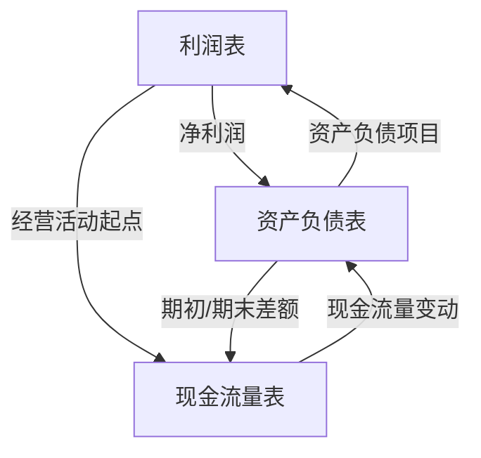
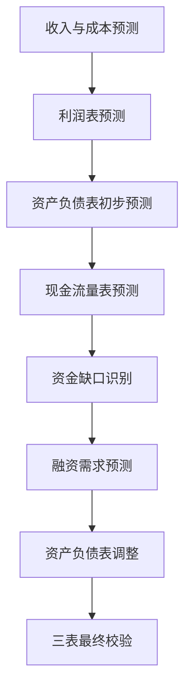

---
{"tags":["财务BP","财务报表预测","报表关系","财务预测","报表逻辑"],"aliases":["三大报表关系","财务报表间的关联性"],"dg-publish":true,"permalink":"/08-财务专业/财务BP/学习内容/财务预测与模型/财务报表预测/报表间的逻辑关系/","dgPassFrontmatter":true}
---

> [!NOTE] 概述
> 财务报表预测中，利润表、资产负债表和现金流量表之间存在严密的逻辑关系和数据连接。理解并正确处理这些关系是准确预测财务状况、避免预测矛盾的关键。本文详细介绍三大报表间的内在逻辑和数据一致性保障方法。

## 三大报表的基本关系概述

财务预测中三大报表的核心关系可概括为：

这种循环关系确保了财务预测的内部一致性，是构建可靠财务模型的基础。这也是为什么[[08-财务专业/财务BP/笔记/财务预测与模型/财务报表预测\|财务报表预测]]必须统筹考虑三大报表的内在联系。

## 利润表与资产负债表的关系

### 1. 净利润与所有者权益的关联

- **净利润流入留存收益**：
  利润表中的净利润进入资产负债表的留存收益，增加所有者权益
  
  公式：期末留存收益 = 期初留存收益 + 净利润 - 股利分配

- **利润分配的影响**：
  若宣告分配股利，减少资产负债表中的留存收益，同时产生应付股利（流动负债）或减少现金

**案例应用**：
某科技公司2023年净利润500万元，年末宣告分配股利150万元，则：
- 留存收益增加：500万元 - 150万元 = 350万元
- 应付股利（若未支付）增加：150万元

### 2. 收入成本与营运资本的关联

- **收入与应收账款**：
  收入增长通常导致应收账款增加
  
  公式：期末应收账款 = 期初应收账款 + 赊销收入 - 收款额

- **成本与存货、应付账款**：
  成本与存货采购相关，影响存货和应付账款余额
  
  存货公式：期末存货 = 期初存货 + 采购 - 销货成本
  
  应付账款公式：期末应付账款 = 期初应付账款 + 赊购 - 付款额

**案例应用**：
某制造企业预测年度收入增长25%（从8,000万元到10,000万元），基于60天的平均收款期，应收账款将从1,315万元增加到1,644万元。

### 3. 资产使用与折旧摊销的关联

- **固定资产与折旧**：
  利润表中的折旧费用减少资产负债表中固定资产的账面价值
  
  公式：期末固定资产净值 = 期初固定资产净值 + 新增固定资产 - 处置固定资产 - 本期折旧

- **无形资产与摊销**：
  同理，摊销费用减少无形资产账面价值

**案例应用**：
某企业期初固定资产净值2,000万元，当年资本支出500万元，年折旧率10%，则：
- 当年折旧：2,000万元 × 10% + 500万元 × 10% × 0.5(假设平均年中购入) = 225万元
- 期末固定资产净值：2,000万元 + 500万元 - 225万元 = 2,275万元

## 利润表与现金流量表的关系

### 1. 净利润与经营活动现金流的调整

[[08-财务专业/财务BP/笔记/预算编制基础/现金流预测\|现金流预测]]中，通常采用间接法将净利润调整为经营活动现金流：

- **加回非现金费用**：
  折旧、摊销、资产减值等

- **调整时间性差异**：
  应收、应付、存货等营运资本变动

- **调整非经营项目**：
  投资收益、资产处置损益等

**案例应用**：
某零售企业净利润800万元，折旧200万元，应收账款增加150万元，存货增加100万元，应付账款增加120万元，则：
- 经营活动现金流 = 800 + 200 - 150 - 100 + 120 = 870万元

### 2. 收入成本与现金流入流出的时间差

- **收入确认与现金收款时间差**：
  收入确认后，根据信用政策延迟收款

- **成本确认与现金支付时间差**：
  成本费用确认后，根据付款条件延迟支付

- **预收预付对现金流的影响**：
  预收增加导致现金流入先于收入确认
  预付增加导致现金流出先于成本确认

**案例应用**：
某项目型公司新签3,000万元合同，收到30%预付款900万元，此时：
- 收入尚未确认
- 现金流入增加900万元
- 资产负债表中预收账款增加900万元

## 资产负债表与现金流量表的关系

### 1. 资产负债表变动与现金流三大分类

资产负债表中各项目的变动，映射到现金流量表的三类活动：

- **经营活动现金流**：
  与日常经营相关的资产负债项目变动（如应收应付、存货等）

- **投资活动现金流**：
  与长期资产相关的变动（如固定资产、长期投资等）

- **筹资活动现金流**：
  与融资相关的项目变动（如借款、股本等）

**案例应用**：
某企业资产负债表变动及其对应的现金流分类：
- 应收账款增加200万元 → 经营活动现金流减少200万元
- 固定资产增加1,000万元(假设全部是购置) → 投资活动现金流减少1,000万元
- 长期借款增加800万元 → 筹资活动现金流增加800万元

### 2. 现金及现金等价物的特殊关系

- **现金流量表底线与资产负债表的现金变动**：
  现金流量表最终结果必须等于资产负债表中现金及现金等价物的变动
  
  公式：期末现金 - 期初现金 = 经营活动现金流 + 投资活动现金流 + 筹资活动现金流 + 汇率变动影响

- **平衡机制**：
  这一关系提供了重要的检验机制，确保预测一致性

**案例应用**：
某企业现金流量表显示：经营活动现金流入500万元，投资活动现金流出700万元，筹资活动现金流入300万元，则：
- 现金净增加额 = 500 - 700 + 300 = 100万元
- 若期初现金为400万元，则期末现金应为500万元

## 保持报表一致性的技术方法

在[[财务预测与模型\|财务预测与模型]]构建过程中，有多种方法确保三大报表的一致性：

### 1. 集成预测法

将三大报表预测整合到一个模型中：

1. 先预测利润表
2. 基于利润表预测资产负债表
3. 基于两表预测现金流量表
4. 检查现金平衡并调整

**案例应用**：
某电子企业财务预测模型采用Excel集成预测：
- 销售、成本、费用预测生成利润表
- 利润数据和周转率预测资产负债表
- 两表数据自动计算现金流量表
- 现金缺口由自动调整的"资金需求"项目平衡

### 2. 平衡项法

设定一个或多个平衡项，自动调整以保持报表平衡：

- **现金作为平衡项**：盈余增加现金，缺口减少现金
- **短期借款作为平衡项**：缺口增加借款，盈余减少借款
- **混合平衡法**：设定优先级，依次调整多个项目

**案例应用**：
某贸易企业采用混合平衡法，设定调整优先级：
1. 首先调整短期投资（现金盈余优先投资）
2. 其次调整短期借款（资金缺口时）
3. 最后保持最低现金水平（安全缓冲）

### 3. 交叉检验法

使用财务恒等式进行交叉验证：

- **资产 = 负债 + 所有者权益**
- **净利润 + 期初留存收益 - 股利 = 期末留存收益**
- **期末现金 - 期初现金 = 现金流量表总计**

**案例应用**：
某咨询公司开发的预测模型包含自动检验机制，对所有关键平衡关系进行检查，任何不平衡超过误差阈值（0.01%）都会标红警示。

## 报表关系在不同行业的特殊考量

### 制造业

- **存货周期与现金转换周期**：
  存货周转慢导致资金长期占用
- **资本支出与折旧的关系**：
  高资本密集度要求在资本支出、折旧和现金流之间保持严格一致

**案例应用**：
某汽车零部件制造商预测显示：
- 存货周转天数：65天
- 应收账款周转天数：45天
- 应付账款周转天数：50天
- 现金转换周期：60天，每百万销售额需10万元营运资金

### 零售业

- **预付与赊销关系**：
  通常向供应商赊购，对顾客现金销售
- **季节性库存变动**：
  库存随季节大幅波动，影响短期借款需求

**案例应用**：
某服装零售商在旺季（第四季度）存货比平时高60%，需要临时性营运资金约2,000万元，通过短期借款解决。

### 服务业

- **低资本支出高人力成本**：
  折旧较少，现金流与利润更相近
- **预收款模式**：
  部分服务业预收款导致现金流优于利润表现

**案例应用**：
某培训机构年收入1亿元，其中70%以预收形式收取，平均预收期3个月，产生约1,750万元预收款，改善现金流。

### 互联网/科技企业

- **高研发支出**：
  是否资本化影响利润与现金流差异
- **快速增长与负现金周期**：
  预收模式下快速增长可能产生正向现金流

**案例应用**：
某SaaS企业年研发支出2,000万元，根据会计政策资本化40%，导致：
- 利润表中研发费用：1,200万元
- 资产负债表中无形资产增加：800万元
- 现金流量表中实际支出：2,000万元

## 报表关系中的预测陷阱

### 1. 非现金交易的处理错误

- **以股代息**：发放股票股利不影响现金流
- **债转股**：影响资产负债表结构但不涉及现金
- **以资产交换资产**：只有差额部分影响现金流

**案例应用**：
某企业进行2亿元债转股，正确处理方式：
- 资产负债表：长期负债减少2亿，股本及资本公积增加2亿
- 现金流量表：不产生现金流入或流出

### 2. 折旧摊销的一致性错误

- **陷阱**：利润表折旧与固定资产账面值变动不一致
- **解决**：建立资产明细表，详细跟踪各类资产折旧

**案例应用**：
某服务企业预测中出现错误：
- 利润表中折旧费用：300万元
- 资产负债表中固定资产减少：250万元（未考虑新增固定资产50万元）
- 正确处理：期末固定资产 = 期初值 + 新增 - 折旧 = 期初值 + 50 - 300

### 3. 营运资本与经营现金流不匹配

- **陷阱**：营运资本变动与经营活动现金流调整不一致
- **解决**：使用调节表，确保每项营运资本变动正确反映在现金流中

**案例应用**：
某贸易企业预测资产负债表显示应收账款增加500万元，但现金流量表调整中只减少了400万元，造成100万元错误。

### 4. 现金流分类错误

- **陷阱**：资产负债项目变动对应的现金流分类错误
- **解决**：明确界定各项目属于哪类现金流活动

**案例应用**：
某企业预测模型将长期借款增加500万元错误地归类为经营活动现金流，正确应归类为筹资活动现金流。

## 构建整合三大报表的预测模型

为确保报表间逻辑关系一致，可采用以下步骤构建整合预测模型：

### 1. 核心预测逻辑流

### 2. 具体实施步骤

1. **从驱动因素开始**：
   - 预测关键业务驱动因素
   - 基于驱动因素预测收入和成本

2. **生成利润表**：
   - 计算毛利、营业利润、税前利润和净利润
   - 明确折旧摊销等非现金项目

3. **预测资产负债表**：
   - 使用比率或直接关联法预测各项目
   - 计算营运资本需求

4. **预测现金流量表**：
   - 使用间接法从净利润调整到经营现金流
   - 纳入投资和筹资活动现金流
   - 计算期末现金余额

5. **识别并解决资金缺口**：
   - 比较期望现金水平与预测现金余额
   - 调整债务或权益融资

6. **最终平衡与检验**：
   - 确保三表相互一致
   - 验证所有财务恒等式

**案例应用**：某新能源企业预测模型的逻辑关系：
- 驱动因素：产能利用率、产品价格、原材料成本
- 预测顺序：先预测产销量→销售收入→成本费用→利润表
- 资产负债预测：使用周转率预测营运资本，使用资本支出计划预测长期资产
- 现金流预测：根据营运资本变动和资本支出计算现金需求
- 资金缺口处理：资金缺口5,000万元通过3,000万元银行贷款和2,000万元股权融资解决

## 报表整合的高级应用

### 1. 财务战略分析

通过整合三大报表预测，可评估不同财务战略的影响：

- **股利政策对现金流和增长的影响**
- **负债结构对利息成本和风险的影响**
- **收购合并对三大报表的综合影响**

**案例应用**：
某制造企业评估三种股利政策：
1. 高分红（净利润70%）：现金充裕但增长受限
2. 中等分红（净利润40%）：平衡增长与股东回报
3. 低分红（净利润10%）：加速增长但股东短期回报低

### 2. 价值驱动分析

基于三大报表关系，分析影响企业价值的关键因素：

- **营运资本效率与自由现金流的关系**
- **资本支出与未来增长和现金流的平衡**
- **融资结构对加权平均资本成本的影响**

**案例应用**：
某科技企业价值驱动分析显示：
- 应收账款周转率每提高10%，每年释放现金约500万元
- 研发支出增加1,000万元，预期三年后带来2,000万元新增利润
- 债务权益比从0.5提高到0.8，加权平均资本成本降低1.2个百分点

### 3. 情景分析与压力测试

利用报表间的逻辑关系，进行[[08-财务专业/财务BP/笔记/财务预测与模型/情景分析\|情景分析]]和压力测试：

- **在极端情况下评估财务韧性**
- **识别最敏感的财务缺口风险**
- **测试违反债务契约的可能性**

**案例应用**：
某能源企业压力测试情景：
- 产品价格下跌30%
- 应收账款周转天数增加20天
- 信贷市场紧缩导致再融资利率提高200个基点

结果显示需要12亿元流动性储备以应对极端情况，据此调整了现金持有策略。

## 小结

理解和正确处理财务报表间的逻辑关系，是财务BP编制的核心技能。通过确保三大报表的内在一致性，可以提高预测的准确性和可信度，避免各种预测陷阱，为管理决策提供更可靠的财务依据。财务预测不仅是数据的简单推演，更是对企业经营逻辑的系统性表达，而报表间的严密逻辑关系则是这一系统的核心保障。

## 参考文献

1. Koller, T., Goedhart, M., & Wessels, D. (2020). *Valuation: Measuring and Managing the Value of Companies*. Wiley.
2. Subramanyam, K. R. (2014). *Financial Statement Analysis*. McGraw-Hill Education.
3. 《上市公司财务报表分析》，陆正飞、马淑文，北京大学出版社，2019.
4. Pignataro, P. (2018). *Financial Modeling and Valuation: A Practical Guide to Investment Banking and Private Equity*. Wiley.
5. 《财务建模实用指南》，张化桥、王振山，中信出版社，2017. 