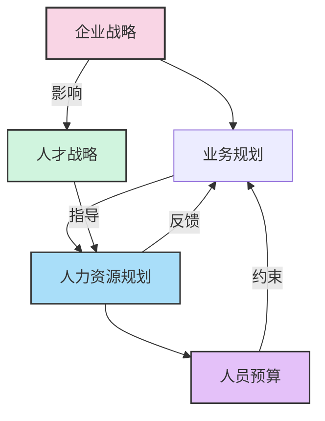
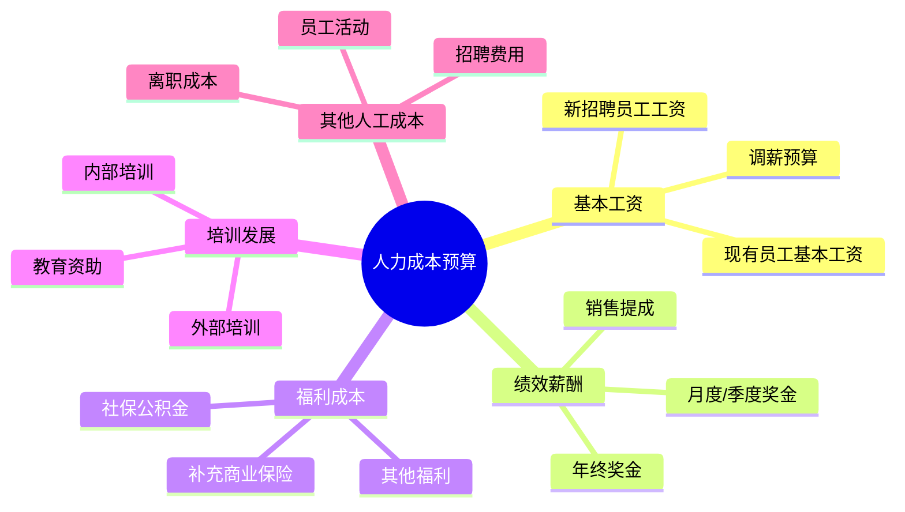
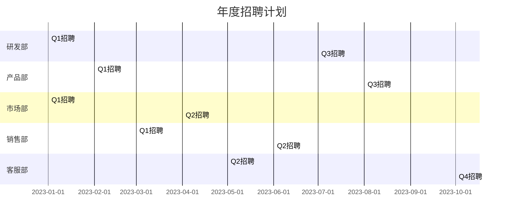

---
{"tags":["财务BP","预算规划","人员预算","人力资源","规划方法"],"aliases":["人力规划预算","人员配置规划"],"created":"2023-11-15","dg-publish":true,"permalink":"/08-财务专业/财务BP/学习内容/预算编制基础/人员预算/人力资源规划与预算/","dgPassFrontmatter":true}
---


# 人力资源规划与预算

> [!abstract] 概述
> 人力资源规划与预算是企业财务BP中至关重要的组成部分，涉及企业未来人员配置、人工成本预测及人才发展战略的系统性规划。本文详细介绍人力资源规划的基本概念、规划方法、与战略的关联以及实施步骤，并通过案例阐述如何建立科学有效的人力资源预算体系，以支持企业战略目标的实现。

## 基本概念

### 人力资源规划的定义与目标

**人力资源规划**是指企业基于战略目标和业务发展需求，对未来一定时期内所需人力资源进行系统性预测、分析、配置和安排的管理过程。人力资源规划通常包括数量规划、结构规划、质量规划和成本规划四个方面。

**主要目标**：
1. 确保企业在正确时间拥有数量适当、能力匹配的人才
2. 优化人力资源配置，提高人力资本回报率
3. 合理控制人力成本，保持企业竞争力
4. 支持企业战略实施和业务发展
5. 建立人才供应链，确保关键岗位的人才梯队

### 人力资源规划与企业战略的关系

人力资源规划是战略实施的基础保障，二者关系紧密：



- **战略驱动**：企业战略决定了人力资源需求的方向和重点
- **业务支撑**：人力资源规划为业务目标实现提供人才支持
- **双向互动**：人力资源条件和成本约束也会反向影响战略调整
- **动态平衡**：保持人力资源规划与战略目标的持续对齐

## 核心内容

### 人力资源规划的维度与要素

人力资源规划应从多个维度进行综合考量：

#### 1. 数量规划

- **总量规划**：预测企业整体人员规模
- **结构规划**：按部门、职级、岗位类别的人员分布
- **进出规划**：预测招聘需求、内部流动和离职替代
- **时间分布**：人员需求的季节性波动和阶段性变化

#### 2. 质量规划

- **能力素质要求**：岗位所需的知识、技能和经验
- **人才结构优化**：高潜人才、专业人才和管理人才的比例
- **能力提升计划**：培训发展和能力建设规划
- **绩效提升目标**：人均产出和效能提升的目标

#### 3. 成本规划

- **薪酬成本**：基本工资、奖金、津贴和佣金
- **福利成本**：社保、公积金、商业保险和其他福利
- **人才发展成本**：培训、发展和继任计划的投入
- **人力效能指标**：人力投入产出比、人均创收等

### 人力资源规划的方法论

#### 趋势外推法

**适用场景**：业务较为稳定、人员需求变化不大的情况

**基本步骤**：
1. 收集历史人员数据和业务数据
2. 分析人员与业务指标的相关性
3. 基于历史趋势和业务预测进行人员规划
4. 考虑效率改进因素进行调整

**应用公式**：
预计人员需求 = 基期人员数 × (1 + 业务增长率) × (1 - 效率提升率)

#### 比率分析法

**适用场景**：人员需求与特定业务指标存在稳定比例关系的部门

**基本步骤**：
1. 确定核心业务指标（如销售额、生产量、客户数等）
2. 分析人员与业务指标的比率关系
3. 基于业务预测计算人员需求
4. 考虑规模经济和效率变化因素

**常用比率**：
- 销售人员：销售额比
- 生产人员：产量比
- 客服人员：客户数比
- 研发人员：收入比

#### 工作量分析法

**适用场景**：工作内容标准化、工作量可量化的岗位

**基本步骤**：
1. 分解岗位主要工作任务
2. 测算单位工作量所需工时
3. 预测未来工作总量
4. 计算所需全职人员数量

**计算公式**：
所需人员数 = 总工作量 ÷ 单位人员标准工作量 ÷ 工时利用率

#### 德尔菲法（专家判断法）

**适用场景**：新业务领域、创新项目或高度不确定环境

**基本步骤**：
1. 组建包含业务、HR和管理专家的小组
2. 收集各方对人员需求的独立预测
3. 汇总分析，反馈差异并讨论
4. 多轮迭代至形成相对一致的预测

### 人力资源预算编制流程

#### 预算编制基础准备

1. **战略目标解读**：理解公司战略和年度业务目标
2. **组织架构规划**：确定组织架构和部门设置
3. **人力资源政策确认**：确认薪酬策略、调薪政策和福利标准
4. **历史数据分析**：分析历史人员和成本数据，识别趋势和问题

#### 人员编制预算

1. **现有人员盘点**：分析现有人员状况和可能的流动变化
2. **缺口分析**：基于规划确定人员缺口或富余
3. **招聘计划**：制定详细的岗位招聘计划和时间表
4. **内部调配计划**：规划内部人员流动和提升路径

#### 人力成本预算

1. **基本工资预算**：
   - 现有员工工资基数和调整计划
   - 新招聘人员薪资预算
   - 职级晋升和薪酬调整影响

2. **绩效薪酬预算**：
   - 绩效奖金及分配机制
   - 销售提成和业绩奖励
   - 项目奖金和特殊激励

3. **法定福利预算**：
   - 社会保险（养老、医疗、失业、工伤、生育）
   - 住房公积金
   - 法定假期工资

4. **补充福利预算**：
   - 商业保险补充
   - 员工关怀计划
   - 福利补贴（餐饮、交通、通讯等）

5. **人才发展预算**：
   - 培训项目投入
   - 员工发展计划
   - 继任者培养项目

#### 预算分析与优化

1. **成本结构分析**：分析不同类型成本占比和变化趋势
2. **人效指标计算**：计算人均产值、人力投资回报率等
3. **敏感性分析**：评估业务波动对人力成本的影响
4. **优化方案制定**：识别成本优化和效能提升机会

## 应用方法

### 人力资源规划与预算的实施步骤

#### 1. 分析企业战略与业务计划

- 审视企业中长期战略和年度业务目标
- 识别关键业务驱动因素和变化趋势
- 明确人力资源支持战略的关键领域
- 评估外部人才市场环境和薪酬趋势

#### 2. 评估当前人力资源状况

- 分析现有人员结构、能力和绩效
- 评估关键岗位人才储备情况
- 识别人才缺口和流失风险
- 评价现有人力资源政策有效性

#### 3. 制定人力资源规划方案

- 确定未来人员规模和结构
- 设计人才获取和培养策略
- 规划组织架构调整方案
- 建立关键岗位继任者计划

#### 4. 编制详细人力资源预算

- 建立人员编制预算表
- 计算薪酬和福利成本
- 规划培训发展投入
- 预测其他人力相关费用

#### 5. 设计实施与监控机制

- 制定人力资源计划实施时间表
- 建立KPI和监控指标体系
- 设计预算执行控制流程
- 规划定期审核与调整机制

### 人力资源预算的常用工具与模板

#### 人员编制预算表

| 部门 | 岗位 | 期初人数 | 计划招聘 | 预计流失 | 内部调入 | 内部调出 | 期末人数 | 平均薪资 | 薪资预算 |
|------|------|---------|---------|---------|---------|---------|---------|---------|---------|
| 销售部 | 销售经理 | 5 | 1 | 1 | 0 | 0 | 5 | 15,000 | 900,000 |
| 销售部 | 销售代表 | 20 | 5 | 4 | 0 | 1 | 20 | 8,000 | 1,920,000 |
| 研发部 | 产品经理 | 3 | 1 | 0 | 0 | 0 | 4 | 18,000 | 864,000 |
| ... | ... | ... | ... | ... | ... | ... | ... | ... | ... |

#### 人力成本预算模型



#### 人力资源KPI跟踪表

| KPI类别 | 指标名称 | 计算方法 | 目标值 | Q1实际 | Q2实际 | Q3实际 | Q4实际 | 年度实际 |
|---------|---------|---------|-------|--------|--------|--------|--------|----------|
| 效能指标 | 人均产值 | 收入/员工数 | 80万 | 75万 | 78万 | - | - | - |
| 效能指标 | 人力成本率 | 人力成本/收入 | 15% | 16.2% | 15.5% | - | - | - |
| 结构指标 | 管理幅度 | 员工数/管理者数 | 8:1 | 7.5:1 | 7.8:1 | - | - | - |
| 发展指标 | 培训覆盖率 | 受训人数/总人数 | 95% | 85% | 90% | - | - | - |
| 留任指标 | 关键人才保留率 | 留任数/期初数 | 90% | 95% | 92% | - | - | - |

## 案例分析

### 案例1：科技公司快速扩张的人力资源规划

**背景**：
某移动应用开发公司计划在下一财年将业务扩展到新的地区市场，预计收入增长40%，需要相应扩大团队规模。

**规划方法**：

1. **业务驱动分析**：
   - 新增地区市场：3个
   - 新增产品线：2条
   - 预计开发项目：从15个增加到24个
   - 客户支持需求：增长50%

2. **部门人员需求预测**：

| 部门 | 现有人数 | 预测方法 | 增长依据 | 预计新增 | 年末人数 |
|------|---------|---------|---------|---------|---------|
| 研发部 | 50 | 工作量分析 | 项目增加60% | 30 | 80 |
| 产品部 | 15 | 固定比例法 | 研发人员比例1:5 | 6 | 21 |
| 市场部 | 12 | 专家评估 | 新市场拓展 | 8 | 20 |
| 销售部 | 20 | 收入比例法 | 收入增长40% | 8 | 28 |
| 客服部 | 18 | 客户比例法 | 客户增长50% | 9 | 27 |
| 行政HR | 10 | 规模经济法 | 人数比例1:12 | 3 | 13 |
| 合计 | 125 | - | - | 64 | 189 |

3. **分阶段招聘计划**：



4. **人力成本预算**：

| 成本类别 | 现有成本(万元) | 增长因素 | 预计增加(万元) | 年度预算(万元) |
|---------|--------------|---------|--------------|--------------|
| 基本工资 | 1,500 | 新增+现有调薪 | 780 | 2,280 |
| 绩效奖金 | 450 | 与基本工资挂钩 | 234 | 684 |
| 社保公积金 | 375 | 工资比例25% | 195 | 570 |
| 期权激励 | 150 | 关键人才覆盖 | 78 | 228 |
| 培训发展 | 75 | 新员工培训 | 50 | 125 |
| 招聘费用 | 30 | 市场竞争加剧 | 70 | 100 |
| 其他福利 | 120 | 员工活动扩展 | 68 | 188 |
| 合计 | 2,700 | - | 1,475 | 4,175 |

5. **风险分析与应对计划**：

- **风险1**：招聘难度增加，可能影响扩张计划
  - **应对**：提前启动校园招聘，建立人才储备库，优化薪酬竞争力

- **风险2**：新员工融入和效能提升周期长
  - **应对**：优化入职培训，导师制，加强团队文化建设

- **风险3**：人力成本增速快于收入增速
  - **应对**：优化组织结构，提高管理幅度，加强效能管理

### 案例2：零售连锁企业的季节性人力资源规划

**背景**：
某零售连锁企业拥有50家门店，面临明显的季节性销售波动，节假日销售额通常是平日的2-3倍，需要灵活调整人力资源配置。

**规划方法**：

1. **销售预测与人员需求关系建模**：
   分析历史销售数据与人员配置的关系，建立预测模型：
   - 基础人员配置：每店固定10人
   - 弹性人员配置：每增加10万日销售额，增加临时人员2人

2. **季节性人员规划**：

```mermaid
%%{init: {'theme': 'base', 'themeVariables': { 'primaryColor': '#d0f4de', 'fontFamily': '"Microsoft YaHei", "微软雅黑", "SimHei", "黑体", sans-serif'}}}%%
bar
    title 季节性人员配置计划
    "一季度" : 650
    "二季度" : 580
    "三季度" : 620
    "国庆黄金周" : 780
    "四季度" : 700
    "春节期间" : 850
```

3. **灵活用工策略**：
   - 全职员工：占总需求的60%，保持稳定
   - 兼职员工：占总需求的25%，灵活调整工时
   - 临时工：占总需求的15%，节假日短期聘用

4. **人力成本预算特点**：
   - 建立季节性预算，反映人力成本波动
   - 采用多情景预算，应对销售波动的不确定性
   - 设计灵活的激励机制，提高旺季服务质量

5. **成本控制与效率提升措施**：
   - 跨门店人员调配机制，优化资源利用
   - 工时排班优化系统，提高人员利用效率
   - 销售效率目标管理，提高人均销售额

## 相关链接

- [[08-财务专业/财务BP/学习内容/预算编制基础/人员预算/人员成本构成\|人员成本构成]] - 详细介绍人力成本的构成要素和预算方法
- [[08-财务专业/财务BP/学习内容/预算编制基础/人员预算/人员效能与成本管理\|人员效能与成本管理]] - 分析如何提升人员效能并控制成本
- [[08-财务专业/财务BP/学习内容/预算编制基础/人员预算/人员预算的敏感性分析\|人员预算的敏感性分析]] - 探讨人员预算的敏感性分析方法
- [[08-财务专业/财务BP/笔记/预算编制基础/预算编制流程\|预算编制流程]] - 人员预算在整体预算编制流程中的位置
- [[08-财务专业/财务BP/学习内容/预算编制基础/收入预测方法/收入预算\|收入预算]] - 人员预算与收入预算的关联
- [[成本预算\|成本预算]] - 人员成本作为企业成本的重要组成部分

## 参考文献

1. Armstrong, M. (2020). *Armstrong's Handbook of Human Resource Management Practice*. Kogan Page.
2. Cascio, W. F. (2018). *Managing Human Resources: Productivity, Quality of Work Life, Profits*. McGraw-Hill Education.
3. Dessler, G. (2019). *Human Resource Management*. Pearson.
4. Noe, R. A., Hollenbeck, J. R., Gerhart, B., & Wright, P. M. (2017). *Human Resource Management: Gaining a Competitive Advantage*. McGraw-Hill Education.
5. Ulrich, D., Younger, J., Brockbank, W., & Ulrich, M. (2017). *Victory Through Organization: Why the War for Talent is Failing Your Company and What You Can Do About It*. McGraw-Hill Education.
6. 黄卫伟. (2019). 《人力资源规划与预算管理》. 中国人民大学出版社.
7. 彭剑锋. (2018). 《人力资源管理概论》. 复旦大学出版社.
8. 王长城. (2020). 《企业预算管理实务》. 中国财政经济出版社. 