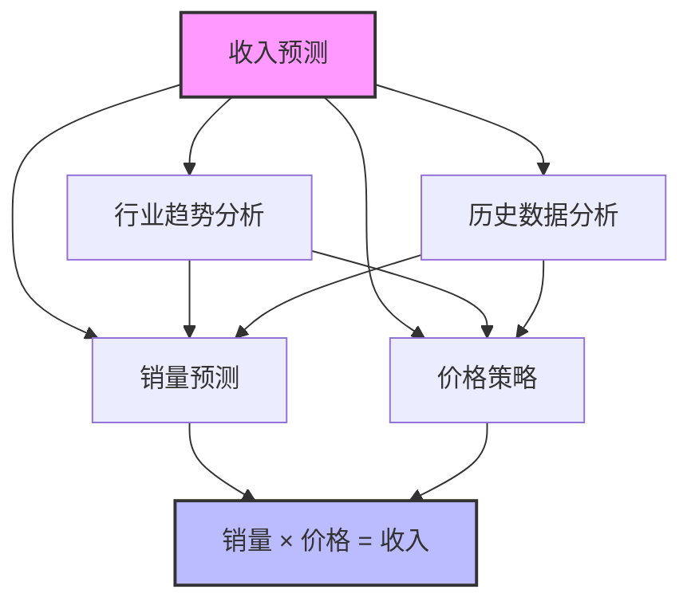

---
{"tags":["财务BP","预算编制","收入预测","销售预测","索引"],"aliases":["收入预测方法索引","销售预测技术汇总"],"cssclasses":["财务知识"],"dg-publish":true,"permalink":"/08-财务专业/财务BP/学习内容/预算编制基础/收入预测方法/收入预测方法/","dgPassFrontmatter":true}
---

> 收入预测是预算编制过程中的首要环节，也是最具挑战性的环节之一。准确的收入预测为后续成本预算、资本支出预算和现金流预测奠定基础。掌握科学的收入预测方法，对[[财务BP\|财务BP]]工作的质量有着决定性影响。

## 收入预测概述

收入预测是基于内外部多种因素，对企业未来特定期间内可能实现的收入进行合理估计的过程。有效的收入预测需要综合分析市场环境、行业趋势、竞争态势、历史数据和企业自身能力等多方面因素。

## 详细学习内容

本模块包含以下详细学习内容，点击链接可进入对应主题的深入学习：

1. [[08-财务专业/财务BP/学习内容/预算编制基础/收入预测方法/销量预测技术\|销量预测技术]] - 各种销量预测方法的原理、适用场景和实施步骤
2. [[08-财务专业/财务BP/学习内容/预算编制基础/收入预测方法/价格策略与预测\|价格策略与预测]] - 定价策略制定与价格变动预测的方法
3. [[08-财务专业/财务BP/学习内容/预算编制基础/收入预测方法/行业趋势分析\|行业趋势分析]] - 宏观经济和行业趋势对收入预测的影响分析
4. [[历史数据分析法\|历史数据分析法]] - 基于历史数据的各类预测模型与应用技巧

## 学习路径建议

推荐按照以下顺序进行学习：

1. 首先了解[[历史数据分析法\|历史数据分析法]]，掌握基于历史数据的基础预测技术
2. 然后学习[[08-财务专业/财务BP/学习内容/预算编制基础/收入预测方法/行业趋势分析\|行业趋势分析]]，了解如何将外部环境因素纳入预测
3. 接着深入[[08-财务专业/财务BP/学习内容/预算编制基础/收入预测方法/销量预测技术\|销量预测技术]]，掌握更专业的销量预测方法
4. 最后研究[[08-财务专业/财务BP/学习内容/预算编制基础/收入预测方法/价格策略与预测\|价格策略与预测]]，完成从销量到收入的预测转化

将收入预测方法与[[08-财务专业/财务BP/学习内容/预算编制基础/预算编制流程/预算编制的基本步骤\|预算编制的基本步骤]]结合学习，可以更好地理解收入预测在整个预算流程中的关键作用。

## 方法选择指南

不同行业和企业发展阶段适合使用不同的收入预测方法：

| 企业类型 | 发展阶段 | 推荐预测方法 | 关键考量因素 |
|---------|---------|------------|------------|
| 成熟制造业 | 稳定期 | 时间序列分析、回归分析 | 季节性、产能限制 |
| 零售业 | 成长期 | 趋势分析、市场调研 | 消费者行为、竞争态势 |
| 科技企业 | 快速成长期 | 增长建模、情景分析 | 产品生命周期、市场接受度 |
| 初创企业 | 起步期 | 底层建模、类比分析 | 市场验证、增长假设 |
| 服务业 | 各阶段 | 客户分层分析、容量规划 | 服务能力、定价弹性 |

## 相关主题

- [[08-财务专业/财务BP/笔记/预算编制基础/成本预测方法\|成本预测方法]] - 与收入预测相配套的成本预测技术
- [[销售与运营计划(S&OP)\|销售与运营计划(S&OP)]] - 销售预测与运营计划的协调机制
- [[收入敏感性分析\|收入敏感性分析]] - 评估关键假设变动对收入预测的影响
- [[收入预测准确性评估\|收入预测准确性评估]] - 衡量收入预测质量的方法与标准

## 应用案例

本模块中的各子主题包含了多个行业的应用案例，包括：
- 消费品企业的季节性产品销量预测案例
- 制药企业的新药上市收入预测案例
- B2B服务企业的客户续约率与新增客户预测案例
- 技术创新产品的市场渗透率与价格预测案例

通过这些案例的学习，可以掌握不同行业环境下收入预测的实践方法与技巧。 