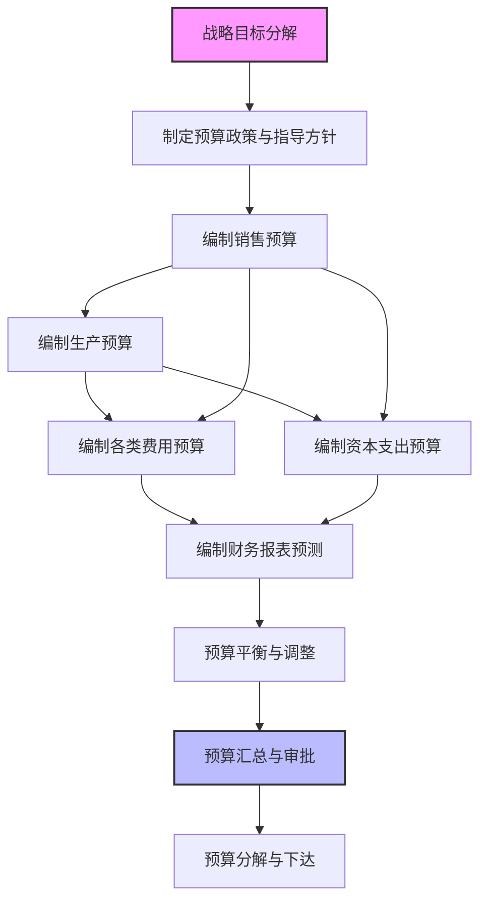

---
{"dg-publish":true,"permalink":"/08-财务专业/财务BP/学习内容/预算编制基础/预算编制流程/预算编制的基本步骤/","tags":["财务BP","预算编制","流程管理","基本步骤","预算规划"]}
---

# 预算编制的基本步骤

> 预算编制是企业财务管理的核心环节，通过系统化的步骤将战略目标转化为可执行的财务计划。掌握科学的预算编制步骤，是确保预算质量和可执行性的关键，同时也是[[财务BP\|财务BP]]发挥价值的重要基础。

## 1. 预算编制步骤概述

预算编制是一个自上而下与自下而上相结合的系统化过程，通常包含以下主要步骤：

不同企业可能根据自身特点对预算编制步骤进行调整，但核心环节通常保持一致。预算编制的每个步骤都有其特定目标和方法，共同构成完整的预算体系。

## 2. 预算编制的具体步骤

### 2.1 战略目标分解

战略目标分解是预算编制的起点，主要工作包括：

- **战略回顾与确认**：回顾企业战略规划，确认下一预算期的战略重点
- **关键指标确定**：将战略目标分解为可量化的关键绩效指标（KPI）
- **责任部门明确**：明确各战略目标及KPI的责任部门和责任人

**实践工具**：
- 战略地图（Strategy Map）
- 平衡计分卡（Balanced Scorecard）
- OKR（Objectives and Key Results）框架

### 2.2 制定预算政策与指导方针

预算政策与指导方针为预算编制提供框架和边界，主要内容包括：

- **预算假设设定**：制定宏观经济、行业环境、内部运营等关键假设
- **预算参数确定**：确定通用预算参数如汇率、工资增长率、通胀率等
- **预算限额分配**：设定各部门或业务单元的预算总额限制
- **预算时间表**：制定详细的预算编制时间计划

**核心要点**：
- 预算假设应具有一致性，避免各部门采用不同假设
- 预算参数应基于科学预测和历史数据分析
- 预算限额应与战略优先级保持一致

### 2.3 编制销售预算

销售预算是其他预算的基础，编制步骤包括：

- **市场分析**：分析市场规模、增长趋势、竞争态势
- **销售预测**：按产品/服务类别、客户类型、区域等维度进行销售量预测
- **定价策略**：确定产品/服务定价策略和价格水平
- **收入计算**：将销量预测与价格策略结合，计算预期收入

**预测方法**：
- 历史趋势法：基于历史销售数据的增长率推算
- 市场调研法：通过市场调研获取客户需求和购买意向
- 销售人员预测法：综合一线销售人员的预测
- 统计预测模型：使用时间序列分析等统计方法

### 2.4 编制生产预算

生产预算是基于销售预算制定的生产计划，包括：

- **产量计划**：根据销售预测和库存政策，确定生产数量
- **物料需求计划**：计算生产所需的原材料、零部件等
- **直接人工预算**：估计所需的直接人工工时和成本
- **制造费用预算**：预计生产过程中的制造费用

**关键考量因素**：
- 产能限制和产能扩张计划
- 季节性生产需求波动
- 库存周转率目标
- 生产效率改进计划

### 2.5 编制各类费用预算

费用预算涵盖企业运营所需的各类费用支出：

- **销售费用预算**：营销、广告、销售佣金等销售相关费用
- **管理费用预算**：行政管理、人力资源等管理相关费用
- **研发费用预算**：产品开发、技术研究等研发相关费用
- **财务费用预算**：利息支出、汇兑损益等财务相关费用

**预算方法**：
- 零基预算法：每期从零开始重新评估必要性和金额
- 增量预算法：在上期基础上增加或减少一定比例
- 活动基础预算法：基于具体活动和驱动因素制定预算

### 2.6 编制资本支出预算

资本支出预算关注企业的长期投资计划：

- **投资项目识别**：识别潜在的资本投资项目
- **项目评估**：使用财务评估方法评价项目可行性
- **项目优先级排序**：根据战略重要性和财务回报排序
- **资金来源规划**：确定资本支出的资金来源

**评估方法**：
- 净现值法（NPV）
- 内部收益率法（IRR）
- 投资回收期法
- 会计收益率法

### 2.7 编制财务报表预测

财务报表预测是将各类预算整合为统一财务视图：

- **预计利润表**：整合收入预算和各类费用预算
- **预计资产负债表**：预测期末资产、负债和所有者权益状况
- **预计现金流量表**：预测经营、投资和筹资活动的现金流量

**编制技巧**：
- 保持三大报表间的逻辑关联性
- 设计驱动因素和计算公式，确保数据一致性
- 进行敏感性分析，评估关键假设变动的影响

### 2.8 预算平衡与调整

预算平衡与调整是确保预算内部协调、符合战略目标的过程：

- **资源平衡**：检查并调整资源分配的合理性
- **目标校准**：确保预算结果符合战略目标要求
- **约束条件处理**：处理资金、产能等约束条件
- **反馈调整**：根据反馈意见进行预算调整

**调整技术**：
- 情景分析：构建多种情景下的预算结果
- 敏感性分析：测试关键变量变化对预算结果的影响
- 迭代优化：通过多轮调整优化预算结果

### 2.9 预算汇总与审批

预算汇总与审批是预算编制的最后环节：

- **预算汇总**：将各部门和各类预算汇总形成整体预算
- **审核验证**：对预算进行审核、验证和质量检查
- **正式审批**：按照预算审批权限获取正式批准
- **最终确认**：确认最终版本并准备分发执行

具体可参考[[08-财务专业/财务BP/学习内容/预算编制基础/预算编制流程/预算汇总与审批\|预算汇总与审批]]了解详细的汇总与审批流程。

### 2.10 预算分解与下达

预算获批后，需要将其分解并下达至执行部门：

- **预算分解**：将总体预算分解为部门、团队和个人目标
- **责任明确**：明确各预算指标的责任人和责任部门
- **沟通宣贯**：解释预算目标和假设，获取执行承诺
- **监控机制建立**：建立预算执行监控和报告机制

**有效实践**：
- 制作预算执行手册，明确执行规则和流程
- 举办预算宣讲会，确保共识和理解
- 将预算指标纳入绩效考核体系

## 3. 不同类型企业的预算编制步骤差异

### 3.1 制造业企业

制造业企业的预算编制特点：

- **生产预算的核心地位**：生产预算在整体预算中占据核心位置
- **详细的物料与产能规划**：需要更详细的物料需求计划和产能规划
- **库存管理的重要性**：原材料、在产品和产成品库存管理受到重视
- **标准成本体系**：通常采用标准成本体系进行成本控制

**案例：某汽车零部件制造企业**

该企业预算编制步骤特点：
1. 基于客户订单预测和OEM厂商生产计划进行销售预测
2. 采用物料需求计划(MRP)系统，从销售预算倒推生产计划和物料采购
3. 设置详细的标准成本卡，对直接材料、直接人工和制造费用进行标准化
4. 建立产能利用率预算，确保生产资源最优配置
5. 通过库存周转率指标连接销售、生产和采购预算

### 3.2 互联网企业

互联网企业的预算编制特点：

- **增长导向**：预算通常围绕用户增长和收入增长设计
- **敏捷性**：采用更敏捷的预算流程，支持快速决策
- **投入与产出关联**：注重营销投入与用户获取成本分析
- **场景预测**：通常设计多种增长场景的预算方案

**案例：某在线教育平台**

该企业预算编制步骤特点：
1. 以用户获取和转化为核心指标，设计营销预算
2. 采用单位经济模型(Unit Economics)，分析用户生命周期价值与获客成本
3. 设置多种增长情景预算，根据实际情况动态调整
4. 内容生产和技术开发预算占比高，重点关注投入产出比
5. 月度预算调整机制，允许根据市场反馈快速调整资源配置

### 3.3 服务业企业

服务业企业的预算编制特点：

- **人力资源预算的重要性**：人力成本通常是主要成本构成
- **产能与需求匹配**：服务产能与客户需求的匹配至关重要
- **服务质量指标**：预算中纳入服务质量和客户满意度指标
- **灵活的资源调配**：需要应对需求波动的资源调配机制

**案例：某医疗服务集团**

该企业预算编制步骤特点：
1. 从历史就诊数据出发，结合季节性因素预测门诊量和住院量
2. 基于医生和设备产能进行资源规划，确保高效运营
3. 医疗耗材和药品预算与预测就诊量直接关联
4. 设置服务质量KPI与成本控制目标的平衡机制
5. 按科室和医生团队分解预算指标，建立责任成本中心

## 4. 预算编制步骤中的常见挑战与应对策略

### 4.1 战略目标与预算脱节

**挑战表现**：
- 预算目标与战略优先级不一致
- 资源分配无法支持关键战略举措
- 预算过度关注短期财务指标，忽视长期战略投入

**应对策略**：
- 使用战略地图明确战略目标与预算的逻辑关联
- 采用战略性预算框架，确保战略举措获得必要资源
- 设置战略预留资金，专门用于战略项目投入

### 4.2 预算假设不一致

**挑战表现**：
- 各部门采用不同的宏观经济或行业增长假设
- 预算参数如汇率、通胀率等假设不一致
- 对关键业务驱动因素的假设存在分歧

**应对策略**：
- 建立统一的预算假设库，确保所有部门使用一致假设
- 明确核心假设的设定依据和责任部门
- 进行假设合理性审核，确保假设基于科学分析

### 4.3 协调性问题

**挑战表现**：
- 销售预算与生产预算目标不匹配
- 营销投入与收入目标不成比例
- 资本支出预算与运营预算缺乏协调

**应对策略**：
- 建立预算协调委员会，负责跨部门预算协调
- 使用预算管理系统自动识别协调性问题
- 开展预算协调会议，解决跨部门预算冲突

### 4.4 数据质量问题

**挑战表现**：
- 历史数据不完整或不准确
- 部门提供的预算数据质量参差不齐
- 缺乏标准化的数据格式和口径

**应对策略**：
- 建立预算数据质量标准和检验机制
- 使用系统工具进行数据一致性和完整性检查
- 提供预算编制培训，提高预算数据质量

### 4.5 缺乏敏捷性

**挑战表现**：
- 预算编制周期过长，无法适应快速变化的市场
- 预算一旦制定很难调整
- 预算过于刚性，限制了业务灵活性

**应对策略**：
- 采用滚动预算方法，定期更新和延展预算期间
- 设计弹性预算机制，允许在特定条件下调整预算
- 建立预算异常管理流程，快速响应环境变化

## 5. 技术与工具在预算编制步骤中的应用

### 5.1 预算管理系统

现代预算管理系统可显著提高预算编制效率：

- **自动化数据收集**：自动从业务系统提取基础数据
- **标准化预算模板**：提供统一的预算编制模板
- **预算逻辑校验**：自动进行数据逻辑和一致性检查
- **协作功能**：支持多部门协同编制预算
- **版本管理**：维护预算的多个版本，便于比较和追踪

**应用案例**：某零售集团使用SAP BPC系统进行预算管理，将预算编制时间从8周缩短至3周，同时提高了预算数据质量和分析深度。

### 5.2 财务建模工具

财务建模工具帮助构建更复杂的预算模型：

- **驱动因素分析**：识别并量化关键业务驱动因素
- **财务逻辑建模**：建立收入、成本和投资间的逻辑关系
- **情景模拟**：快速构建不同假设下的预算结果
- **敏感性分析**：评估关键变量变动对预算的影响

**推荐工具**：
- Excel高级功能（数据表、敏感性分析）
- 专业财务建模软件（如Anaplan、Adaptive Insights）
- 统计分析工具（如R、Python）用于高级预测

### 5.3 数据可视化工具

数据可视化工具提升预算分析和沟通效果：

- **趋势图表**：展示关键指标的历史和预测趋势
- **预算差异分析**：直观展示预算与实际的差异
- **资源分配视图**：展示不同部门或项目的资源分配
- **交互式仪表盘**：支持管理层动态探索预算数据

**应用案例**：某电信企业使用Power BI创建预算分析仪表盘，帮助管理层直观把握各区域和产品线的预算分配和执行情况，提高决策效率。

## 6. 预算编制步骤的最佳实践

### 6.1 整体架构设计

- **自上而下与自下而上相结合**：战略目标自上而下分解，具体预算自下而上编制
- **预算与战略的明确关联**：建立预算目标与战略目标的明确映射关系
- **责任明确与授权清晰**：各预算环节的责任人和权限边界清晰定义
- **过程透明与沟通充分**：预算过程和决策依据对相关方保持透明

### 6.2 销售预算编制最佳实践

- **多维度预测**：从产品、客户、区域等多维度进行预测
- **基于客户的预测方法**：针对重要客户进行个性化需求预测
- **历史数据与市场预测结合**：既考虑历史趋势，也纳入前瞻性市场判断
- **销售团队参与**：充分发挥一线销售团队的市场洞察

### 6.3 成本预算编制最佳实践

- **成本结构分析**：深入理解固定成本和变动成本结构
- **成本驱动因素识别**：识别并量化关键成本驱动因素
- **改进机会纳入**：将成本改进和效率提升计划纳入预算
- **责任成本中心**：建立明确的成本责任中心体系

### 6.4 资本支出预算最佳实践

- **战略关联性评估**：评估项目与战略目标的关联度
- **财务回报综合分析**：考虑短期和长期财务回报
- **风险评估纳入**：将项目风险因素纳入评估
- **分类分级管理**：根据项目类型和规模实施分级审批

## 7. 预算编制步骤的案例分析

### 7.1 大型制造企业案例

**企业背景**：
某大型汽车制造企业，年产量50万辆，员工2万人，年营业额超过500亿元。

**预算编制步骤亮点**：

1. **战略目标分解**：
   - 采用平衡计分卡方法，将公司战略分解为财务、客户、内部流程和学习成长四个维度
   - 针对每个战略目标设定关键绩效指标(KPI)和目标值

2. **销售预算**：
   - 结合宏观经济数据、行业预测和历史数据建立销售预测模型
   - 按车型、销售区域和渠道进行多维度销售预测
   - 应用价格弹性分析确定不同车型的最优定价策略

3. **生产预算**：
   - 基于销售预测和最优库存水平，制定月度生产计划
   - 通过物料需求计划(MRP)系统，生成详细的物料采购计划
   - 采用标准成本系统，对直接材料、直接人工和制造费用进行预算

4. **特色做法**：
   - 建立"预算场景库"，根据不同宏观经济情景准备多套预算方案
   - 实施"预算挑战机制"，各部门预算需通过管理层挑战才能获批
   - 建立季度预算调整机制，允许根据市场变化调整预算

**成效**：
- 预算准确度提升30%，预算与实际差异控制在±5%范围内
- 预算编制时间从原来的3个月缩短至6周
- 预算执行监控更加及时，异常情况响应速度提高50%

### 7.2 科技初创企业案例

**企业背景**：
某SaaS软件初创企业，成立3年，快速增长阶段，员工200人，年收入2亿元。

**预算编制步骤亮点**：

1. **增长驱动的预算框架**：
   - 以用户增长为核心驱动因素，构建预算框架
   - 采用SaaS指标体系（如MRR、CAC、LTV等）作为预算核心指标

2. **敏捷预算流程**：
   - 采用季度滚动预算，每季度更新未来4-6个季度的预算
   - 预算会议精简为1天集中讨论，提高决策效率
   - 使用在线协作平台，支持分布式团队同步编制预算

3. **资源优先级框架**：
   - 采用"70/20/10"资源分配法：70%用于核心业务，20%用于新兴机会，10%用于创新尝试
   - 建立动态资源分配机制，根据业务表现自动调整资源分配

4. **特色做法**：
   - "北极星指标"驱动：将公司北极星指标（付费用户数）作为预算核心驱动因素
   - "增长实验预算"：专门设立预算用于营销和产品增长实验
   - "OKR-预算联动"：将季度OKR与预算资源直接挂钩

**成效**：
- 资源利用效率提高35%，投资回报率明显改善
- 预算决策速度加快，从提案到决策平均仅需3天
- 预算执行的灵活性提高，能够快速响应市场机会

## 8. 学习建议与相关资源

> 掌握预算编制的基本步骤需要理论学习与实践相结合。建议结合[[08-财务专业/财务BP/学习内容/预算编制基础/预算编制流程/预算编制的准备工作\|预算编制的准备工作]]和[[08-财务专业/财务BP/学习内容/预算编制基础/预算编制流程/预算汇总与审批\|预算汇总与审批]]内容，形成对预算编制全流程的系统理解。同时，了解[[财务BP与企业战略的关系\|财务BP与企业战略的关系]]有助于将预算编制融入企业战略管理体系。

### 8.1 学习路径建议

1. 首先理解预算在企业管理中的战略位置和作用
2. 掌握各类预算的编制方法和逻辑关系
3. 学习预算协调和平衡的技术与方法
4. 深入研究行业特点和最佳实践案例
5. 通过模拟演练或实际项目积累实践经验

### 8.2 推荐学习资源

- 《全面预算管理实务》 - 提供预算编制的系统方法和实操指南
- 《预算管理变革》 - 探讨现代预算管理的创新方法
- 财务建模课程 - 学习构建预算模型的技术和方法
- 行业协会预算管理研讨会 - 了解行业最新预算管理实践

## 参考文献

1. Frow, N., Marginson, D., & Ogden, S. (2010). "Continuous Budgeting: Reconciling Budget Flexibility with Budgetary Control." *Accounting, Organizations and Society*, 35(4), 444-461.
2. Hope, J., & Fraser, R. (2013). *Beyond Budgeting: How Managers Can Break Free from the Annual Performance Trap*. Harvard Business Press.
3. 陈立齐. (2019). 《企业全面预算管理实务》. 中国财政经济出版社.
4. Sandalgaard, N., & Nikolaj, P. B. (2014). "Beyond Budgeting and Change: A Case Study." *Journal of Accounting & Organizational Change*, 10(3), 409-423.
5. 刘光明. (2020). 《预算编制方法与实践》. 经济管理出版社. 