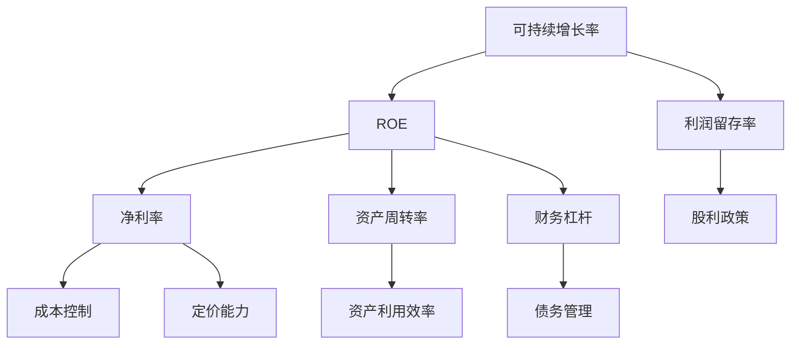
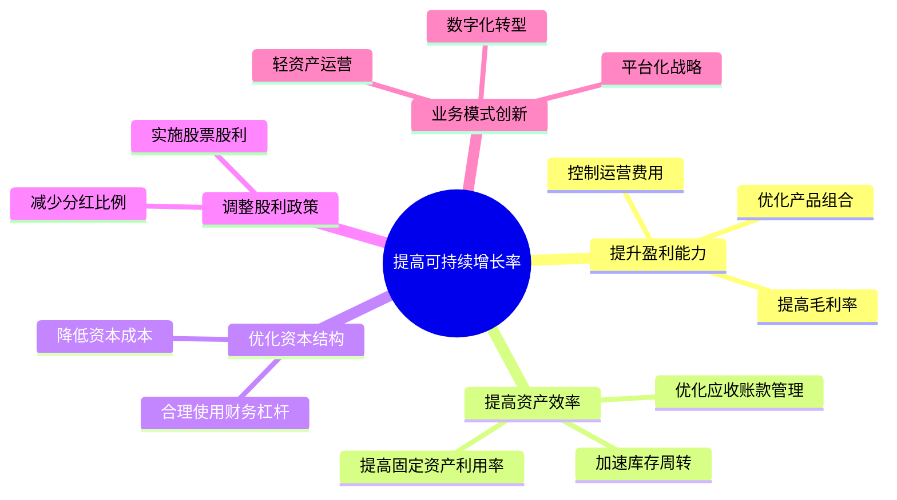

---
{"tags":["财务BP","高级分析","增长管理","可持续性","增长战略"],"aliases":["可持续增长模型","SGR分析"],"created":"2023-11-10","dg-publish":true,"permalink":"/08-财务专业/财务BP/学习内容/高级分析方法/增长模型/可持续增长率分析/","dgPassFrontmatter":true}
---


# 可持续增长率分析

> [!abstract] 概述
> 可持续增长率(Sustainable Growth Rate, SGR)是衡量企业在不增加财务杠杆、不稀释股权的前提下，通过内生增长能够维持的最大收入增长率。本文详细介绍可持续增长率的概念、计算方法、影响因素、应用场景以及在财务BP中的实践案例，帮助财务专业人士科学规划企业增长路径。

## 基本概念

可持续增长率是指企业在保持现有财务政策（如资本结构、股利政策）和运营表现不变的情况下，企业能够承受的最大收入增长率。它是财务BP中平衡增长与财务健康的关键指标，反映了企业自身造血能力与增长野心之间的平衡点。

### 可持续增长率的重要性

可持续增长率的概念对财务BP工作具有几方面重要意义：

1. **增长规划基准**：为企业设定合理的增长目标提供量化参考
2. **财务压力预警**：提前识别增长过快可能导致的财务压力
3. **融资需求信号**：帮助判断是否需要额外融资支持增长
4. **战略调整指引**：指导企业在运营和财务政策上的调整方向

### 增长率类型对比

在财务BP中，需要区分几种不同的增长率概念：

| 增长率类型 | 定义 | 限制条件 | 应用场景 |
|---------|------|---------|---------|
| 可持续增长率(SGR) | 维持现有财务政策下的最大增长率 | 不增加杠杆、不稀释股权 | 中长期战略规划 |
| 内部增长率(IGR) | 仅靠内部留存收益支持的增长率 | 零负债增长 | 保守型增长策略 |
| 目标增长率 | 战略目标设定的增长率 | 根据战略需求确定 | 战略目标设定 |
| 行业平均增长率 | 行业整体的增长水平 | 外部市场环境决定 | 绩效对标参考 |

## 核心内容

### 可持续增长率的计算方法

#### 1. 基本公式法

可持续增长率的经典计算公式为：

**SGR = ROE × 利润留存率**

其中：
- ROE（净资产收益率）= 净利润 ÷ 平均股东权益
- 利润留存率 = 1 - 股利支付率 = 留存收益 ÷ 净利润

这一公式体现了企业增长的两个核心驱动因素：盈利能力（ROE）和再投资能力（留存率）。

#### 2. 扩展杜邦分析法

将ROE分解为多个财务比率，可得出更详细的可持续增长率计算公式：

**SGR = 净利率 × 资产周转率 × 财务杠杆 × 利润留存率**

其中：
- 净利率 = 净利润 ÷ 销售收入
- 资产周转率 = 销售收入 ÷ 总资产
- 财务杠杆 = 总资产 ÷ 股东权益
- 利润留存率 = 1 - 股利支付率

这种分解方式有助于识别影响可持续增长的具体经营和财务因素。



#### 3. 资产负债表法

从资产负债表角度，可持续增长率也可以表示为：

**SGR = L × R × A × T ÷ [1 - (L × R × A × T)]**

其中：
- L = 负债总额 ÷ 股东权益
- R = 留存收益 ÷ 税后利润
- A = 销售净利率
- T = 销售收入 ÷ 总资产

### 可持续增长率影响因素分析

可持续增长率受多种因素影响，在财务BP中需要全面考虑：

#### 1. 运营效率因素

- **毛利率**：产品定价能力和成本控制能力
- **费用控制**：营销、管理等费用的控制效率
- **资产利用效率**：固定资产和营运资金的周转效率

#### 2. 财务政策因素

- **股利政策**：分红比例决定利润留存程度
- **资本结构**：负债比例影响财务杠杆水平
- **融资渠道**：融资方式的多元化程度

#### 3. 行业特性因素

- **资本密集度**：行业所需资本投入强度
- **增长阶段**：行业所处的生命周期阶段
- **技术创新**：行业技术更新换代速度

### 可持续增长率与实际增长率的偏差分析

在财务BP工作中，分析企业实际增长率与可持续增长率的差异，对识别潜在财务风险和机会至关重要：

| 对比情况 | 含义 | 潜在影响 | 应对策略 |
|---------|------|---------|---------|
| 实际增长 > SGR | 增长超过可持续水平 | 资金短缺、财务压力 | 增加融资、调整扩张策略 |
| 实际增长 = SGR | 增长处于平衡状态 | 财务状况稳定 | 维持现有战略 |
| 实际增长 < SGR | 增长低于可持续水平 | 资金闲置、效率不足 | 扩大投资、提高股利 |

```mermaid
xychart-beta
    title "增长率对比分析"
    x-axis ["Q1", "Q2", "Q3", "Q4", "Q1'", "Q2'", "Q3'", "Q4'"]
    y-axis "增长率(%)" 0 --> 30
    bar [15, 18, 20, 22, 25, 28, 24, 22]
    line [16, 17, 17, 18, 19, 20, 20, 21]
    annotate "实际增长率" (1, 15)
    annotate "可持续增长率" (1, 16)
    annotate "资金缺口" (6, 28)
```

## 应用方法

### 可持续增长率在财务BP中的应用流程

#### 1. 历史数据分析

- 计算过去3-5年的可持续增长率
- 分析可持续增长率的变动趋势
- 对比历史实际增长率与可持续增长率

#### 2. 目标增长评估

- 计算战略规划中的目标增长率
- 对比目标增长率与可持续增长率
- 评估目标实现的财务可行性

#### 3. 敏感性分析

- 测试关键变量变动对可持续增长率的影响
- 识别提升可持续增长率的关键杠杆
- 评估外部环境变化对可持续增长的影响

#### 4. 增长策略调整

- 根据对比结果，调整增长目标
- 设计平衡增长与财务稳健的策略方案
- 制定分阶段的增长路径

#### 5. 融资需求测算

- 计算快速增长情景下的资金缺口
- 评估不同融资方式的可行性
- 设计最优融资组合方案

### 常见增长情景与应对策略

不同增长情景下，财务BP应提供针对性的策略建议：

#### 1. 高增长超越SGR情景

当企业面临市场机遇，计划增长率超过可持续水平时：

- **策略方向**：扩大资金来源，支持快速增长
- **具体措施**：
  - 设计股权融资方案
  - 增加债务融资
  - 探索战略合作伙伴共同投资
  - 阶段性调整股利政策，提高利润留存

#### 2. 增长低于SGR情景

当企业增长低于可持续水平，存在资金利用效率问题时：

- **策略方向**：优化资金配置，提高股东回报
- **具体措施**：
  - 增加股利分配
  - 实施股票回购
  - 多元化投资拓展新业务
  - 收购兼并加速增长

#### 3. 增长与SGR匹配情景

当企业增长与可持续水平基本一致时：

- **策略方向**：维持平衡，提升内在价值
- **具体措施**：
  - 持续优化运营效率
  - 维持稳定的股利政策
  - 保持适度的财务杠杆
  - 专注核心业务增长

### 提高可持续增长率的策略

在财务BP中，可以提出多种提高企业可持续增长率的策略建议：



1. **提升盈利能力**
   - 优化产品定价策略
   - 改善成本结构
   - 扩大规模经济效应

2. **提高资产效率**
   - 优化营运资金管理
   - 改进固定资产利用效率
   - 实施精益生产和库存管理

3. **优化资本结构**
   - 合理增加杠杆比例
   - 使用多元化融资工具
   - 匹配融资期限与投资期限

4. **调整股利政策**
   - 降低现金分红比例
   - 实施弹性股利政策
   - 考虑股票股利替代现金股利

5. **业务模式创新**
   - 发展轻资产业务
   - 实施外包策略减少资本需求
   - 探索合作共赢的生态系统模式

## 案例分析

### 案例一：制造业企业扩张的可持续增长分析

某机械制造企业计划在未来3年实现年均20%的收入增长，需要评估这一目标的财务可行性。

**基础财务数据**：
- 净利率：8%
- 资产周转率：1.2次/年
- 资产负债率：40%
- 股利支付率：30%

**可持续增长率计算**：
1. 财务杠杆 = 1 / (1 - 资产负债率) = 1 / (1 - 40%) = 1.67
2. ROE = 净利率 × 资产周转率 × 财务杠杆 = 8% × 1.2 × 1.67 = 16%
3. 利润留存率 = 1 - 股利支付率 = 1 - 30% = 70%
4. SGR = ROE × 利润留存率 = 16% × 70% = 11.2%

**增长缺口分析**：
- 目标增长率：20%
- 可持续增长率：11.2%
- 增长缺口：8.8个百分点

**财务压力预测**：
若公司坚持20%的增长目标，在不调整财务政策的情况下：
- 第1年末：额外资金需求约为年销售额的7%
- 第2年末：额外资金需求累计达到年销售额的16%
- 第3年末：额外资金需求累计达到年销售额的27%

**策略建议**：
1. **调整内部运营**：
   - 提高净利率至10%（通过产品结构优化和成本控制）
   - 提高资产周转率至1.5次/年（通过精益生产和库存优化）
   - 降低股利支付率至20%
   - 这些调整可将SGR提升至16.7%

2. **外部融资规划**：
   - 即使采取上述措施，仍有3.3个百分点的增长缺口
   - 建议在3年期间分步骤实施融资计划：
     - 增加银行贷款：2亿元（第1年）
     - 发行公司债券：3亿元（第2年）
     - 引入战略投资者：股权融资2亿元（第3年）

3. **分阶段增长策略**：
   - 第1年：控制在15%增长率
   - 第2年：提升至18%增长率
   - 第3年：实现20%增长率
   - 这种渐进式增长策略可以减轻初期财务压力

### 案例二：科技创业公司的增长可持续性评估

某SaaS创业公司处于快速增长阶段，过去两年实现了100%的年收入增长，管理层计划维持这一高增长，同时准备B轮融资。

**基础财务数据**：
- 收入：1亿元/年
- 净利率：-20%（尚未盈利）
- 烧钱率：月均1000万元
- 现有现金储备：2亿元

**可持续增长分析**：
由于公司尚未盈利，传统SGR模型不适用。需要替代性评估方法：

1. **现金可支撑时间**：
   - 现有现金储备 ÷ 月度烧钱率 = 2亿元 ÷ 1000万元 = 20个月

2. **收入增长与成本结构关系**：
   - 当前单位收入变动成本率：45%
   - 固定运营成本：7500万元/年
   - 盈亏平衡收入：7500万元 ÷ (1 - 45%) = 1.36亿元

3. **增长率下的盈亏平衡预测**：
   - 维持100%增长率：第2年末达到盈亏平衡
   - 降至50%增长率：第3年初达到盈亏平衡

**可持续性评估**：
- 在不额外融资的情况下，100%的增长率最多可维持约18个月
- 如继续这一增长速度，至少需要额外3亿元融资支持两年增长

**策略建议**：

1. **优化单位经济模型**：
   - 提高产品定价，将毛利率从55%提升至65%
   - 降低客户获取成本，从当前获客成本12个月回收期降至9个月
   - 提高客户留存率，从85%提升至92%

2. **分阶段增长策略**：
   - 近期（1年内）：维持80-100%的高增长，巩固市场地位
   - 中期（1-2年）：增长率控制在50-60%，专注提升经营效率
   - 长期（2年以上）：增长率稳定在30-40%，实现盈利增长

3. **融资规划**：
   - B轮融资目标：4亿元
   - 融资用途分配：市场扩张40%、产品研发30%、团队建设20%、运营资金10%
   - 预留18个月现金跑道，防范融资环境变化风险

4. **增长质量优化**：
   - 提高收入质量（增加经常性收入比例）
   - 专注高价值客户细分市场
   - 优先发展现有客户价值，提高客单价

## 相关链接

- [[08-财务专业/财务BP/学习内容/高级分析方法/增长模型/增长驱动因素识别\|增长驱动因素识别]]
- [[08-财务专业/财务BP/学习内容/高级分析方法/增长模型/增长阶段的财务规划差异\|增长阶段的财务规划差异]]
- [[08-财务专业/财务BP/学习内容/高级分析方法/增长模型/增长瓶颈分析\|增长瓶颈分析]]
- [[08-财务专业/财务BP/学习内容/高级分析方法/投资回报分析/ROI计算方法\|ROI计算方法]]
- [[财务BP/学习内容/财务预测与模型/财务指标预测/增长指标预测\|增长指标预测]]

## 参考文献

1. Higgins, R. C. (2018). *Analysis for Financial Management*. McGraw-Hill Education.
2. Van Horne, J. C., & Wachowicz, J. M. (2009). *Fundamentals of Financial Management*. Prentice Hall.
3. Damodaran, A. (2015). *Applied Corporate Finance*. John Wiley & Sons.
4. Ross, S. A., Westerfield, R., & Jordan, B. D. (2019). *Corporate Finance*. McGraw-Hill Education.
5. 朱宝宪，《财务管理学》，清华大学出版社，2020.
6. 李曜，《企业增长与财务可持续性》，中国财政经济出版社，2018.
7. 刘志远，《财务战略与价值创造》，中信出版社，2021. 