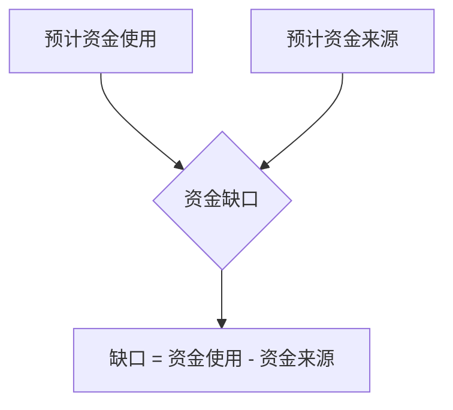
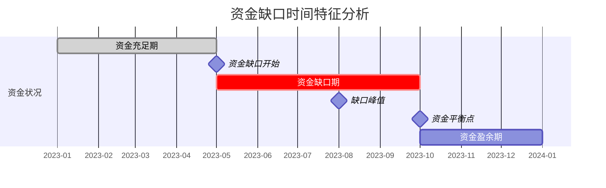

---
{"tags":["财务BP","高级分析","资金管理","缺口分析","资金规划"],"aliases":["资金需求分析方法","资金缺口测算"],"created":"2023-09-15","dg-publish":true,"permalink":"/08-财务专业/财务BP/学习内容/高级分析方法/资金需求分析/资金缺口计算方法/","dgPassFrontmatter":true}
---

# 资金缺口计算方法

> [!abstract] 概述
> 资金缺口计算是财务BP中至关重要的一环，用于确定企业在规划期内需要外部融资的金额和时间。本文介绍资金缺口的定义、计算方法、常见模型以及实际应用案例，帮助财务BP专业人士准确评估企业的资金需求。

## 基本概念

资金缺口（Funding Gap）是指企业在特定时期内，现有和预计的资金来源不足以满足其资金使用需求的差额。识别和量化这一缺口是财务BP工作中的关键任务，直接影响企业的融资决策和流动性管理。

### 资金缺口的类型

1. **营运资金缺口**：日常经营活动中的短期资金需求缺口
2. **项目资金缺口**：特定投资项目所需资金与可用资金的差额
3. **结构性资金缺口**：长期性的资金供需不平衡
4. **季节性资金缺口**：因业务季节性波动产生的临时资金需求

## 核心内容

### 资金缺口计算基本方法

#### 1. 直接法

**计算公式**：
资金缺口 = 预计资金使用总额 - 预计资金来源总额

其中：
- 预计资金使用：包括经营性支出、资本支出、债务偿还、股利支付等
- 预计资金来源：包括经营现金流入、资产处置、现有信贷额度等

#### 2. 现金流法

通过详细预测现金流量表，识别各期现金净流量为负的时期及金额。

**计算步骤**：
1. 预测未来每个期间的经营活动现金流量
2. 预测投资活动现金流量
3. 预测现有融资活动现金流量（不含新增融资）
4. 合计上述三项，得到基础现金净流量
5. 累计基础现金净流量，识别累计为负的最大值，即为资金缺口

#### 3. 比率推导法

基于销售收入预测和财务比率，推导出资金需求。

**计算公式**：
额外资金需求 = (A/S × ΔS) - (L/S × ΔS) - MS(1-d)

其中：
- A/S：资产销售比率
- L/S：自发负债销售比率
- ΔS：销售收入增量
- M：利润率
- S：销售收入
- d：股利支付比率

### 资金缺口时间特征分析

资金缺口不仅关注总量，还应分析其时间分布特征：

1. **缺口出现时点**：确定何时开始需要外部资金
2. **缺口持续时间**：短期临时性需求还是长期结构性缺口
3. **缺口峰值时点**：资金需求达到最大值的时间
4. **缺口解除时点**：何时资金状况转为盈余

### 敏感性分析在资金缺口计算中的应用

资金缺口预测应结合敏感性分析，评估关键假设变动对资金需求的影响：

1. **收入增长率变动**：分析销售增长速度变化对资金需求的影响
2. **毛利率变动**：考察产品定价或成本变化对资金需求的影响
3. **应收账款周转天数**：评估收款政策变化对资金需求的影响
4. **存货周转天数**：分析库存管理效率对资金需求的影响
5. **资本支出调整**：分析投资计划变更对资金需求的影响

## 应用方法

### 资金缺口计算流程

1. **确定预测期与时间细分度**
   - 短期预测（1年内）：按月或季度
   - 中期预测（1-3年）：按季度或半年
   - 长期预测（3年以上）：按年度

2. **构建基础预测模型**
   - 销售预测模型
   - 成本费用预测模型
   - 资本支出计划
   - 营运资金需求模型

3. **汇总现金流预测**
   - 经营活动现金流预测
   - 投资活动现金流预测
   - 现有融资活动现金流预测

4. **识别资金缺口**
   - 计算各期累计现金余额
   - 识别现金余额转负的时点及金额
   - 确定最大累计负值（资金缺口）

5. **制定融资方案**
   - 基于缺口特征选择融资工具
   - 设计融资时间和金额
   - 纳入融资成本影响
   - 重新计算现金流验证融资方案有效性

### 资金缺口计算工具

1. **Excel建模**：最常用的资金缺口计算工具，可定制性强
2. **专业财务规划软件**：提供标准化的资金缺口分析功能
3. **仪表板与可视化工具**：用于动态监控和展示资金缺口状况

## 案例分析

### 案例一：制造业扩张项目资金缺口测算

某制造企业计划投资1亿元建设新生产线，项目周期2年，预计第3年开始产生收益。

**基础假设**：
- 项目总投资：1亿元
- 建设期：2年（第一年投入6000万，第二年投入4000万）
- 经营期开始：第3年
- 预计投资回收期：5年（含建设期）
- 企业自有资金：3000万元
- 预计经营现金净流入：第3年1500万，第4年2500万，第5年3000万，第6年及以后每年3500万

**资金缺口计算**：

| 年份 | 项目现金流出 | 项目现金流入 | 净现金流 | 累计净现金流 |
|-----|------------|------------|---------|------------|
| 第1年 | -6000万  | 0         | -6000万  | -6000万    |
| 第2年 | -4000万  | 0         | -4000万  | -10000万   |
| 第3年 | 0        | 1500万    | 1500万   | -8500万    |
| 第4年 | 0        | 2500万    | 2500万   | -6000万    |
| 第5年 | 0        | 3000万    | 3000万   | -3000万    |
| 第6年 | 0        | 3500万    | 3500万   | 500万      |

**资金缺口分析**：
- 项目最大资金需求出现在第2年末，累计需要1亿元
- 考虑企业自有资金3000万元，实际资金缺口为7000万元
- 缺口出现时间：第1年初
- 缺口持续时间：约5年（直到第5年末）
- 建议融资方案：项目贷款7000万元，期限5年，从第3年开始还款

### 案例二：科技创业公司现金消耗分析

某SaaS科技创业公司处于快速增长阶段，需要评估未来12个月的资金需求以决定融资时机。

**基础假设**：
- 月营收增长率：10%
- 毛利率：70%
- 月度营销支出：当月收入的50%
- 研发支出：固定每月100万元
- 管理费用：当月收入的20%
- 当前现金余额：1000万元
- 初始月收入：200万元

**资金缺口计算**（单位：万元）：

| 月份 | 收入 | 毛利 | 营销支出 | 研发支出 | 管理费用 | 月净现金流 | 累计现金余额 |
|-----|------|------|---------|---------|---------|-----------|------------|
| 初始 | - | - | - | - | - | - | 1000 |
| 1月 | 200 | 140 | 100 | 100 | 40 | -100 | 900 |
| 2月 | 220 | 154 | 110 | 100 | 44 | -100 | 800 |
| 3月 | 242 | 169 | 121 | 100 | 48 | -100 | 700 |
| 4月 | 266 | 186 | 133 | 100 | 53 | -100 | 600 |
| 5月 | 293 | 205 | 146 | 100 | 59 | -100 | 500 |
| 6月 | 322 | 225 | 161 | 100 | 64 | -100 | 400 |
| 7月 | 354 | 248 | 177 | 100 | 71 | -100 | 300 |
| 8月 | 390 | 273 | 195 | 100 | 78 | -100 | 200 |
| 9月 | 429 | 300 | 214 | 100 | 86 | -100 | 100 |
| 10月 | 472 | 330 | 236 | 100 | 94 | -100 | 0 |
| 11月 | 519 | 363 | 260 | 100 | 104 | -101 | -101 |
| 12月 | 571 | 400 | 285 | 100 | 114 | -99 | -200 |

**资金缺口分析**：
- 公司将在第10个月末耗尽现有现金
- 12个月后累计资金缺口约200万元
- 考虑融资时间和不确定性，建议在第7-8个月（现金余额降至300-200万时）启动新一轮融资
- 理想融资金额：至少500万元（覆盖12个月缺口并提供额外缓冲）

## 相关链接

- [[08-财务专业/财务BP/学习内容/财务预测与模型/现金流预测/现金流预测的重要性\|现金流预测的重要性]]
- [[财务BP/学习内容/高级分析方法/资金需求分析/融资结构优化\|融资结构优化]]
- [[财务BP/学习内容/高级分析方法/资金需求分析/融资能力评估\|融资能力评估]]
- [[08-财务专业/财务BP/学习内容/财务预测与模型/敏感性分析/敏感性分析的目的与方法\|敏感性分析的目的与方法]]
- [[08-财务专业/财务BP/学习内容/高级分析方法/风险评估/财务风险识别\|财务风险识别]]

## 参考文献

1. Brealey, R. A., Myers, S. C., & Allen, F. (2020). *Principles of Corporate Finance*. McGraw-Hill Education.
2. Damodaran, A. (2018). *Applied Corporate Finance*. John Wiley & Sons.
3. Higgins, R. C. (2016). *Analysis for Financial Management*. McGraw-Hill Education.
4. Titman, S., Keown, A. J., & Martin, J. D. (2017). *Financial Management: Principles and Applications*. Pearson.
5. 朱叶，《企业资金管理实务》，中国财政经济出版社，2019.
6. 刘志远，《战略财务管理》，中信出版社，2020.
7. 周斌，《企业财务预警与风险管理》，经济管理出版社，2018. 