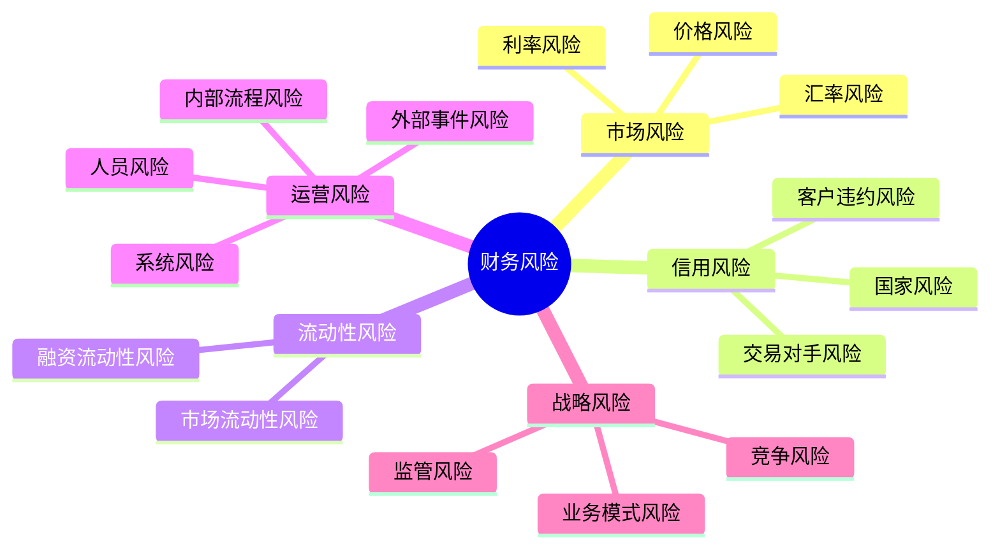

---
{"tags":["财务BP","高级分析","风险管理","风险识别","财务风险"],"aliases":["财务风险辨识","财务风险分类"],"created":"2023-10-12","dg-publish":true,"permalink":"/08-财务专业/财务BP/学习内容/高级分析方法/风险评估/财务风险识别/","dgPassFrontmatter":true}
---

# 财务风险识别

> [!abstract] 概述
> 财务风险识别是财务BP过程中的重要环节，旨在系统性地发现、辨别和评估可能影响企业财务稳定性和目标实现的各种风险因素。本文介绍财务风险的类型、识别方法、风险评估框架以及实践案例，帮助财务BP专业人士提前预警和应对潜在财务风险。

## 基本概念

财务风险（Financial Risk）是指可能导致企业财务损失、财务状况恶化或财务目标无法实现的不确定性。在财务BP工作中，准确识别、评估和管理这些风险是确保规划可行性的关键步骤。

### 财务风险的主要类型

1. **市场风险**：由市场价格变动导致的财务损失风险
   - 利率风险：利率变动影响借贷成本和投资收益
   - 汇率风险：汇率波动影响国际业务盈亏
   - 价格风险：商品、原材料价格波动影响成本结构

2. **信用风险**：交易对手方未能履行合同义务导致的财务损失风险
   - 客户违约风险：客户未按期支付货款
   - 交易对手风险：合作伙伴破产或违约
   - 国家风险：外国政府政策变更影响国际业务

3. **流动性风险**：无法及时获取足够资金以满足业务需求的风险
   - 融资流动性风险：无法获取所需资金
   - 市场流动性风险：无法以合理价格迅速变现资产

4. **运营风险**：内部流程、人员、系统不当或外部事件导致的风险
   - 内部流程风险：流程设计缺陷或执行不当
   - 人员风险：人为错误或舞弊
   - 系统风险：信息系统故障或安全漏洞
   - 外部事件风险：自然灾害、疫情等突发事件

5. **战略风险**：企业战略决策失误导致的长期财务损失风险
   - 业务模式风险：商业模式适应性不足
   - 竞争风险：市场竞争格局变化
   - 监管风险：法规政策变更

## 核心内容

### 财务风险识别的方法与工具

#### 1. 定性识别方法

**头脑风暴法**
组织相关人员集中讨论，通过集体智慧发现可能存在的财务风险点。
- 优点：覆盖范围广，思维发散
- 缺点：依赖参与者经验，可能存在盲点

**德尔菲法**
通过多轮专家匿名问卷，收集专业意见并寻求共识。
- 优点：避免个人偏见，汇集专业判断
- 缺点：耗时较长，需要专家配合

**检查表法**
基于既有经验和最佳实践，使用标准化的检查表识别风险。
- 优点：系统全面，标准化程度高
- 缺点：可能忽略新型风险或个性化风险

**情景分析法**
构建各种可能的未来情景，分析每种情景下可能面临的财务风险。
- 优点：前瞻性强，覆盖多种可能性
- 缺点：对情景构建能力要求高

#### 2. 定量识别方法

**历史数据分析**
分析历史财务数据的波动性、异常值和趋势，发现潜在风险信号。
- 指标分析：财务比率异常波动
- 趋势分析：关键指标恶化趋势
- 波动性分析：现金流、利润等关键指标的波动

**敏感性分析**
测试关键假设变动对财务预测的影响，识别高敏感度因素。
- 单因素敏感性分析：逐一测试单个因素变动的影响
- 多因素敏感性分析：同时考虑多个因素变动的综合影响

**压力测试**
设定极端不利情景，评估企业财务承受能力。
- 宏观经济压力测试：经济衰退、通胀高企等
- 行业特定压力测试：行业需求急剧下滑、原材料价格暴涨等
- 企业特定压力测试：核心客户流失、重大项目失败等

**蒙特卡洛模拟**
通过大量随机模拟，分析各种风险因素组合下的财务结果概率分布。
- 优点：全面评估不确定性，提供概率分布
- 缺点：模型构建复杂，参数设定有难度

### 财务风险识别框架

有效的财务风险识别应遵循系统化的框架，确保全面覆盖：

#### 1. 识别准备阶段

- 明确财务BP的目标和关键假设
- 确定风险识别的范围和边界
- 组建跨部门风险识别团队
- 收集相关历史数据和行业信息

#### 2. 风险识别实施阶段

- 按风险类别系统梳理潜在风险点
- 结合定性和定量方法全面识别风险
- 记录识别的风险及其可能的触发因素
- 初步评估风险的可能性和影响程度

#### 3. 风险分析与优先级排序

- 评估各风险的发生概率
- 分析各风险可能造成的财务影响
- 计算风险暴露值（概率×影响）
- 按风险暴露值排序，确定关键风险

#### 4. 风险识别结果整合

- 编制风险登记册，记录所有识别的风险
- 针对关键风险，分析其根本原因
- 明确风险之间的相互关系和传导机制
- 与财务BP模型整合，进行情景分析

### 财务BP中常见的风险盲区

在财务BP过程中，一些风险区域容易被忽视：

1. **相关性风险**：风险因素之间的相关性被低估，导致风险叠加效应
2. **极端事件风险**：低概率高影响事件被忽视
3. **假设隐含风险**：BP基础假设本身的脆弱性
4. **过度依赖历史数据**：在快速变化环境中历史数据可能不具代表性
5. **模型风险**：预测模型自身的局限性和错误
6. **执行风险**：规划实施过程中的执行偏差
7. **反馈循环风险**：一个风险触发连锁反应，形成负向循环

## 应用方法

### 财务风险识别流程

1. **确定风险识别目标与范围**
   - 明确财务BP的核心假设和关键指标
   - 确定需要重点关注的风险领域
   - 设定风险识别的时间范围

2. **收集风险信息**
   - 内部数据：历史财务数据、风险事件记录
   - 外部数据：行业报告、经济预测、监管变化
   - 专家经验：管理层访谈、专家咨询

3. **应用风险识别方法**
   - 组织头脑风暴会议
   - 实施德尔菲调研
   - 开展情景分析
   - 进行量化模拟

4. **编制风险清单**
   - 记录识别的各类风险
   - 描述风险发生的可能条件
   - 分析风险的潜在影响范围和程度
   - 评估风险的时间特征（短期/长期）

5. **风险评估与筛选**
   - 对识别的风险进行定性评级
   - 进行定量分析（如可能）
   - 筛选出关键风险清单

6. **将风险整合到财务BP**
   - 在财务模型中反映关键风险
   - 设计敏感性分析情景
   - 制定风险缓解计划

### 风险识别矩阵

风险识别矩阵是一种实用工具，用于系统梳理各环节的风险点：

| 业务环节 | 财务影响点 | 潜在风险 | 风险特征 | 识别方法 |
|---------|-----------|---------|---------|---------|
| 销售预测 | 营收计划 | 市场需求预测偏差 | 高概率/中等影响 | 历史数据分析、专家判断 |
| 产品定价 | 毛利率 | 价格竞争加剧 | 中等概率/高影响 | 竞争对手分析 |
| 成本预测 | 生产成本 | 原材料价格波动 | 高概率/高影响 | 趋势分析、压力测试 |
| 资本支出 | 投资回报 | 项目延期或超支 | 中等概率/高影响 | 情景分析 |
| 融资计划 | 融资成本 | 利率上升 | 中等概率/中等影响 | 敏感性分析 |
| 外汇交易 | 汇兑损益 | 汇率波动 | 高概率/中等影响 | 蒙特卡洛模拟 |
| 应收账款 | 现金流 | 客户延迟付款 | 高概率/中等影响 | 账龄分析 |
| 供应链 | 运营成本 | 供应中断 | 低概率/高影响 | 情景分析 |

## 案例分析

### 案例一：制造业企业原材料价格风险识别

某机械制造企业在制定年度财务BP时，需要识别和评估原材料价格波动带来的财务风险。

**背景信息**：
- 企业主要原材料为钢材和铜，占成本结构的40%
- 过去两年钢材价格波动率为15%，铜价波动率为20%
- 企业产品销售合同通常为固定价格，期限6-12个月

**风险识别过程**：

1. **定性分析**：
   - 通过头脑风暴，识别原材料价格可能上涨的因素：全球经济复苏、贸易摩擦、主要生产国政策变化等
   - 通过专家访谈，分析行业供需趋势和价格周期特征

2. **定量分析**：
   - 历史价格分析：分析过去5年原材料价格的季节性和周期性特征
   - 敏感性分析：测算原材料价格每上涨5%对毛利率的影响
   - 情景分析：设定基准/悲观/极端三种价格情景，计算财务影响

**风险识别结果**：

| 风险因素 | 可能性 | 财务影响 | 风险评级 | 早期预警指标 |
|---------|-------|---------|---------|------------|
| 钢材价格上涨超过20% | 中等 | 毛利率下降5个百分点 | 高 | 钢铁PMI指数持续上升 |
| 铜价上涨超过30% | 低 | 毛利率下降3个百分点 | 中 | 全球主要铜矿减产消息 |
| 供应商交付延迟 | 中等 | 生产中断，每天损失50万 | 高 | 供应商交付周期延长 |
| 原材料质量下降 | 低 | 产品退货率上升，损失不确定 | 中 | 质检报告异常增加 |

**风险应对建议**：
- 对于高风险项目，考虑原材料套期保值策略
- 在销售合同中增加原材料价格调整条款
- 扩大供应商网络，降低单一供应商依赖
- 适当增加安全库存，防范短期供应中断

### 案例二：科技服务企业汇率风险识别

某跨国SaaS企业在制定年度财务BP时，需要识别和评估汇率波动带来的财务风险。

**背景信息**：
- 企业总收入的60%来自海外市场，主要以美元、欧元结算
- 成本主要以人民币支付（研发团队位于中国）
- 过去一年美元/人民币汇率波动率为8%，欧元/人民币汇率波动率为10%

**风险识别过程**：

1. **暴露分析**：
   - 美元收入约1200万美元/年
   - 欧元收入约800万欧元/年
   - 净外汇敞口：美元1200万、欧元800万

2. **敏感性分析**：
   - 人民币对美元升值1%，利润减少约82万人民币
   - 人民币对欧元升值1%，利润减少约56万人民币

3. **情景模拟**：
   使用蒙特卡洛模拟，基于历史波动率模拟1000种可能的汇率情景

**风险识别结果**：

| 风险情景 | 概率 | 财务影响 | 风险评级 |
|---------|------|---------|---------|
| 人民币对美元升值>5% | 30% | 利润减少410万人民币 | 高 |
| 人民币对欧元升值>5% | 25% | 利润减少280万人民币 | 中高 |
| 汇率剧烈波动（季内波动>10%） | 15% | 财务报表波动，预测困难 | 中 |
| 结汇政策变更 | 5% | 增加合规成本，具体影响难以量化 | 低 |

**综合风险评估**：
- 95%置信区间下，汇率波动可能导致年度利润变动范围为-800万至+200万人民币
- 汇率风险是企业面临的最主要财务风险之一

**风险应对建议**：
- 实施分层次的汇率风险对冲策略
- 调整定价策略，在高风险市场采用本币定价
- 优化收入和成本的币种匹配度
- 增强财务预测中的汇率敏感性分析

## 相关链接

- [[财务BP/学习内容/高级分析方法/风险评估/风险量化方法\|风险量化方法]]
- [[财务BP/学习内容/高级分析方法/风险评估/风险缓解策略\|风险缓解策略]]
- [[财务BP/学习内容/高级分析方法/风险评估/压力测试应用\|压力测试应用]]
- [[08-财务专业/财务BP/学习内容/财务预测与模型/敏感性分析/敏感性分析的目的与方法\|敏感性分析的目的与方法]]
- [[08-财务专业/财务BP/学习内容/财务预测与模型/情景分析/情景构建方法\|情景构建方法]]

## 参考文献

1. Jorion, P. (2011). *Financial Risk Manager Handbook*. Wiley Finance.
2. Hopkin, P. (2018). *Fundamentals of Risk Management: Understanding, Evaluating and Implementing Effective Risk Management*. Kogan Page.
3. Damodaran, A. (2008). *Strategic Risk Taking: A Framework for Risk Management*. Wharton School Publishing.
4. Hull, J. C. (2018). *Risk Management and Financial Institutions*. Wiley Finance.
5. 李雪松，《企业风险管理实务》，中国财政经济出版社，2020.
6. 钱小军，《金融风险识别与控制》，中信出版社，2019.
7. 郑建明，《现代企业风险管理》，经济管理出版社，2021. 