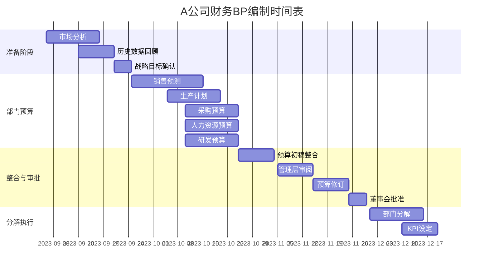
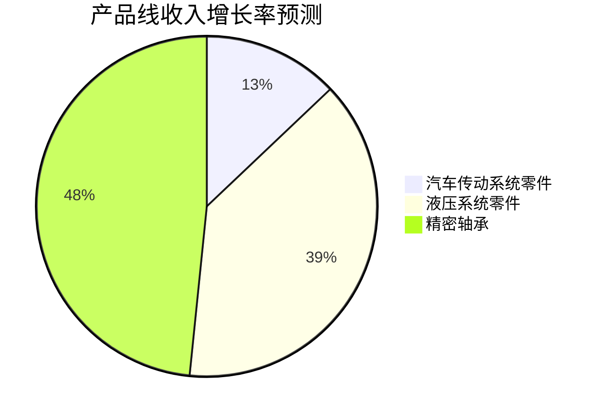
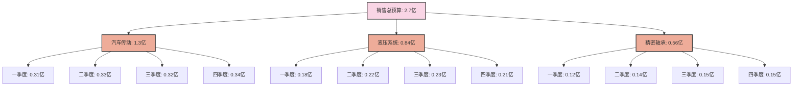
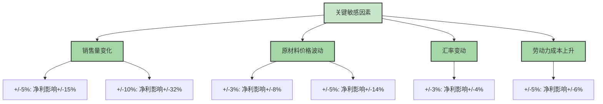

---
{"dg-publish":true,"dg-home":false,"permalink":"/08-财务专业/财务BP/案例/制造业BP案例-A公司/","dgPassFrontmatter":true}
---

# 制造业BP案例分析：A公司年度预算编制

#案例分析 #制造业 #年度预算

## 公司背景

A公司是一家中型机械零部件制造企业，成立15年，年营收约2.5亿元，员工300人。公司主要为汽车、工程机械和农业设备制造商提供精密零部件。

公司产品分为三大类：
- 汽车传动系统零件（占营收50%）
- 液压系统零件（占营收30%）
- 精密轴承（占营收20%）

## 面临的挑战与目标

### 市场环境

- 汽车行业需求增速放缓，预计下一年度增长3%
- 工程机械市场前景看好，预计增长12%
- 原材料（钢材、铝合金）价格波动加剧
- 劳动力成本持续上升
- 行业竞争加剧，客户价格敏感度提高

### 战略目标

公司制定了以下战略目标：
- 营收增长目标：8%
- 毛利率目标：28%（较上年提高1个百分点）
- 净利润率目标：10%
- 新产品线（精密轴承新型号）推出
- 产能利用率从85%提升至90%

## 财务BP编制流程



A公司采用"自上而下与自下而上相结合"的预算编制方法：
1. 管理层提供整体目标和关键假设
2. 各部门基于这些假设提交详细预算
3. 财务部门整合并检查一致性
4. 通过多轮讨论和调整达成最终预算

## 主要预算假设

### 收入预测假设



- 汽车传动系统零件：增长4%（考虑市场放缓但公司市占率提升）
- 液压系统零件：增长12%（顺应工程机械市场增长）
- 精密轴承：增长15%（新型号推出带动增长）
- 整体加权平均增长：8%

### 成本假设

- 原材料成本：占收入的45%（较上年下降1个百分点，通过集中采购和工艺改进）
- 直接人工：占收入的15%（考虑5%的工资上涨因素）
- 制造费用：占收入的12%（通过提高产能利用率略有下降）
- 销售费用：占收入的8%（保持不变）
- 管理费用：占收入的6%（保持不变）
- 研发投入：占收入的4%（较上年增加0.5个百分点）

### 资本支出计划

A公司计划投资2000万元用于以下项目：
- 生产线自动化升级：1200万元
- 检测设备更新：500万元
- 研发中心扩建：300万元

## 关键预算模块

### 1. 销售预算

销售预算按产品线、客户和季节性因素进行细分：



### 2. 生产预算

基于销售预算和库存政策制定，考虑产能限制和季节性因素：
- 目标成品库存：30天销售量
- 原材料库存：45天生产需求
- 产能规划：考虑90%的产能利用率

### 3. 人员预算

```mermaid
%%{init: {'theme': 'base', 'themeVariables': { 'primaryColor': '#f9d5e5', 'fontFamily': '"Microsoft YaHei", "微软雅黑", "SimHei", "黑体", sans-serif', 'fontSize': '20px', 'primaryBorderColor': '#333333', 'primaryTextColor': '#333333'}}}%%
bar
    title A公司人员规划
    "生产部门" : 180
    "技术研发" : 45
    "销售市场" : 35
    "管理行政" : 25
    "供应链" : 15
```

人员成本预算包括：
- 基本工资
- 奖金（销售部门按销售额的2%，其他部门按基本工资的两个月）
- 福利（基本工资的40%）
- 培训（人均5000元/年）

### 4. 现金流预算

特别关注以下因素：
- 应收账款周期：60天
- 应付账款周期：45天
- 资本支出支付计划（按季度分期）
- 季节性因素对现金流的影响

## 敏感性分析

A公司对以下关键变量进行了敏感性分析：



分析显示，公司业绩对销售量变化最为敏感，其次是原材料价格波动。

## 情景分析

A公司制定了三种情景的财务预测：

### 1. 基准情景（概率60%）
- 销售增长：8%
- 毛利率：28%
- 净利润：2700万元

### 2. 乐观情景（概率25%）
- 销售增长：12%
- 毛利率：29%
- 净利润：3400万元

### 3. 保守情景（概率15%）
- 销售增长：4%
- 毛利率：26%
- 净利润：1800万元

## BP执行与监控计划

为确保BP的有效实施，A公司建立了以下机制：

1. **月度业绩审查**：比较实际结果与预算目标
2. **滚动预测**：每季度更新未来12个月的预测
3. **预警指标**：设定关键指标的容忍区间
4. **调整机制**：明确何时需要修订预算的触发条件
5. **责任制**：各部门负责人对预算目标负责

## 经验与教训

A公司通过多年的预算实践总结了以下经验：

1. **平衡准确性与灵活性**：预算需要足够准确以指导行动，但也要保持灵活性以应对变化
2. **跨部门协作至关重要**：销售、生产、采购和财务部门需密切配合
3. **聚焦关键驱动因素**：识别并关注真正影响业务结果的核心变量
4. **情景规划很有价值**：帮助管理层做好应对不同情况的准备
5. **数据质量是基础**：历史数据的准确性对预测质量至关重要

## 对其他企业的启示

1. 将战略目标与财务BP紧密结合
2. 充分考虑行业和市场环境变化
3. 使用自上而下和自下而上相结合的编制方法
4. 重视敏感性分析和情景规划
5. 建立有效的监控和调整机制

相关概念：
- [[08-财务专业/财务BP/笔记/预算编制基础/预算编制流程\|预算编制流程]]
- [[08-财务专业/财务BP/笔记/财务预测与模型/敏感性分析\|敏感性分析]]
- [[08-财务专业/财务BP/笔记/财务预测与模型/情景分析\|情景分析]]
- [[08-财务专业/财务BP/笔记/预算编制基础/资本支出预算\|资本支出预算]] 