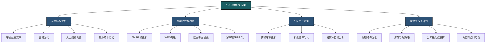
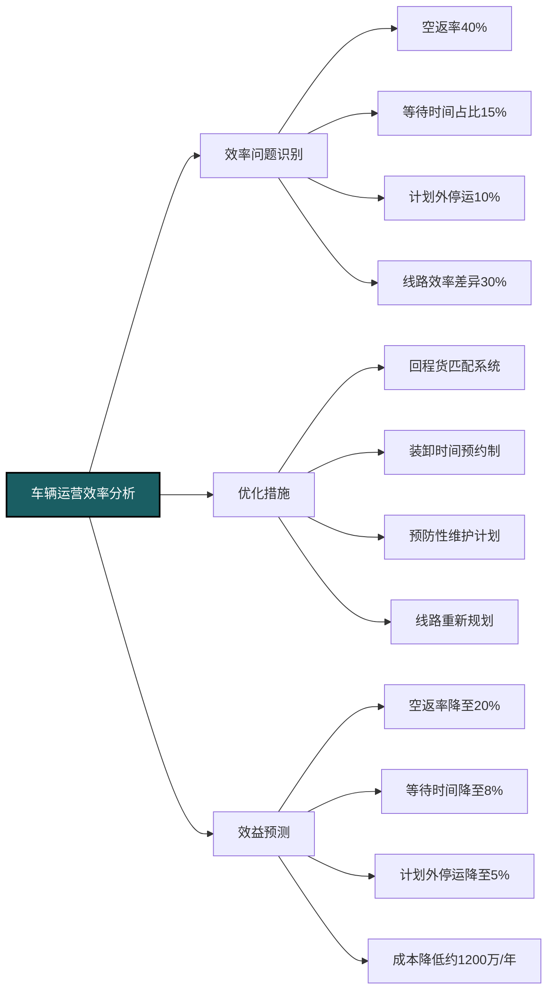
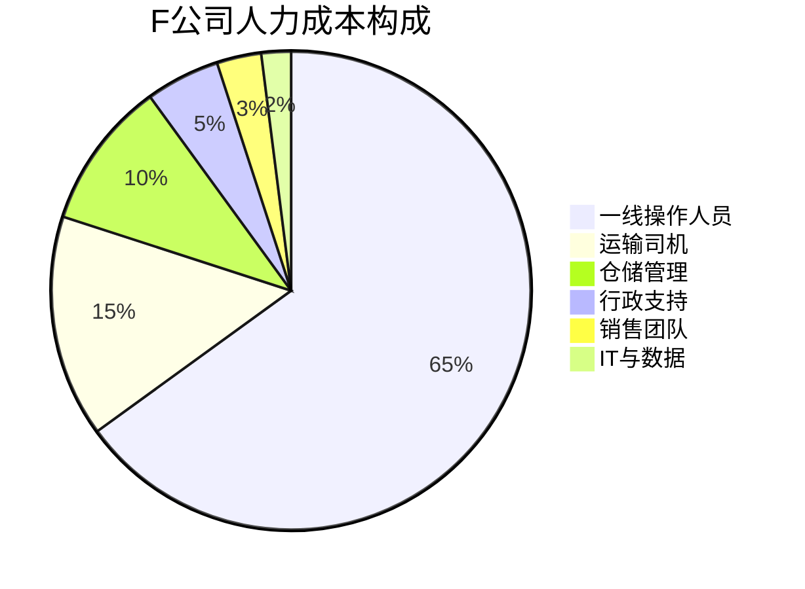
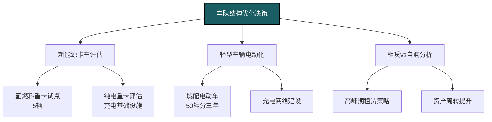
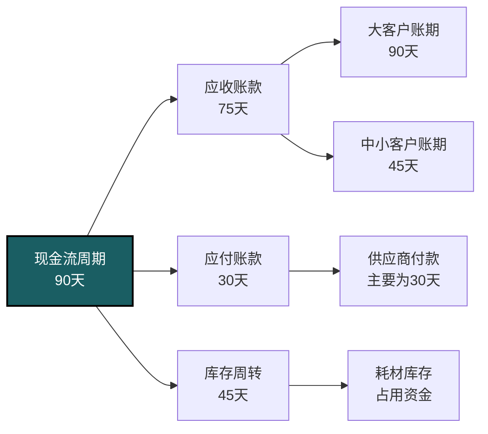
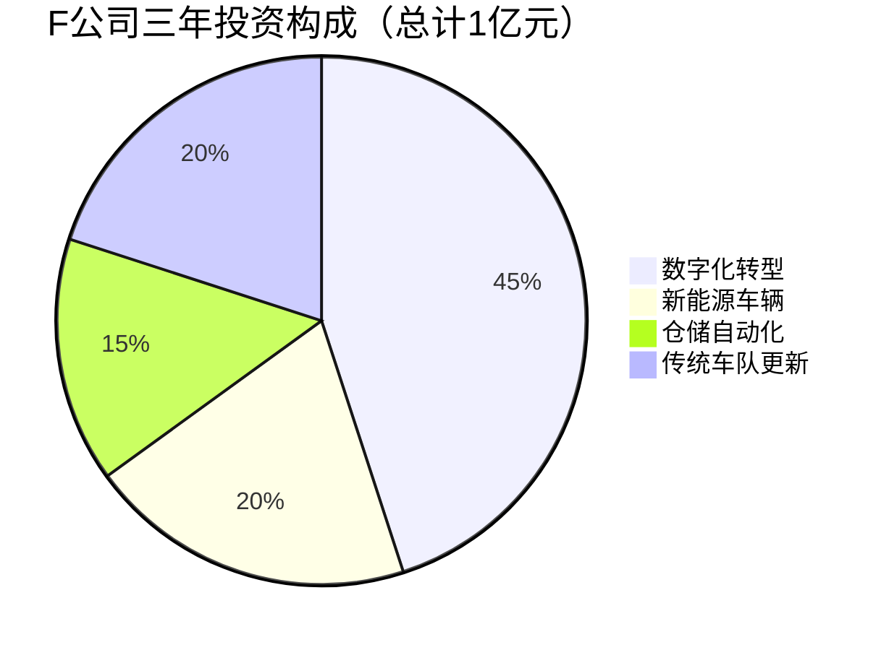
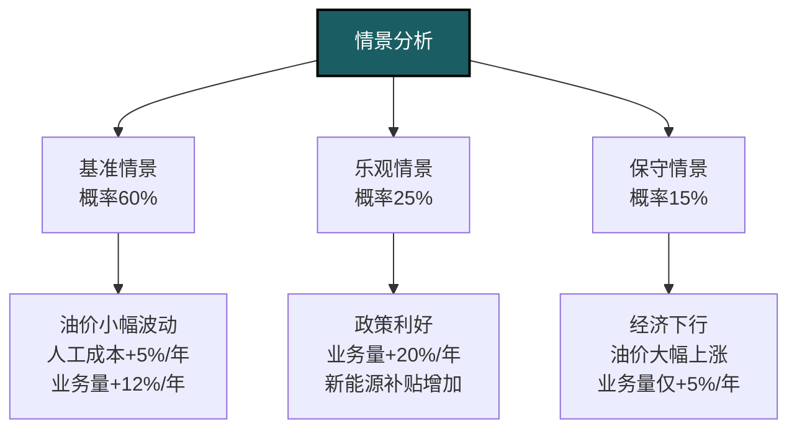

---
{"dg-publish":true,"permalink":"/08-财务专业/财务BP/案例/物流企业BP案例-F公司/"}
---

# 物流企业BP案例分析：F公司成本优化与数字化转型

#案例分析 #物流企业 #成本优化 #数字化转型 #现金流管理

## 公司背景

F公司是一家成立于2008年的区域物流服务提供商，主要为华南地区的制造业、电商和零售企业提供综合物流解决方案。公司拥有自有车队150辆，在5个城市运营8个仓储中心，员工总数约700人，年营业收入4.6亿元。

F公司的业务结构分为以下几个板块：
- 整车运输服务（占收入45%，毛利率18%）
- 仓储与库存管理（占收入30%，毛利率25%）
- 城市配送（占收入15%，毛利率12%）
- 供应链解决方案咨询（占收入10%，毛利率35%）

## 面临的挑战与问题

### 外部环境挑战

- 燃油价格波动加剧，对运输成本形成巨大压力
- 电商巨头自建物流网络，挤压第三方物流市场空间
- 同行业数字化转型加速，传统运营模式竞争力下降
- 客户对物流时效和可视化需求不断提高
- 新能源物流车政策扶持增加，但初始投资较大

### 内部经营问题

- 车辆利用率不均衡，空返率高达40%
- 仓储空间季节性闲置问题明显，平均利用率70%
- 人工成本持续上升，占总成本的35%
- IT系统陈旧，数据孤岛问题严重
- 现金流周期长，应收账款周转天数达90天

## 财务BP重点与框架



F公司的财务BP主要聚焦于四个关键领域，通过精细化分析和情景规划，为公司未来三年的战略决策提供财务支持和可行性评估。

## 成本结构优化分析

### 车辆运营效率提升规划

F公司通过对车队运营数据的深入分析，发现了多项优化机会：



通过实施这些优化措施，F公司预计在不增加车辆数量的情况下，有效运力可提升约25%，每年可减少运营成本约1200万元。

### 仓储网络与利用率优化

F公司对8个仓储中心进行了全面评估，并制定了差异化策略：

**仓储中心分类及策略**：
- A类核心仓（3个）：扩建并增加自动化设备投入
- B类平衡仓（3个）：维持现状，优化内部运营流程
- C类边缘仓（2个）：考虑改为共享仓模式或租赁部分面积

**仓储优化关键措施**：
- 引入动态库存分配系统，根据区域需求波动调整库存布局
- 实施高密度存储解决方案，提高空间利用率20%
- 开发季节性仓储共享平台，闲置期对外租赁
- 优化人员配置，提高人均作业效率

通过这些措施，预计仓储利用率可从70%提升至85%，每年可降低单位存储成本约15%。

### 人力结构优化与自动化

F公司进行了详细的人力成本分析，发现多个优化空间：



人力优化策略包括：
- 仓储自动化：引入AGV和自动分拣系统，减少30%人工需求
- 司机效率提升：通过优化调度和路线规划，提高人均产出15%
- 中后台精简：通过流程再造和系统升级，精简行政人员20%
- 数字化团队扩充：增加IT与数据分析人才，从15人扩充至35人

这些措施预计将使公司总人数从700人优化至650人，但人均产值提升25%，整体人力成本占比从35%降至30%。

## 数字化转型投资规划

### 系统架构与投资计划

F公司规划了三年的数字化转型路线图，总投资约4500万元：

```mermaid
gantt
    title F公司数字化转型时间表
    dateFormat  YYYY-Q
    section 基础架构
    云基础设施迁移      :2023-Q1, 2023-Q3
    数据中台建设       :2023-Q2, 2024-Q1
    API网关建设        :2023-Q3, 2024-Q1
    section 核心系统
    TMS系统升级        :2023-Q2, 2024-Q1
    WMS系统更新        :2023-Q3, 2024-Q2
    BI平台建设         :2024-Q1, 2024-Q3
    section 客户端应用
    司机APP开发        :2023-Q4, 2024-Q2
    客户门户升级       :2024-Q2, 2024-Q4
    物流可视化平台     :2024-Q3, 2025-Q1
    section 智能应用
    AI路径优化         :2024-Q2, 2025-Q1
    预测性分析系统     :2024-Q3, 2025-Q2
    数字孪生仓库试点   :2025-Q1, 2025-Q4
```

主要投资明细：
- 基础设施与平台：1000万元
- 核心业务系统：1800万元
- 移动应用程序：700万元
- 数据分析与AI应用：800万元
- 实施与培训：200万元

### ROI分析与分阶段收益

F公司对数字化投资进行了详细的投资回报分析：

**短期收益（1年内）**：
- 运营效率提升10%，节约成本约800万元/年
- 错误率降低40%，减少赔付与返工约300万元/年
- 人工成本优化，节约约500万元/年

**中期收益（1-2年）**：
- 车辆利用率提高25%，增加收入约2000万元/年
- 仓储空间利用率提升15%，增加收入约800万元/年
- 客户满意度提升，客户留存率从85%提高到92%

**长期收益（2-3年）**：
- 数据驱动决策能力建立，提高定价准确性
- 建立竞争壁垒，提高高利润服务占比
- 实现业务模式创新，开发新的收入来源

投资回收期预计为2.2年，三年累计净收益预计为7000万元。

## 车队资产规划与优化

### 新能源车辆转型评估

F公司对传统燃油车与新能源物流车进行了全面的TCO(总拥有成本)分析：



**总拥有成本(TCO)比较**：
- 传统柴油重卡：初期投资80万元/辆，10年TCO约280万元
- 纯电动重卡：初期投资180万元/辆，10年TCO约320万元
- 氢燃料重卡：初期投资250万元/辆，10年TCO约370万元
- 传统轻型车：初期投资25万元/辆，8年TCO约85万元
- 电动轻型车：初期投资40万元/辆，8年TCO约75万元

考虑到政策补贴、运营成本和环保要求，F公司计划：
- 城市配送车辆：3年内100%转为电动车，总投资2000万元
- 干线运输车辆：先试点5辆氢燃料重卡，视情况扩大规模
- 最终目标是在5年内将50%的车队转为新能源车辆

### 资产轻量化策略

F公司还评估了车辆资产轻量化的可能性：

**自有vs租赁比较**：
- 基本需求(占70%)：保持自有，确保核心运力
- 季节性需求(占20%)：长期租赁，1-2年合同
- 峰值需求(占10%)：短期租赁或社会化运力

**社会化运力整合**：
- 开发货主-车主直接对接平台
- 建立优质社会车辆资源池，分级管理
- 实施标准化的服务评价体系

这一策略预计可以减少资本支出约3000万元，提高资产回报率从8%至12%，同时提升对需求波动的响应能力。

## 现金流改善计划

### 应收账款与付款条件优化

F公司的现金流周期分析显示严重的资金占用问题：



针对这一问题，F公司制定了以下改善措施：

**应收账款管理**：
- 客户分级付款政策：A类客户60天，B类45天，C类30天或预付
- 提前付款折扣计划：提前30天支付可享1.5%折扣
- 电子发票与自动对账系统，缩短结算周期10天
- 大客户专属对接人，加强对账与催收流程

**供应商协同策略**：
- 主要供应商付款期延长至45-60天
- 建立供应商融资计划，提供及时付款选项
- 集中采购增加议价能力

通过这些措施，预计将现金流周期从90天缩短至60天，释放营运资金约3800万元。

### 投资现金流与融资规划

F公司未来三年的主要资本支出包括：
- 数字化转型投资：4500万元
- 新能源车辆购置：2000万元（一期）
- 仓储自动化设备：1500万元
- 现有车队更新：2000万元



资金来源规划：
- 经营现金流：5000万元
- 银行贷款：3000万元（设备贷款，平均利率4.5%）
- 融资租赁：1500万元（主要用于新能源车辆）
- 政府补贴：500万元（新能源车辆和数字化补贴）

F公司计划保持资产负债率控制在50%以内，确保财务安全。

## 关键绩效指标与监控

F公司建立了一套综合的KPI体系来监控BP执行情况：

### 财务KPI

| 指标类别 | KPI | 基准值 | 目标值 |
|---------|-----|-------|-------|
| 盈利能力 | 毛利率 | 20% | 25% |
| | 营业利润率 | 5% | 9% |
| | EBITDA利润率 | 12% | 16% |
| 运营效率 | 资产周转率 | 2.1 | 2.8 |
| | 车辆利用率 | 60% | 85% |
| | 仓储利用率 | 70% | 85% |
| 现金流 | 经营现金流 | 1.5亿 | 2.2亿 |
| | 现金转换周期 | 90天 | 60天 |
| | 应收账款周转天数 | 75天 | 55天 |

### 业务运营KPI

| 指标类别 | KPI | 基准值 | 目标值 |
|---------|-----|-------|-------|
| 客户指标 | 客户留存率 | 85% | 92% |
| | 准时交付率 | 92% | 98% |
| | 服务投诉率 | 3% | <1% |
| 运营指标 | 空返率 | 40% | 20% |
| | 车辆平均装载率 | 75% | 85% |
| | 人均产值 | 65万元 | 85万元 |
| 数字化指标 | 自动化作业率 | 15% | 40% |
| | 数据分析覆盖率 | 30% | 85% |
| | 系统集成度 | 40% | 95% |

## 情景分析与风险评估

F公司针对未来三年可能面临的不同情景进行了详细分析和准备：

### 核心情景假设



### 情景应对策略

**基准情景**：执行当前BP计划，保持投资节奏。

**乐观情景应对**：
- 加速数字化转型进度，提前实施第二阶段
- 扩大新能源车队转型规模
- 考虑并购小型同行，扩大网络覆盖
- 提前布局高增长区域市场

**保守情景应对**：
- 延缓非核心数字化投资
- 更多采用资产轻模式，减少自有车辆投入
- 强化成本控制，实施零基预算
- 重点发展高毛利率业务线
- 加强现金流管理，确保财务安全

## BP实施经验与教训

### 成功因素

F公司通过实施精细化的财务BP，在第一年已取得以下成果：
- 车辆空返率降低15个百分点，直接节约成本约500万元
- 应收账款周转天数减少10天，释放现金流约1200万元
- 数字化应用初见成效，客户服务满意度提升12%
- 新能源车试点运行良好，单车运营成本降低18%

### 关键经验教训

F公司总结了以下BP实施经验：

1. **数据驱动决策至关重要**：详实的运营数据是制定有效BP的基础
2. **资产优化需量身定制**：不同业务线和区域需要差异化资产策略
3. **现金流比利润更重要**：物流行业资本密集，现金流管理是生存关键
4. **数字化是手段非目的**：技术投入必须服务于明确的业务目标
5. **转型需要循序渐进**：尤其是新能源车队转型，需要充分考虑配套设施和运营适应性

## 行业启示与战略展望

F公司的案例对物流行业其他企业有以下启示：

1. 精细化成本管理是物流企业在微利环境中生存的关键
2. 科学的资产配置策略可以显著提高资本效率和企业韧性
3. 数字化转型需要全面规划但分步实施，注重投资回报
4. 新能源物流车虽有前景，但转型节奏需要考虑多重因素
5. 现代物流企业需要从单纯资产运营向供应链集成服务商转型

展望未来，F公司计划在以下方向继续深化BP的实施：
- 发展融合物流金融的供应链服务
- 探索数据变现和平台化业务模式
- 打造基于物联网和区块链的透明供应链
- 通过数字孪生技术优化网络规划和资源配置

相关概念：
- [[物流成本分析\|物流成本分析]]
- [[资产周转优化\|资产周转优化]]
- [[现金周期管理\|现金周期管理]]
- [[新能源物流车TCO分析\|新能源物流车TCO分析]]
- [[数字化转型ROI评估\|数字化转型ROI评估]] 