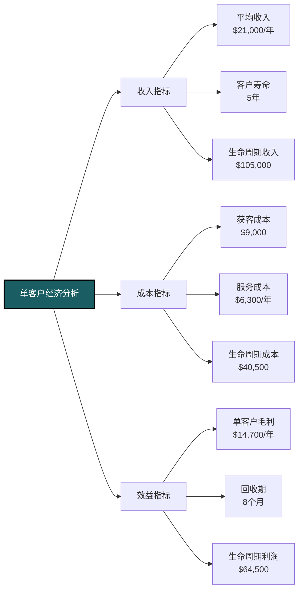

---
{"dg-publish":true,"dg-home":false,"permalink":"/08-财务专业/财务BP/案例/科技企业BP案例-B公司/","dgPassFrontmatter":true}
---

# 科技企业BP案例分析：B公司SaaS业务规划

#案例分析 #科技企业 #SaaS #多年期规划 #客户生命周期价值

## 公司背景

B公司是一家成立5年的企业软件公司，提供基于云的客户关系管理(CRM)和营销自动化SaaS解决方案。公司目前有员工120人，年度经常性收入(ARR)为1800万美元，增长率约为45%。公司完成了B轮融资，获得3000万美元投资，投资者期望公司在未来3年内达到盈亏平衡并准备C轮融资或IPO路径。

公司产品分为三个版本：
- 基础版（面向小型企业，每用户每月49美元）
- 专业版（面向中型企业，每用户每月99美元）
- 企业版（面向大型企业，每用户每月199美元）

## 面临的挑战与目标

### 市场环境

- SaaS CRM市场年增长率约20%，但竞争激烈
- 获客成本(CAC)持续上升，从两年前的6000美元/客户上升至9000美元/客户
- 降低客户流失率成为行业关注焦点
- 新兴AI功能成为竞争新前沿
- 远程办公趋势增加了对云解决方案的需求

### 战略目标

B公司设定了以下三年战略目标：
- ARR增长：从1800万美元增长到5000万美元
- 总客户数：从850个增加到2000个
- 客户留存率：从目前的82%提升至90%
- 毛利率：从68%提升至72%
- 企业版收入占比：从25%提升至40%
- 实现盈亏平衡并开始产生正现金流

## 财务BP编制框架


B公司采用基于客户生命周期的SaaS财务规划方法：
1. 从销售漏斗和转化率预测开始
2. 应用客户生命周期价值(CLV)模型推动决策
3. 关注核心SaaS指标而非传统财务指标
4. 重视单位经济学模型
5. 采用动态资源配置以优化投资回报

## 收入预测模型

### 客户获取与留存模型


B公司基于历史数据和市场趋势，构建了详细的客户获取与留存模型：

#### 新客户获取预测：
- 营销漏斗转化率模型：市场投入→线索→销售机会→客户
- 按客户规模细分获客策略：小型(60%)、中型(30%)、大型(10%)
- 销售周期：小型客户30天、中型客户60天、大型客户90天
- 第一年计划获取480个新客户，第二年650个，第三年800个

#### 客户留存与扩展预测：
- 按客户群组追踪留存率：0-1年(80%)、1-2年(85%)、2年以上(90%)
- 扩展收入两个来源：座位数增加、升级到更高级版本
- 净收入留存率(NRR)目标：第一年105%，第二年110%，第三年115%

### 收入增长路径

```mermaid
bar
    title B公司三年收入增长预测（百万美元）
    "年度经常性收入(ARR)" : 18, 28, 38, 50
    "来自现有客户" : 18, 16, 24, 32
    "来自新客户" : 0, 12, 14, 18
```

收入增长来源分析：
- 第一年：66%来自新客户，34%来自现有客户扩展减去流失
- 第二年：58%来自新客户，42%来自现有客户扩展减去流失
- 第三年：52%来自新客户，48%来自现有客户扩展减去流失

## 成本结构与投入规划

### 销售与营销策略

B公司的销售与营销投入基于客户获取成本(CAC)与客户生命周期价值(CLV)的比率优化：

- 目标CAC:CLV比率：1:3以上
- 销售团队规模增长：从目前15人增加到三年后40人
- 营销预算分配：内容营销(40%)、付费获客(30%)、品牌建设(15%)、活动(15%)
- 销售效率目标：每销售人员年收入从120万美元提升至150万美元

### 研发投入计划


研发团队扩张计划：
- 当前研发人员：35人
- 第一年末：45人
- 第二年末：60人
- 第三年末：75人

研发投入占收入百分比目标：
- 第一年：30%
- 第二年：28%
- 第三年：25%

### 云基础设施成本

- 采用AWS作为主要云提供商
- 基础设施成本与客户数和使用量呈非线性增长关系
- 规模效应导致单位客户成本降低
- 目标将云成本控制在收入的12-15%之间
- 随着规模增长，计划降低单客户云成本20%

## 单位经济分析

B公司深入分析单个客户的经济模型，以指导资源分配和定价决策：



重要发现：
- 企业版客户的CLV:CAC比为5.8，而基础版仅为2.1
- 客户获取第二年，ROI转为正值
- 客户的价值随使用时间呈现非线性增长（第三年开始加速增长）
- 扩展收入对整体业务经济性影响显著

## SaaS核心指标预测

B公司跟踪一系列SaaS特有指标，作为财务BP的重要组成部分：


通过这些关键指标，B公司能够：
- 衡量业务健康度与可持续性
- 优化资源分配与投资决策
- 设置明确的绩效目标与问责制
- 为投资者提供标准化的评估框架

## 现金流与融资规划

### 月度现金流预测


B公司现金流管理策略：
- 优先通过年付折扣方式改善现金流（提供15%折扣）
- 严格控制烧钱率(Burn Rate)，从目前的70万美元/月逐步降低
- 实现单位经济盈利为首要目标，然后再追求整体盈利
- 预计在第三年第四季度实现经营现金流转正
- 在资金耗尽前18个月启动新一轮融资准备

### 资金需求预测

基于三种增长情景的融资需求分析：

| 情景 | ARR增长率 | 额外融资需求 | 融资时间点 | 预期估值 |
|------|-----------|--------------|------------|----------|
| 保守 | 25%/年    | 不需要       | -          | -        |
| 基准 | 40%/年    | 2000万美元   | 第二年末   | 2.5亿美元|
| 加速 | 60%/年    | 4000万美元   | 第二年中   | 3亿美元  |

## 敏感性与情景分析

### 关键假设敏感性分析

B公司对关键假设进行了详细的敏感性分析：


敏感性分析表明客户留存率和获客成本是对财务结果影响最大的因素：
- 客户留存率每降低5个百分点，3年ARR将减少800万美元
- 获客成本每上升10%，三年内将增加支出500万美元
- 企业版客户比例每提高5个百分点，毛利率将上升约1个百分点

### 三年财务情景预测


## 执行与调整机制

为确保财务规划的有效实施，B公司建立了以下管理机制：

### 监控与调整框架

- **周度指标**：销售漏斗、转化率、客户获取成本
- **月度指标**：新ARR、流失率、单位经济性、烧钱率
- **季度指标**：整体财务表现、团队效率、战略项目进展
- **调整触发点**：明确设定关键指标的偏差阈值，超出后启动调整流程
- **资源再分配机制**：基于ROI表现每季度重新评估预算分配

### 情景应对计划

针对不同情景，预先制定行动方案：

- **增长超预期**：加速招聘、扩大营销预算、前置产品路线图
- **客户流失率上升**：增强客户成功团队、优化入职流程、提供忠诚度激励
- **获客成本显著上升**：调整营销渠道组合、强化产品引导获客、重新评估目标客户群
- **资金紧张**：控制非关键招聘、延迟非核心产品开发、优化定价策略

## 关键经验与教训

B公司通过财务BP实践总结了以下SaaS业务规划经验：

1. **重视单位经济性**：在扩张前确保基础业务模式健康
2. **平衡增长与盈利**：不盲目追求增长率，关注增长质量
3. **精细化客户分层**：不同客户群体需要不同的投资和服务策略
4. **现金流比利润重要**：SaaS业务前期应更关注现金流而非利润
5. **保持情景弹性**：为意外情况预留资金和调整空间
6. **数据驱动决策**：建立数据基础设施，确保关键决策基于可靠数据

## 对其他SaaS企业的启示

1. 构建基于客户生命周期的财务模型而非传统会计期间
2. CAC:CLV比率是评估业务健康度的核心指标
3. 销售与营销支出应视为投资而非成本
4. 平衡指标矩阵比单一财务指标更能反映SaaS业务健康度
5. 现金管理与融资时机对SaaS企业至关重要

相关概念：
- [[SaaS财务模型\|SaaS财务模型]]
- [[客户生命周期价值\|客户生命周期价值]]
- [[单位经济分析\|单位经济分析]]
- [[增长经济学\|增长经济学]] 