---
{"dg-publish":true,"dg-home":false,"permalink":"/08-财务专业/财务BP/案例/科技服务企业BP案例-T公司/","dgPassFrontmatter":true}
---

# 科技服务企业BP案例分析：T公司SaaS转型规划

#案例分析 #科技服务 #SaaS #订阅模式 #转型规划

## 公司背景

T公司是一家成立于2015年的企业软件提供商，主要为中型制造企业提供供应链管理解决方案。公司最初以传统软件销售和实施服务为主，采用一次性软件许可+年度维护费的商业模式。截至2022年底，公司拥有客户约180家，年收入1.8亿元，员工250人，其中研发人员占45%。

### 业务构成（2022年数据）

| 业务线 | 收入占比 | 毛利率 | 
|-------|---------|-------|
| 软件许可 | 40% | 85% |
| 实施服务 | 30% | 45% |
| 维护服务 | 20% | 75% |
| 定制开发 | 10% | 60% |

公司核心产品包括：
- 供应链协同平台（SCM系统）
- 仓储管理系统（WMS）
- 生产排程系统（APS）
- 供应商关系管理系统（SRM）

## 面临的挑战与战略方向

### 市场环境变化

- 传统软件许可模式增长放缓，市场饱和度提高
- 客户对云服务和订阅模式接受度提升
- 竞争对手纷纷向SaaS模式转型
- 资本市场对SaaS企业估值倍数更高（收入的10-15倍 vs 许可模式的3-5倍）
- 疫情加速了企业数字化转型需求

### 战略决策

经过战略评估，T公司决定在3年内完成从传统软件许可模式向SaaS订阅模式的转型，具体目标包括：

- 将90%的新客户采用SaaS模式
- 将50%的存量客户迁移至SaaS模式
- 订阅收入占比从0%提升至60%以上
- ARR（年度经常性收入）达到1.2亿元
- 客户留存率达到95%以上
- 转型期间维持公司总体盈利能力

## SaaS转型的财务BP框架

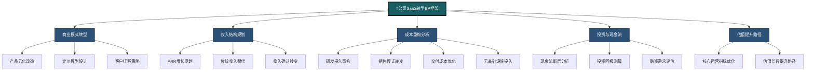

## 商业模式转型规划

### 产品定价策略转变

T公司基于市场调研和客户价值分析，设计了新的SaaS订阅定价模型：

**传统许可模式（旧）**：
- 一次性许可费：单模块30-80万元
- 年度维护费：许可费的15%
- 实施服务费：许可费的70-100%
- 客户总拥有成本（5年）：约为许可费的2.5倍

**SaaS订阅模式（新）**：
- 基础套餐：5万元/月（含100用户）
- 扩展用户：300元/用户/月
- 高级功能模块：额外订阅费用
- 实施服务费：固定套餐，根据规模收费
- 客户总拥有成本（5年）：月租×60个月+实施费

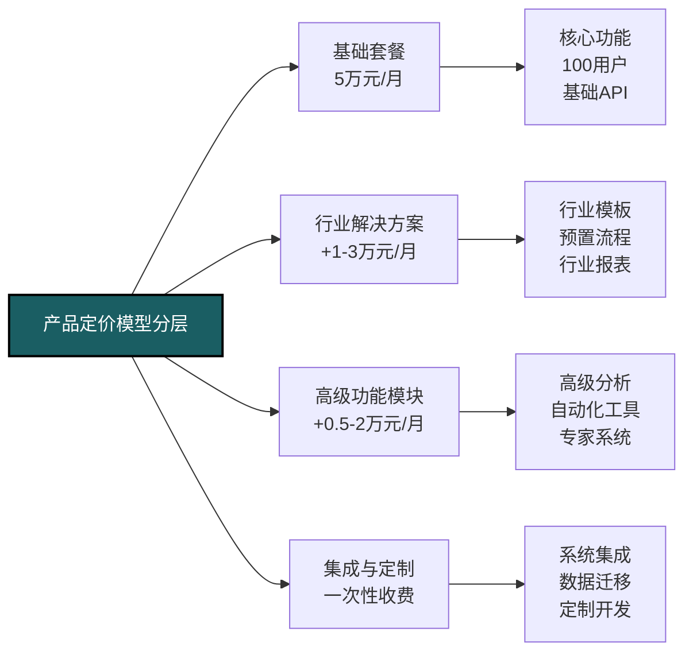

### 客户迁移策略

T公司为不同类型客户设计了差异化迁移方案：

**新客户策略**：
- 2023年：提供双选方案，SaaS价格优惠20%
- 2024年：主推SaaS方案，许可方案价格提高15%
- 2025年：仅提供SaaS方案，特殊需求按定制项目处理

**存量客户迁移策略**：
- A类高价值客户（20%）：一对一迁移方案，提供专属优惠与支持
- B类成长客户（50%）：标准化迁移套餐，许可折抵订阅费
- C类小型客户（30%）：自助迁移工具，基础培训支持

```mermaid
gantt
    title T公司客户迁移时间表
    dateFormat  YYYY-Q
    section 新客户获取
    SaaS新客户(30家)      :2023-Q1, 2023-Q4
    SaaS新客户(45家)      :2024-Q1, 2024-Q4
    SaaS新客户(60家)      :2025-Q1, 2025-Q4
    section A类客户迁移
    迁移方案设计           :2023-Q1, 2023-Q2
    试点客户迁移(5家)      :2023-Q2, 2023-Q3
    批量迁移A类(15家)      :2023-Q3, 2024-Q2
    section B类客户迁移
    标准迁移方案开发       :2023-Q1, 2023-Q3
    B类客户迁移(30家)      :2023-Q3, 2024-Q2
    B类客户迁移(40家)      :2024-Q2, 2025-Q2
    section C类客户迁移
    自助工具开发           :2023-Q2, 2023-Q4
    C类客户迁移(20家)      :2024-Q1, 2024-Q4
    C类客户迁移(35家)      :2025-Q1, 2025-Q4
```

## 收入结构转型预测

### ARR增长路径规划

T公司制定了详细的ARR（年度经常性收入）增长规划：

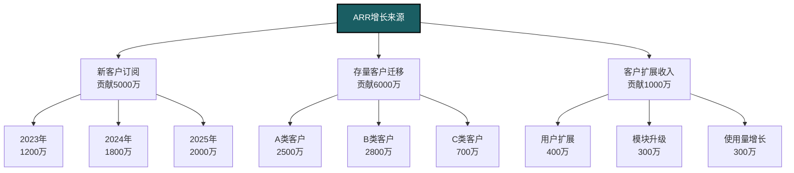

### 收入结构演变预测

T公司预计在转型期间，收入结构将发生以下变化：

| 收入类型 | 2022年 | 2023年 | 2024年 | 2025年 |
|---------|-------|-------|-------|-------|
| 软件许可 | 7200万 | 5400万 | 3600万 | 1800万 |
| 传统维护 | 3600万 | 3000万 | 2000万 | 1000万 |
| SaaS订阅 | 0 | 3000万 | 7200万 | 1.2亿 |
| 实施服务 | 5400万 | 6000万 | 6800万 | 7500万 |
| 定制开发 | 1800万 | 2000万 | 2200万 | 2500万 |
| 总收入 | 1.8亿 | 1.94亿 | 2.18亿 | 2.6亿 |

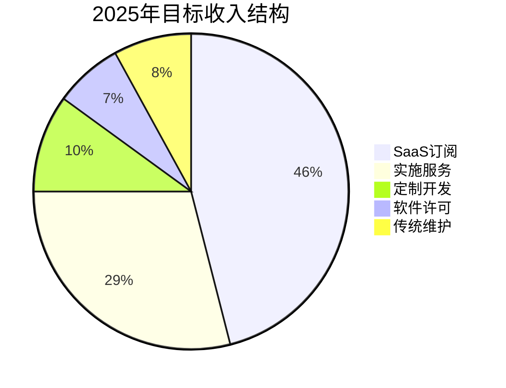

### SaaS核心指标目标

T公司设定了以下SaaS业务核心指标目标：

- 客户获取成本（CAC）：首年ARR的70%
- 客户终身价值（LTV）：CAC的5倍以上
- 净收入留存率（NRR）：115%（含客户扩展）
- 客户续订率：95%
- 单客户平均收入（ARPU）：50万元/年
- 营销获客占比：从10%提升至30%
- 销售周期：从9个月缩短至3个月

## 成本结构重构

### 研发投入重构

为支持SaaS转型，T公司对研发投入进行了重构规划：

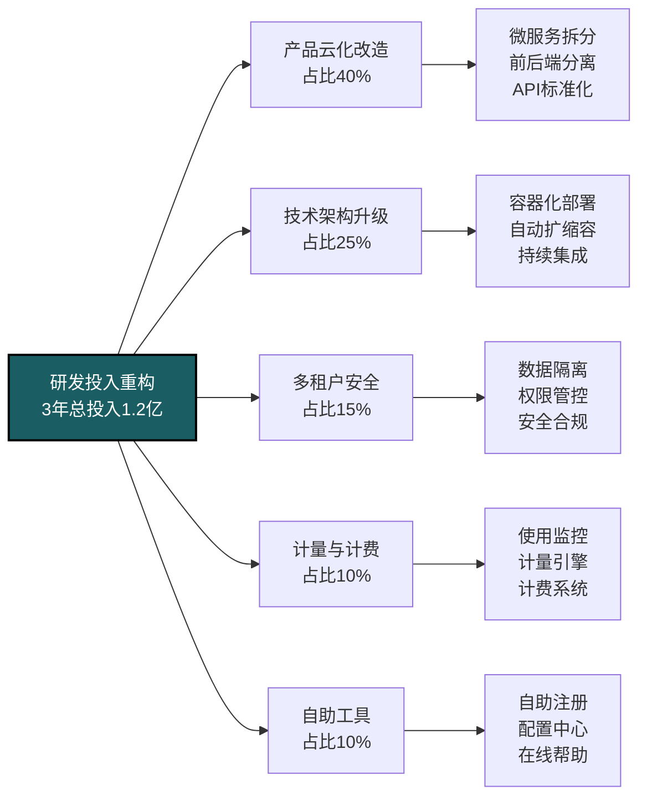

研发团队结构也将相应调整：
- 云平台团队：从5人扩展至25人
- DevOps团队：从3人扩展至15人
- 产品开发团队：从90人调整至80人
- 安全与合规团队：从2人扩展至10人
- 数据分析团队：新建10人团队

### 销售模式转变

传统模式下的销售成本结构：
- 销售人员：30人，人均年薪30万+提成
- 销售周期：6-9个月
- 客单价：初始许可100-300万
- 获客成本：成交金额的25-30%

SaaS模式下的销售成本结构：
- 销售人员：精简至20人，聚焦大客户
- 数字营销团队：新建10人
- 内部销售团队：新建15人，负责中小客户和线索跟进
- 客户成功团队：新建20人，负责客户培养和扩展销售
- 获客成本：首年ARR的70%，逐年优化至60%

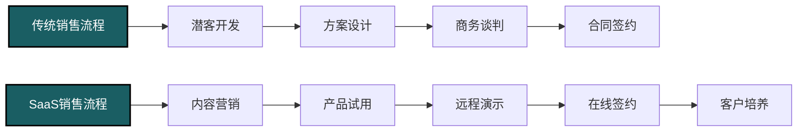

### 云基础设施成本

T公司计划采用混合云策略，基础设施成本结构如下：

- 公有云服务：按客户数量线性增长
  - 基础计算资源：每客户每年2万元
  - 数据存储：每客户每年1万元
  - CDN和网络：每客户每年0.5万元
  - 安全服务：固定成本+按客户数量增长

- 私有云建设：
  - 核心数据中心：初期投资1000万
  - 灾备中心：投资500万
  - 网络设备：投资300万
  - 运维人员：15人团队

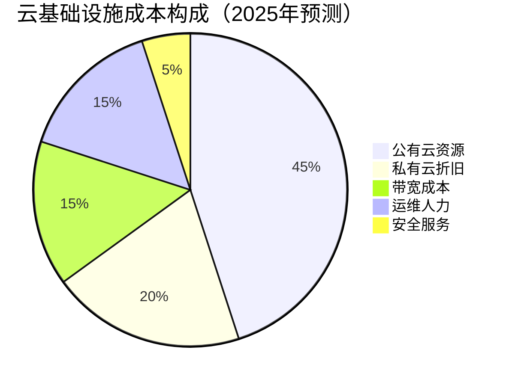

### 交付成本优化

T公司计划通过以下方式优化交付成本：

- 标准化实施模板：减少定制化工作量30%
- 远程实施工具：减少现场工作量50%
- 自助式培训系统：减少培训人力投入40%
- 知识库与社区支持：减少基础支持工作量35%

交付团队结构调整：
- 传统交付顾问：从60人减少至40人
- 解决方案架构师：保持15人规模
- 远程交付专家：新增20人
- 客户成功经理：新增20人

## 投资与现金流规划

### 转型期现金流断层分析

SaaS转型期间，T公司将面临"现金流断层"挑战，主要体现在：

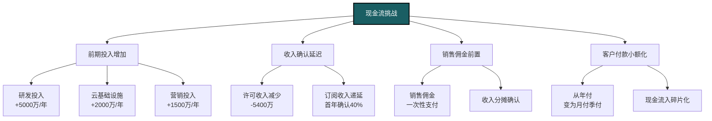

### 营运资金需求预测

T公司预测转型期间的额外营运资金需求：

| 资金需求项目 | 2023年 | 2024年 | 2025年 | 合计 |
|------------|-------|-------|-------|------|
| 研发投入 | 4000万 | 4500万 | 3500万 | 1.2亿 |
| 基础设施 | 1500万 | 1000万 | 800万 | 3300万 |
| 销售营销 | 1500万 | 2000万 | 2500万 | 6000万 |
| 运营资金 | 2000万 | 2500万 | 1500万 | 6000万 |
| 总需求 | 9000万 | 1亿 | 8300万 | 2.73亿 |

### 融资规划

基于现金流测算，T公司制定了分阶段融资计划：

**第一阶段（2023年Q1）**：
- 股权融资：1亿元（20%股权）
- 估值：5亿元（收入2.5倍）
- 用途：产品研发和基础设施

**第二阶段（2024年Q2）**：
- 股权融资：1.5亿元（15%股权）
- 估值：10亿元（收入4倍）
- 用途：市场扩张和并购整合

**第三阶段（2025年）**：
- 银行贷款：5000万元信用额度
- 用途：运营资金需求

## 财务预测与估值提升

### 关键财务指标预测

T公司对转型期间的核心财务指标进行了预测：

| 财务指标 | 2022年 | 2023年 | 2024年 | 2025年 |
|---------|-------|--------|--------|--------|
| 总收入 | 1.8亿 | 1.94亿 | 2.18亿 | 2.6亿 |
| 经常性收入占比 | 20% | 31% | 42% | 60% |
| 毛利率 | 65% | 62% | 60% | 65% |
| 研发费用率 | 25% | 32% | 30% | 25% |
| 销售费用率 | 20% | 25% | 28% | 25% |
| 管理费用率 | 10% | 10% | 8% | 8% |
| EBITDA | 1800万 | 500万 | 1000万 | 2500万 |
| 经营现金流 | 2000万 | -3000万 | -1000万 | 1500万 |

### 估值倍数提升路径

T公司预计通过SaaS转型，公司估值倍数将实现显著提升：

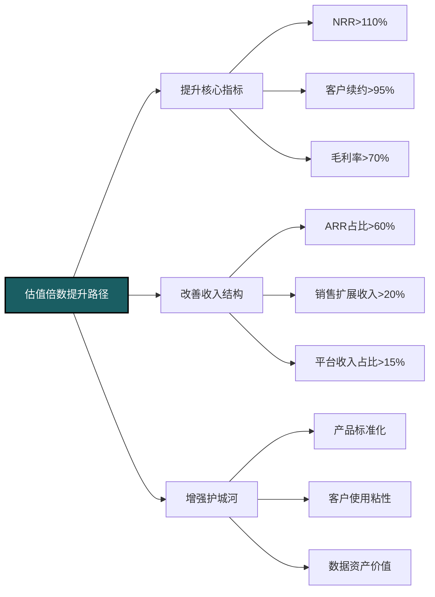

估值目标：
- 2022年：3.6亿（收入的2倍）
- 2023年：5亿（收入的2.5倍）
- 2024年：10亿（收入的4.5倍）
- 2025年：30亿（收入的12倍）

## 风险管理与应对策略

### 转型期主要风险

T公司识别了SaaS转型过程中的主要风险：

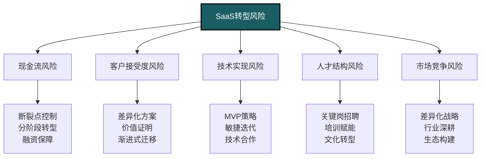

### 情景分析与决策触发点

针对不同情景，T公司制定了相应的应对策略和决策触发点：

**乐观情景**：
- 新客户SaaS接受度超预期（>95%）
- 老客户迁移率超预期（>60%）
- 客户续约率达到98%
- 应对策略：加速研发投入，提前扩张销售团队，考虑并购整合

**基准情景**：
- 新客户SaaS接受度达预期（90%）
- 老客户迁移率达预期（50%）
- 客户续约率达到95%
- 应对策略：按计划执行，动态调整资源分配

**保守情景**：
- 新客户SaaS接受度低于预期（<70%）
- 老客户迁移率低于预期（<30%）
- 客户续约率低于预期（<90%）
- 应对策略：放缓转型节奏，调整定价策略，强化客户成功团队

关键决策触发点：
- ARR增长连续2个季度低于计划30%：重新审视定价策略和产品策略
- 现金消耗率超过预期50%：启动开源节流计划和额外融资
- 客户流失率超过8%：暂停强制迁移，增加过渡期产品支持
- 技术问题导致服务中断>24小时：推迟新客户转化，加强技术投入

## SaaS运营模型构建

### 客户全生命周期管理

T公司建立了SaaS业务的客户全生命周期管理体系：

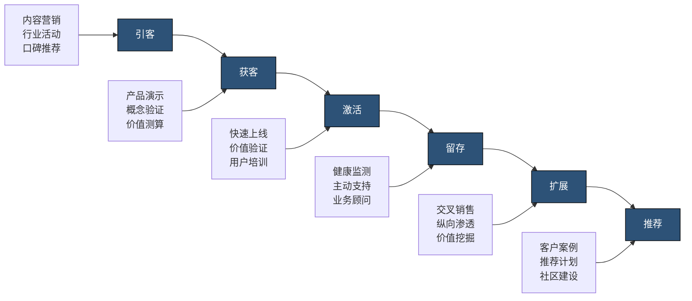

针对不同生命周期阶段，设置了差异化的KPI：
- 引客阶段：营销ROI，线索质量，流量转化率
- 获客阶段：销售转化率，销售周期，客单价
- 激活阶段：上线时间，活跃度，功能采用率
- 留存阶段：续约率，客户满意度，支持响应时间
- 扩展阶段：扩展收入占比，交叉销售率，客单价增长率
- 推荐阶段：推荐客户数，推荐转化率，NPS

### 数据驱动运营体系

T公司建立了一套数据驱动的SaaS运营体系：

- 产品使用分析：
  - 功能采用率和活跃度跟踪
  - 用户行为路径分析
  - 性能和错误监控

- 客户健康度评分系统：
  - 登录频率和活跃用户比例
  - 核心功能使用广度和深度
  - 支持请求频率和类型
  - 业务价值实现指标

- 收入管理仪表盘：
  - MRR/ARR增长分解
  - 客户获取成本和回收周期
  - 客户生命周期价值
  - 流失风险预警

## T公司SaaS转型的关键经验

T公司在SaaS转型过程中总结了以下关键经验：

### 转型阶段划分的重要性

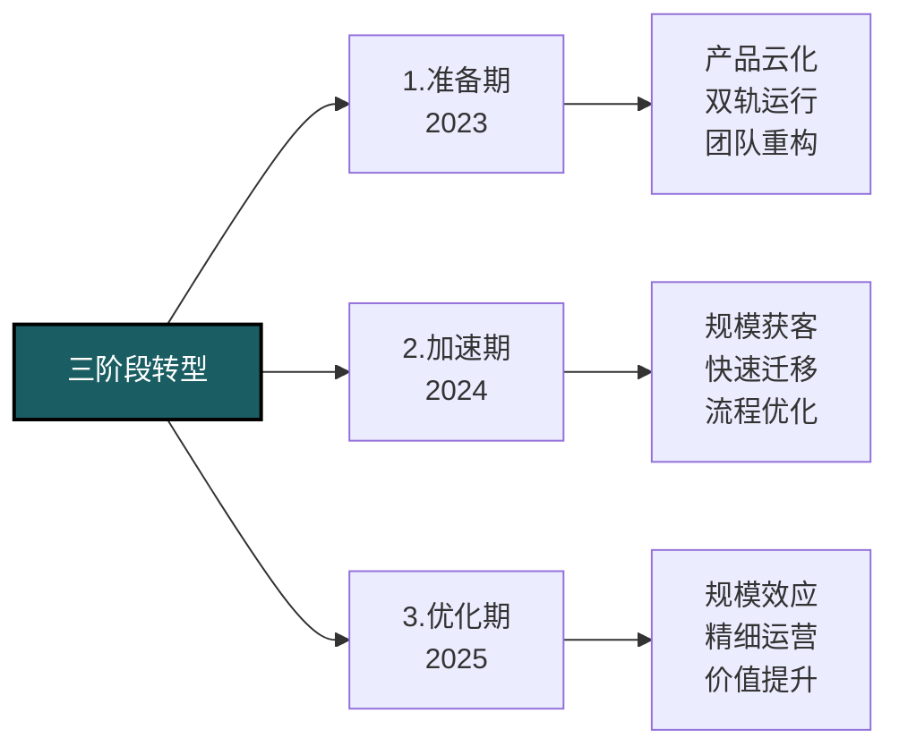

### 转型关键成功因素

1. **管理层坚定承诺**：克服短期业绩压力，坚持长期战略
2. **产品先行原则**：确保SaaS产品体验超越传统版本
3. **销售团队转型**：从大单思维转向持续价值创造
4. **客户成功文化**：建立以客户成功为中心的组织文化
5. **透明沟通**：对投资者、员工和客户保持开放透明沟通
6. **数据驱动决策**：建立关键指标追踪和快速反馈机制
7. **灵活调整**：随市场反馈不断调整转型策略和节奏

## 对其他科技服务企业的启示

1. **转型是马拉松**：SaaS转型是3-5年的长期过程，需要战略耐心
2. **客户参与设计**：邀请核心客户参与SaaS产品设计，降低迁移阻力
3. **价值定价**：基于客户价值而非成本或竞争者定价
4. **融资先行**：提前规划融资，应对现金流断层挑战
5. **保留双模式**：在转型期保留许可模式选项，降低客户和销售阻力
6. **持续沟通价值**：不断强化SaaS模式对客户、公司和员工的长期价值

相关概念：
- [[SaaS商业模式\|SaaS商业模式]]
- [[订阅经济\|订阅经济]]
- [[客户成功管理\|客户成功管理]]
- [[ARR增长策略\|ARR增长策略]]
- [[SaaS估值模型\|SaaS估值模型]] 