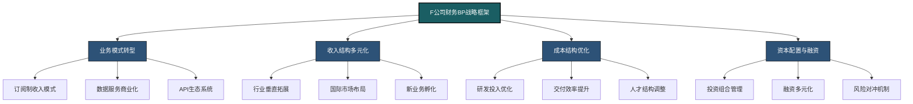
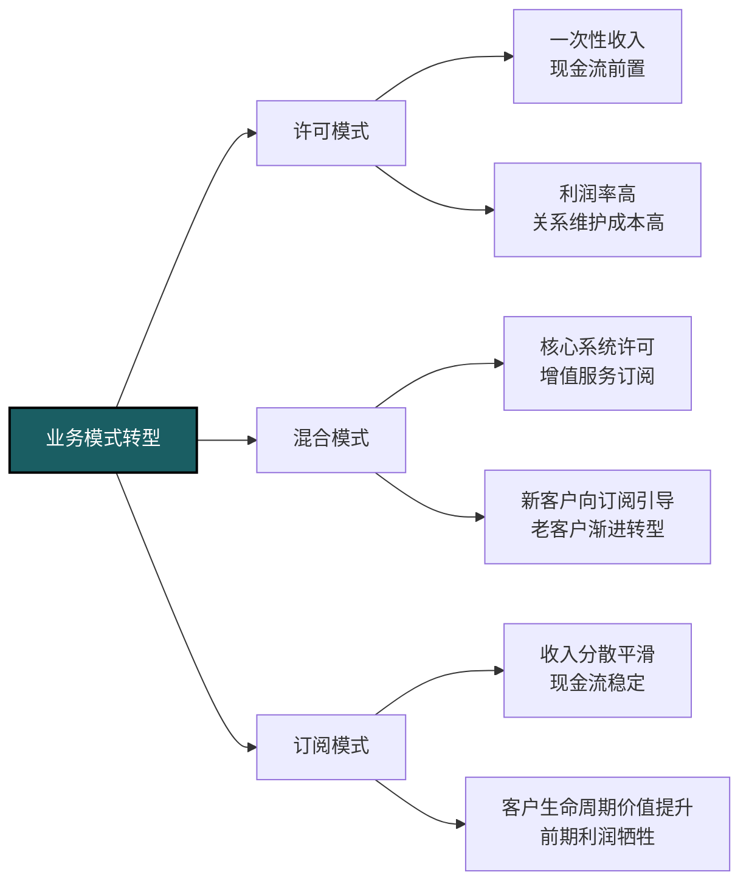
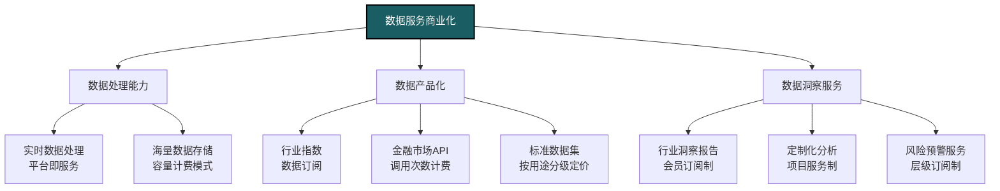
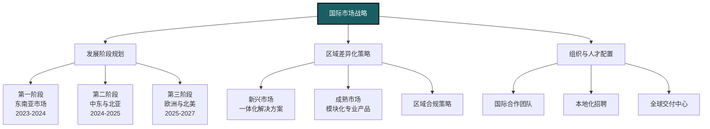
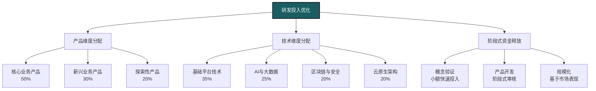
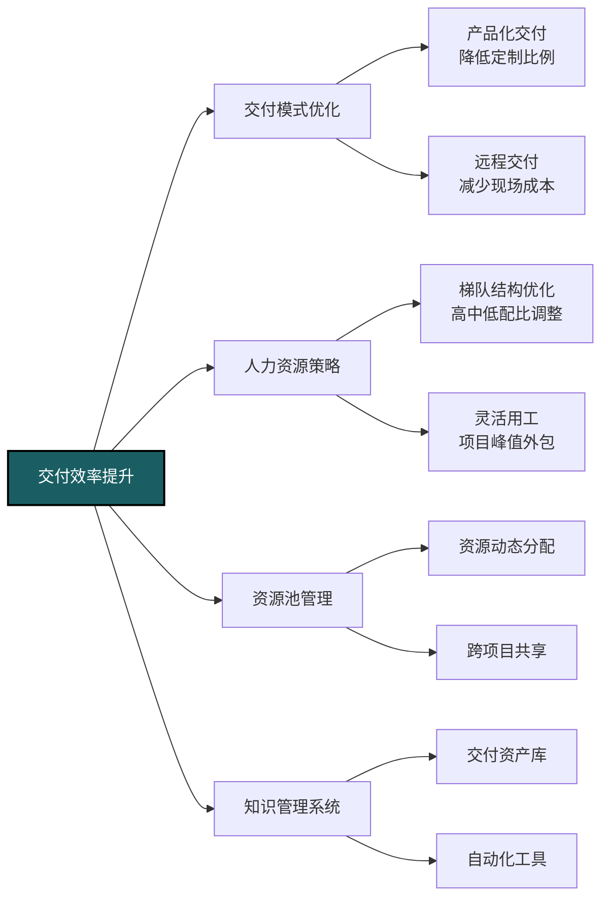
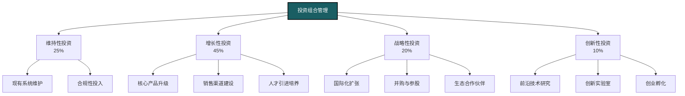
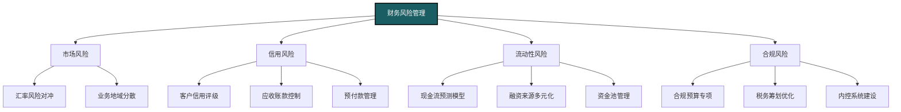
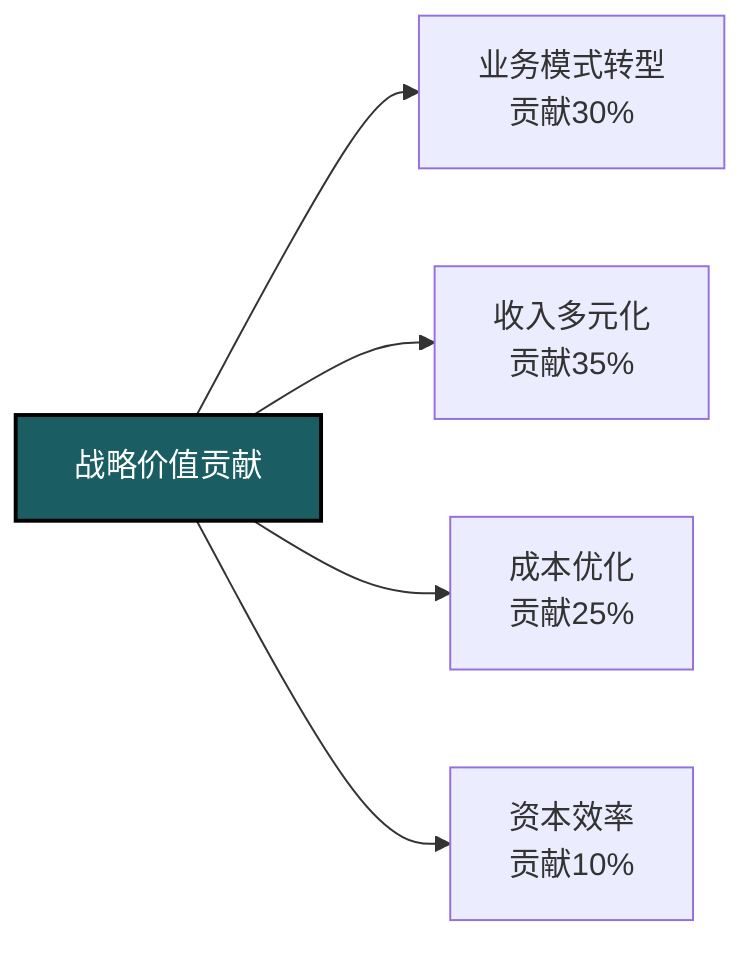
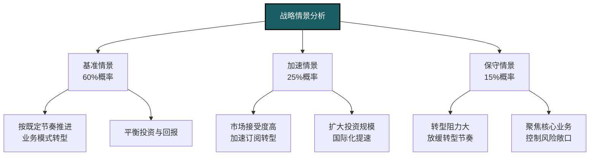

---
{"dg-publish":true,"dg-home":false,"permalink":"/08-财务专业/财务BP/案例/金融科技企业BP案例-F公司/","dgPassFrontmatter":true}
---

# 金融科技企业BP案例分析：F公司的数字化转型与收入多元化

#案例分析 #金融科技 #数字化转型 #收入多元化 #风险管理

## 公司背景

F公司成立于2010年，是一家专注于金融科技解决方案的科技企业。公司总部位于中国深圳，在北京、上海、香港和新加坡设有分支机构。主要客户包括商业银行、证券公司、保险机构和大型企业财资部门。F公司现有员工1,500人，其中技术研发人员占比60%，年营业收入约12亿元人民币，净利润率在24-26%之间。

F公司业务分为四大板块：
- 金融交易系统（占收入42%，毛利率65%）
- 风险管理平台（占收入28%，毛利率72%）
- 数据分析服务（占收入18%，毛利率58%）
- 云基础设施服务（占收入12%，毛利率45%）

## 面临的挑战与转型需求

### 外部环境挑战

- 金融行业监管趋严，合规成本上升
- 大型科技公司加速进入金融科技领域，竞争加剧
- 客户对定制化需求持续增长，项目交付压力增大
- 数据安全与隐私保护要求不断提高
- 全球金融市场波动加大，客户IT预算趋于谨慎
- 人工智能、区块链等新技术迭代速度加快

### 内部经营问题

- 业务过度依赖交易系统和风险管理平台，收入结构单一
- 高端技术人才争夺激烈，人力成本持续攀升（年增幅15%以上）
- 前沿技术研发投入大但商业化周期长，资金压力增加
- 传统许可证模式收入缺乏持续性，经营现金流波动较大
- 国际业务扩张面临本地化挑战和合规风险
- 项目管理效率不高，部分大型项目交付延期和成本超支

## 财务BP战略重点框架



F公司的财务BP战略围绕业务模式转型、收入多元化、成本优化和资本配置四个关键维度展开，旨在提升企业长期盈利能力和抗风险能力。

## 业务模式转型策略

### 从许可销售向订阅服务转型

F公司传统收入主要来自软件许可销售和实施服务，导致收入波动大、客户黏性不足。财务BP团队通过深入分析，制定了SaaS转型战略：



**转型路径规划**：
- 第一阶段（1-2年）：开发云原生产品，保留许可模式，提供订阅选项
- 第二阶段（2-3年）：新客户主推订阅模式，老客户提供迁移激励
- 第三阶段（3-5年）：全面转向订阅模式，许可模式仅针对特殊客户

**财务影响分析**：
- 短期（1-2年）：收入增长放缓，营业利润率下降3-5个百分点
- 中期（3-4年）：收入增长回升，经常性收入占比提升至60%以上
- 长期（5年+）：客户生命周期价值提升40%，收入预测准确度提高

通过战略转型，F公司预计可将经常性收入比例从目前的15%提升至5年后的75%，大幅提升业务稳定性。

### 数据服务商业化战略

F公司拥有金融数据处理的核心技术优势，财务BP团队设计了数据服务商业化策略：



**数据产品组合规划**：
- 基础数据API：标准金融数据接口，按调用量阶梯定价
- 行业指数产品：特定行业风险和表现指数，包月订阅制
- 预测性分析服务：基于AI的市场预测，高端会员制
- 定制数据解决方案：针对大客户的高端定制服务

**商业模式设计**：
- 免费层：基础API有限调用，吸引开发者
- 标准层：完整API访问，中等数据量，月订阅
- 专业层：高级分析功能，大数据量，年订阅
- 企业层：定制功能，无限数据量，合同定价

通过数据服务商业化，F公司预计未来三年内可将数据分析服务占总收入比例从18%提升至30%以上，同时保持65%以上的高毛利率。

## 收入结构多元化战略

### 行业垂直拓展策略

为降低对传统银行业客户的依赖，F公司制定了精准的行业拓展策略：

```mermaid
quadrant-chart
    title 行业拓展优先级矩阵
    x-axis 市场进入难度 --> 高 中 低
    y-axis 预期利润率 --> 低 中 高
    quadrant-1 核心发展重点
    quadrant-2 长期耕耘领域
    quadrant-3 择机尝试
    quadrant-4 精选机会
    "银行业(现有)": [0.2, 0.7]
    "证券行业(现有)": [0.3, 0.65]
    "保险行业(现有)": [0.4, 0.6]
    "财富管理": [0.35, 0.75]
    "支付服务": [0.7, 0.55]
    "供应链金融": [0.5, 0.7]
    "数字货币": [0.8, 0.85]
    "监管科技": [0.6, 0.65]
    "普惠金融": [0.55, 0.45]
    "资产管理": [0.4, 0.6]
```

**优先发展战略**：
- 核心发展重点：财富管理（毛利率>70%）与供应链金融（毛利率65%）
- 长期耕耘领域：监管科技与数字货币（高风险高回报）
- 精选机会：资产管理（与现有客户协同强）
- 择机尝试：普惠金融（社会价值高，利润率较低）

**行业拓展资源配置**：
1. 研发投入：财富管理平台（年投入8000万元）
2. 销售团队：组建行业专家团队（计划招募35人）
3. 合作伙伴：与细分领域领先企业建立战略合作（目标10家）
4. 市场推广：打造行业解决方案品牌（投入3000万元）

通过行业扩张，F公司目标在三年内将非银行业务占比从40%提升至60%，降低单一行业依赖风险。

### 国际市场布局策略

F公司确立了"深耕亚太，布局全球"的国际化策略：



**区域市场优先级**：
1. 东南亚（新加坡、马来西亚、泰国）：文化相近，监管包容
2. 中东（阿联酋、沙特）：数字化需求强烈，资金充足
3. 北亚（日本、韩国）：技术要求高，市场成熟
4. 欧洲（选择性进入）：从监管科技切入，建立品牌

**国际化投资与回报分析**：

| 区域市场 | 初始投资（万元） | 预计回收期 | 5年收入目标（亿元） | 预期毛利率 |
|---------|----------------|-----------|-----------------|-----------|
| 东南亚 | 5,000 | 2.5年 | 4.5 | 60% |
| 中东 | 3,800 | 3年 | 3.2 | 65% |
| 北亚 | 7,200 | 3.5年 | 5.5 | 55% |
| 欧洲 | 6,500 | 4年 | 3.8 | 50% |

通过国际化战略，F公司计划在五年内将海外收入占比从现有的8%提升至30%，同时优化收入的地域分布，降低单一区域风险。

## 成本结构优化策略

### 研发投入优化体系

F公司研发投入占营收比例高达25%，财务BP团队设计了精细化的研发资源配置机制：



**研发ROI评估机制**：
- 建立多维度评估指标：技术先进性、市场潜力、开发难度、竞争优势
- 设计分级投资审批流程：探索项目（<300万元）、开发项目（<1000万元）、战略项目（>1000万元）
- 引入实物期权分析方法：为高风险高回报项目设计灵活退出机制

**研发效率提升措施**：
1. 技术栈统一与组件化：降低重复开发，提高代码重用率
2. DevOps流程优化：将交付周期缩短30%
3. 研发绩效动态评估：基于代码质量、交付效率和产品表现
4. 低代码开发平台：非核心功能采用低代码平台，提高开发速度

通过研发投入优化，F公司预计每年可节约研发成本约1.3亿元，同时提高研发产出效率20%以上。

### 交付效率提升计划

F公司项目交付成本占总成本的35%，财务BP团队针对交付效率设计了系统性改进方案：



**交付模式优化措施**：
- 推行标准化解决方案交付：提高复用率，降低人均交付工时
- 建立远程交付中心：减少出差成本，提高资源利用率
- 开发自助式实施工具：客户自助完成部分配置，减轻实施压力

**交付成本节约目标**：
- 实施时长：平均缩短25%（从4.5个月降至3.4个月）
- 人员配置：优化交付团队结构，高级顾问配比降低10%
- 远程交付：将远程交付比例从40%提升至70%
- 自动化工具：实施环节自动化率提升30%

通过交付效率提升，预计未来两年内可降低项目交付成本约25%，每年节约成本0.8亿元，同时改善客户满意度。

## 资本配置与融资策略

### 投资组合管理框架

为优化资本配置效率，F公司建立了分层次的投资组合管理框架：



**资本配置决策流程**：
- 项目分类评估：基于战略重要性、财务回报、风险水平
- 投资组合平衡：短期、中期、长期项目合理配比
- 动态调整机制：季度回顾，半年调整，年度规划

**投资回报预期**：
- 维持性投资：维持现有业务稳定，ROI要求>20%
- 增长性投资：扩大现有业务规模，ROI要求>35%
- 战略性投资：开拓新业务方向，ROI要求>25%（5年周期）
- 创新性投资：前沿技术布局，成功率20%，成功情况下ROI>200%

通过投资组合管理优化，F公司资本使用效率提升约15%，ROIC从25%提升至29%。

### 融资策略与资本结构优化

为支持业务扩张和转型，F公司设计了多元化融资策略：

```mermaid
gantt
    title F公司融资路径规划
    dateFormat  YYYY-Q
    section 股权融资
    Pre-IPO轮融资   :2023-Q1, 2023-Q2
    IPO准备与辅导    :2023-Q2, 2024-Q2
    公开发行上市     :2024-Q3, 2024-Q4
    section 债务融资
    银行授信扩大     :2023-Q1, 2023-Q3
    可转债发行       :2023-Q4, 2024-Q1
    并购贷款         :2024-Q2, 2024-Q4
    section 其他融资
    供应商融资计划   :2023-Q2, 2023-Q3
    政府科技专项支持 :2023-Q2, 2024-Q1
    战略合作伙伴投资 :2023-Q3, 2024-Q2
```

**资本结构目标**：
- 维持最优资本结构：债务权益比0.3-0.5
- 控制融资成本：加权平均资本成本<8%
- 流动性管理：保持现金与经营性支出比率>6个月

**融资风险管理**：
- 汇率风险：国际业务扩张中的多币种敞口管理
- 利率风险：长期债务锁定固定利率，降低波动影响
- 再融资风险：债务到期分散化，避免集中偿付压力

通过优化融资策略，F公司在扩大资本规模的同时，将综合融资成本控制在7.2%，低于行业平均水平。

## 风险管理体系

### 财务风险识别与防控

作为金融科技企业，F公司面临多重财务风险，财务BP团队建立了全面风险管理体系：



**关键风险指标监控**：
- 流动性风险：现金流预测准确度>90%，速动比率>1.5
- 信用风险：应收账款周转天数<90天，坏账率<1%
- 市场风险：汇率敞口对利润影响<2%，利率敏感性分析
- 合规风险：税务合规度100%，内控体系完整性评分

**风险预警与应对机制**：
- 建立三级风险预警机制：早期信号、amber警示、red警报
- 制定风险情景应对预案：流动性紧张、坏账突增、汇率剧烈波动
- 设立风险管理委员会：跨部门协同应对重大风险事件

通过全面风险管理，F公司成功将财务风险控制在可接受范围，提升了企业整体抗风险能力。

## 业绩提升路径与预测

### 五年业绩提升路径

基于上述战略举措，F公司财务BP团队预测了未来五年的业绩提升路径：



**关键财务指标预测**：

| 指标 | 2022年(基准) | 2023年 | 2024年 | 2025年 | 2026年 | 2027年 | 年复合增长率 |
|------|------------|-------|-------|-------|-------|-------|------------|
| 营业收入(亿元) | 12.0 | 14.0 | 17.0 | 21.5 | 27.0 | 34.0 | 23.2% |
| 订阅收入占比 | 15% | 25% | 40% | 55% | 65% | 75% | - |
| 海外收入占比 | 8% | 12% | 18% | 22% | 26% | 30% | - |
| 毛利率 | 62% | 61% | 60% | 62% | 64% | 66% | - |
| 营业利润率 | 28% | 26% | 25% | 27% | 30% | 32% | - |
| 研发投入占比 | 25% | 24% | 23% | 22% | 21% | 20% | - |
| ROE | 22% | 20% | 19% | 22% | 25% | 28% | - |
| 经常性收入比例 | 15% | 25% | 40% | 55% | 65% | 75% | - |

### 战略情景分析

为应对不确定性，F公司财务BP团队设计了三种战略情景：



**加速情景触发条件**：
- SaaS产品市场接受度超预期，转化率>60%
- 国际市场拓展顺利，前期项目回报率>30%
- 资本市场融资顺利，融资成本低于预期

**加速情景应对策略**：
- 加大研发投入（提升至收入的23%）
- 加速全球扩张（前置国际化时间表12个月）
- 考虑战略性并购（分配3-5亿元并购资金）
- 大力推进订阅转型（提供更多转型激励）

**保守情景应对策略**：
- 放缓转型节奏，延长过渡期
- 控制资本开支，提高现金储备
- 聚焦高利润业务，暂缓低利润新业务拓展
- 强化成本控制，提高资源利用效率

通过情景规划，F公司增强了战略执行的灵活性和应变能力。

## 关键绩效指标与监控

F公司建立了多层次KPI体系监控战略执行情况：

### 财务维度KPI

| 指标类别 | KPI | 基准值 | 目标值 |
|---------|-----|-------|-------|
| 增长指标 | 营业收入增长率 | 18% | >23% |
| | 经常性收入占比 | 15% | 75% |
| | 国际收入占比 | 8% | 30% |
| 盈利指标 | 毛利率 | 62% | >65% |
| | 营业利润率 | 28% | >30% |
| | 净利润率 | 25% | >28% |
| 效率指标 | 研发投入产出比 | 3.2:1 | >4:1 |
| | 销售费用率 | 15% | <12% |
| | 人均创收 | 80万元 | >110万元 |
| 资本回报 | ROE | 22% | >25% |
| | ROIC | 25% | >28% |
| | 自由现金流 | 2.2亿元 | >6亿元 |

### 业务维度KPI

| 指标类别 | KPI | 基准值 | 目标值 |
|---------|-----|-------|-------|
| 客户指标 | 客户续约率 | 85% | >92% |
| | 客户生命周期价值 | 350万元 | >500万元 |
| | 大客户数量 | 45家 | >80家 |
| 产品指标 | 订阅转化率 | - | >50% |
| | API调用量增长率 | 60% | >100% |
| | 数据服务用户数 | 120家 | >450家 |
| 运营指标 | 产品交付周期 | 4.5个月 | <3个月 |
| | 员工留存率 | 82% | >90% |
| | 研发项目按时完成率 | 65% | >85% |

## BP实施经验与挑战

### 关键成功因素

F公司在实施财务BP战略过程中，总结了以下关键成功因素：

1. **高管团队一致认同**：CEO亲自推动业务模式转型，消除内部阻力
2. **数据驱动决策文化**：建立精细化数据分析能力，支持决策制定
3. **灵活的激励机制**：设计与转型目标匹配的绩效考核和激励计划
4. **渐进式转型策略**：业务模式转型采用平滑过渡，避免断崖效应
5. **跨部门协作**：财务BP团队与产品、技术、销售紧密协作

### 实施过程中的挑战与对策

**挑战1：销售团队转型阻力**
- 挑战：从一次性许可销售转向长期订阅模式，销售人员收入结构受影响
- 对策：设计过渡性激励方案，基于客户全生命周期价值核算奖金
- 结果：销售团队接受度从30%提升至80%，新客户订阅模式签约率达65%

**挑战2：技术架构转型复杂性**
- 挑战：传统系统向云原生架构转型，技术债务沉重
- 对策：采用渐进式重构策略，核心模块优先改造，边缘系统逐步替换
- 结果：两年内完成70%核心系统云原生改造，性能提升40%，运维成本降低30%

**挑战3：国际市场的本地化挑战**
- 挑战：不同区域监管需求和市场习惯差异大
- 对策：建立"全球平台+本地模块"架构，核心技术全球统一，本地需求独立定制
- 结果：国际项目交付周期缩短35%，本地化成本降低40%

## 对其他金融科技企业的启示

F公司的案例为同类企业提供了以下关键启示：

1. **业务模式转型是趋势**：从产品销售向服务订阅转型可显著提升业务稳定性和客户黏性
2. **数据资产变现潜力巨大**：构建数据服务生态体系，开发多层次商业模式
3. **平衡短期业绩与长期价值**：转型过程中需制定合理预期，接受短期阵痛
4. **灵活资源配置机制**：建立动态资源分配框架，提高资本使用效率
5. **风险与机遇并存**：金融科技行业变化快，需建立敏捷决策机制

## 后续发展规划

F公司在完成当前战略后，计划探索以下发展方向：

1. **产业金融平台战略**：从技术提供商转型为产业金融服务平台
2. **开放式API生态**：构建开发者生态系统，实现平台网络效应
3. **全球数据服务网络**：建立跨区域数据服务体系，应对全球化需求
4. **行业整合者角色**：通过战略并购整合细分领域能力
5. **ESG融入产品战略**：将可持续金融理念融入产品设计

相关概念：
- [[金融科技商业模式转型\|金融科技商业模式转型]]
- [[订阅经济与SaaS转型\|订阅经济与SaaS转型]]
- [[数据货币化策略\|数据货币化策略]]
- [[金融科技风险管理\|金融科技风险管理]]
- [[多元化收入结构\|多元化收入结构]] 