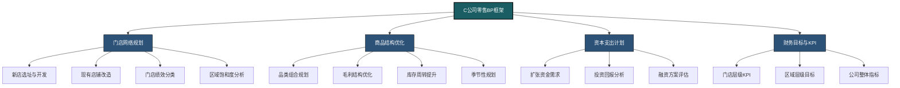
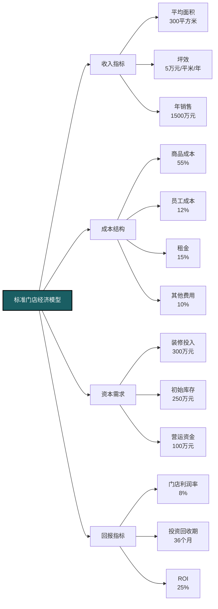
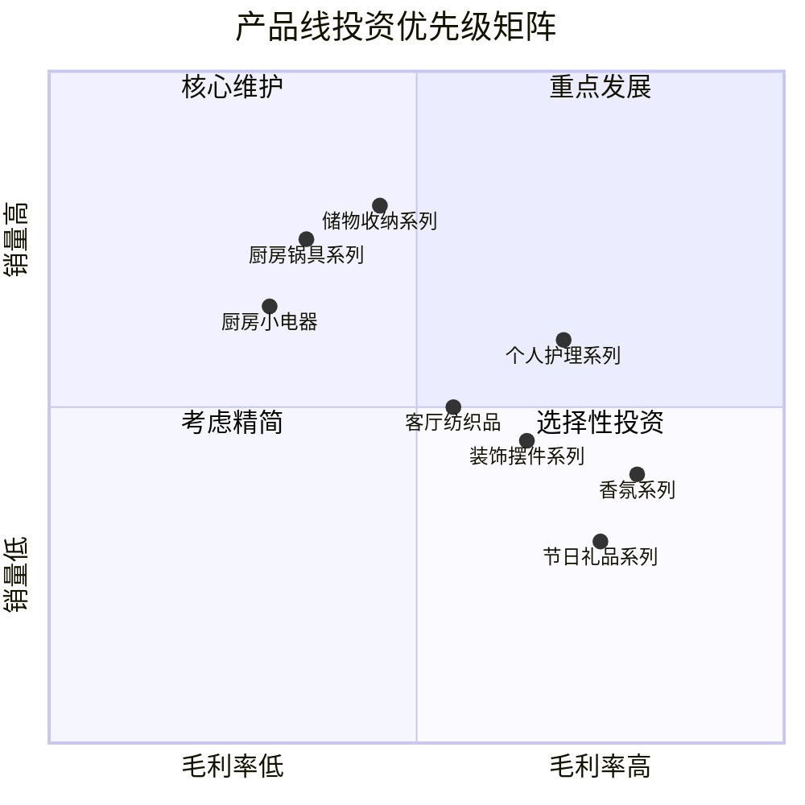
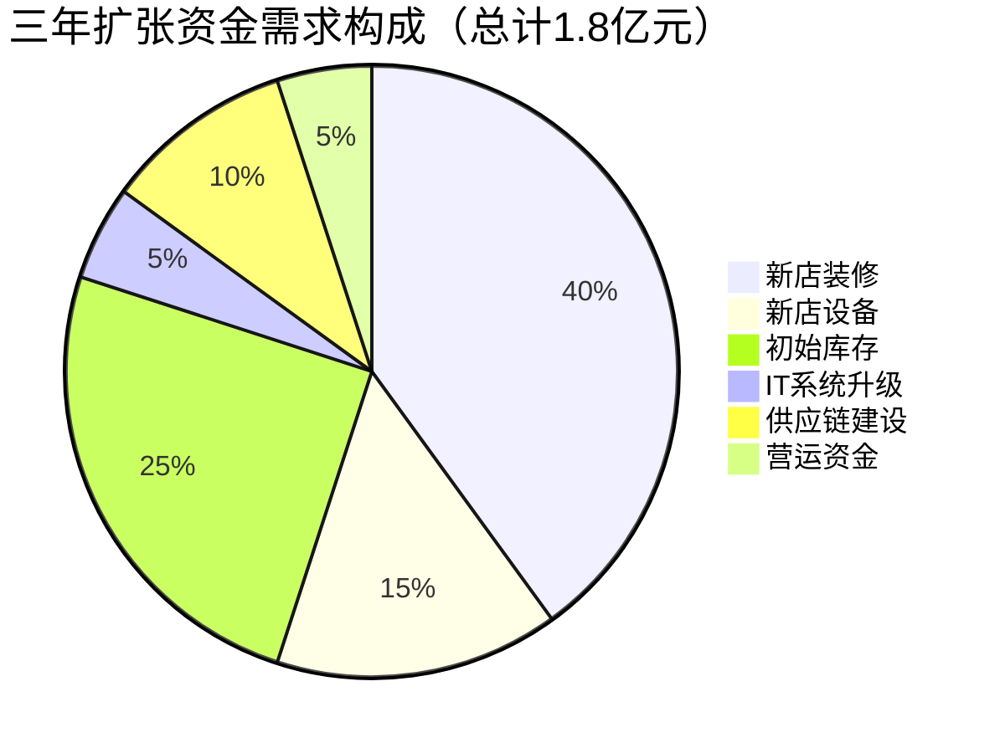
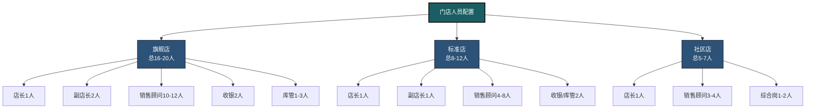
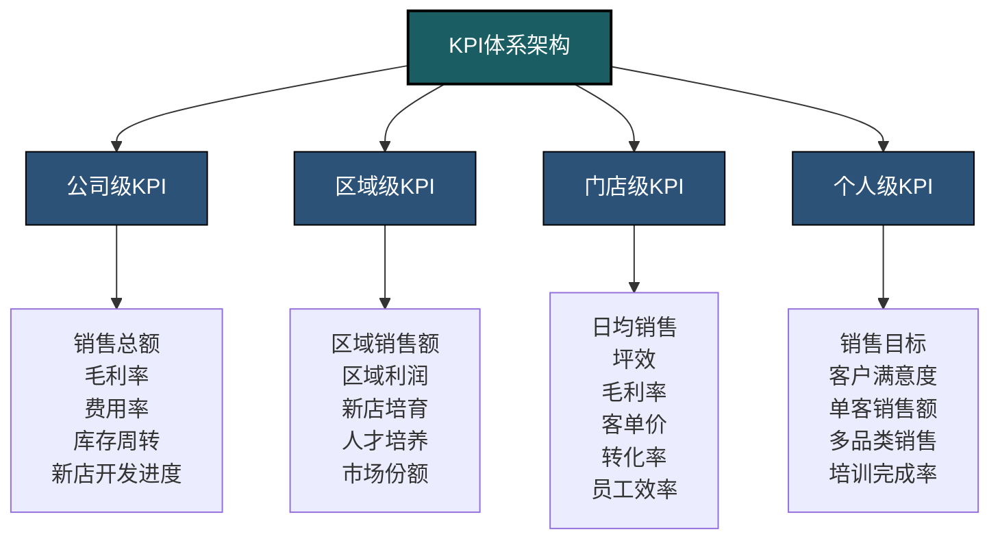
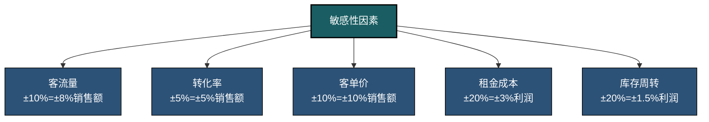
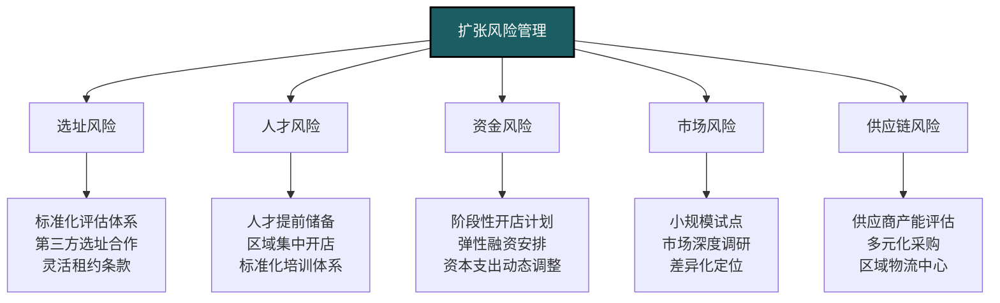
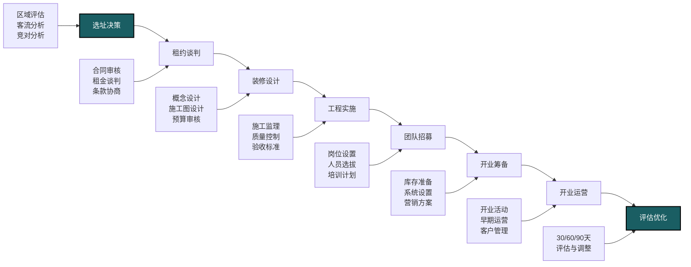

---
{"dg-publish":true,"permalink":"/08-财务专业/财务BP/案例/零售企业BP案例-C公司/"}
---

# 零售企业BP案例分析：C公司多门店扩张规划

#案例分析 #零售业 #多门店 #扩张规划 #资本配置

## 公司背景

C公司是一家区域性生活精品零售连锁企业，成立8年，目前在华东地区拥有28家门店，年销售额约4.2亿元，员工450人。公司销售家居装饰、厨房用品、个人护理和创意礼品等生活类商品，定位中高端市场，主要客群为25-45岁城市中产家庭。

公司收入来源分为四大类：
- 家居装饰品（占销售额35%）
- 厨房与餐饮用品（占销售额30%）
- 个人护理产品（占销售额20%）
- 创意礼品与季节性商品（占销售额15%）

## 面临的挑战与目标

### 市场环境

- 生活精品零售市场年增长率约8%，线上竞争日益激烈
- 购物中心空置率上升，提供了优质选址机会
- 消费者对体验和场景化消费需求增强
- 供应链成本上升，对毛利形成压力
- 区域市场竞争加剧，同质化现象严重

### 战略目标

公司制定了以下三年扩张战略：
- 门店数量：从28家增至65家（年均增长32%）
- 年销售额：从4.2亿元增至10亿元
- 毛利率：从42%提升至45%
- 营业利润率：从8%提升至10%
- 新增区域市场：拓展华北和华中市场
- 渠道整合：线下体验与线上销售联动

## 财务BP编制框架



C公司采用以下步骤进行零售财务BP编制：
1. 自上而下：设定整体目标和扩张路径
2. 自下而上：基于门店经济模型推导可行性
3. 分区域分阶段制定实施计划
4. 将销售、库存和人员计划紧密整合
5. 通过情景分析评估风险和机会

## 门店网络扩张规划

### 门店经济模型分析

C公司根据历史数据和行业标准，构建了详细的单店经济模型：



### 门店分类与差异化策略

C公司对门店进行分类，并针对不同类型制定差异化策略：

**旗舰店(5家计划)**：
- 面积：600-800平方米
- 位置：一线城市核心商圈
- 投资：600-800万元/店
- 功能：品牌形象展示、全品类、体验中心
- 预期坪效：6万元/平米/年

**标准店(25家计划)**：
- 面积：250-350平方米
- 位置：一二线城市优质商圈
- 投资：400-500万元/店
- 功能：核心品类、标准服务流程
- 预期坪效：5万元/平米/年

**社区店(7家计划)**：
- 面积：150-200平方米
- 位置：城市高端社区周边
- 投资：250-300万元/店
- 功能：高频日用品、便利服务
- 预期坪效：4万元/平米/年

### 区域扩张时间表

```mermaid
gantt
    title C公司三年门店扩张计划
    dateFormat  YYYY-Q
    section 华东区域
    现有门店升级    :2023-Q1, 2024-Q2
    新增标准店(12家) :2023-Q1, 2025-Q4
    新增社区店(4家)  :2023-Q3, 2025-Q2
    section 华北区域
    市场调研       :2023-Q1, 2023-Q2
    首家旗舰店     :2023-Q3, 2023-Q4
    标准店扩张(8家)  :2024-Q1, 2025-Q4
    section 华中区域
    市场调研       :2023-Q2, 2023-Q3
    首家旗舰店     :2023-Q4, 2024-Q1
    标准店扩张(5家)  :2024-Q2, 2025-Q4
    社区店试点(3家)  :2024-Q3, 2025-Q2
```

## 商品结构与库存规划

### 品类组合优化

C公司基于销售贡献与毛利率进行品类投资组合分析：



基于上述分析，C公司制定了品类策略：
- **核心维护品类**（储物收纳、个人护理）：扩大SKU范围，增加营销投入
- **重点发展品类**（厨房锅具、小电器）：提升坪效，优化供应链降本
- **选择性投资品类**（装饰摆件、香氛系列）：提高高毛利SKU比例
- **精简优化品类**（部分季节性商品）：减少SKU数量，提高周转率

### 库存管理策略

**差异化库存策略**：
- A类商品（销售贡献60%）：安全库存15天，周转12次/年
- B类商品（销售贡献30%）：安全库存25天，周转8次/年
- C类商品（销售贡献10%）：安全库存40天，周转6次/年

**季节性商品规划**：
- 提前90天制定季节性商品计划
- 建立15/30/45/10配货模型（首批15%，追加30%+45%，尾货控制在10%以内）
- 季末折扣策略：30/50/70阶梯折扣

**新店库存策略**：
- 开业库存：标准店250万元，旗舰店450万元，社区店150万元
- 前3个月补货频率：每周2次，之后调整为每周1次
- 新店商品结构：80%标准品类+20%区域化调整

## 资本支出与融资计划

### 三年扩张资金需求



C公司对扩张资金来源进行了规划：
- 经营现金流自筹：7000万元
- 银行贷款：6000万元（3年期，年利率5.5%）
- 引入战略投资者：5000万元（拟出让10%股权）

### 投资回报分析

C公司对各类门店的投资回报进行了详细分析：

| 门店类型 | 初始投资 | 年均销售额 | 门店利润率 | 回收期 | ROI |
|---------|---------|------------|-----------|-------|-----|
| 旗舰店   | 700万元 | 3600万元   | 9%        | 24个月 | 30% |
| 标准店   | 450万元 | 1500万元   | 8%        | 36个月 | 25% |
| 社区店   | 280万元 | 800万元    | 7%        | 42个月 | 20% |

基于上述分析，制定了各类门店的投资优先级和资源配置策略。

### 现金流预测与管理

特别关注以下现金流关键节点：
- 新店开业前3个月：集中装修和铺货支出
- 每年第四季度：旺季备货资金需求增加
- 春节前6周：销售高峰期带来现金流入
- 每年Q1和Q3：战略性补库存时点

采取的现金流管理策略：
- 与供应商协商：从30天账期延长至45-60天
- 开业促销活动：提高新店早期现金回收
- 银行授信安排：应对季节性波动
- 库存周转目标：从现有7.2次/年提升至8.5次/年

## 门店运营与人员规划

### 门店人员配置模型



### 人力成本与效率规划

C公司制定了详细的人力成本和效率目标：

**人员效率目标**：
- 旗舰店：人均年销售贡献200万元
- 标准店：人均年销售贡献150万元
- 社区店：人均年销售贡献120万元

**薪酬结构**：
- 基本工资占比：60%
- 销售提成占比：25%
- 业绩奖金占比：15%
- 总体人力成本控制在销售额的10-12%

**人才梯队建设**：
- 从现有门店选拔30%的新店店长
- 每年招聘应届生60名进入管培生项目
- 基层员工晋升通道：销售顾问→主管→副店长→店长
- 计划三年内培养50名储备店长

## KPI设定与激励机制

### 多层级KPI体系

C公司建立了从公司到个人的多层级KPI体系：



### 门店升降级管理

C公司根据业绩表现，对门店实施差异化管理：

**A级门店**（前20%）：
- 享有采购自主权（总采购量的30%可自主决定）
- 店长薪酬上浮20%
- 获得创新项目试点资格
- 优先获得市场推广资源

**B级门店**（中间60%）：
- 标准化运营管理
- 差异化改善重点
- 季度考核和调整

**C级门店**（后20%）：
- 强化督导和指导
- 制定90天改善计划
- 连续两季度C级将更换管理团队
- 连续一年C级考虑关店或调整位置

## 敏感性与情景分析

### 关键驱动因素敏感性分析

C公司对影响门店业绩的关键因素进行了敏感性分析：



分析显示，客流量和客单价对业绩影响最大，因此成为重点管理指标。

### 三年扩张情景分析

C公司制定了三种扩张情景，并进行了财务影响评估：

**积极情景**（30%概率）：
- 新开门店：42家（超额5家）
- 销售达成：11亿元（超额10%）
- 门店达产时间：平均4个月
- 资金需求：2亿元
- 预期ROI：28%

**基准情景**（50%概率）：
- 新开门店：37家
- 销售达成：10亿元
- 门店达产时间：平均6个月
- 资金需求：1.8亿元
- 预期ROI：25%

**保守情景**（20%概率）：
- 新开门店：30家（少7家）
- 销售达成：8.5亿元（少15%）
- 门店达产时间：平均8个月
- 资金需求：1.5亿元
- 预期ROI：20%

## 风险管理与应对策略

C公司识别了扩张过程中的主要风险并制定应对策略：



针对新店开业后的业绩表现，设定了预警指标和干预机制：
- 开业首月销售低于预期30%：总部派驻支援团队
- 连续3个月未达目标的80%：评估店长更换
- 开业6个月仍未盈亏平衡：考虑调整商品结构或重新装修
- 开业12个月仍亏损：评估关店止损决策

## 执行与反馈机制

### 扩张项目管理流程

C公司建立了标准化的扩张管理流程：



门店建设执行标准：
- 从选址确认到开业标准周期：90天
- 装修工期控制：45天内
- 开业前培训时间：团队组建后至少15天
- 开业库存到位率：不低于95%

### 定期审查与调整机制

C公司建立了多层次的审查和调整机制：
- 周度：门店销售数据回顾与短期调整
- 月度：区域业绩评估与资源调配
- 季度：战略执行检视与策略调整
- 年度：扩张计划全面评估与下年规划

每季度组织"扩张复盘会"，从以下方面进行系统评估：
- 新店业绩达成情况及差异分析
- 成本控制与投资回报评估
- 区域市场反应与竞争对手动态
- 人才培养与管理能力评估
- 供应链响应与产品策略有效性

## 关键经验与教训

C公司在多年零售扩张过程中总结了以下经验：

1. **选址是核心成功因素**：宁缓勿错，好位置比好装修更重要
2. **标准化与灵活性平衡**：80%标准化+20%本地化是最佳平衡点
3. **先人后店**：提前储备人才是保证快速扩张质量的关键
4. **群店效应**：同一区域集中开设多家门店可降低管理成本
5. **控制扩张节奏**：每家新店达到预期业绩后再开下一家，避免摊薄管理资源
6. **现金流管理比盈利更重要**：扩张期要特别关注库存和应收/应付周期管理

## 对其他零售企业的启示

1. 基于单店经济模型制定扩张策略，确保可复制性
2. 人才梯队建设应先于门店扩张计划
3. 差异化门店定位满足不同区域和消费群体需求
4. 建立完善的风险预警和干预机制
5. 扩张速度应与供应链能力和人才供给匹配

相关概念：
- [[零售选址分析\|零售选址分析]]
- [[多门店管理\|多门店管理]]
- [[库存周转优化\|库存周转优化]]
- [[零售坪效提升\|零售坪效提升]] 