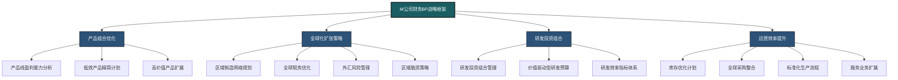
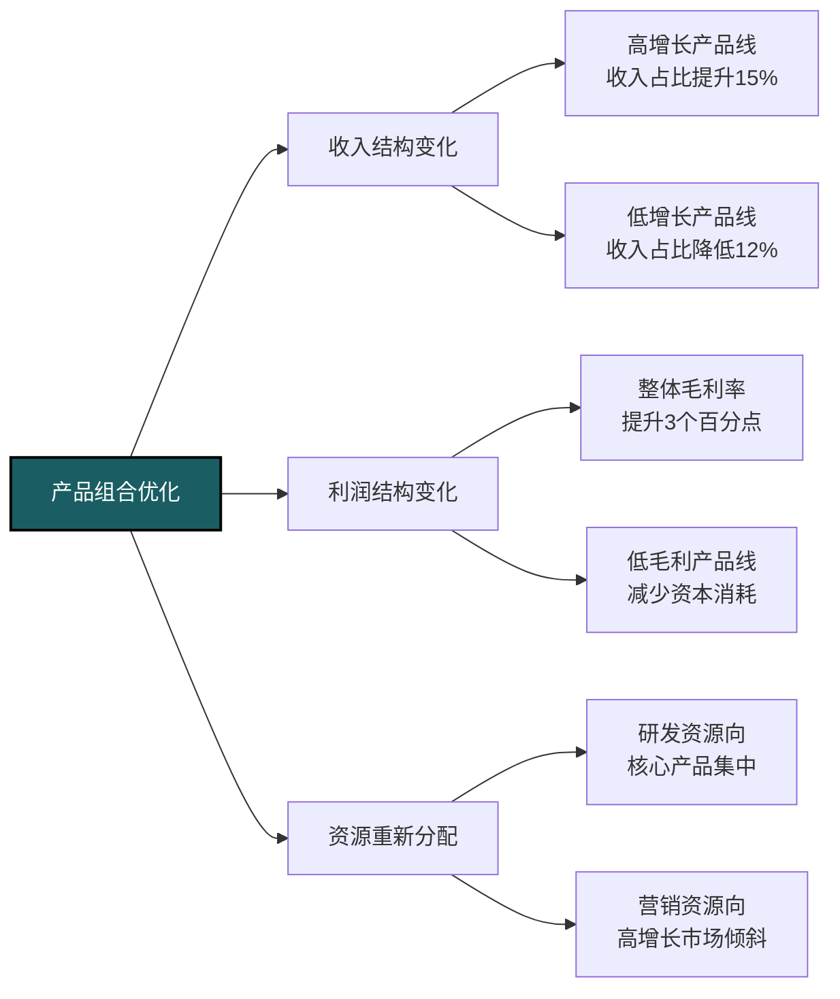
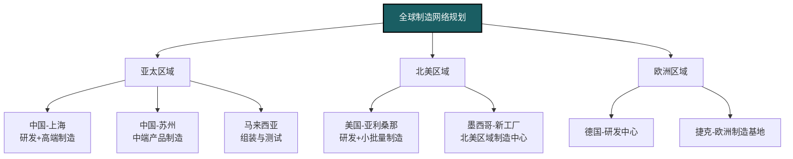
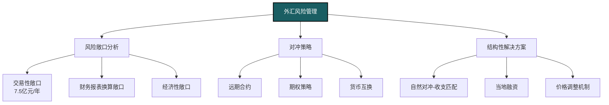
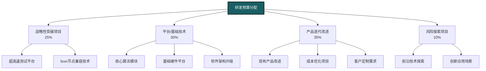
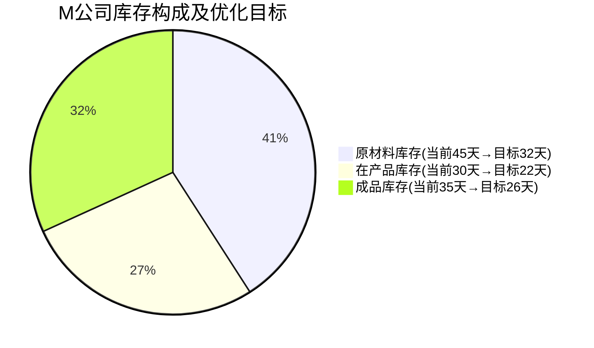
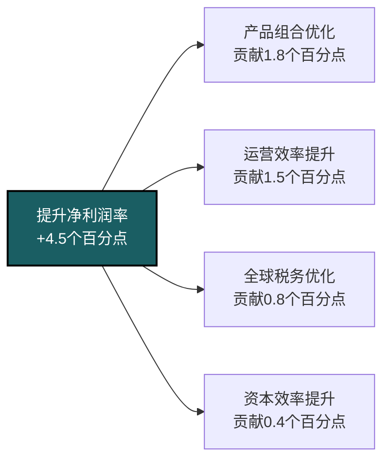
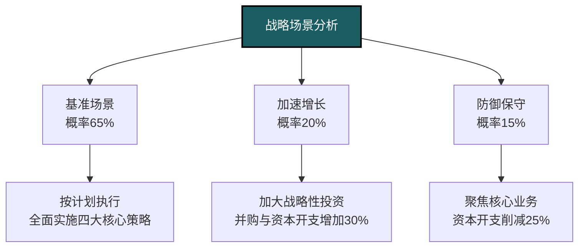

---
{"dg-publish":true,"dg-home":false,"permalink":"/08-财务专业/财务BP/案例/高科技制造企业BP案例-M公司/","dgPassFrontmatter":true}
---

# 高科技制造企业BP案例分析：M公司战略转型与全球化扩张

#案例分析 #高科技制造 #产品组合优化 #全球化扩张 #研发投资

## 公司背景

M公司是一家成立于1995年的高科技精密制造企业，专注于半导体设备和测量仪器的研发与生产。公司总部位于中国上海，在北美和欧洲设有研发中心，在亚太地区拥有3个生产基地。M公司现有员工2,800人，其中研发人员占比25%，年营业收入约28亿元人民币，净利润率稳定在12-14%。

M公司业务分为四大板块：
- 半导体测试设备（占收入45%，毛利率38%）
- 精密仪器仪表（占收入28%，毛利率42%）
- 自动化装配设备（占收入18%，毛利率31%）
- 售后技术服务（占收入9%，毛利率55%）

## 面临的挑战与转型需求

### 外部环境挑战

- 全球半导体行业周期性波动加剧，客户资本支出谨慎
- 行业技术迭代加速，新产品开发窗口期缩短50%
- 国际贸易环境复杂化，关税和供应链风险上升
- 竞争对手整合加剧，市场份额争夺激烈
- 客户要求本地化服务与支持的需求急剧上升
- 疫情后全球供应链重构，区域化生产趋势明显

### 内部经营问题

- 产品组合分散，部分低毛利产品线拖累整体绩效
- 研发投入分散，资源利用效率不足
- 海外业务扩张缺乏系统财务规划，国际税务成本高
- 库存周转率低，资金占用严重（周转天数110天）
- 新产品从研发到商业化周期过长（平均24个月）
- 全球运营协同不足，区域间资源共享有限

## 财务BP战略重点框架



M公司的财务BP战略框架围绕四个核心支柱展开，旨在提升公司整体价值创造能力和全球竞争力。通过系统性分析和前瞻性规划，为公司未来五年的增长提供清晰路径。

## 产品组合优化分析

### 产品线盈利能力矩阵分析

M公司对现有产品组合进行了深入分析，建立了基于市场增长率和毛利贡献的产品线评估矩阵：

```mermaid
quadrant-chart
    title 产品线战略评估矩阵
    x-axis 市场增长潜力 --> 低 中 高
    y-axis 毛利贡献 --> 低 中 高
    quadrant-1 战略重点投资
    quadrant-2 选择性投资
    quadrant-3 优化或剥离
    quadrant-4 维持与改进
    "半导体测试-HT系列": [0.75, 0.85]
    "半导体测试-MT系列": [0.65, 0.5]
    "半导体测试-LT系列": [0.2, 0.3]
    "精密仪器-A系列": [0.8, 0.7]
    "精密仪器-B系列": [0.4, 0.75]
    "精密仪器-C系列": [0.25, 0.4]
    "自动化装配-X系列": [0.7, 0.45]
    "自动化装配-Y系列": [0.3, 0.25]
    "自动化装配-Z系列": [0.1, 0.2]
    "技术服务-标准包": [0.5, 0.6]
    "技术服务-高级包": [0.6, 0.9]
```

基于这一分析，M公司制定了产品组合优化计划：

**A. 重点投资产品线**：
- 半导体测试-HT系列：增加研发投入40%，扩大产能20%
- 精密仪器-A系列：加速新一代产品开发，目标18个月内发布
- 技术服务-高级包：扩大服务团队，开发预测性维护模块

**B. 优化或剥离产品线**：
- 半导体测试-LT系列：寻求技术授权或战略合作伙伴
- 自动化装配-Y/Z系列：计划24个月内逐步剥离或整合
- 精密仪器-C系列：重新定位为入门级产品，简化功能降低成本

### 产品线优化效益预测



通过这一优化策略，预计三年内M公司可实现：
- 整体毛利率提升3个百分点（从37.5%到40.5%）
- 研发效率提升20%（相同投入下产出增加）
- 低效产品线占用资本减少约3.2亿元
- 高增长产品线销售额年复合增长率达23%

## 全球化扩张财务策略

### 区域制造网络规划

M公司针对全球市场需求和供应链风险，重新设计了制造网络布局：



**区域制造策略要点**：
- 实施"设计全球化，制造区域化"策略，减少物流成本和贸易风险
- 在北美建立制造基地，覆盖美国、加拿大和墨西哥市场
- 在欧洲捷克建立制造基地，服务欧洲客户
- 在亚太地区完善"中国+东南亚"双中心布局

**资本投资计划**：
- 墨西哥新工厂：总投资2.1亿元，分三年实施
- 捷克工厂扩建：总投资1.8亿元，两年内完成
- 马来西亚产能扩充：投资9500万元，18个月内完成

### 全球税务优化架构

M公司重新设计了全球税务结构，优化跨境业务税负：

**优化前问题**：
- 跨境交易重复征税
- 知识产权管理分散
- 转移定价文档不完善
- 国际税收抵免机制使用不足

**优化后架构**：
- 建立区域总部模式：新加坡作为亚太区总部，爱尔兰作为欧洲区总部
- 知识产权集中管理模式
- 建立符合OECD原则的转移定价体系
- 优化集团内部融资结构

通过税务架构优化，预计可降低集团有效税率5-6个百分点，每年节约税务成本约7000万元。

### 外汇风险管理体系

作为全球化企业，M公司面临多币种经营风险。财务BP团队设计了系统性外汇管理策略：



**关键风险管理措施**：
- 建立滚动12个月的外汇风险预测模型
- 对预计未来6个月的外汇敞口进行50-70%比例对冲
- 针对USD、EUR、JPY建立常态化对冲机制
- 采用期权策略应对高波动性时期
- 通过当地采购和融资增加自然对冲比例

实施优化后的外汇管理策略，预计可降低外汇波动对年度净利润的影响至±1.5%以内，保持财务业绩的稳定性。

## 研发投资组合管理

### 价值驱动型研发预算分配

M公司年研发投入占收入的12%（约3.36亿元），其财务BP团队为优化研发投资回报设计了新的资金分配框架：



### 研发项目财务评估体系

M公司建立了一套多维度研发项目评估体系：

**投资决策标准**：
- 战略突破项目：5年目标ROI>200%，市场增长贡献>15%
- 产品迭代项目：3年目标ROI>150%，成本降低>12%或性能提升>25%
- 平台技术项目：支持>5个产品线，减少研发周期>30%
- 风险探索项目：潜在市场规模>5亿，技术成功概率>30%

**项目评估流程**：
- 初步筛选：战略适配性+市场规模评估
- 深入分析：技术可行性+资源需求+风险评估
- 财务建模：情境分析+净现值+投资回报期+实物期权分析
- 决策审批：分级授权机制（>5000万元项目需董事会批准）

通过实施该评估体系，M公司实现了研发预算的精准配置，项目商业化成功率从42%提升至68%，新产品对收入的贡献率提高15个百分点。

### 研发效率提升计划

为加速产品从研发到上市的周期，M公司财务BP设计了专项研发效率提升计划：

```mermaid
gantt
    title 研发效率提升计划时间表
    dateFormat  YYYY-Q
    section 研发流程再造
    流程梳理与分析   :2023-Q1, 2023-Q2
    精益研发导入     :2023-Q2, 2023-Q4
    敏捷开发扩展     :2023-Q3, 2024-Q1
    section 组织优化
    矩阵式研发组织重组  :2023-Q2, 2023-Q3
    全球研发中心协同   :2023-Q3, 2024-Q1
    section 技术工具
    研发PLM系统升级   :2023-Q2, 2023-Q4
    数字孪生技术应用   :2023-Q4, 2024-Q2
    AI辅助设计工具    :2024-Q1, 2024-Q3
    section 文化与机制
    绩效激励机制改革   :2023-Q3, 2024-Q1
    创新文化建设      :2023-Q4, 2024-Q3
```

通过这些措施，M公司计划在三年内实现：
- 产品研发周期从平均24个月缩短至16个月
- 研发项目按时完成率从65%提高至90%
- 研发费用占收入比例从12%优化至10.5%
- 新产品上市后12个月内的销售目标达成率从70%提高至85%

## 运营效率与资本结构优化

### 库存优化与供应链重构

M公司针对库存周转率低的问题进行了详细分析：

**库存结构分析**：
- 原材料库存：周转天数45天（行业标准30天）
- 在产品库存：周转天数30天（行业标准20天）
- 成品库存：周转天数35天（行业标准25天）



**库存优化措施**：
- 实施供应商管理库存(VMI)模式，覆盖50%关键原材料
- 推行精益生产方法，减少生产周期和在制品库存
- 区域分销中心整合，通过共享库存降低安全库存水平
- 动态销售与运营计划(S&OP)流程优化，提高需求预测准确性

通过这些措施，预计两年内库存周转天数从110天降至80天，释放营运资金约2.5亿元。

### 全球资本配置与融资策略

为支持全球扩张，M公司设计了差异化的资本配置和融资策略：

**资本支出计划**（三年总投资9.5亿元）：
- 全球制造网络扩张：5.2亿元
- 研发设备与实验室：2.3亿元
- 数字化转型项目：1.4亿元
- 运营改善项目：0.6亿元

**区域融资策略**：
- 亚太区域：主要依靠内部现金流和银团贷款（人民币/美元）
- 北美区域：当地银行贷款+设备租赁（美元）
- 欧洲区域：欧洲投资银行贷款+当地银行融资（欧元）

**资本结构目标**：
- 维持债务权益比在0.4-0.5之间
- 带息负债与EBITDA比率控制在2.0以下
- 信用评级目标维持在A-或以上

通过优化融资结构，预计可降低综合融资成本50-70个基点，每年节约财务费用约1200万元。

## 业绩提升路径与预测

### 三年业绩提升路径

基于上述战略举措，M公司财务BP团队预测了未来三年的业绩提升路径：



**关键财务指标预测**：

| 指标 | 2022年(基准) | 2023年 | 2024年 | 2025年 | 年复合增长率 |
|------|------------|-------|-------|-------|------------|
| 营业收入(亿元) | 28.0 | 32.5 | 39.0 | 46.8 | 18.7% |
| 毛利率 | 37.5% | 38.7% | 39.8% | 41.0% | +3.5个百分点 |
| 营业利润率 | 15.5% | 16.8% | 18.2% | 19.6% | +4.1个百分点 |
| 净利润率 | 12.3% | 13.5% | 15.2% | 16.8% | +4.5个百分点 |
| ROE | 16.2% | 18.0% | 20.5% | 22.8% | +6.6个百分点 |
| 净现金流(亿元) | 2.8 | 3.5 | 4.8 | 6.5 | 32.4% |

### 战略场景分析

M公司财务BP团队针对不同外部环境变化，设计了三种战略应对场景：



**加速增长场景**（行业高速增长+全球化机遇扩大）：
- 增加研发投入至收入的14%
- 加速全球制造网络扩张，提前12个月完成
- 考虑战略并购2-3家中型技术公司
- 预期三年CAGR提升至25%以上

**防御保守场景**（宏观经济下行+行业周期低谷）：
- 聚焦核心产品和市场，战略性收缩非核心业务
- 推迟非关键资本支出，强化现金流管理
- 提高股息支付比例，向投资者返还价值
- 保持盈利能力，维持营业利润率不低于14%

## 关键绩效指标与监控

M公司建立了多层次KPI体系监控战略执行情况：

### 财务KPI体系

| 指标类别 | KPI | 基准值 | 目标值 |
|---------|-----|-------|-------|
| 增长指标 | 营业收入增长率 | 15% | >18% |
| | 新产品收入占比 | 22% | 35% |
| | 海外市场收入占比 | 38% | 55% |
| 盈利指标 | 毛利率 | 37.5% | 41% |
| | 营业利润率 | 15.5% | 19.6% |
| | EBITDA利润率 | 20.3% | 24% |
| 效率指标 | 库存周转天数 | 110天 | 80天 |
| | 固定资产周转率 | 2.8 | 3.5 |
| | 研发投入产出比 | 6.5:1 | 9:1 |
| 资本回报 | ROE | 16.2% | >22% |
| | ROIC | 14.5% | >18% |
| | 经济增加值(EVA) | 2.1亿元 | >4.5亿元 |

### 业务层面KPI

| 指标类别 | KPI | 基准值 | 目标值 |
|---------|-----|-------|-------|
| 客户指标 | 顶级客户留存率 | 92% | >95% |
| | 客户满意度指数 | 4.2/5 | >4.5/5 |
| | 新客户获取数 | 45/年 | >60/年 |
| 产品指标 | 新产品按时发布率 | 65% | >90% |
| | 研发周期 | 24个月 | 16个月 |
| | 产品质量指数 | 98.2% | >99.5% |
| 运营指标 | 生产周期时间 | 21天 | 14天 |
| | 按时交付率 | 91% | >96% |
| | 制造良率 | 96.5% | >98.5% |

## BP实施经验与挑战

### 关键成功因素

M公司在实施财务BP战略过程中，总结了以下关键成功因素：

1. **战略-财务协同机制**：建立了业务战略与财务规划的紧密联动机制
2. **以数据驱动决策**：建立了产品线、客户、区域维度的精细化财务模型
3. **跨职能团队运作**：财务BP作为业务合作伙伴融入各业务单元决策过程
4. **灵活的资源配置机制**：基于价值贡献动态调整资源分配
5. **有效的激励机制**：将战略KPI与管理层激励直接挂钩

### 实施过程中的挑战与对策

在BP执行过程中，M公司也遇到了一些挑战：

**挑战1：全球化运营协同难度**
- 应对措施：建立区域导向、矩阵式管理结构
- 实施统一ERP系统，提升全球运营可视性
- 区域负责人月度协同会议机制

**挑战2：产品组合调整的阵痛**
- 应对措施：渐进式退出策略，避免对客户造成冲击
- 针对低效产品线员工的职业转型计划
- 制定详细沟通计划，降低内外部阻力

**挑战3：研发资源重配置的复杂性**
- 应对措施：建立基于数据的透明决策机制
- 高管团队对战略重点达成共识
- 设立"创新基金"，鼓励创新思维转型

## 对其他高科技制造企业的启示

M公司的案例为同类企业提供了以下关键启示：

1. **聚焦核心优势领域**：集中资源在高价值、高增长的产品线和市场
2. **区域化生产战略**：平衡全球化与本地化，降低供应链风险
3. **价值导向研发**：构建研发投资组合，平衡短期与长期回报
4. **数据驱动决策**：基于精细财务分析优化资源配置
5. **全球资本结构优化**：合理规划区域融资策略，提高资金效率

## 后续发展规划

M公司计划在完成当前战略后，探索以下发展方向：

1. **服务业务模式创新**：从设备供应商向解决方案提供商转型
2. **平台化战略**：构建开放式技术平台，打造产业生态
3. **数字孪生技术**：将物理产品与数字模型融合，开发新收入来源
4. **可持续发展战略**：将ESG目标纳入财务规划框架

相关概念：
- [[高科技产品组合管理\|高科技产品组合管理]]
- [[全球税务优化\|全球税务优化]]
- [[研发投资组合\|研发投资组合]]
- [[全球制造网络规划\|全球制造网络规划]]
- [[高科技企业并购策略\|高科技企业并购策略]] 