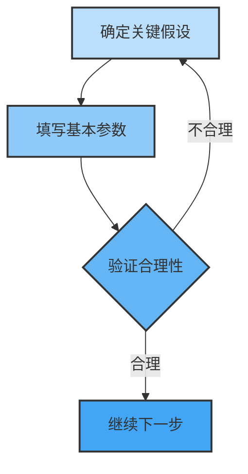
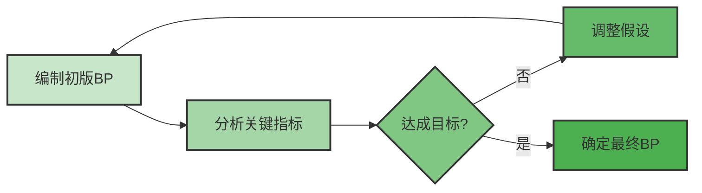

---
{"dg-publish":true,"permalink":"/08-财务专业/财务BP/模板/基础年度财务BP模板.xlsx/"}
---

# 基础年度财务BP模板

## 模板概述

此模板提供了一个基础的年度财务BP框架，适合中小型企业使用。模板包含以下主要工作表：

1. **说明与指引**
2. **假设与参数**
3. **收入预测**
4. **成本预测**
5. **资本支出计划**
6. **人员规划**
7. **利润表预测**
8. **资产负债表预测**
9. **现金流量表预测**
10. **财务指标分析**
11. **情景分析**
12. **图表摘要**

## 使用方法

### 1. 填写基本假设

首先在"假设与参数"工作表中填写关键业务假设，包括：

- 收入增长率
- 毛利率目标
- 费用率假设
- 税率
- 资本支出计划
- 运营资本周转率

### 2. 编制详细预测

按照以下顺序逐步完成各模块：

1. **收入预测**：按产品线/业务部门/客户类型细分
2. **成本预测**：区分固定成本和变动成本
3. **资本支出**：按项目和优先级排序
4. **人员规划**：按部门和职能规划人员需求和成本

### 3. 生成财务报表

基于上述预测，模板将自动生成：

- 月度/季度/年度利润表
- 年度资产负债表
- 月度/季度/年度现金流量表

### 4. 分析与优化

利用"财务指标分析"和"情景分析"工作表：

- 评估关键财务指标表现
- 进行敏感性分析
- 调整计划以达到目标
- 制定应对不同情景的策略

## 模板结构详解

### 收入预测工作表

包含以下结构：
- 按产品/服务类别分类
- 月度销量预测
- 单价假设
- 季节性因素调整
- 同比增长分析

### 成本预测工作表

包含以下分类：
- 直接材料成本
- 直接人工成本
- 制造费用
- 销售费用
- 管理费用
- 研发费用
- 其他运营费用

### 资本支出计划工作表

包含以下内容：
- 项目描述
- 投资时间表
- 预期回报分析
- 折旧计算
- 投资优先级排序

### 财务指标分析工作表

计算并分析以下指标：
- 毛利率和净利率
- 流动比率和速动比率
- 资产周转率
- 投资回报率
- 资本结构比率
- 增长指标

## 实际应用说明

此模板可根据企业具体情况进行定制，建议：

1. 首先理解各工作表的关联逻辑
2. 根据企业实际情况调整假设
3. 确保跨工作表的数据一致性
4. 定期(月度/季度)更新实际数据
5. 分析差异并调整预测

## 模板样例数据

模板中提供了一家假设的制造企业的示例数据，可作为参考。要使用自己的数据，请替换示例数据并确保公式引用正确。

## 相关资源

- [[财务BP编制流程\|财务BP编制流程]]
- [[08-财务专业/财务BP/笔记/预算编制基础/收入预测方法\|收入预测方法]]
- [[08-财务专业/财务BP/笔记/预算编制基础/成本预测方法\|成本预测方法]]
- [[财务指标分析\|财务指标分析]] 