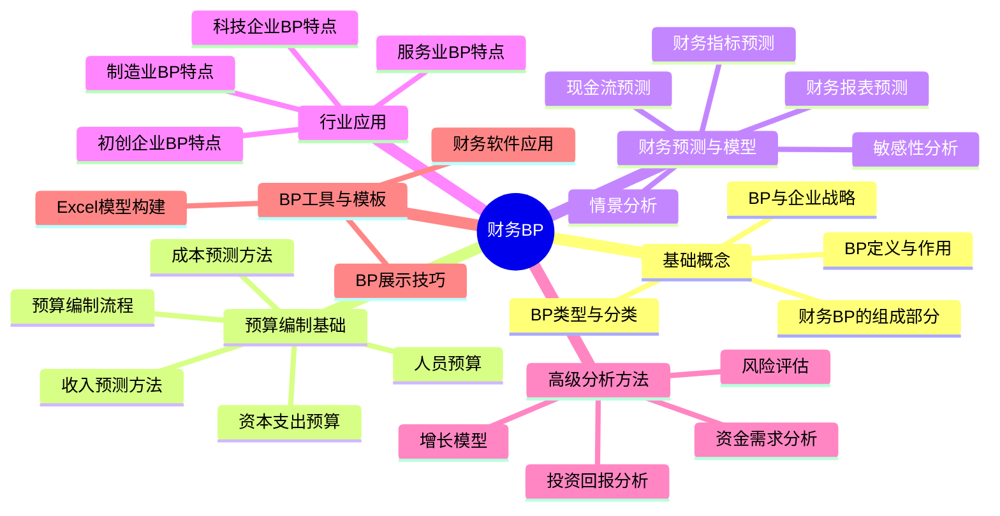
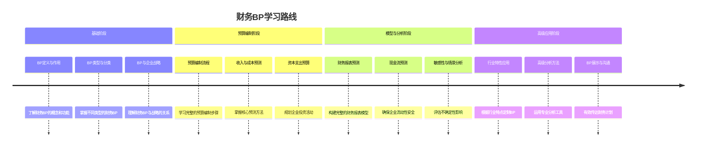
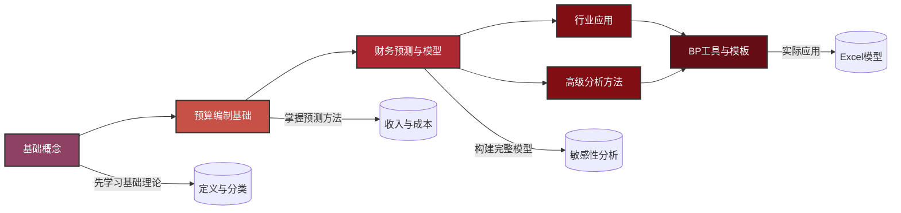

---
{"dg-publish":true,"dg-home":false,"tags":["财务BP","预算规划","财务规划","商业计划","学习大纲","资金规划"],"aliases":["财务业务规划","预算与计划大纲"],"cssclass":"catalogue","permalink":"/08-财务专业/财务BP/目录/","dgPassFrontmatter":true}
---

# 财务BP学习大纲

> [!NOTE] 概述
> 本文档是财务BP(Business Plan/Budget Planning)的系统学习大纲，涵盖从基础概念到高级应用的完整知识体系。通过结构化学习路径，帮助掌握财务BP的编制方法、分析技术和实践应用。

## 学习路线图

## 章节详细内容

### 1. 财务BP基础概念
- **1.1 BP定义与作用** #基础概念 #定义
  - 1.1.1 [[08-财务专业/财务BP/学习内容/财务BP基础概念/BP定义与作用/财务BP的定义\|财务BP的定义]] #概念定义
  - 1.1.2 [[08-财务专业/财务BP/学习内容/财务BP基础概念/BP定义与作用/财务BP的作用与目标\|财务BP的作用与目标]] #价值分析
  - 1.1.3 [[08-财务专业/财务BP/学习内容/财务BP基础概念/BP定义与作用/财务BP在企业管理中的位置\|财务BP在企业管理中的位置]] #管理体系
  
- **1.2 BP类型与分类** #基础概念 #分类法
  - 1.2.1 [[08-财务专业/财务BP/学习内容/财务BP基础概念/BP类型与分类/按时间范围分类\|按时间范围分类]] #分类方法 #规划周期
  - 1.2.2 [[08-财务专业/财务BP/学习内容/财务BP基础概念/BP类型与分类/按用途分类\|按用途分类]] #分类方法 #应用场景
  - 1.2.3 [[财务BP/学习内容/财务BP基础概念/BP类型与分类/按编制方法分类\|按编制方法分类]] #分类方法 #编制流程

- **1.3 BP与企业战略** #基础概念 #战略规划
  - 1.3.1 [[08-财务专业/财务BP/学习内容/财务BP基础概念/BP与企业战略/财务BP与企业战略的关系\|财务BP与企业战略的关系]] #战略联系
  - 1.3.2 [[08-财务专业/财务BP/学习内容/财务BP基础概念/BP与企业战略/如何将战略目标转化为财务规划\|如何将战略目标转化为财务规划]] #战略落地
  - 1.3.3 [[08-财务专业/财务BP/学习内容/财务BP基础概念/BP与企业战略/财务BP的战略价值\|财务BP的战略价值]] #价值评估

- **1.4 财务BP的组成部分** #基础概念 #结构组成
  - 1.4.1 [[财务BP/学习内容/财务BP基础概念/财务BP的组成部分/收入预算\|收入预算]] #预算组成 #收入管理
  - 1.4.2 [[财务BP/学习内容/财务BP基础概念/财务BP的组成部分/成本预算\|成本预算]] #预算组成 #成本管理
  - 1.4.3 [[财务BP/学习内容/财务BP基础概念/财务BP的组成部分/资本支出预算\|资本支出预算]] #预算组成 #资本管理
  - 1.4.4 [[财务BP/学习内容/财务BP基础概念/财务BP的组成部分/现金流预算\|现金流预算]] #预算组成 #现金流管理
  - 1.4.5 [[财务BP/学习内容/财务BP基础概念/财务BP的组成部分/财务报表预测\|财务报表预测]] #预算组成 #报表预测

### 2. 预算编制基础
- **2.1 预算编制流程** #预算编制 #流程管理
  - 2.1.1 [[08-财务专业/财务BP/学习内容/预算编制基础/预算编制流程/预算编制的准备工作\|预算编制的准备工作]] #流程步骤 #前期准备
  - 2.1.2 [[08-财务专业/财务BP/学习内容/预算编制基础/预算编制流程/预算编制的基本步骤\|预算编制的基本步骤]] #流程步骤 #核心流程
  - 2.1.3 [[08-财务专业/财务BP/学习内容/预算编制基础/预算编制流程/预算汇总与审批\|预算汇总与审批]] #流程步骤 #审批管理
  - 2.1.4 [[08-财务专业/财务BP/学习内容/预算编制基础/预算编制流程/预算编制流程\|预算编制流程]] #流程索引

- **2.2 收入预测方法** #预算编制 #收入预测
  - 2.2.1 [[08-财务专业/财务BP/学习内容/预算编制基础/收入预测方法/销量预测技术\|销量预测技术]] #预测方法 #销售管理
  - 2.2.2 [[08-财务专业/财务BP/学习内容/预算编制基础/收入预测方法/价格策略与预测\|价格策略与预测]] #预测方法 #定价策略
  - 2.2.3 [[08-财务专业/财务BP/学习内容/预算编制基础/收入预测方法/行业趋势分析\|行业趋势分析]] #预测方法 #趋势分析
  - 2.2.4 [[08-财务专业/财务BP/学习内容/预算编制基础/收入预测方法/历史数据分析法\|历史数据分析法]] #预测方法 #数据分析

- **2.3 成本预测方法** #预算编制 #成本预测
  - 2.3.1 [[08-财务专业/财务BP/学习内容/预算编制基础/成本预测方法/固定成本与变动成本分析\|固定成本与变动成本分析]] #成本分析 #成本结构
  - 2.3.2 [[08-财务专业/财务BP/学习内容/预算编制基础/成本预测方法/成本结构分析\|成本结构分析]] #成本分析 #结构评估
  - 2.3.3 [[财务BP/学习内容/预算编制基础/成本预测方法/成本驱动因素识别\|成本驱动因素识别]] #成本分析 #驱动因素
  - 2.3.4 [[财务BP/学习内容/预算编制基础/成本预测方法/边际成本分析\|边际成本分析]] #成本分析 #边际分析

- **2.4 资本支出预算** #预算编制 #资本预算
  - 2.4.1 [[08-财务专业/财务BP/学习内容/预算编制基础/资本支出预算/资本支出分类\|资本支出分类]] #资本管理 #支出分类
  - 2.4.2 [[08-财务专业/财务BP/学习内容/预算编制基础/资本支出预算/资本支出评估方法\|资本支出评估方法]] #资本管理 #评估方法
  - 2.4.3 [[08-财务专业/财务BP/学习内容/预算编制基础/资本支出预算/资本支出优先级排序\|资本支出优先级排序]] #资本管理 #优先级管理
  - 2.4.4 [[财务BP/学习内容/预算编制基础/资本支出预算/资本支出的财务影响\|资本支出的财务影响]] #资本管理 #影响分析

- **2.5 人员预算** #预算编制 #人员预算
  - 2.5.1 [[08-财务专业/财务BP/学习内容/预算编制基础/人员预算/人力资源规划与预算\|人力资源规划与预算]] #人员管理 #规划方法
  - 2.5.2 [[08-财务专业/财务BP/学习内容/预算编制基础/人员预算/人员成本构成\|人员成本构成]] #人员管理 #成本结构
  - 2.5.3 [[08-财务专业/财务BP/学习内容/预算编制基础/人员预算/人员效能与成本管理\|人员效能与成本管理]] #人员管理 #效能评估
  - 2.5.4 [[08-财务专业/财务BP/学习内容/预算编制基础/人员预算/人员预算的敏感性分析\|人员预算的敏感性分析]] #人员管理 #敏感性分析

### 3. 财务预测与模型
- **3.1 财务报表预测** #财务预测 #报表预测
  - 3.1.1 [[08-财务专业/财务BP/学习内容/财务预测与模型/财务报表预测/利润表预测方法\|利润表预测方法]] #报表预测 #利润分析
  - 3.1.2 [[08-财务专业/财务BP/学习内容/财务预测与模型/财务报表预测/资产负债表预测方法\|资产负债表预测方法]] #报表预测 #资产负债
  - 3.1.3 [[08-财务专业/财务BP/学习内容/财务预测与模型/财务报表预测/报表间的逻辑关系\|报表间的逻辑关系]] #报表预测 #逻辑关系
  - 3.1.4 [[08-财务专业/财务BP/学习内容/财务预测与模型/财务报表预测/常见预测错误及规避\|常见预测错误及规避]] #报表预测 #错误处理

- **3.2 现金流预测** #财务预测 #现金流管理
  - 3.2.1 [[08-财务专业/财务BP/学习内容/财务预测与模型/现金流预测/现金流预测的重要性\|现金流预测的重要性]] #现金流 #价值分析
  - 3.2.2 [[财务BP/学习内容/财务预测与模型/现金流预测/直接法现金流预测\|直接法现金流预测]] #现金流 #预测方法
  - 3.2.3 [[财务BP/学习内容/财务预测与模型/现金流预测/间接法现金流预测\|间接法现金流预测]] #现金流 #预测方法
  - 3.2.4 [[财务BP/学习内容/财务预测与模型/现金流预测/营运资金管理与预测\|营运资金管理与预测]] #现金流 #营运资金

- **3.3 敏感性分析** #财务预测 #敏感性分析
  - 3.3.1 [[08-财务专业/财务BP/学习内容/财务预测与模型/敏感性分析/敏感性分析的目的与方法\|敏感性分析的目的与方法]] #分析方法 #目的价值
  - 3.3.2 [[08-财务专业/财务BP/学习内容/财务预测与模型/敏感性分析/关键变量识别\|关键变量识别]] #分析方法 #关键因素
  - 3.3.3 [[08-财务专业/财务BP/学习内容/财务预测与模型/敏感性分析/单因素和多因素敏感性分析\|单因素和多因素敏感性分析]] #分析方法 #分析技术
  - 3.3.4 [[08-财务专业/财务BP/学习内容/财务预测与模型/敏感性分析/敏感性分析的展示方法\|敏感性分析的展示方法]] #分析方法 #结果展示

- **3.4 情景分析** #财务预测 #情景分析
  - 3.4.1 [[08-财务专业/财务BP/学习内容/财务预测与模型/情景分析/情景构建方法\|情景构建方法]] #分析方法 #情景规划
  - 3.4.2 [[08-财务专业/财务BP/学习内容/财务预测与模型/情景分析/最佳、基准与最差情景\|最佳、基准与最差情景]] #分析方法 #情景类型
  - 3.4.3 [[08-财务专业/财务BP/学习内容/财务预测与模型/情景分析/情景权重分析\|情景权重分析]] #分析方法 #权重评估
  - 3.4.4 [[08-财务专业/财务BP/学习内容/财务预测与模型/情景分析/情景分析的决策应用\|情景分析的决策应用]] #分析方法 #决策支持

- **3.5 财务指标预测** #财务预测 #指标预测
  - 3.5.1 [[财务BP/学习内容/财务预测与模型/财务指标预测/盈利能力指标预测\|盈利能力指标预测]] #指标分析 #盈利能力
  - 3.5.2 [[财务BP/学习内容/财务预测与模型/财务指标预测/流动性指标预测\|流动性指标预测]] #指标分析 #流动性
  - 3.5.3 [[财务BP/学习内容/财务预测与模型/财务指标预测/杠杆率指标预测\|杠杆率指标预测]] #指标分析 #财务杠杆
  - 3.5.4 [[财务BP/学习内容/财务预测与模型/财务指标预测/增长指标预测\|增长指标预测]] #指标分析 #增长评估

### 4. 行业应用
- **4.1 制造业BP特点** #行业应用 #制造业
  - 4.1.1 [[08-财务专业/财务BP/学习内容/行业应用/制造业BP特点/制造业成本结构特点\|制造业成本结构特点]] #行业特点 #成本结构
  - 4.1.2 [[财务BP/学习内容/行业应用/制造业BP特点/产能规划与预算\|产能规划与预算]] #行业特点 #产能管理
  - 4.1.3 [[财务BP/学习内容/行业应用/制造业BP特点/库存管理与预算\|库存管理与预算]] #行业特点 #库存管理
  - 4.1.4 [[08-财务专业/财务BP/学习内容/行业应用/制造业BP特点/制造业BP案例分析\|制造业BP案例分析]] #行业特点 #案例研究

- **4.2 服务业BP特点** #行业应用 #服务业
  - 4.2.1 [[08-财务专业/财务BP/学习内容/行业应用/服务业BP特点/服务业收入模式特点\|服务业收入模式特点]] #行业特点 #收入模式
  - 4.2.2 [[08-财务专业/财务BP/学习内容/行业应用/服务业BP特点/人员成本规划\|人员成本规划]] #行业特点 #人员成本
  - 4.2.3 [[08-财务专业/财务BP/学习内容/行业应用/服务业BP特点/服务能力与扩张预算\|服务能力与扩张预算]] #行业特点 #扩张管理
  - 4.2.4 [[08-财务专业/财务BP/学习内容/行业应用/服务业BP特点/服务业BP案例分析\|服务业BP案例分析]] #行业特点 #案例研究

- **4.3 科技企业BP特点** #行业应用 #科技行业
  - 4.3.1 [[08-财务专业/财务BP/学习内容/行业应用/科技企业BP特点/科技企业业务模式特点\|科技企业业务模式特点]] #行业特点 #业务模式
  - 4.3.2 [[08-财务专业/财务BP/学习内容/行业应用/科技企业BP特点/研发投入预算\|研发投入预算]] #行业特点 #研发管理
  - 4.3.3 [[08-财务专业/财务BP/学习内容/行业应用/科技企业BP特点/快速增长阶段的BP策略\|快速增长阶段的BP策略]] #行业特点 #增长管理
  - 4.3.4 [[08-财务专业/财务BP/学习内容/行业应用/科技企业BP特点/科技企业BP案例分析\|科技企业BP案例分析]] #行业特点 #案例研究

- **4.4 初创企业BP特点** #行业应用 #初创企业
  - 4.4.1 [[08-财务专业/财务BP/学习内容/行业应用/初创企业BP特点/初创期BP的特殊挑战\|初创期BP的特殊挑战]] #行业特点 #挑战管理
  - 4.4.2 [[08-财务专业/财务BP/学习内容/行业应用/初创企业BP特点/融资计划与财务规划\|融资计划与财务规划]] #行业特点 #融资管理
  - 4.4.3 [[08-财务专业/财务BP/学习内容/行业应用/初创企业BP特点/现金消耗率管理\|现金消耗率管理]] #行业特点 #现金管理
  - 4.4.4 [[08-财务专业/财务BP/学习内容/行业应用/初创企业BP特点/初创企业BP案例分析\|初创企业BP案例分析]] #行业特点 #案例研究

### 5. 高级分析方法
- **5.1 投资回报分析** #高级分析 #投资分析
  - 5.1.1 [[08-财务专业/财务BP/学习内容/高级分析方法/投资回报分析/ROI计算方法\|ROI计算方法]] #分析技术 #ROI分析
  - 5.1.2 [[08-财务专业/财务BP/学习内容/高级分析方法/投资回报分析/投资回收期分析\|投资回收期分析]] #分析技术 #回收期
  - 5.1.3 [[08-财务专业/财务BP/学习内容/高级分析方法/投资回报分析/净现值与内部收益率分析\|净现值与内部收益率分析]] #分析技术 #NPV与IRR
  - 5.1.4 [[财务BP/学习内容/高级分析方法/投资回报分析/投资决策指标的应用\|投资决策指标的应用]] #分析技术 #决策应用

- **5.2 资金需求分析** #高级分析 #资金管理
  - 5.2.1 [[08-财务专业/财务BP/学习内容/高级分析方法/资金需求分析/资金缺口计算方法\|资金缺口计算方法]] #分析技术 #缺口分析
  - 5.2.2 [[财务BP/学习内容/高级分析方法/资金需求分析/融资结构优化\|融资结构优化]] #分析技术 #融资结构
  - 5.2.3 [[财务BP/学习内容/高级分析方法/资金需求分析/债务管理策略\|债务管理策略]] #分析技术 #债务管理
  - 5.2.4 [[财务BP/学习内容/高级分析方法/资金需求分析/融资能力评估\|融资能力评估]] #分析技术 #能力评估

- **5.3 风险评估** #高级分析 #风险管理
  - 5.3.1 [[08-财务专业/财务BP/学习内容/高级分析方法/风险评估/财务风险识别\|财务风险识别]] #风险分析 #风险识别
  - 5.3.2 [[财务BP/学习内容/高级分析方法/风险评估/风险量化方法\|风险量化方法]] #风险分析 #量化技术
  - 5.3.3 [[财务BP/学习内容/高级分析方法/风险评估/风险缓解策略\|风险缓解策略]] #风险分析 #缓解方法
  - 5.3.4 [[财务BP/学习内容/高级分析方法/风险评估/压力测试应用\|压力测试应用]] #风险分析 #压力测试

- **5.4 增长模型** #高级分析 #增长管理
  - 5.4.1 [[08-财务专业/财务BP/学习内容/高级分析方法/增长模型/可持续增长率分析\|可持续增长率分析]] #增长分析 #可持续性
  - 5.4.2 [[财务BP/学习内容/高级分析方法/增长模型/增长驱动因素识别\|增长驱动因素识别]] #增长分析 #驱动因素
  - 5.4.3 [[财务BP/学习内容/高级分析方法/增长模型/增长阶段的财务规划差异\|增长阶段的财务规划差异]] #增长分析 #阶段规划
  - 5.4.4 [[财务BP/学习内容/高级分析方法/增长模型/增长瓶颈分析\|增长瓶颈分析]] #增长分析 #瓶颈管理

### 6. BP工具与模板
- **6.1 Excel模型构建** #工具应用 #Excel模型
  - 6.1.1 [[08-财务专业/财务BP/学习内容/BP工具与模板/Excel模型构建/财务模型设计原则\|财务模型设计原则]] #模型构建 #设计原则
  - 6.1.2 [[财务BP/学习内容/BP工具与模板/Excel模型构建/模型结构与布局\|模型结构与布局]] #模型构建 #模型结构
  - 6.1.3 [[财务BP/学习内容/BP工具与模板/Excel模型构建/公式与函数应用\|公式与函数应用]] #模型构建 #函数应用
  - 6.1.4 [[财务BP/学习内容/BP工具与模板/Excel模型构建/数据验证与检查\|数据验证与检查]] #模型构建 #验证技术

- **6.2 财务软件应用** #工具应用 #财务软件
  - 6.2.1 [[08-财务专业/财务BP/学习内容/BP工具与模板/财务软件应用/常用财务规划软件比较\|常用财务规划软件比较]] #软件应用 #工具比较
  - 6.2.2 [[08-财务专业/财务BP/学习内容/BP工具与模板/财务软件应用/软件选择考虑因素\|软件选择考虑因素]] #软件应用 #选择标准
  - 6.2.3 [[08-财务专业/财务BP/学习内容/BP工具与模板/财务软件应用/系统整合与数据导入\|系统整合与数据导入]] #软件应用 #数据整合
  - 6.2.4 [[08-财务专业/财务BP/学习内容/BP工具与模板/财务软件应用/自动化报告生成\|自动化报告生成]] #软件应用 #报告生成

- **6.3 BP展示技巧** #工具应用 #展示技巧
  - 6.3.1 [[08-财务专业/财务BP/学习内容/BP工具与模板/BP展示技巧/管理层报告设计\|管理层报告设计]] #展示方法 #报告设计
  - 6.3.2 [[08-财务专业/财务BP/学习内容/BP工具与模板/BP展示技巧/数据可视化技巧\|数据可视化技巧]] #展示方法 #可视化
  - 6.3.3 [[08-财务专业/财务BP/学习内容/BP工具与模板/BP展示技巧/关键信息提炼\|关键信息提炼]] #展示方法 #信息提炼
  - 6.3.4 [[08-财务专业/财务BP/学习内容/BP工具与模板/BP展示技巧/有效沟通财务计划\|有效沟通财务计划]] #展示方法 #沟通技巧

## 学习路径建议

1. 首先掌握基础概念，了解财务BP的定义、分类和组成部分 #学习路径 #基础阶段
2. 学习预算编制基础，包括收入、成本和资本支出的预测方法 #学习路径 #预算阶段
3. 深入财务预测与模型，学习报表预测和敏感性分析 #学习路径 #预测阶段
4. 根据兴趣和需求，选择特定行业应用或高级分析方法 #学习路径 #应用阶段
5. 最后学习BP工具与模板，掌握实用技能和展示技巧 #学习路径 #工具阶段

每个章节学习完成后，建议通过案例分析和实践练习巩固所学知识，并定期回顾前面的内容，建立知识连接。 #学习方法 #学习建议

## 相关资源

- [[财务BP/README\|项目介绍]]
- [[08-财务专业/财务BP/模板/基础年度财务BP模板.xlsx\|预算编制模板]]
- [[财务BP案例集索引\|财务BP案例集索引]]
- [[财务BP软件工具比较\|财务BP软件工具比较]]

> [!TIP] 使用指南
> 本学习大纲采用模块化设计，可以根据个人需求和基础灵活选择学习路径。建议初学者按照上述顺序逐步学习，而有经验的专业人士可直接选择感兴趣的模块深入学习。每个模块都设计了核心概念和实践应用相结合的内容。 

## 参考文献

1. Bragg, S. M. (2021). *Budgeting: A Comprehensive Guide*. Accounting Tools.
2. Hope, J., & Fraser, R. (2013). *Beyond Budgeting: How Managers Can Break Free from the Annual Performance Trap*. Harvard Business Review Press.
3. Kaplan, R. S., & Norton, D. P. (2008). *The Execution Premium: Linking Strategy to Operations for Competitive Advantage*. Harvard Business Press.
4. Damodaran, A. (2012). *Investment Valuation: Tools and Techniques for Determining the Value of Any Asset*. Wiley Finance.
5. 《企业全面预算管理实务》，中国财政经济出版社，2019.
6. 《战略财务管理》，刘志远，中信出版社，2020.
7. 《财务建模与估值：投资银行和私募股权实践指南》，保罗·皮格纳塔罗，机械工业出版社，2018. 