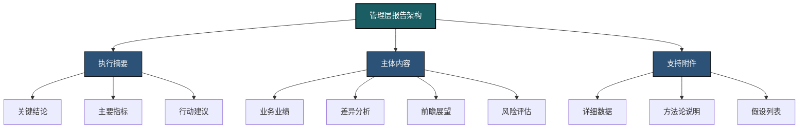
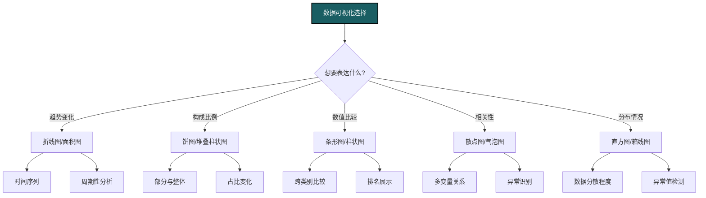
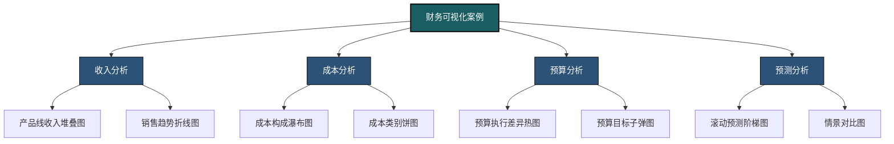
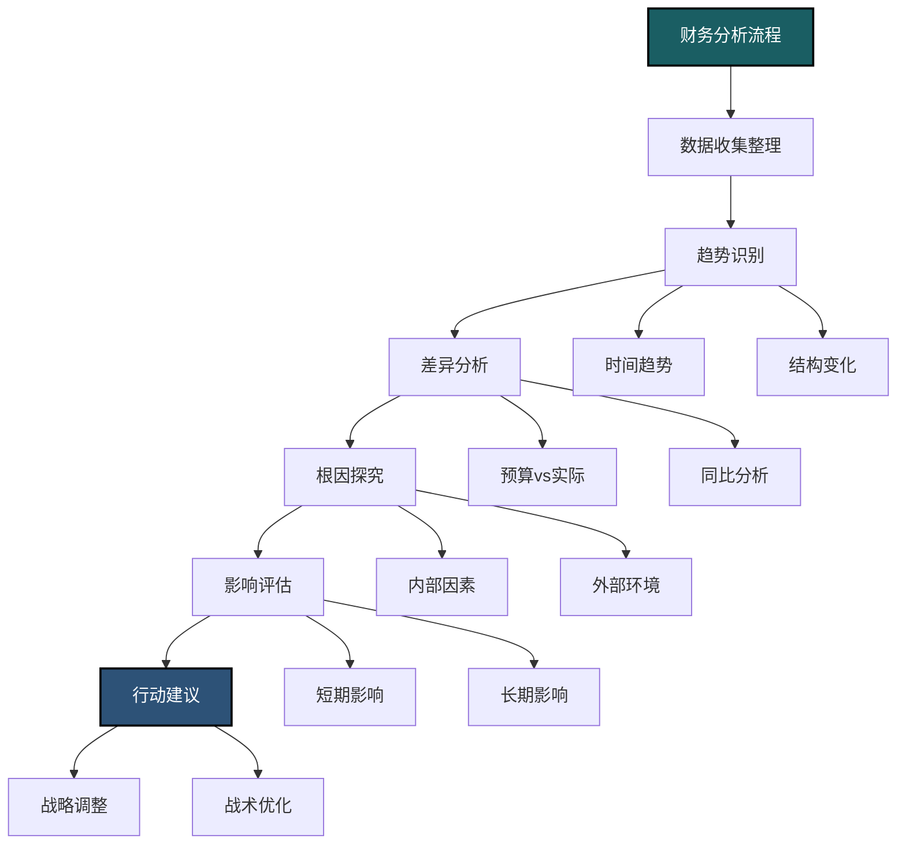
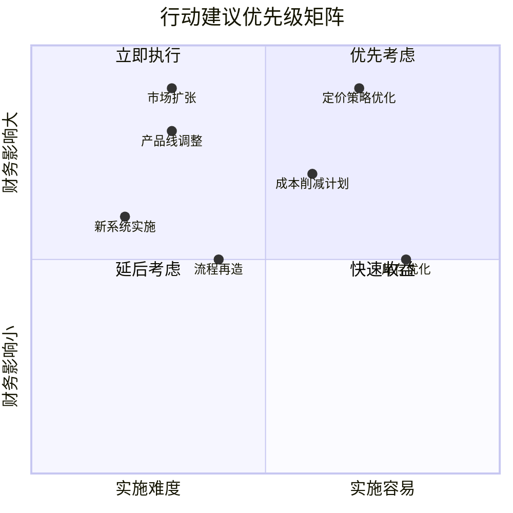
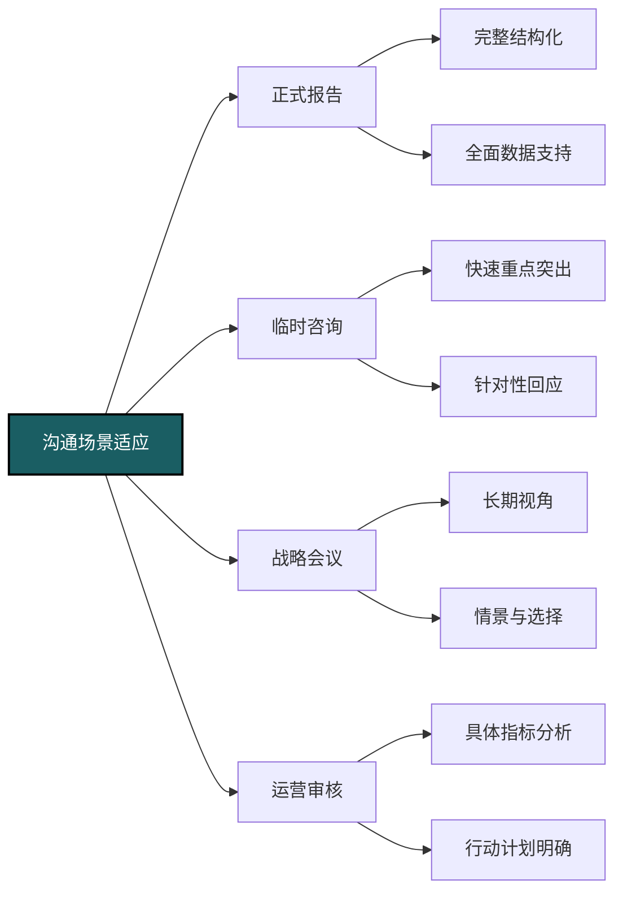
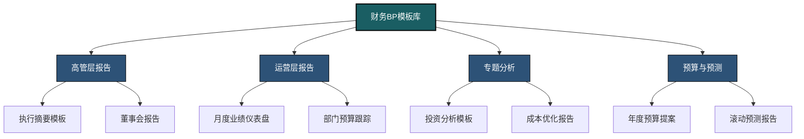
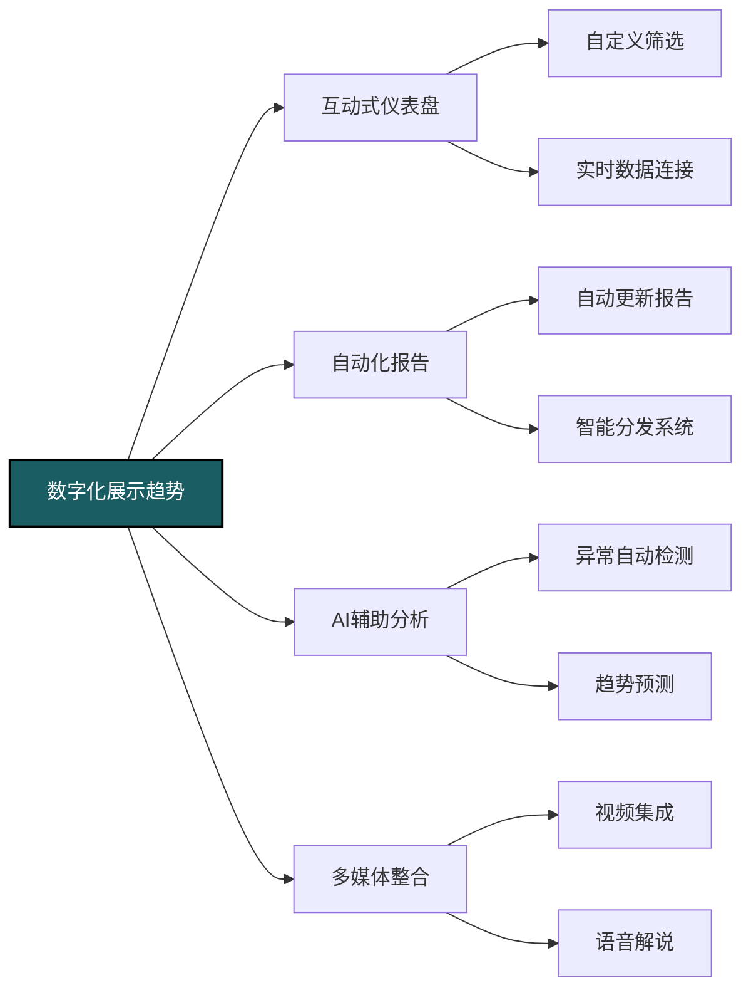

---
{"dg-publish":true,"dg-home":false,"permalink":"/08-财务专业/财务BP/笔记/BP工具与模版/BP展示技巧/","dgPassFrontmatter":true}
---

#财务BP #展示技巧 #沟通 #数据可视化 #管理报告

## 管理层报告设计

财务BP的核心价值在于将复杂的财务数据转化为有价值的业务洞察，并通过有效的报告呈现给决策者。优秀的管理层报告不仅展示数据，更能讲述一个引人入胜的业务故事。

### 报告结构设计

**层次化信息架构**：
- 自上而下的信息组织模式
- 先总结结论，再提供支持细节
- 关键信息优先，辅助信息次之
- 创建清晰的逻辑层次和信息流
- 设计直观的导航和阅读路径

**执行摘要设计**：
- 简明扼要的业务结果概述
- 关键发现与重要警示
- 战略影响与行动建议
- 背景与上下文简介
- 限制在1页内的高价值信息

**主体报告结构**：
- 背景与业务环境
- 当前业绩与关键指标
- 异常分析与问题解释
- 预期趋势与预测
- 风险与机会评估
- 建议行动与下一步

### 内容定制与受众分析

**受众画像分析**：
- 高管层：战略影响与决策支持
- 业务主管：运营细节与执行指导
- 职能部门：专业领域深度分析
- 外部利益相关者：监管与合规重点
- 分析师与投资者：业绩驱动因素与未来前景

**信息需求匹配**：
- 根据决策职责定制内容
- 调整专业术语与技术深度
- 强调受众关心的关键指标
- 提供相关的业务背景
- 预测可能的问题与准备回应

**不同层级报告特点**：
- 董事会报告：高战略性，聚焦大局
- 执行委员会报告：决策导向，综合视角
- 部门管理报告：业务细节，实施焦点
- 运营团队报告：具体指标，行动指导
- 项目评审报告：进度与偏差，风险控制

### 设计风格与品牌

**视觉一致性**：
- 遵循公司品牌指南
- 使用一致的颜色编码系统
- 标准化图表样式与格式
- 统一的字体层次结构
- 保持页面布局一致性

**专业外观设计**：
- 清晰简洁的布局
- 适当的留白与视觉平衡
- 高对比度提高可读性
- 精炼的版式与对齐
- 高质量图表与可视元素

**设计模板系统**：
- 创建标准化报告模板
- 预设样式与格式定义
- 组件库与常用元素
- 季度/月度报告变体
- 项目与特殊分析模板

## 数据可视化技巧

高效的数据可视化是财务BP的核心能力，能够将复杂的财务数据转化为直观、有说服力的视觉信息，帮助决策者迅速把握关键趋势和洞察。

### 可视化选择原则

**图表类型匹配**：
- 趋势分析：折线图、面积图
- 组成分析：饼图、堆叠柱状图、树状图
- 分布分析：直方图、散点图、箱线图
- 关系分析：散点图、气泡图、热力图
- 比较分析：条形图、雷达图、哑铃图

**数据复杂度考量**：
- 简单比较：使用简单条形图
- 多维比较：分组条形图或小倍数图表
- 时间序列：折线图或面积图
- 部分与整体：饼图或树状图
- 复杂关系：矩阵图或网络图

**目的导向选择**：
- 分析型图表：散点图、热力图（发现模式）
- 解释型图表：注释折线图、流程图（解释原因）
- 探索型图表：交互式仪表盘（自由探索）
- 说明型图表：简化图形（传达核心信息）
- 预测型图表：包含预测区间的趋势线

### 设计优化技巧

**简化与聚焦**：
- 移除非必要视觉元素（图表垃圾）
- 减少数据-墨水比例
- 突出显示关键信息点
- 合理使用颜色指引注意力
- 简化标签与图例

**颜色策略**：
- 有意义的颜色编码（红色表示负面）
- 为相似数据使用相似色调
- 对比色强调重要元素
- 考虑色盲友好色板
- 避免使用过多颜色种类

**标注与上下文**：
- 直接标注重要数据点
- 添加基准线与参考值
- 使用注释说明异常或重要变化
- 提供必要的背景信息
- 清晰的标题传达核心信息

**高级设计考量**：
- 数据密度与清晰度平衡
- 多尺度比较（日/月/年）
- 小倍数(small multiples)展示多维度
- 组合图表展示关联指标
- 一致的排序逻辑（数值/字母/时间）

### 常见财务可视化

**收入与利润可视化**：
- 瀑布图：展示利润构成变化
- 复合柱状图：收入与利润率对比
- 环比折线图：同比环比趋势对比
- 堆叠柱状图：产品线/地区收入构成
- 差异热力图：预算与实际偏差分析

**财务KPI仪表盘**：
- 计量表：关键比率指标
- 子弹图：目标与实际对比
- 迷你趋势图：重要指标趋势
- 条件格式表格：多指标监控
- 综合评分卡：平衡计分卡可视化

**预算与预测可视化**：
- 阶梯图：滚动预测变化
- 带区间的预测线：置信区间展示
- 情景对比图：多情景预测比较
- 预算执行热力图：执行偏差模式
- 敏感性分析矩阵：关键变量影响

## 关键信息提炼

财务BP的核心价值在于从海量数据中提炼出对业务真正重要的信息，并将其转化为有意义的洞察和行动建议。

### 洞察发现方法

**结构化分析流程**：
- 从宏观趋势开始，再深入微观
- 比较计划与实际，识别关键差异
- 分析原因，区分内部因素与外部因素
- 评估影响，确定重要性与紧急性
- 形成结论，预测未来影响

**异常识别技巧**：
- 同比/环比/计划对比的重大变化
- 偏离历史模式或季节性预期
- 与行业基准有显著差距
- 关键比率的异常变动
- 预警指标的触发信号

**根因分析方法**：
- 五个为什么(5 Whys)深入分析
- 鱼骨图识别多元因素
- 帕累托分析确定关键因素
- 交叉验证各数据来源
- 区分结构性问题与一次性事件

### 业务故事构建

**叙事框架结构**：
- 情境设定：相关背景与上下文
- 冲突/挑战：问题与困难呈现
- 分析/洞察：数据支持的见解
- 解决方案：建议的行动路径
- 结果预期：预期成果与效益
- 下一步行动：具体可执行计划

**SCQA框架应用**：
- 情境(Situation)：业务背景描述
- 复杂性(Complication)：面临的挑战
- 问题(Question)：需要解决的核心问题
- 答案(Answer)：数据支持的解决方案

**金字塔原理运用**：
- 先总结后细节的思维模式
- 主要论点与支持论据的层次结构
- 横向逻辑组织相关内容
- 纵向逻辑深入论证过程
- 视觉化组织结构提高清晰度

### 行动建议提炼

**决策支持技巧**：
- 提供明确的选项与权衡
- 量化不同选择的财务影响
- 明确决策时间窗口和关键节点
- 提供实施难度与资源需求评估
- 识别潜在风险与缓解策略

**建议格式化呈现**：
- 简明扼要的行动描述
- 预期结果与衡量指标
- 时间框架与里程碑
- 资源需求与关键依赖
- 风险考量与应对预案

**优先级设定框架**：
- 财务影响评分（高/中/低）
- 实施难度评估（难/中/易）
- 时间紧迫性考量（立即/近期/长期）
- 战略一致性分析（高/中/低）
- 二维矩阵可视化（影响力vs.可行性）

## 有效沟通财务计划

财务BP的成功不仅取决于分析质量，更取决于能否有效沟通这些发现和建议，使其转化为实际行动和业务价值。

### 演示技巧与策略

**口头演示结构**：
- 引人注目的开场（关键信息或引人思考的问题）
- 明确的议程与演示路线图
- 核心信息的三点式展开
- 提前处理可能的反对意见
- 明确的行动号召与后续步骤

**幻灯片设计原则**：
- 每张幻灯片一个核心信息
- 6x6原则（最多6行，每行最多6词）
- 图文结合，以视觉为主
- 简化复杂概念，使用类比
- 一致的设计语言与品牌元素

**演示者delivery技巧**：
- 讲故事而非读幻灯片
- 控制语速与停顿创造节奏
- 自信的肢体语言与眼神接触
- 使用具体例子增加说服力
- 准备备用细节但不过度呈现

### 不同场景沟通策略

**正式会议演示**：
- 预先了解与会者背景与期望
- 严格控制时间与节奏
- 准备简洁的讨论导引问题
- 预测问题并准备答案
- 提供书面材料作为后续参考

**一对一财务辅导**：
- 建立共同语言与理解基础
- 使用交互式方法增强参与感
- 根据反馈实时调整深度与节奏
- 确认理解并鼓励提问
- 设定明确的后续行动计划

**跨部门协作沟通**：
- 避免过度使用财务术语
- 强调共同目标与互利点
- 使用业务语言翻译财务概念
- 关注对方部门关心的指标
- 建立共同责任与协作框架

### 处理质疑与异议

**回应问题技巧**：
- 倾听完整问题，不打断
- 认可问题价值与对方关切
- 结构化组织回答（先结论后细节）
- 提供数据支持，但避免过度技术细节
- 主动跟进确认回答是否满足需求

**处理异议策略**：
- 分离情感与事实进行回应
- 找到共同点作为讨论基础
- 运用数据和证据，避免防御姿态
- 提供替代视角而非直接否定
- 设定后续跟进机制解决复杂问题

**困难对话管理**：
- 保持冷静专业的态度
- 关注问题而非人
- 适时使用图表转移至客观数据
- 提供背景与假设增强透明度
- 提议离线讨论复杂或敏感话题

### 影响力与说服技巧

**建立可信度**：
- 展示深入的业务理解
- 准确预测历史事件建立信任
- 承认不确定性与局限
- 保持一致性与专业态度
- 使用第三方数据与行业基准增强权威性

**说服技巧运用**：
- 调整信息以满足听众关切
- 使用社会证明（其他人/部门的认可）
- 创造紧迫感但避免不必要的恐慌
- 展示互惠价值（双赢结果）
- 使用权威背书（高管支持或行业标准）

**持续影响力构建**：
- 定期跟进决策结果验证预测
- 记录成功案例与价值创造
- 与关键利益相关者建立个人连接
- 作为业务伙伴而非财务警察
- 在非正式场合建立关系与信任

## 案例研究

### 战略投资决策报告

**背景与挑战**：
- 大型制造企业考虑海外市场扩张
- 需要评估3个不同国家市场的投资方案
- 复杂的财务模型与多种风险因素
- 董事会需要清晰简明的决策支持
- 技术与财务团队难以达成共识

**解决方案**：
- 创建分层次报告：1页执行摘要+5页核心分析+详细附件
- 开发决策矩阵比较不同市场的关键指标
- 构建情景分析展示不同假设下的结果
- 使用瀑布图展示价值创造来源
- 创建时间线展示投资与回报关系

**可视化策略**：
- 决策树展示主要选择与结果
- 热力图比较不同市场关键指标
- 敏感性分析图表展示关键变量影响
- 现金流图表展示投资与回报时间分布
- 风险-回报散点图定位各投资方案

**成功因素**：
- 将复杂分析简化为关键决策点
- 提供明确的建议而非仅呈现数据
- 有效处理技术与财务视角差异
- 创建备用分析回应预期问题
- 使用通俗语言解释复杂财务概念

### 季度业绩报告改进

**背景与挑战**：
- 零售企业的季度业绩报告流程低效
- 40页PDF报告充满数据但缺乏洞察
- 管理团队难以识别关键问题和优先事项
- 准备报告耗时3周，信息已过时
- 各部门对数据解读不一致导致冲突

**解决方案**：
- 重新设计为分层次报告：核心仪表盘+专题深度分析
- 创建自动化数据流程减少手动处理时间
- 开发标准化异常检测与根因分析框架
- 实施经营回顾会议新结构与议程
- 建立预警系统主动识别关键风险

**改进成果**：
- 报告准备时间从3周减至3天
- 会议时间减少30%，行动项增加50%
- 关键问题识别速度显著提升
- 跨部门共识和协作显著改善
- 决策反应时间从数周减至数天

**关键经验**：
- 精简信息层次比全面细节更有价值
- 自动化是加速报告流程的关键
- 标准化异常分析框架提高一致性
- 强调问题解决而非仅报告问题
- 设计报告与会议结构协同优化效果最佳

## 财务BP沟通工具箱

### 标准化模板库

**高管报告模板**：
- 一页式执行摘要模板
- 董事会财务报告框架
- 战略决策简报模板
- 投资审批演示框架
- 风险评估报告结构

**运营报告模板**：
- 月度业绩评估模板
- 部门预算跟踪表
- 项目财务状态报告
- KPI仪表盘模板
- 差异分析报告框架

**预测与规划模板**：
- 滚动预测演示模板
- 年度预算提案框架
- 长期规划报告结构
- 情景分析展示格式
- 资源配置决策框架

### 可视化资源库

**标准图表库**：
- 财务KPI趋势图模板
- 预算vs实际比较图
- 部门成本构成图
- 收入驱动因素分解图
- 现金流瀑布图模板

**高级可视化资源**：
- 敏感性分析热力图
- 多维度散点图模板
- 财务决策树模板
- 风险-回报矩阵模板
- 战略项目组合图

**品牌一致性元素**：
- 公司色板与字体设定
- 标准图表格式文件
- 图表说明样式指南
- 演示幻灯片模板
- 标准图标与视觉元素

### 沟通提升工具

**结构化分析框架**：
- SCQA框架模板
- 五个为什么分析表
- 机会-成本-风险评估表
- 决策矩阵模板
- 根因分析鱼骨图模板

**演示辅助工具**：
- 关键信息梳理清单
- 常见问题与回答准备表
- 演示节奏与时间控制指南
- 听众分析与定制提示
- 高效会议议程模板

**跟进与执行工具**：
- 决策追踪模板
- 行动项跟踪系统
- 价值实现评估框架
- 反馈收集与整合表
- 持续改进记录模板

## 数字化展示趋势

### 互动式报告技术

**交互式仪表盘**：
- 用户自定义过滤与视角
- 钻取功能支持深入分析
- 实时数据更新与刷新
- 个性化视图与收藏功能
- 协作注释与讨论功能

**移动端报告优化**：
- 响应式设计适应不同设备
- 触摸优化的交互体验
- 简化视图与关键指标聚焦
- 推送通知与异常提醒
- 离线访问与同步功能

**高级可视化技术**：
- 自然语言生成的自动解释
- 预测性分析与趋势投射
- AI驱动的异常检测与突出显示
- 增强现实数据展示
- 自动化报告生成与分发

### 远程协作与展示

**虚拟会议最佳实践**：
- 虚拟演示结构与技巧调整
- 提高远程参与度的互动策略
- 数字白板与实时协作工具
- 虚拟会议室管理与主持技巧
- 混合办公环境下的沟通策略

**协作平台与工具**：
- 实时协作文档与演示
- 财务数据虚拟协作空间
- 视频会议增强功能应用
- 远程决策支持工具
- 跨地域团队协调技术

**异步沟通策略**：
- 录制演示与解说视频
- 自导向式报告与解释层
- 跟进机制与问答管理
- 决策跟踪与文档化流程
- 信息共享与知识管理平台

### 未来趋势展望

**AI辅助分析与沟通**：
- 自动化洞察生成与提炼
- 智能叙事建议与结构化
- 个性化内容推荐与适配
- 对话式分析与探索界面
- 情感分析优化沟通策略

**沉浸式数据体验**：
- 虚拟现实财务数据室
- 3D可视化与空间数据展示
- 多感官数据呈现方式
- 协作式虚拟环境决策
- 数字孪生财务模拟

**可持续报告实践**：
- 精简数据传输与存储
- 按需生成减少冗余报告
- 数字优先减少纸质文档
- 报告生命周期管理
- 集成ESG指标与可持续性报告 