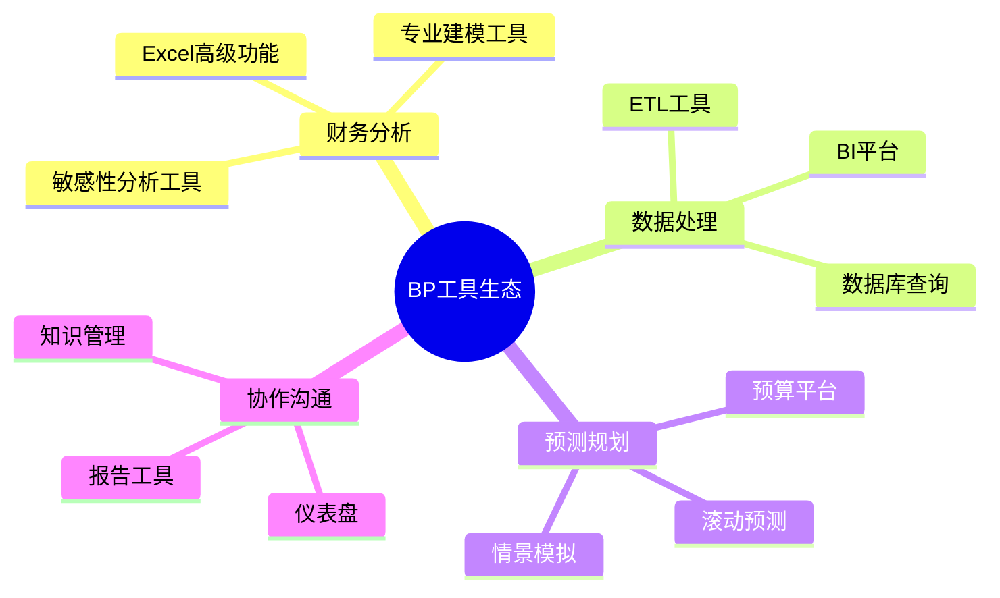

---
{"dg-publish":true,"permalink":"/08-财务专业/财务BP/笔记/BP工具与模版/BP工具与模板/"}
---

# BP工具与模板

#财务BP #工具 #模板 #效率提升 #最佳实践

## 概述

BP工具与模板是财务业务伙伴(Business Partner)工作中的核心资产，能够显著提升工作效率、规范分析流程、确保输出一致性。高质量的工具和模板不仅节省时间，还能提升财务分析的专业水准和决策支持能力。本文档汇总了财务BP工作中常用的各类工具和标准化模板，以及它们的选择、定制与应用方法。

## 核心工具类别

### 财务分析工具

**财务模型构建工具**：
- Excel高级函数与分析工具包
- 财务建模专用插件与加载项
- 敏感性分析与情景模拟工具
- 数据表与透视分析工具集
- 可视化图表制作工具

**数据处理与分析工具**：
- Power Query数据获取与转换
- Power Pivot数据建模与分析
- SQL查询与数据库连接工具
- BI工具(Power BI, Tableau, Qlik)
- Python/R财务分析脚本库

**预测与规划工具**：
- 时间序列预测工具
- 预算编制与规划平台
- 滚动预测自动化工具
- 驱动因素分析模型
- 目标设定与绩效追踪工具

## 标准模板库

### 预算与规划模板

**年度预算模板**：
- 收入预算工作表
- 费用预算模板
- 资本支出规划表
- 人力资源预算模板
- 整合预算汇总表

**滚动预测模板**：
- 13周现金流预测
- 季度滚动预测模板
- 驱动因素更新工作表
- 预测偏差分析模板
- 情景规划工作表

**长期规划模板**：
- 三年/五年战略财务规划
- 投资回报分析模板
- 增长情景建模工具
- 战略项目财务评估
- 长期资源配置规划

### 分析报告模板

**管理报告套件**：
- 经营业绩月度报告
- 财务KPI仪表盘
- 部门业绩评估表
- 偏差分析报告
- 跨期趋势分析报告

**决策支持模板**：
- 投资决策分析框架
- 项目财务评估表
- 定价策略分析工具
- 产品组合评估模板
- 资源优化配置模型

**战略分析模板**：
- 战略选项财务评估
- 竞争对标分析框架
- 价值驱动因素分解
- 业务单元投资矩阵
- 风险-回报评估模型

## 模板设计原则

### 用户体验设计

**界面设计最佳实践**：
- 清晰的视觉层次结构
- 一致的颜色编码系统
- 导航与控制区域分离
- 关键信息突出显示
- 输入与输出区域明确区分

**交互设计要素**：
- 直观的数据输入流程
- 自动计算与即时反馈
- 保护公式与关键单元格
- 内置数据验证与提示
- 错误检测与警告机制

**文档与指引**：
- 内置使用说明与教程
- 关键假设清晰标注
- 数据来源与定义说明
- 常见问题解答区域
- 更新历史与版本控制

### 技术构建标准

**结构设计标准**：
- 模块化工作表架构
- 数据-计算-输出分离
- 一致的命名约定
- 标准化颜色编码
- 单元格格式规范化

**公式编写标准**：
- 公式简化与分步计算
- 使用命名范围与表格
- 动态引用与自动扩展
- 条件逻辑标准化
- 公式注释与文档

**性能优化原则**：
- 减少复杂嵌套公式
- 避免过度使用VLOOKUP
- 优化大型数据集处理
- 减少波动引用数量
- 适当使用数组公式

## 模板定制与管理

### 模板定制流程

**需求分析阶段**：
- 用户需求调研方法
- 现有流程痛点识别
- 关键数据需求确认
- 报告输出要求明确
- 用户能力水平评估

**设计与开发流程**：
- 模板结构概念设计
- 关键功能原型开发
- 用户反馈收集与整合
- 迭代优化与调整
- 文档撰写与教程制作

**测试与部署**：
- 功能测试方法与标准
- 用户接受度测试流程
- 边界条件与异常测试
- 部署与迁移计划
- 培训与支持准备

### 模板治理与管理

**版本控制与管理**：
- 版本编号规范与系统
- 变更日志维护标准
- 模板库组织结构
- 发布与审批流程
- 存档与备份策略

**共享与协作机制**：
- 模板共享平台建设
- 权限管理与访问控制
- 协作编辑与审核流程
- 反馈收集与改进机制
- 最佳实践分享渠道

**模板维护体系**：
- 定期审核与更新流程
- 技术债务管理方法
- 功能升级规划
- 用户支持与问题解决
- 退役与替换决策标准

## 工具应用实践

### 工具选择与评估

**工具评估标准**：
- 功能与需求匹配度
- 技术兼容性与集成
- 可扩展性与自定义能力
- 用户友好度与学习曲线
- 成本与价值平衡分析

**常见工具对比**：
- 通用vs.专业财务工具
- 本地vs.云端解决方案
- 自建vs.购买决策框架
- 开源vs.商业软件比较
- 单点工具vs.集成平台

**工具生态系统设计**：
- 核心工具组合规划
- 工具间数据流设计
- 集成点与接口设计
- 权限与安全架构
- 可扩展性路径规划

### 技能提升与培训

**核心技能图谱**：
- Excel高级技能路径
- 数据分析能力阶梯
- 财务建模专业技术
- 可视化设计能力
- 自动化与编程基础

**培训与能力建设**：
- 结构化学习路径
- 微型学习资源库
- 实践项目与案例学习
- 同伴学习与指导
- 认证与评估体系

**持续改进机制**：
- 技能差距分析方法
- 新技术跟踪与评估
- 工作流程优化反馈
- 效率度量与基准
- 创新实践分享平台

## 案例研究

### 跨国企业预算模板优化

**背景与挑战**：
- 全球30+子公司预算流程不一致
- 数据整合耗时且易出错
- 汇率与跨区域分析复杂
- 版本控制混乱导致决策延迟
- 管理层需要更灵活的分析视角

**解决方案**：
- 设计统一预算模板与数据结构
- 建立集中式数据收集平台
- 实现自动化汇率转换与合并
- 开发多维分析视图与仪表盘
- 构建情景模拟与敏感性分析工具

**成果与经验**：
- 预算周期缩短40%
- 数据错误率降低85%
- 分析深度与广度显著提升
- 决策支持能力获得高度评价
- 跨区域协作与沟通明显改善

### 中型制造企业BI工具应用

**背景与挑战**：
- 手工Excel报告耗时且缺乏深度
- 数据分散在多个系统无法整合
- 管理层决策依赖滞后信息
- 分析能力受限于Excel功能
- 业务洞察难以及时传达

**解决方案**：
- 部署Power BI数据分析平台
- 建立自动化数据连接与处理
- 设计交互式业务仪表盘套件
- 构建预测分析与异常预警模型
- 实现移动端访问与分享功能

**成果与经验**：
- 报告生成时间减少80%
- 数据更新频率从月度提升至日度
- 异常识别提前7-10天
- 决策反应速度显著提升
- 分析人员从数据处理转向业务支持

## 未来趋势与发展

### 智能化工具趋势

**人工智能与机器学习**：
- 预测准确性提升技术
- 异常检测与自动分析
- 自然语言查询与报告
- 智能建议与决策支持
- 自适应模型与学习能力

**自动化与流程优化**：
- 端到端流程自动化
- 智能工作流与审批
- 自动数据收集与整合
- 文档生成与分发
- 自动调整与校准能力

**增强分析能力**：
- 高级可视化与叙事
- 增强现实数据呈现
- 实时协作与注释
- 智能搜索与上下文理解
- 多维度动态分析

### 集成与生态系统

**平台整合趋势**：
- 财务与业务系统无缝集成
- 跨平台数据共享标准
- API经济与微服务架构
- 开放生态系统与插件模式
- 统一工作空间与体验

**协作与知识共享**：
- 社交化财务分析工具
- 知识管理与最佳实践库
- 共创与众包模板开发
- 全球财务团队虚拟协作
- 学习型组织支持工具

**敏捷财务支持模式**：
- 快速部署与迭代模板
- 用户自助分析能力
- 按需定制与即时适应
- 实验与创新支持工具
- 持续反馈与改进机制 