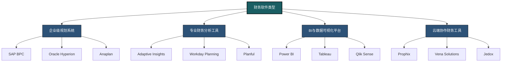
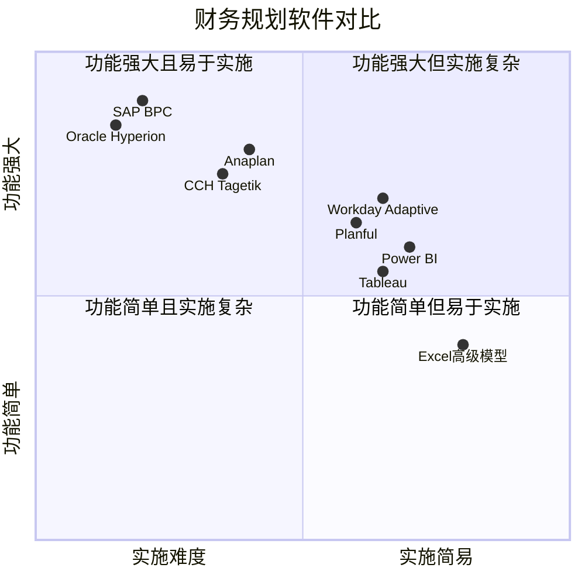
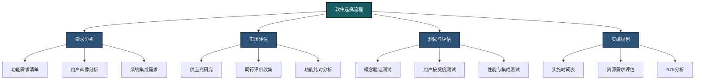
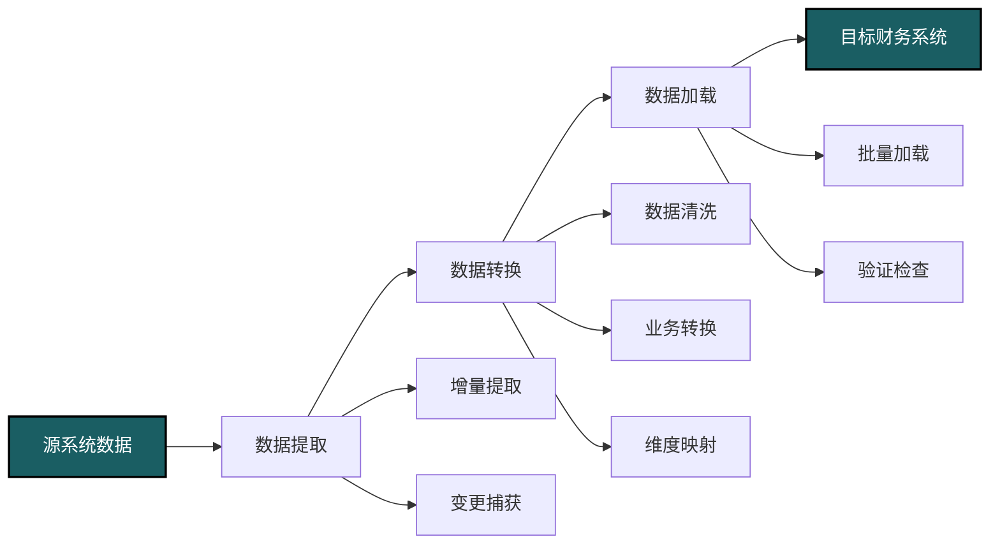
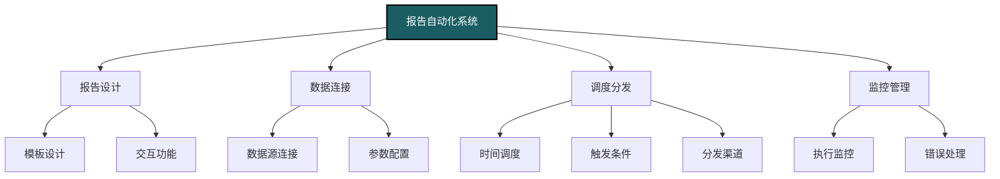
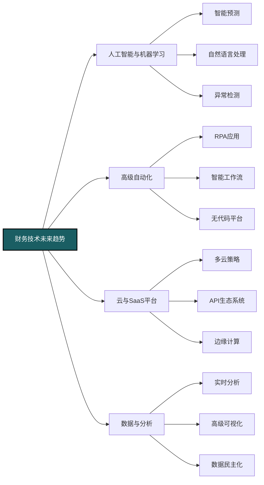

---
{"dg-publish":true,"permalink":"/08-财务专业/财务BP/笔记/BP工具与模版/财务软件应用/"}
---

# 财务软件应用

#财务BP #财务软件 #数据分析 #预算规划 #系统集成

## 财务规划软件概述

财务BP工作中，专业财务软件能够提供超越Excel的规划、分析和报告能力。了解不同类型的财务软件及其适用场景，对于提升财务BP工作效率和专业水平至关重要。

### 财务软件分类

**企业级规划系统**：
- 完整的预算编制与财务规划平台
- 集中式数据库和多用户协作能力
- 强大的工作流和审批功能
- 与ERP和其他企业系统的集成能力
- 代表产品：SAP BPC、Oracle Hyperion、Anaplan

**专业财务分析工具**：
- 聚焦财务模型和分析的专用软件
- 强大的预测和情景分析功能
- 高级敏感性分析和驱动因素建模
- 更友好的财务模型构建体验
- 代表产品：Adaptive Insights、Workday Adaptive Planning、Planful

**BI与数据可视化平台**：
- 数据分析与可视化专长
- 多源数据整合与转换能力
- 交互式仪表盘与动态报告
- 自助式分析与数据探索
- 代表产品：Power BI、Tableau、Qlik Sense

**云端协作财务工具**：
- 基于云技术的财务规划解决方案
- 随时随地访问与协作功能
- 持续更新与低IT维护需求
- 灵活的订阅定价模式
- 代表产品：Prophix、Vena Solutions、Jedox

### 软件应用场景

**企业规模与软件匹配**：
- 大型企业：企业级规划系统（SAP BPC、Oracle Hyperion）
- 中型企业：专业财务分析工具（Adaptive Insights、Planful）
- 小型企业：云端解决方案（Prophix、Vena）或高级Excel模型
- 创业公司：轻量级云工具或专业Excel模型

**业务复杂度考量**：
- 高度复杂业务：多维分析平台（Anaplan、IBM Planning Analytics）
- 中等复杂度：业务智能平台（Power BI、Tableau）与财务规划工具结合
- 标准业务模式：模板化财务规划解决方案
- 特殊行业需求：行业特定解决方案（零售、医疗、制造等）

**使用目的差异**：
- 战略规划：情景规划与长期预测功能（Planful、Adaptive Insights）
- 预算编制：详细的自下而上预算工具（SAP BPC、Oracle Hyperion）
- 报告分析：BI与数据可视化平台（Power BI、Tableau）
- 滚动预测：灵活的预测工具（Workday Adaptive Planning、Jedox）

## 常用财务软件比较

### 企业级规划系统

**SAP BPC (Business Planning and Consolidation)**：
- **优势**：与SAP ERP紧密集成、强大的合并功能、全面的财务规划能力
- **劣势**：实施复杂度高、成本高、用户界面学习曲线陡峭
- **适用场景**：大型SAP客户、需要复杂合并的跨国企业
- **特色功能**：内置财务智能、强大的合规与审计功能、全面的数据治理

**Oracle Hyperion Planning**：
- **优势**：成熟稳定的平台、强大的多维分析、优秀的财务建模能力
- **劣势**：部署周期长、总体拥有成本高、需要专门技术支持
- **适用场景**：大型Oracle客户、复杂财务规划需求企业
- **特色功能**：Essbase多维数据库、灵活的规划工作流、全面报表功能

**Anaplan**：
- **优势**：高度灵活、实时计算引擎、业务用户友好、敏捷实施
- **劣势**：价格较高、缺乏某些传统财务功能、报表功能相对简单
- **适用场景**：需要跨职能规划的中大型企业、快速变化的业务环境
- **特色功能**：HyperModel引擎、连接规划理念、基于角色的多维模型

### 专业财务分析工具

**Workday Adaptive Planning**：
- **优势**：用户友好界面、灵活的建模能力、快速实施周期、强大协作
- **劣势**：复杂合并功能相对弱、定制报表能力有限、高级分析需要技术知识
- **适用场景**：中型企业、成长型公司、寻求快速价值实现
- **特色功能**：Elastic Hypercube技术、自助式财务报表、内置驱动因素建模

**Planful (formerly Host Analytics)**：
- **优势**：平衡的规划与合并能力、直观界面、良好的财务流程支持
- **劣势**：API集成相对有限、某些高级功能需要额外配置
- **适用场景**：中型企业、财务转型项目、混合规划需求
- **特色功能**：SpotLight for Office、动态规划能力、财务语言设计

**CCH Tagetik**：
- **优势**：全面的财务性能管理、强大的合规与披露管理、深度财务功能
- **劣势**：界面较为传统、某些模块复杂度高、成本相对较高
- **适用场景**：注重财务合规的企业、复杂管理报告需求
- **特色功能**：财务智能引擎、内置IFRS/GAAP合规、详细审计跟踪

### BI与数据可视化平台

**Microsoft Power BI**：
- **优势**：与Office生态系统集成、直观的拖放界面、强大的DAX语言、价格合理
- **劣势**：高级功能需要Premium版本、大数据集处理有限制、移动体验不如桌面版
- **适用场景**：Microsoft客户、需要成本效益高的分析解决方案
- **特色功能**：Power Query数据准备、AI分析功能、强大的共享与协作

**Tableau**：
- **优势**：业界领先的可视化能力、直观的数据探索、强大的社区支持
- **劣势**：价格较高、财务特定功能需要定制、与规划工具集成需要额外工作
- **适用场景**：需要卓越数据可视化的企业、数据驱动的组织文化
- **特色功能**：VizQL技术、Story功能、地理空间分析、自然语言查询

**Qlik Sense**：
- **优势**：关联式数据引擎、内存处理能力、强大的数据发现功能
- **劣势**：学习曲线较陡、财务模板有限、定制开发需要专业技能
- **适用场景**：需要深度数据探索的企业、复杂分析需求
- **特色功能**：关联引擎、自由探索、智能搜索、自动关联识别

### 云端协作财务工具

**Prophix**：
- **优势**：全面的财务规划功能、友好的用户界面、良好的协作工具
- **劣势**：高级分析功能相对有限、定制化灵活性不如企业级系统
- **适用场景**：中型企业、财务部门主导的规划流程
- **特色功能**：工作流自动化、版本控制、多维分析视图

**Vena Solutions**：
- **优势**：Excel界面集成、熟悉的用户体验、强大的工作流、良好的协作
- **劣势**：高级数据可视化有限、某些企业级功能需要额外配置
- **适用场景**：Excel密集型环境、寻求结构化协作的团队
- **特色功能**：原生Excel体验、模板库、版本控制与审计

**Jedox**：
- **优势**：Excel集成与Web界面并存、灵活的模型构建、内置ETL工具
- **劣势**：用户社区相对较小、某些行业特定功能有限
- **适用场景**：需要Excel兼容性的企业、自助式建模需求
- **特色功能**：OLAP加速器、预测分析、移动访问能力

## 软件选择考虑因素

### 业务需求评估

**核心功能需求**：
- 预算编制与长期规划能力
- 情景分析与模拟能力
- 报告与仪表盘功能
- 工作流与审批流程
- 合并与集团报告需求

**技术环境考量**：
- 与现有ERP和数据系统的集成需求
- IT架构限制与安全要求
- 内部IT支持能力
- 云端vs本地部署偏好
- 数据量与性能需求

**用户体验要素**：
- 用户界面友好度与学习曲线
- Excel集成程度需求
- 移动访问与远程协作需求
- 自助式分析与报告能力
- 用户培训与支持需求

### 成本与价值分析

**总体拥有成本 (TCO) 因素**：
- 软件许可或订阅费用
- 实施与配置成本
- 培训与变更管理成本
- 持续维护与支持费用
- 未来升级与扩展成本

**投资回报评估**：
- 流程效率提升潜力
- 决策质量改善价值
- 人力资源释放效益
- 错误减少与合规改善
- 战略决策支持价值

**风险评估维度**：
- 实施失败风险
- 用户采纳度风险
- 供应商稳定性与支持
- 数据安全与隐私风险
- 业务连续性与灾难恢复

### 实施与变更管理

**实施方法选择**：
- 大爆炸式vs分阶段实施
- 敏捷实施vs传统瀑布式
- 内部团队vs外部顾问
- 标准模板vs高度定制
- 试点项目与全面推广策略

**变更管理策略**：
- 领导层支持与倡导
- 用户参与与培训计划
- 沟通策略与期望管理
- 抵抗管理与问题解决
- 新旧系统过渡管理

**成功度量指标**：
- 预算编制周期时间缩短
- 报告生成与分析时间减少
- 数据准确性与一致性提升
- 用户满意度与采纳率
- 业务洞见与决策改进评估

## 系统整合与数据导入

### 数据架构与集成策略

**数据源映射**：
- ERP系统数据结构分析
- 会计系统与财务软件映射
- 数据分类与层次结构设计
- 主数据管理与维度设计
- 历史数据转换与迁移策略

**集成架构模式**：
- 直接数据库连接
- API与Web服务集成
- ETL工具与数据仓库
- 中间件与服务总线
- 文件导入导出机制

**数据治理框架**：
- 数据所有权与责任分配
- 数据质量控制机制
- 变更管理与版本控制
- 审计与合规要求
- 数据标准与命名约定

### ETL流程设计

**数据提取策略**：
- 增量vs全量提取
- 调度与触发机制
- 错误处理与重试逻辑
- 源系统性能影响控制
- 提取日志与监控

**数据转换功能**：
- 格式标准化与统一
- 业务规则应用
- 计算字段生成
- 数据清洗与验证
- 汇总与聚合处理

**数据加载优化**：
- 批量加载技术
- 并行处理能力
- 事务处理与完整性
- 性能调优与优化
- 加载验证与平衡检查

### 数据质量与验证

**数据质量维度**：
- 准确性：数据正确性与精度
- 完整性：必要数据的存在性
- 一致性：跨系统数据协调性
- 时效性：数据更新频率与及时性
- 有效性：业务规则符合性

**质量控制技术**：
- 数据验证规则实施
- 异常检测与警报
- 数据平衡与交叉核对
- 重复与冲突识别
- 来源与转换追踪

**自动化验证流程**：
- 预定义验证规则库
- 自动平衡检查
- 异常与错误报告
- 数据质量仪表盘
- 纠正动作工作流

## 自动化报告生成

### 报告类型与设计

**财务报告类别**：
- 管理报表（内部决策支持）
- 法定报表（合规与监管）
- 预算与差异分析报告
- 预测与趋势分析
- 特定分析与即席查询

**报告设计原则**：
- 目标受众与信息需求匹配
- 层次化信息展示（总览到细节）
- 关键信息突出与视觉层次
- 一致的术语与计算方法
- 清晰的上下文与比较基准

**交互式报告功能**：
- 动态筛选与切片能力
- 钻取与钻透分析
- 参数化报告与场景选择
- 自定义视图与个人化设置
- 注释与协作功能

### 报告自动化技术

**调度与分发机制**：
- 基于时间的自动调度
- 事件触发报告生成
- 多格式导出（PDF、Excel、Web）
- 电子邮件分发与通知
- 基于角色的访问控制

**报告生成优化**：
- 报告缓存与预计算
- 增量报告更新
- 并行处理与性能优化
- 报表生成队列管理
- 高峰期资源分配策略

**高级报告功能**：
- 异常突出显示与警报
- 条件格式与阈值指标
- 趋势线与预测分析
- 统计分析与比较
- 注释与管理见解

### 移动与协作功能

**移动报告特性**：
- 响应式设计与移动优化
- 触摸友好交互
- 离线访问能力
- 推送通知与提醒
- 简化视图与关键指标

**协作报告功能**：
- 共享与权限管理
- 注释与讨论功能
- 审批与签核工作流
- 版本比较与历史跟踪
- 团队协作空间

**嵌入与集成选项**：
- 门户与内部网集成
- 第三方应用嵌入
- API访问与扩展
- 单点登录与认证
- 跨平台访问能力

## 案例研究

### 制造企业预算系统转型

**背景与挑战**：
- 全球制造企业使用分散Excel预算流程
- 20多个部门和10个国家的协调困难
- 预算周期长达3个月，严重影响效率
- 版本控制混乱导致错误频繁
- 管理层需要更及时的决策数据

**解决方案选择**：
- 实施Adaptive Insights云端预算系统
- 构建标准化全球预算模板
- 实施自下而上与自上而下结合的预算流程
- 创建集中式审批工作流
- 开发管理层仪表盘与动态报告

**实施流程与挑战**：
- 阶段式实施：先财务部门，再业务部门
- 关键挑战：数据结构差异与标准化
- 变更管理：广泛培训与支持
- 数据集成：与SAP ERP建立自动化连接
- 并行运行：首年与Excel并行以确保平稳过渡

**成果与价值**：
- 预算周期从3个月缩短至5周
- 数据准确性显著提升，错误减少80%
- 预测更新频率从季度提升至月度
- 分析深度与广度大幅增强
- 管理决策响应时间显著缩短

### 金融服务公司BI平台转型

**背景与挑战**：
- 中型资产管理公司依赖手动Excel报告
- 每月报告周期耗时5-7天
- 数据来源分散在多个系统
- 分析能力有限，主要是静态报表
- 客户和管理层需要更及时的投资绩效数据

**解决方案选择**：
- 实施Power BI Premium分析平台
- 创建集中式数据模型与语义层
- 开发标准化报告套件
- 实施每日数据刷新流程
- 创建内部与客户访问门户

**实施流程与挑战**：
- 快速实施：90天完成核心功能
- 关键挑战：数据质量与一致性问题
- 采用增量方法：优先关键报告
- 数据治理：建立数据字典与标准
- 用户采用：培训与支持计划

**成果与价值**：
- 报告生成时间从5-7天减至实时/每日
- 分析师从数据处理转向价值分析
- 客户满意度显著提升
- 运营洞察提升带来6位数成本节约
- 新产品开发决策周期缩短50%

## 未来趋势与发展

### 人工智能与预测分析

**AI驱动预测**：
- 机器学习预测模型
- 异常检测与智能警报
- 自动化数据清洗与准备
- 自然语言处理查询与报告
- 智能预算建议

**高级预测功能**：
- 多变量预测模型
- 外部数据源整合分析
- 自适应预测算法
- 统计概率分析
- 多情景预测与评估

**未来人机协作模式**：
- AI辅助财务决策
- 自动化例行分析任务
- 人类专注高价值解释
- 混合智能分析流程
- 持续学习与改进循环

### 云技术与自动化

**云平台演进**：
- 多云与混合云战略
- 微服务架构与API经济
- 无服务器计算与自动扩展
- 边缘计算与实时分析
- 云原生财务应用生态

**高级自动化技术**：
- 财务机器人流程自动化(RPA)
- 智能文档处理与提取
- 端到端流程自动化
- 自动数据调谐与优化
- 低代码/无代码平台扩展

**集成与互操作性**：
- 开放API标准与平台
- 事件驱动架构
- 实时数据同步
- 混合系统协调
- 企业服务总线发展

### 协作与移动体验

**虚拟协作环境**：
- 财务数字工作区
- 实时多人协作工具
- 虚拟团队空间
- 知识管理与共享
- 跨地域财务协作

**增强现实与可视化**：
- 3D财务数据可视化
- 空间数据分析与展示
- 沉浸式财务审查体验
- 多维数据探索环境
- 情境感知财务分析

**无缝移动体验**：
- 跨设备一致体验
- 语音与手势交互
- 上下文感知分析
- 位置感知报告
- 移动优先设计思维

### 数据安全与隐私

**高级安全策略**：
- 零信任安全架构
- 高级威胁防护
- 行为分析与异常检测
- 持续身份验证
- 数据泄露预防技术

**隐私保护技术**：
- 数据匿名化与假名化
- 区块链审计追踪
- 同态加密与安全计算
- 权限精细控制
- 隐私设计原则

**合规与风险管理**：
- 自动化合规监控
- 嵌入式风险评估
- 监管科技(RegTech)整合
- 实时合规检查
- 全球多区域合规管理 