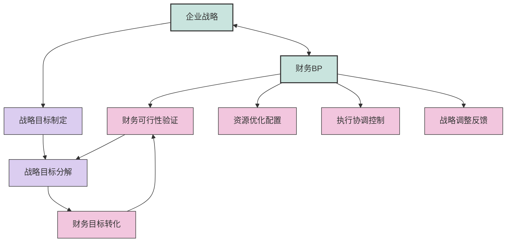
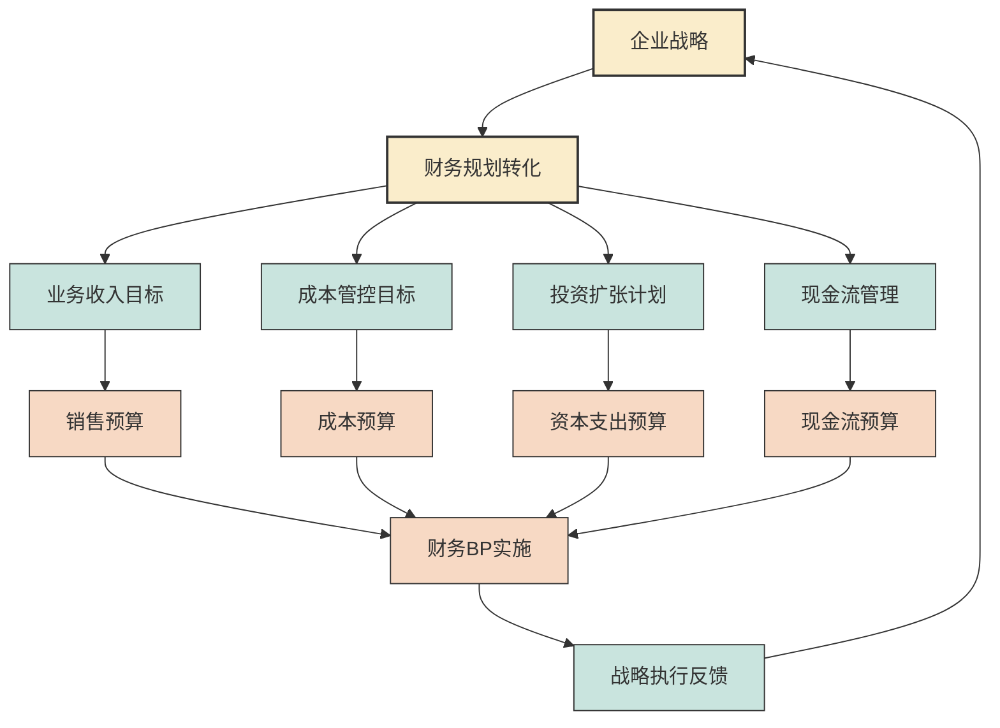

---
{"dg-publish":true,"permalink":"/08-财务专业/财务BP/笔记/基础概念/BP与企业战略/"}
---

# BP与企业战略

#财务BP #基础概念 #企业战略 #战略规划

## 概述

财务BP与企业战略是紧密关联的两个概念，企业战略决定了财务BP的方向和重点，而财务BP则是企业战略的具体落地和量化工具。理解二者之间的关系，有助于制定既符合战略意图又具有可操作性的财务计划。

## 财务BP与企业战略的关系模型

财务BP与企业战略之间存在双向互动关系：
- **战略引导BP**：战略确定了企业的发展方向、竞争定位和关键举措，财务BP需要反映这些战略意图
- **BP支持战略**：财务BP通过资源分配、财务评估和风险管理支持战略的执行和调整
- **循环迭代**：战略制定→财务规划→执行评估→战略调整，形成完整闭环

## 如何将战略目标转化为财务规划

### 战略转化的基本步骤

1. **战略解读**：深入理解企业战略的核心内容和关键方向
2. **目标分解**：将战略目标分解为可量化的财务和非财务指标
3. **资源评估**：评估实现战略所需的财务资源和能力
4. **规划制定**：根据战略要求和资源约束，制定详细的财务计划
5. **执行控制**：建立监控机制，确保财务执行符合战略意图

### 战略目标的财务转化框架

| 战略维度 | 战略目标示例 | 财务指标转化 | 在BP中的体现 |
|---------|------------|------------|------------|
| 市场扩张 | 进入新市场，提高市场份额 | 新市场收入增长率，市场投入回报率 | 营销预算增加，区域销售预测调整 |
| 产品创新 | 推出新产品，提升产品竞争力 | 研发投入比率，新产品收入占比 | 研发预算分配，新产品收入预测 |
| 运营效率 | 提高生产效率，降低运营成本 | 毛利率提升，单位成本下降 | 生产成本预算优化，效率提升项目投入 |
| 人才发展 | 吸引和保留核心人才 | 人均产值，人力成本回报率 | 薪酬预算调整，培训投入规划 |
| 资本结构 | 优化融资结构，提高资本效率 | 资本回报率，负债比率 | 融资计划，资本支出预算 |

## 财务BP的战略价值

### 1. 战略可行性验证
财务BP通过数据模型和情景分析，帮助企业评估战略在财务上的可行性：
- 确定战略实施所需的资金规模
- 评估战略对财务状况的长期影响
- 识别战略执行中的财务瓶颈和风险

### 2. 资源优化配置
财务BP根据战略优先级，合理分配有限的财务资源：
- 确保战略重点领域获得充分资源
- 在战略性项目和日常运营间取得平衡
- 通过预算控制避免资源浪费或错配

### 3. 战略执行的协调机制
财务BP作为各部门的共同语言，协调战略在组织内的一致执行：
- 将战略意图传达至各业务单元
- 使不同部门的目标与整体战略保持一致
- 建立基于财务目标的绩效评估体系

### 4. 战略调整的信号系统
财务BP的执行监控为战略调整提供及时反馈：
- 通过财务偏差识别战略执行中的问题
- 为战略调整提供数据支持
- 对市场环境变化做出快速财务响应

## 实际案例：汽车制造商的战略转型与财务BP

### 背景
某传统汽车制造商决定从燃油车向电动汽车转型，制定了5年战略转型计划。

### 战略目标
1. 电动车产品线扩展：5年内推出10款电动车型
2. 技术领先：建立电池和自动驾驶核心技术
3. 收入结构转变：电动车收入占比从5%提升至40%
4. 保持盈利能力：转型期间仍维持10%以上毛利率

### 财务BP的战略支持

**资本支出规划**
- 电动车生产线改造：投资20亿美元，分5年执行
- 电池研发中心：投资5亿美元，前2年完成
- 传统生产线维护：降低至每年2亿美元（原先4亿美元）

**研发预算分配**
- 电动车平台：研发预算占比从15%提升至40%
- 电池技术：新增研发预算占比15%
- 自动驾驶：新增研发预算占比10%
- 传统技术：研发预算占比从85%降至35%

**收入与利润规划**
- 预测5年电动车收入复合增长率50%
- 接受前3年利润率下降3个百分点
- 第4-5年通过规模效应恢复利润率

**融资战略**
- 发行绿色债券10亿美元
- 战略投资者引入5亿美元
- 传统业务现金流支持10亿美元

**风险管理**
- 建立季度战略执行评估机制
- 制定三种市场接受度情景的应对预案
- 设立技术研发里程碑与资金释放挂钩

### 成效
财务BP成为企业战略转型的核心支持工具：
- 确保了转型过程中资金链安全
- 使各部门明确了转型优先级和资源边界
- 为投资者提供了清晰的转型路径和收益预期
- 建立了灵活的资源调整机制，应对市场变化

## 与其他概念的关系

- [[08-财务专业/财务BP/笔记/基础概念/BP定义与作用\|BP定义与作用]] - 战略支持是财务BP的核心作用之一
- [[08-财务专业/财务BP/笔记/基础概念/BP类型与分类\|BP类型与分类]] - 战略BP是专门用于支持企业战略的一类财务规划
- [[战略BP案例分析\|战略BP案例分析]] - 更多战略BP的实际应用案例（待创建）
- [[08-财务专业/财务BP/笔记/财务预测与模型/敏感性分析\|敏感性分析]] - 评估战略不确定性对财务的影响

## 思考与练习

1. 选择一家你熟悉的企业，分析其公开的战略目标如何转化为具体的财务指标和计划。
2. 讨论在快速变化的市场环境中，如何平衡战略的稳定性与财务BP的灵活性？
3. 分析一个战略转型失败的企业案例，从财务BP的角度找出可能的问题和改进方向。
4. 思考不同行业（如科技、制造、服务业）的企业，其战略与财务BP的关系有何不同特点？ 

