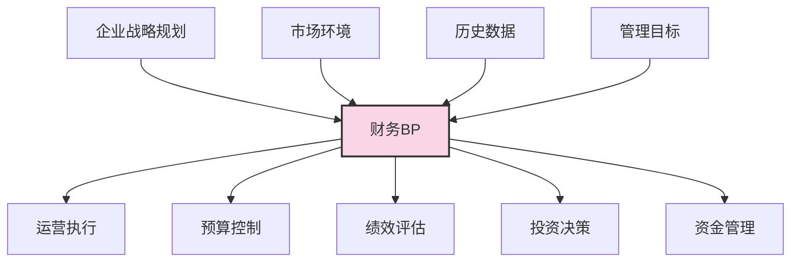

---
{"dg-publish":true,"permalink":"/08-财务专业/财务BP/笔记/基础概念/BP定义与作用/"}
---

#财务BP #基础概念 #定义 

## 定义

财务BP（Business Plan/Budget Planning）是指组织对未来一段时间内财务活动的系统性规划，涉及预期收入、支出、资源分配和财务目标等多个方面。它是企业财务管理的核心工具，用于指导企业的财务决策和资源配置。

财务BP通常包含以下核心要素：
- 收入预测
- 成本预算
- 资本支出计划
- 现金流预测
- 财务报表预测（利润表、资产负债表、现金流量表）

## 作用与目标

财务BP在企业运营中发挥着多重关键作用：

### 1. 战略引导
确保企业的财务活动与总体战略目标保持一致，将战略愿景转化为可衡量的财务目标和计划。这种转化过程帮助管理层理解战略实施所需的财务资源和预期成果。

### 2. 资源配置
为组织内部资源分配提供依据，确保有限资源被合理分配到最能创造价值的业务活动中。通过预算编制过程，企业能够对不同部门、项目或产品线的资源需求进行优先级排序。

### 3. 业绩控制
建立财务目标和标准，用于监控和评估实际业绩表现。财务BP设定了明确的业绩预期，使管理层能够及时发现偏差并采取纠正措施。

### 4. 风险管理
通过预测和情景分析，帮助企业识别、评估和管理潜在的财务风险。这包括市场风险、流动性风险、信用风险等多种形式的财务风险。

### 5. 沟通协调
作为各部门间的沟通工具，促进组织内部不同职能部门的协作与配合。财务BP的编制过程通常需要各部门的参与和信息输入，这种跨部门合作有助于建立共识和目标一致性。

## 财务BP在企业管理中的位置

财务BP是连接战略与执行的关键桥梁：
- **上承战略**：将企业长期战略目标分解为可执行的短期财务目标
- **下接执行**：为日常运营活动提供财务指导和约束
- **横向协调**：协调各业务部门和职能部门的资源需求和预期产出

## 案例分析：科技初创公司的财务BP

某SaaS软件初创公司在A轮融资后，需要制定下一年度的财务BP。

### 背景情况
- 刚完成500万美元A轮融资
- 目前月收入10万美元，环比增长15%
- 员工30人，计划一年内扩张至60人
- 正在开发新产品模块，预计6个月后发布

### 财务BP的关键作用

1. **现金消耗控制**：详细规划人员扩张和研发投入的节奏，确保资金可支撑至少18个月运营

2. **增长资源分配**：在市场推广、产品研发和团队扩张三个方向间合理分配资金，优先保障对增长最关键的投入

3. **融资时间点规划**：基于现金流预测，提前6-9个月开始下一轮融资准备工作

4. **投资者沟通**：提供清晰的业绩指标和里程碑，用于定期向投资者汇报进展

这个财务BP成为公司各部门的行动指南，技术团队了解可用研发预算，销售团队获得明确的收入目标，人力资源部门知道招聘计划和薪资预算。

## 与其他概念的关系

- [[08-财务专业/财务BP/笔记/基础概念/BP类型与分类\|BP类型与分类]] - 不同类型的财务BP适用于不同业务场景和目的
- [[08-财务专业/财务BP/笔记/预算编制基础/预算编制流程\|预算编制流程]] - 财务BP的实际执行过程
- [[08-财务专业/财务BP/笔记/基础概念/BP与企业战略\|BP与企业战略]] - 财务BP如何支持和实现企业战略目标
- [[08-财务专业/财务BP/笔记/财务预测与模型/财务报表预测\|财务报表预测]] - 财务BP的核心产出之一

## 思考与练习

1. 思考你所熟悉的企业可能如何使用财务BP来指导决策？
2. 分析财务BP在不同规模企业（大型企业、中型企业、小型企业）中的侧重点有何不同？
3. 为一个假设的小型企业列出制定财务BP的主要步骤和考虑因素。 