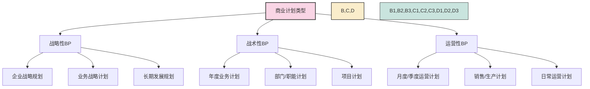
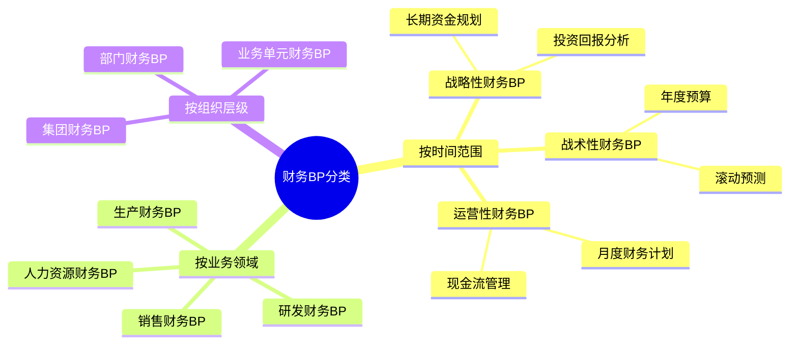

---
{"dg-publish":true,"dg-home":false,"permalink":"/08-财务专业/财务BP/笔记/基础概念/BP类型与分类/","dgPassFrontmatter":true}
---

#财务BP #基础概念 #分类 

## 概述

财务BP可以根据不同的维度进行分类，包括时间范围、用途、编制方法等。了解不同类型的财务BP有助于企业选择最适合自身需求的规划方式，并提高财务规划的针对性和有效性。

## 按时间范围分类

### 短期BP（1年以内）
- **特点**：详细、具体、操作性强
- **目的**：指导日常经营活动
- **周期**：通常分为月度、季度、年度
- **内容重点**：详细收支预算、现金流管理
- **调整频率**：可能每月或每季度审视一次
- **案例**：零售企业的季节性销售预算

### 中期BP（1-3年）
- **特点**：兼顾细节和策略
- **目的**：实现战略性业务目标
- **周期**：通常为2-3年
- **内容重点**：业务扩张计划、产品线调整
- **调整频率**：通常每年审视一次
- **案例**：制造企业的产能扩张计划

### 长期BP（3-5年或更长）
- **特点**：战略性强、细节较少
- **目的**：指导长期发展方向
- **周期**：通常为5年甚至10年
- **内容重点**：行业趋势、市场定位、资本结构
- **调整频率**：通常每2-3年审视一次
- **案例**：能源企业的产业链布局规划

## 按用途分类

### 运营BP
- **定义**：关注企业日常业务活动的财务规划
- **范围**：收入预测、成本控制、人员编制、营运资金
- **时间跨度**：通常为1年或更短
- **主要用户**：各部门管理层、财务部门
- **案例**：餐饮连锁店的年度营业收支计划

### 资本BP
- **定义**：聚焦企业资本支出和投资活动的财务规划
- **范围**：固定资产投资、并购、研发投入、产能扩张
- **时间跨度**：中长期，通常2-5年
- **主要用户**：高管团队、董事会、投资者
- **案例**：制药公司的研发投资组合规划

### 战略BP
- **定义**：服务于企业战略目标的财务规划
- **范围**：业务转型、市场进入、新产品开发
- **时间跨度**：长期，通常3-10年
- **主要用户**：高层领导、董事会、战略投资者
- **案例**：传统零售企业向电商转型的财务规划

## 按编制方法分类

### 自上而下法
- **过程**：由企业高层设定总体目标，再分解至各部门
- **优点**：战略一致性高、效率高、全局视角
- **缺点**：可能缺乏一线人员的实际输入，实操性较弱
- **适用场景**：稳定行业、成熟企业、集权管理模式
- **案例**：大型银行的预算编制

### 自下而上法
- **过程**：各部门先提交需求和计划，再汇总到公司层面
- **优点**：更贴合实际情况、员工参与度高、执行意愿强
- **缺点**：协调难度大、可能与战略目标不完全一致
- **适用场景**：创新型企业、专业服务行业、分权管理模式
- **案例**：咨询公司的年度预算

### 混合法
- **过程**：高层设定目标框架，部门提交详细计划，双向调整
- **优点**：兼顾战略一致性和实操性，平衡各方需求
- **缺点**：过程可能复杂冗长，需要多轮沟通
- **适用场景**：多数中大型企业、矩阵式管理结构
- **案例**：消费品企业的年度营销预算

## 实际案例：不同类型BP的应用场景

### 案例一：快速成长的电商企业
该企业采用**混合法**编制短期**运营BP**和中期**战略BP**：
- **短期运营BP**：精细规划季度营销支出、库存管理和人员扩张
- **中期战略BP**：规划2-3年内的品类扩张、物流中心建设和IT系统升级
- **编制方法**：管理层确定增长目标和资源上限，各部门提交详细计划，经多轮调整后最终确定

### 案例二：大型制造企业
该企业同时使用不同类型的BP满足不同需求：
- **短期运营BP**（自下而上）：各生产基地和业务部门提交年度预算需求
- **中期资本BP**（自上而下）：总部规划3年设备更新和产能扩张计划
- **长期战略BP**（自上而下）：10年产业布局和技术路线图

## 选择适当BP类型的考虑因素

1. **企业发展阶段**：初创期企业可能更关注短期现金流，成熟企业则需要平衡短期和长期规划
2. **行业特性**：资本密集型行业需要更注重资本BP，快速变化的行业可能需要更灵活的短期BP
3. **管理结构**：集权化管理适合自上而下，扁平化组织适合自下而上或混合法
4. **环境不确定性**：不确定性高的环境可能需要更灵活、短期的BP和情景规划
5. **资源限制**：资源紧张的小企业可能选择简化版的BP形式

## 与其他概念的关系

- [[08-财务专业/财务BP/笔记/基础概念/BP定义与作用\|BP定义与作用]] - 不同类型的BP有不同的作用重点
- [[08-财务专业/财务BP/笔记/预算编制基础/预算编制流程\|预算编制流程]] - 不同编制方法会影响具体的预算流程
- [[08-财务专业/财务BP/笔记/基础概念/BP与企业战略\|BP与企业战略]] - 战略BP与企业长期战略紧密相连
- [[08-财务专业/财务BP/笔记/财务预测与模型/财务报表预测\|财务报表预测]] - 各类BP最终都需要转化为财务报表预测

## 思考与练习

1. 针对一家你熟悉的企业，分析它最适合采用哪种类型的BP，为什么？
2. 不同行业的BP侧重点有何不同？举例说明。
3. 在编制方法选择上，为什么大多数企业选择混合法而非纯粹的自上而下或自下而上？ 