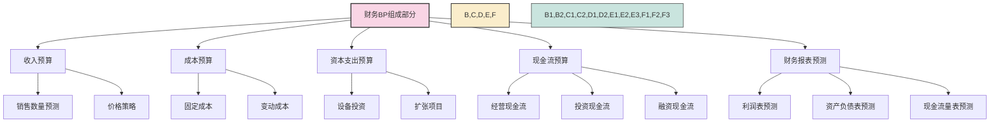
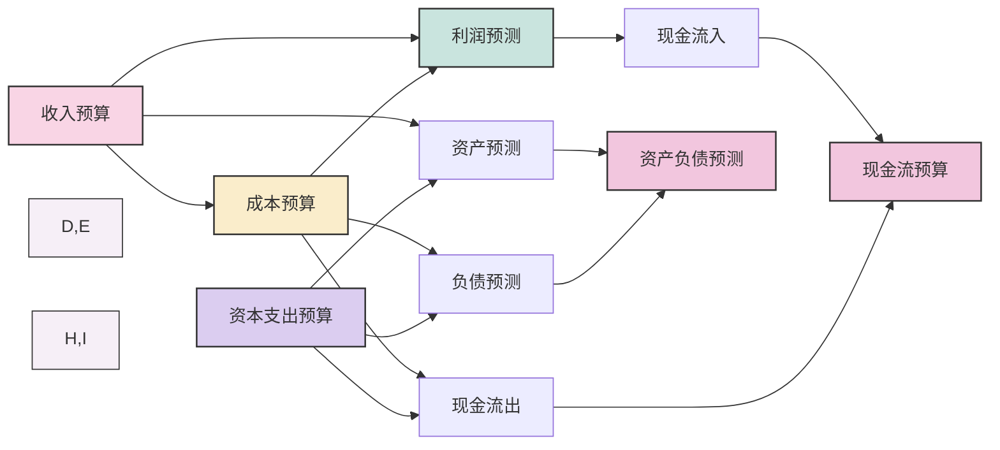

---
{"dg-publish":true,"permalink":"/08-财务专业/财务BP/笔记/基础概念/财务BP的组成部分/"}
---

#财务BP #基础概念 #预算组成

## 概述

财务BP由多个相互关联的部分组成，每个部分负责规划企业财务活动的不同方面。全面了解这些组成部分及其相互关系，是制定有效财务BP的基础。一个完整的财务BP应包含收入预算、成本预算、资本支出预算、现金流预算和财务报表预测等核心要素。

## 财务BP的核心组成框架

## 收入预算

### 定义与目的
收入预算是对企业未来一段时间内预期获得的各项收入进行的规划，旨在预测企业的收入来源、金额和时间分布。

### 主要内容
- **销售收入预测**：按产品/服务、客户类型、地区等维度
- **价格策略**：产品定价、折扣政策、价格调整计划
- **销量预测**：基于市场趋势、销售能力和产能
- **其他收入**：利息收入、租金收入、投资收益等

### 编制方法
- **自上而下法**：基于整体市场规模和市场份额目标
- **自下而上法**：汇总各产品线、销售团队的预测
- **时间序列分析**：基于历史数据的趋势外推
- **驱动因素法**：识别关键销售驱动因素并建立预测模型

### 关键考虑因素
- 市场环境变化
- 竞争态势
- 新产品/服务推出计划
- 季节性波动
- 宏观经济影响

## 成本预算

### 定义与目的
成本预算规划企业在经营过程中预期发生的各种成本和费用，目标是合理控制成本，支持收入目标实现，并提高整体利润率。

### 主要内容
- **直接成本**：原材料、直接人工、外购服务
- **制造费用**：设备折旧、能源消耗、车间管理费用
- **销售费用**：销售人员薪酬、广告促销、物流配送
- **管理费用**：行政人员薪酬、办公费用、咨询服务
- **研发费用**：研发人员、试验设备、专利费用

### 成本分类视角
- **按性质**：固定成本vs变动成本
- **按功能**：生产成本、销售成本、管理成本
- **按责任中心**：部门、项目、产品线
- **按价值链**：采购、生产、销售、售后

### 编制方法
- **零基预算法**：每年重新评估所有成本项目
- **增量预算法**：在上年基础上根据变化调整
- **活动基础成本法**：基于业务活动预测成本
- **标准成本法**：根据标准单位成本和预计数量

## 资本支出预算

### 定义与目的
资本支出预算规划企业对长期资产的投资，包括固定资产购置、无形资产开发、股权投资等，目的是支持企业长期发展和价值创造。

### 主要内容
- **固定资产投资**：厂房建设、设备购置、基础设施
- **技术研发投资**：新产品开发、技术平台建设
- **并购投资**：收购企业、业务整合
- **无形资产投资**：软件系统、专利权、品牌建设
- **维护性投资**：设备更新、系统升级

### 评估方法
- **净现值法**：计算投资产生的贴现现金流现值
- **内部收益率法**：计算投资回报率与资本成本比较
- **回收期法**：评估投资回收所需时间
- **经济增加值**：计算投资产生的经济附加值

### 优先级排序考虑因素
- 战略契合度
- 财务回报率
- 风险程度
- 资源约束
- 时间紧迫性

## 现金流预算

### 定义与目的
现金流预算是对企业现金流入与流出的规划，目的是确保企业在任何时点都有足够的现金流动性，防止出现资金短缺或过剩。

### 主要内容
- **经营活动现金流**：销售收款、采购付款、工资支付等
- **投资活动现金流**：资本支出、投资收回
- **融资活动现金流**：借款、还款、股利支付
- **期初现金余额和期末现金余额**
- **资金缺口或盈余**

### 编制方法
- **直接法**：详细规划每项现金收支
- **间接法**：从利润表出发，调整非现金项目
- **滚动预测**：定期更新最近一段时间的现金流预测

### 关键考虑因素
- 收款政策和付款条件
- 存货周转变化
- 季节性波动
- 突发事件预备金
- 融资可获得性
- 现金持有成本

## 财务报表预测

### 定义与目的
财务报表预测是以上各项预算的综合体现，通过预测的利润表、资产负债表和现金流量表，全面展示企业未来财务状况和经营成果。

### 主要内容
- **预测利润表**：展示预期盈利能力
- **预测资产负债表**：展示预期财务状况
- **预测现金流量表**：展示预期现金流动情况
- **财务比率分析**：流动性、盈利能力、杠杆率等
- **敏感性分析**：关键假设变化对财务影响

### 编制流程
1. 基于收入和成本预算编制利润表
2. 结合资本支出预算和营运资金变化预测资产负债表
3. 整合经营、投资和融资活动预测现金流量表
4. 确保三张报表之间的逻辑一致性
5. 计算关键财务指标并与目标比较

### 应用价值
- 为管理决策提供财务信息
- 评估企业战略的财务可行性
- 识别潜在财务风险和机会
- 与投资者和债权人沟通
- 作为绩效评估的基准

## 各组成部分之间的关系

关键关系：
- 收入预算与成本预算共同决定利润率
- 收入预测影响应收账款和收入相关资产
- 成本预算影响应付账款和成本相关负债
- 资本支出影响固定资产和融资需求
- 各类预算共同影响现金流
- 所有组成部分最终综合反映在三大财务报表中

## 实际案例：零售连锁企业财务BP组成

### 背景
某零售连锁企业计划在下一财年开设10家新门店，同时升级现有20家门店的设备和装修。

### 1. 收入预算
- **现有门店**：基于历史数据预测同店增长5%
- **新开门店**：根据位置和规模预测每家新店月均销售60万元
- **电商渠道**：预测增长25%，占总收入比例提高至30%
- **会员收入**：预测会员数增长15%，会员贡献率提高2个百分点
- **总收入**：预测达到5亿元，同比增长18%

### 2. 成本预算
- **商品成本**：通过优化供应链，预计毛利率提高1个百分点至42%
- **人工成本**：新增门店人员成本1500万元，现有人员成本上涨8%
- **租金成本**：新增门店租金800万元，现有门店租金平均上涨5%
- **营销费用**：总营销预算占收入比例维持在4.5%
- **物流成本**：随销售额增长，但单位成本下降3%
- **总成本**：预计达到4.2亿元，成本收入比84%

### 3. 资本支出预算
- **新店投资**：每家新店平均投资300万元，共3000万元
- **门店升级**：每家改造店平均投资100万元，共2000万元
- **IT系统升级**：投资500万元提升全渠道能力
- **物流中心扩建**：投资1000万元增加50%仓储能力
- **总资本支出**：6500万元

### 4. 现金流预算
- **经营现金流入**：预计5.1亿元（含部分上年应收账款）
- **经营现金流出**：预计4.3亿元（含部分下年预付款）
- **净经营现金流**：8000万元
- **投资现金流出**：6500万元（资本支出）
- **融资现金流入**：银行贷款3000万元
- **融资现金流出**：偿还贷款1500万元，利息支出500万元
- **年度现金净增加**：2500万元

### 5. 财务报表预测
- **利润表**：预测销售收入5亿元，营业利润4000万元，净利润3000万元
- **资产负债表**：年末总资产2.8亿元，权益1.5亿元，资产负债率46%
- **现金流量表**：期末现金余额8000万元，比期初增加2500万元
- **关键指标**：ROE预测20%，现金流覆盖率1.2，每店平均销量提升8%

### 结果应用
- 基于此财务BP，企业决定调整新店开设节奏，先开设5家，效果良好再追加
- 将资本支出与经营现金流相匹配，减少了融资需求和财务风险
- 为各部门设定了明确的预算目标，形成了有效的绩效考核基础

## 与其他概念的关系

- [[08-财务专业/财务BP/笔记/基础概念/BP定义与作用\|BP定义与作用]] - 介绍财务BP的基本概念
- [[08-财务专业/财务BP/笔记/预算编制基础/预算编制流程\|预算编制流程]] - 描述如何编制这些组成部分
- [[08-财务专业/财务BP/笔记/预算编制基础/收入预测方法\|收入预测方法]] - 深入探讨收入预算的具体方法
- [[08-财务专业/财务BP/笔记/预算编制基础/成本预测方法\|成本预测方法]] - 详细介绍成本预算的编制技术
- [[08-财务专业/财务BP/笔记/预算编制基础/资本支出预算\|资本支出预算]] - 专门讨论资本支出预算的评估方法
- [[08-财务专业/财务BP/笔记/预算编制基础/现金流预测\|现金流预测]] - 详细介绍现金流管理和预测技术

## 思考与练习

1. 选择一个你熟悉的行业，分析其财务BP的各组成部分中哪些最为关键，为什么？
2. 讨论收入预算与成本预算之间应保持怎样的平衡关系，过度乐观或保守的收入预测会带来什么问题？
3. 对于不同规模、不同行业的企业，其财务BP的各组成部分的重要性如何变化？提供具体例子。
4. 尝试为一个小型创业公司制定简化版的财务BP，重点关注哪些组成部分，为什么？ 