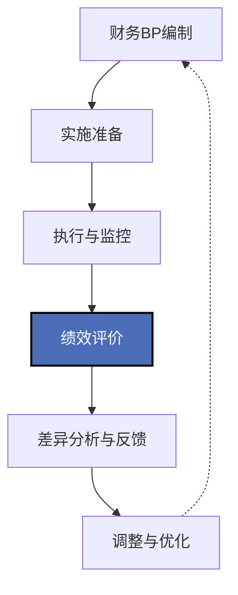

---
{"dg-publish":true,"permalink":"/08-财务专业/财务BP/笔记/实施与评价/财务BP实施与绩效评价/"}
---

#财务BP #实施框架 #绩效评价 #滚动预算 #差异分析

## 概述

财务BP（Business Planning）的实施与绩效评价是将财务规划与预算管理理论转化为企业实践的关键环节。高质量的财务BP不仅需要科学的编制方法，更需要有效的实施机制、动态的调整流程和全面的绩效评价体系。财务BP实施与绩效评价的核心目标是确保预算目标与战略目标一致，促进各部门协同高效运作，同时通过持续的监控、反馈与改进，不断提升企业资源配置效率和经营管理水平。

## 财务BP实施与绩效评价的整体框架

财务BP的实施与评价是一个闭环管理过程，各阶段紧密衔接、相互影响：
- 实施准备阶段确立执行基础与保障机制
- 执行与监控阶段落实预算计划并实时跟踪
- 绩效评价阶段对照目标衡量实际结果
- 差异分析与反馈阶段识别问题并溯源
- 调整与优化阶段根据反馈改进策略与资源配置
- 循环回到下一轮预算编制，形成持续改进机制

## 财务BP实施的关键环节

### 1. 实施准备与动员

**主要工作内容**：
- 预算目标分解与责任落实
- 预算执行计划制定
- 预算授权体系建立
- 相关方培训与沟通
- 支持系统准备与测试

**实施技术要点**：
- 目标分解采用SMART原则
- 通过预算责任矩阵明确各方职责
- 执行计划纳入里程碑管理
- 构建多级预算授权体系
- 制定预算执行手册与操作指南

### 2. 组织保障与协同机制

**主要工作内容**：
- 确立预算管理委员会职责
- 构建跨部门协调机制
- 建立首席预算官(CBO)制度
- 设计预算沟通渠道
- 预算冲突解决机制

**实施技术要点**：
- 高层参与的预算执行例会制度
- 关键部门协同的决策流程设计
- 明确的职责分工与协作界面
- 预算信息共享平台建设
- "例外管理"机制的应用

### 3. 执行监控与预警机制

**主要工作内容**：
- 预算执行进度监控
- 预算偏差预警指标设计
- 关键风险事项监测
- 阶段性执行评估
- 及时纠偏与调整

**实施技术要点**：
- 构建实时预算执行监控体系
- 设置预算红绿灯预警机制
- 关键预算项目的里程碑检查
- 预算执行晨会/周会制度
- 预算异常处理流程标准化

### 4. 动态调整与滚动预算

**主要工作内容**：
- 预算调整触发条件确定
- 调整申请与审批流程
- 滚动预测的频率与范围
- 情境切换的决策机制
- 重大调整的影响评估

**实施技术要点**：
- 预算弹性区间的设定方法
- 分级审批的预算调整权限
- 月度/季度滚动预测机制
- 基于关键指标的预算情境切换
- 动态资源重分配的决策模型

### 5. 数字化支持与系统集成

**主要工作内容**：
- 预算管理系统的部署与应用
- 业务系统与预算系统集成
- 数据采集与处理自动化
- 预算分析工具应用
- 移动端预算监控

**实施技术要点**：
- 企业资源规划(ERP)与预算系统对接
- 业务数据与财务数据的映射规则
- 数据仓库与预算数据集市建设
- 预算分析仪表盘的设计与应用
- 系统权限与数据安全管理

## 财务BP绩效评价的方法与技术

### 1. 预算执行差异分析

**主要分析维度**：
- 收入差异(价格差异与数量差异)
- 成本与费用差异(价格差异与效率差异)
- 利润差异(销售组合、边际贡献等)
- 现金流差异(收支时间与金额)
- 特殊项目与非经常性项目差异

**分析技术方法**：
- 标准差异分析法
- 弹性预算比较法
- 因素分解法
- 差异责任追溯
- 趋势与结构分析

### 2. 多维度绩效指标体系

**指标分类框架**：
- 财务维度指标(ROI、EVA、营收增长等)
- 业务维度指标(市场份额、客户满意度等)
- 运营维度指标(产能利用率、周转率等)
- 学习与创新维度指标(研发投入产出比等)
- 可持续发展维度指标(能源效率、员工留存等)

**指标设计技术**：
- 平衡计分卡(BSC)方法应用
- 关键绩效指标(KPI)设计
- 指标间因果关系映射
- 领先指标与滞后指标结合
- 定量与定性指标平衡

### 3. 预算责任考核与激励

**考核方法**：
- 固定目标与相对目标结合
- 过程考核与结果考核并重
- 部门独立考核与协同考核结合
- 短期业绩与长期发展平衡
- 刚性考核与弹性调整结合

**激励机制设计**：
- 预算达成与绩效薪酬挂钩
- 部门集体激励与个人激励结合
- 即时激励与延期激励并用
- 物质激励与精神激励互补
- 正向激励与负向约束平衡

### 4. 预算绩效诊断与改进

**诊断内容**：
- 预算目标设定合理性
- 预算编制过程有效性
- 预算执行纪律性
- 预算管理机制健全性
- 预算文化认同度

**改进方法**：
- 预算绩效问题树分析
- 标杆企业对标分析
- 预算管理成熟度评估
- 预算流程再造
- 预算文化建设

### 5. 基于价值创造的评价方法

**评价框架**：
- 经济增加值(EVA)分析
- 股东价值分析(SVA)
- 战略价值贡献评估
- 非财务价值创造评估
- 综合价值贡献度量

**实施技术**：
- 价值驱动因素分解
- 资本成本计算与调整
- 长期价值创造与短期业绩平衡
- 无形资产价值贡献评估
- 综合价值创造指数设计

## 行业差异与适应性策略

### 1. 不同行业的绩效评价重点

**制造业**：
- 产能利用率与规模效益
- 标准成本差异分析
- 供应链与库存管理绩效
- 产品质量与生产效率
- 固定资产投资回报

**服务业**：
- 人力资源效能与生产力
- 客户满意度与续约率
- 服务交付及时性与质量
- 服务能力与需求匹配度
- 客户生命周期价值贡献

**科技企业**：
- 研发投入产出效率
- 创新成果转化率
- 用户增长与留存指标
- 产品迭代速度与质量
- 人才价值创造评估

**金融行业**：
- 风险调整后回报率
- 资本配置效率
- 资产质量与负债结构
- 客户价值与渠道贡献
- 合规风控有效性

### 2. 企业生命周期阶段的评价差异

**创业期**：
- 现金流与生存能力
- 客户获取效率
- 产品/服务验证速度
- 核心团队效能
- 资源扩张节奏

**快速成长期**：
- 增长速度与质量
- 规模扩张效率
- 组织能力提升
- 市场份额变化
- 融资与资本效率

**成熟期**：
- 利润率与回报率
- 市场地位巩固
- 运营效率优化
- 创新转型能力
- 股东回报表现

**转型期**：
- 新旧业务平衡
- 转型投入产出
- 组织适应性
- 核心竞争力重塑
- 长期发展潜力

### 3. 不同管理模式的适应性策略

**集中管控型企业**：
- 详细的预算执行监控
- 严格的差异分析与问责
- 完整的预算执行报告体系
- 强调预算纪律与执行力
- 集中决策的预算调整机制

**分散授权型企业**：
- 关注关键指标与边界管理
- 强调预算结果与价值创造
- 部门自主的预算管理权限
- 灵活的资源调配机制
- 创新激励与风险容忍度

**矩阵式管理企业**：
- 多维度责任划分与考核
- 跨部门协同指标设计
- 双重汇报的预算执行机制
- 复合型预算绩效评价
- 协同激励与冲突管理机制

## 财务BP实施与评价中的常见问题及解决方案

### 1. 预算僵化与缺乏弹性

**问题表现**：
- 环境变化时预算无法快速调整
- 过于关注预算达成而非业务实质
- 预算成为部门行为的"天花板"
- 资源无法根据业务需求灵活分配
- 创新尝试受预算约束而受限

**解决方案**：
- 引入滚动预算与动态调整机制
- 设置战略性资源池与弹性预算
- 建立例外管理与快速审批通道
- 实施情景预算与切换条件
- 培养业务导向的预算管理文化

### 2. 部门壁垒与协同不足

**问题表现**：
- 预算资源分配以部门为单位，缺乏跨部门视角
- 各部门为优化自身预算指标而非整体价值
- 预算考核激励各自为政，协同动力不足
- 部门间资源共享与调配困难
- 价值链整体绩效低于各环节绩效之和

**解决方案**：
- 设计跨部门协同指标与联合考核
- 建立资源共享与协作激励机制
- 推行端到端流程的预算管理
- 实施价值链整体绩效评价
- 优化组织结构与预算责任体系

### 3. 短期导向与长期价值失衡

**问题表现**：
- 过度关注短期预算达成，忽视长期投入
- 为达成短期指标而牺牲未来发展
- 研发、品牌等长期投入容易被削减
- 风险管理与可持续发展受关注不足
- 创新项目因短期回报不确定而难获支持

**解决方案**：
- 构建短中长期平衡的指标体系
- 实施滚动预算与长期规划结合
- 设置战略性投入的保护机制
- 引入经济增加值等长期价值评价方法
- 设计针对创新项目的专项预算与评价

### 4. 数据质量与系统集成问题

**问题表现**：
- 预算数据采集延迟与质量不佳
- 业务系统与预算系统割裂
- 预算数据口径与业务数据不一致
- 数据分析能力不足，难以支持决策
- 多系统数据整合困难，影响监控效率

**解决方案**：
- 加强数据治理与质量管控
- 推进业务系统与预算系统集成
- 统一数据标准与维度定义
- 建设预算数据分析平台
- 运用数字化技术提升数据处理效率

### 5. 预算文化与能力建设不足

**问题表现**：
- 预算意识淡薄，执行随意性强
- 预算技能不足，方法运用不当
- 缺乏有效的预算沟通机制
- 预算工作被视为财务部门的任务
- 预算分析结果未能有效转化为管理改进

**解决方案**：
- 加强预算文化建设与宣传教育
- 开展预算管理能力培训
- 优化预算沟通渠道与频率
- 促进业务部门主动参与预算管理
- 建立预算分析应用的闭环机制

## 新兴趋势与最佳实践

### 1. 敏捷预算与持续规划

**发展趋势**：
- 从年度预算转向滚动规划
- 缩短预算周期，提高响应速度
- 动态调整取代固定目标
- 精简预算流程，减少层级审批
- 以价值交付为中心的预算方法

**实践方向**：
- 月度/季度滚动预算的实施框架
- 预算调整授权的下放与简化
- 基于OKR的敏捷预算方法
- 持续规划与快速反馈机制
- 预算敏捷性评估与改进方法

### 2. 数字化与智能预算管理

**发展趋势**：
- 自动化数据采集与处理
- 人工智能辅助预测与分析
- 可视化仪表盘实时监控
- 系统自动预警与建议
- 云端预算协同与移动应用

**实践方向**：
- 预算数字化转型路径设计
- 智能预算系统选型与实施
- 预算大数据分析能力建设
- 自动化报告与决策支持工具
- 预算管理的数字孪生应用

### 3. 超越预算管理的创新方法

**发展趋势**：
- 零基预算法的新应用
- 基于驱动因素的资源分配
- 价值流预算与精益管理结合
- 自组织团队的预算自主权
- 去中心化的资源配置模式

**实践方向**：
- "超越预算"(Beyond Budgeting)原则应用
- 价值驱动的资源动态分配框架
- 敏捷组织的预算治理机制
- 内部市场机制在资源配置中的应用
- 创新项目的风险投资式预算管理

### 4. 整合ESG与可持续发展评价

**发展趋势**：
- ESG目标纳入预算管理体系
- 气候风险与机会的财务量化
- 社会影响与环境效益评估
- 可持续发展指标与财务指标整合
- 利益相关方多元价值评价

**实践方向**：
- ESG指标与预算目标的映射方法
- 可持续发展的财务与非财务价值评估
- 碳预算与碳中和路径规划
- 社会责任投入的回报评价模型
- 面向多元利益相关方的综合绩效报告

## 案例分析：某跨国制造企业的BP实施与评价革新

### 背景介绍

某全球领先的工业设备制造企业，业务遍及50多个国家，年销售额超过100亿美元，面临市场波动加剧、数字化转型以及可持续发展压力。传统的预算管理模式已无法满足快速变化的市场环境和内部管理需求，企业决定全面革新其财务BP实施与评价体系。

### 面临的主要挑战

1. 年度预算周期过长，难以应对市场快速变化
2. 多业务线、多区域的协同效率低下
3. 预算执行监控滞后，难以及时干预
4. 各部门关注点不同，整体战略执行不一致
5. 传统评价方法过于关注短期财务指标
6. 预算调整流程复杂，资源分配缺乏灵活性

### 改革方案与创新实践

**1. 构建"3+9+24"滚动预算框架**

设计并实施三层级滚动预算体系：
- 3年战略规划：每年更新一次，确定中期战略方向
- 9季度滚动预测：每季度更新，关注中期业务趋势
- 24周详细预算：每月更新，聚焦短期执行与资源分配
- 建立三个层级的衔接机制与信息传递渠道
- 不同层级设置差异化的关注重点与决策权限

**成效**：预测准确率提高30%，资源分配效率提升25%，市场变化响应时间缩短60%。

**2. 实施价值驱动的预算绩效评价**

重构预算绩效评价体系：
- 识别各业务线的关键价值驱动因素
- 将价值驱动树与预算目标体系连接
- 设计多维度的绩效评价指标矩阵
- 建立短期业绩与长期价值平衡的考核机制
- 实施"固定+浮动"双目标评价方法

**成效**：各单位价值创造意识显著提升，战略重点项目资源保障率提高40%，长期投资决策质量改善。

**3. 部署全球一体化的数字预算平台**

建设并推广数字化预算管理平台：
- 整合全球业务数据与财务数据
- 构建实时预算执行监控仪表盘
- 开发智能异常检测与预警功能
- 实施统一的预算调整工作流
- 建立预算数据分析与决策支持系统

**成效**：预算数据处理时间减少70%，异常情况识别提前15天，管理决策效率提升50%。

**4. 建立跨部门预算协同机制**

设计新型的预算协同治理架构：
- 成立跨职能预算管理委员会
- 实施端到端业务流程的预算协同
- 建立资源共享与交叉调配机制
- 设计协同绩效指标与联合激励
- 构建预算冲突快速解决机制

**成效**：跨部门协作项目周期缩短35%，资源共享率提高60%，综合运营效率提升25%。

**5. 实施差异化的预算管理模式**

针对不同业务特性实施差异化管理：
- 按业务成熟度与波动性分类管理
- 成熟业务采用精细化预算控制
- 创新业务实施里程碑触发式预算
- 构建快速增长业务的弹性资源池
- 建立特殊项目的专项预算管理机制

**成效**：创新项目成功率提高40%，新业务孵化周期缩短30%，同时保持传统业务稳定性。

### 实施策略与关键成功因素

**1. 分阶段推进策略**

采用三阶段实施法：
- 第一阶段：概念验证与试点(6个月)
- 第二阶段：区域推广与优化(12个月)
- 第三阶段：全球标准化与深化(18个月)
- 每个阶段设定明确的目标与里程碑
- 建立经验总结与持续改进机制

**2. 变革领导与组织保障**

构建有力的变革支持体系：
- 获取高层领导的坚定支持与参与
- 组建专职的变革管理团队
- 选拔并培养变革推动者网络
- 建立跨部门的变革协调机制
- 设计变革进度监控与干预体系

**3. 数字赋能与能力建设**

重视技术支持与人员能力提升：
- 加强数字化基础设施建设
- 开展分层级预算管理培训
- 建立预算管理能力认证体系
- 推广最佳实践与知识分享
- 发展内部预算分析专家队伍

**4. 文化建设与沟通机制**

注重软环境建设与变革沟通：
- 塑造价值导向的预算文化
- 建立多渠道的变革沟通体系
- 设计变革激励与认可机制
- 打造预算透明与信息共享平台
- 持续评估与改进组织氛围

### 实施成果与经验总结

**实施成果**：
- 预算周期从传统的年度预算缩短为动态滚动规划
- 预算准确性显著提高，偏差率从±20%降至±7%
- 资源利用效率提升30%，资本回报率提高5个百分点
- 跨部门协作效率大幅提升，项目周期缩短40%
- 变革两年内整体运营效率提高22%，盈利能力提升15%

**关键经验**：
1. 预算管理变革必须与企业战略和业务特性紧密结合
2. 数字技术是实现预算管理现代化的关键支撑
3. 平衡控制与灵活性是预算管理的核心挑战
4. 文化与能力建设的重要性不亚于工具与流程优化
5. 渐进式实施策略能有效降低变革风险

**对其他企业的启示**：
1. 预算实施与评价应根据企业发展阶段与业务特点定制
2. 动态调整机制是应对不确定性的必要手段
3. 价值导向比控制导向更能激发组织活力
4. 协同预算能有效打破部门壁垒
5. 数字化转型是预算管理升级的必由之路

## 财务BP实施与评价的关键工具与模板

### 1. 预算执行监控工具

- 预算执行差异分析表
- 预算KPI监控仪表盘
- 预算执行例外报告模板
- 滚动预测更新工作表
- 预算调整申请与审批表

### 2. 绩效评价方法工具

- 多维度绩效评价矩阵
- 预算责任与绩效对照表
- 价值驱动树分析模板
- 平衡计分卡设计框架
- 部门/个人绩效评价表

### 3. 管理决策支持工具

- 预算情景分析模型
- 资源优化配置决策矩阵
- 预算调整影响评估模板
- 战略预算资源分配工具
- 预算压力测试模型

### 4. 预算管理提升工具

- 预算成熟度评估量表
- 预算流程优化分析框架
- 预算文化调查问卷
- 预算最佳实践对标工具
- 预算管理改进计划模板

## 与其他财务BP工具的结合

- [[滚动预算方法\|滚动预算方法]] - 实施中的动态预算调整需要滚动预算技术支持
- [[差异分析技术\|差异分析技术]] - 绩效评价的核心工具之一
- [[平衡计分卡\|平衡计分卡]] - 多维度绩效评价的重要方法
- [[08-财务专业/财务BP/笔记/高级分析方法/价值驱动因素分析\|价值驱动因素分析]] - 价值导向的绩效评价基础
- [[预算信息系统\|预算信息系统]] - 数字化实施与评价的系统支撑
- [[预算管理成熟度\|预算管理成熟度]] - 评估预算管理水平的框架

## 思考与练习

1. 分析一家企业如何在保持预算控制力的同时提升预算灵活性，并设计一个兼顾两者的预算实施框架。
2. 探讨不同行业(制造、服务、科技)在预算绩效评价方面的差异，并提出针对性的评价体系设计方案。
3. 思考数字化技术如何改变传统的预算实施与监控模式，并概述预算数字化转型的实施路径。
4. 设计一个解决部门间预算协同问题的方案，包括组织架构、指标设计、激励机制等要素。
5. 研究一个预算管理失效的案例，分析失败原因并提出改进建议。 