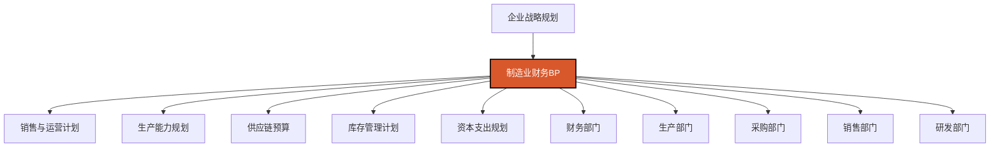

---
{"dg-publish":true,"dg-home":false,"permalink":"/08-财务专业/财务BP/笔记/行业应用/制造业BP特点/","dgPassFrontmatter":true}
---

#财务BP #行业应用 #制造业 #生产预算 #成本控制

## 概述

制造业财务BP（Business Planning）是针对制造行业特性设计的财务规划与预算管理体系。制造业企业普遍具有资本密集、供应链复杂、生产周期长、成本结构固定、库存管理重要等特点，这些特性使得制造业的财务BP在结构设计、重点关注领域、编制方法和执行管理上具有独特之处。制造业财务BP的核心是实现生产计划与销售预测的协调一致，优化资源配置，平衡生产能力与市场需求，确保成本控制与产品质量的平衡，支持企业在复杂多变的市场环境中保持竞争优势。

## 制造业BP在企业管理中的位置

在制造业企业中，财务BP是连接战略目标与日常运营的核心工具，具有以下作用：
- 将销售预测转化为具体的生产计划和资源需求
- 协调生产能力、原材料供应与市场需求
- 优化固定资产投资与产能扩张节奏
- 平衡成本控制、质量管理与运营效率
- 提供多情景分析以应对供应链波动与需求变化

## 制造业的行业特性及对BP的影响

### 1. 资产密集与固定成本高

**行业特点**：
- 大量固定资产投资需求
- 设备折旧占总成本比重大
- 产能利用率直接影响单位成本
- 固定成本与变动成本结构较为复杂
- 资本密集度高，投资回报周期长

**对BP的影响**：
- 固定资产投资预算是核心组成部分
- 产能规划与利用率目标至关重要
- 固定成本分摊需精细化管理
- 盈亏平衡点分析是关键决策依据
- 资本支出回报评估需更严格

### 2. 生产流程复杂且周期长

**行业特点**：
- 生产工艺流程多环节
- 从原材料到成品周期较长
- 工序间紧密衔接与依赖
- 生产计划调整成本高
- 产品工艺更新迭代节奏慢

**对BP的影响**：
- 生产规划需与销售预测深度整合
- 在制品与半成品预算管理复杂
- 需考虑不同生产环节的产能平衡
- 提前期长需更长周期的预算规划
- 生产柔性与预算弹性设计难度大

### 3. 供应链管理复杂

**行业特点**：
- 原材料供应商众多且分散
- 供应链条长且关联度高
- 原材料价格波动对成本影响大
- 供应链风险多元且不确定性高
- 物流与库存管理压力大

**对BP的影响**：
- 原材料采购预算的战略地位提升
- 需建立价格波动的预算调整机制
- 供应商管理成本需纳入预算考量
- 安全库存与战略库存的资金占用规划
- 供应链风险缓释措施的预算支持

### 4. 库存管理要求高

**行业特点**：
- 原材料、在制品、成品多级库存
- 库存资金占用规模大
- 库存水平直接影响交付能力
- 库存周转与现金流紧密相关
- 过度库存与缺货风险并存

**对BP的影响**：
- 多层次库存规划是预算重点
- 库存占用资金需纳入财务预算
- 建立库存目标与生产计划联动机制
- 季节性生产与销售的库存预算差异
- 库存优化是资金效率提升关键

### 5. 质量控制与合规成本高

**行业特点**：
- 产品质量要求严格
- 行业标准与认证众多
- 质量缺陷成本潜在影响大
- 环保与安全法规日趋严格
- 产品责任风险持续增加

**对BP的影响**：
- 质量管理投入需专项预算
- 合规成本需系统性预算规划
- 质量风险缓释的财务准备
- 环保与安全投入的长期规划
- 质量改进与成本控制的平衡预算

## 制造业BP的主要组成部分

### 1. 销售预测与生产计划预算

**特点与重点**：
- 销售与运营计划(S&OP)整合
- 产品组合与产量规划
- 生产计划的季节性调整
- 交货周期与能力承诺
- 生产灵活性规划

**预算技术要点**：
- 销售预测与生产计划的协同模型
- 产能约束下的优化生产排程
- 基于销售弹性的生产调整机制
- 产品组合利润贡献分析
- 瓶颈资源识别与产能规划方法

### 2. 直接材料与采购预算

**特点与重点**：
- 原材料需求计划(MRP)
- 供应商管理与价格策略
- 战略采购与战术采购分离
- 原材料价格波动应对
- 供应链风险管理

**预算技术要点**：
- 物料需求计划与采购预算转换
- 原材料价格波动情景分析
- 供应商管理成本分摊方法
- 库存优化与采购批量决策模型
- 关键材料储备策略的财务评估

### 3. 直接人工与生产人员预算

**特点与重点**：
- 生产人力规划与班次安排
- 正常工时与加班安排
- 劳动生产率目标
- 工人技能结构规划
- 临时工与正式工配比

**预算技术要点**：
- 生产计划转化为工时需求模型
- 直接人工生产率目标设定方法
- 工时平衡与成本效率分析
- 不同产品生产人工分配模型
- 人员利用率与生产弹性平衡策略

### 4. 制造费用预算

**特点与重点**：
- 间接生产人员费用
- 设备维护与能源消耗
- 生产管理费用
- 辅助生产部门费用
- 生产场地费用

**预算技术要点**：
- 固定与变动费用区分方法
- 制造费用分配基础选择
- 产能利用率对单位制造费用的影响分析
- 成本中心责任制与预算控制
- 制造费用标准制定与差异分析

### 5. 产品成本预算

**特点与重点**：
- 标准成本制定
- 产品成本结构分析
- 成本改善目标设定
- 新产品成本预算
- 产品生命周期成本管理

**预算技术要点**：
- 标准成本制定与修订机制
- 成本差异分析与管理报告体系
- 价值工程在成本预算中的应用
- 产品成本下降曲线设计方法
- 多品种生产的共同成本分摊

### 6. 质量与合规预算

**特点与重点**：
- 质量控制与检测投入
- 环保与安全合规支出
- 质量改进项目投资
- 质量保证体系维护
- 产品责任风险准备

**预算技术要点**：
- 质量成本分类与量化方法
- 质量投入与质量改进效益评估
- 合规成本的行业对标分析
- 风险事件财务影响评估
- 质量改进项目的ROI测算

### 7. 资本支出预算

**特点与重点**：
- 产能扩张与更新改造
- 设备技术升级计划
- 自动化与智能制造投资
- 生产基地布局优化
- 生产能力与柔性平衡

**预算技术要点**：
- 产能投资的阶梯成本模型
- 设备更新与维护经济性分析
- 自动化投资的财务回报评估
- 生产布局优化的成本效益分析
- 战略性产能储备的价值评估

## 制造业BP的编制方法与技术

### 1. 销售预测驱动的生产规划方法

**方法与步骤**：
1. 分解销售预测至产品族、规格与时间维度
2. 评估销售预测可靠性与波动风险
3. 将销售预测转化为生产量需求
4. 考虑库存策略与安全库存要求
5. 验证生产需求与产能约束的匹配度
6. 制定主生产计划与物料需求计划
7. 建立生产计划调整与异常处理机制

**技术要点**：
- 销售与运营计划(S&OP)流程整合
- 需求预测精度评估与校准方法
- 产能约束条件下的生产优化模型
- 库存策略的财务影响量化
- 生产计划波动成本的评估与控制

### 2. 基于作业的制造成本预算

**方法与步骤**：
1. 梳理核心生产作业与辅助作业
2. 识别作业成本动因与资源消耗关系
3. 设定作业标准与效率目标
4. 按产品品种分配作业成本
5. 构建多层次成本汇总体系
6. 设计作业效率改进目标与成本节约计划
7. 建立作业成本监控与差异分析机制

**技术要点**：
- 作业成本法(ABC)在制造业的应用
- 作业效率指标与财务指标的关联
- 多品种生产下的成本分配模型
- 标准成本制定与维护方法
- 基于价值流的成本分析技术

### 3. 弹性生产与库存优化预算

**方法与步骤**：
1. 分析产品需求的确定性与波动性
2. 区分标准品与定制品生产策略
3. 设计不同产品的库存策略与目标水平
4. 评估生产弹性选项与成本影响
5. 平衡库存成本与缺货成本
6. 制定季节性生产与库存计划
7. 建立库存预警与生产调整机制

**技术要点**：
- 经济订货批量(EOQ)与经济生产批量(EPQ)模型
- 库存成本构成与量化方法
- 生产柔性价值的财务评估
- 安全库存水平的优化方法
- 库存周转率目标与现金周期的平衡

### 4. 产品生命周期的成本管理预算

**方法与步骤**：
1. 梳理产品组合与生命周期阶段
2. 区分新产品导入、成熟产品与退出产品的管理策略
3. 对新产品设定成本下降曲线与目标
4. 为成熟产品制定成本改善与优化计划
5. 管理退出产品的库存清理与资源转移
6. 平衡产品组合的资源分配与盈利贡献
7. 建立产品成本竞争力评估体系

**技术要点**：
- 目标成本法在新产品开发中的应用
- 价值工程与成本改善技术
- 产品成本下降曲线设计方法
- 产品组合管理的财务评价模型
- 产品退出决策的财务分析框架

### 5. 多情景与敏感性分析技术

**方法与步骤**：
1. 识别关键不确定性因素与假设
2. 构建基准(Base)、乐观(Upside)、保守(Downside)情景
3. 分析产能利用率、原材料价格、订单量等关键变量的敏感性
4. 评估不同情景下的财务影响与风险
5. 制定应对措施与资源调整计划
6. 建立情景触发指标与预警机制
7. 将预算弹性与决策授权结合

**技术要点**：
- 成本结构敏感性分析矩阵
- 盈亏平衡点分析的动态应用
- 情景规划与财务压力测试方法
- 供应链中断风险的财务影响评估
- 预算调整的触发机制与程序设计

## 制造业细分行业BP特点

### 1. 离散制造业（机械设备/电子产品）

**行业特点**：
- 产品品种多、批量小至中等
- 生产工艺复杂、工序多
- 订单驱动与库存生产并存
- 产品更新换代较快
- 客户定制化需求明显

**BP重点**：
- 柔性生产能力规划与投资
- 复杂产品的成本精细化管理
- 新老产品交替的资源配置
- 订单响应与规模效益平衡
- 研发与生产协同的预算机制

### 2. 流程制造业（化工/钢铁/造纸）

**行业特点**：
- 连续性生产、规模效应显著
- 原材料成本占比高
- 能源消耗大且敏感
- 产能利用率至关重要
- 环保与安全要求高

**BP重点**：
- 产能利用率优化与边际贡献分析
- 原材料战略采购与价格风险管理
- 能源效率提升与成本控制
- 环保合规投入的长期规划
- 大修与停产的影响预算

### 3. 消费品制造业（食品/饮料/日化）

**行业特点**：
- 产品周期短、季节性明显
- 品牌与营销投入大
- 分销渠道多元复杂
- 消费者偏好变化快
- 食品安全与质量要求高

**BP重点**：
- 需求预测精准度与库存优化
- 产品组合与SKU优化预算
- 营销费用与生产规模的协调
- 季节性需求的生产与库存策略
- 灵活包装线的投资回报评估

### 4. 高科技制造业（半导体/精密仪器）

**行业特点**：
- 技术密集、研发投入大
- 设备投资规模高且更新快
- 良率管理直接影响成本
- 产业链分工精细
- 知识产权保护重要

**BP重点**：
- 研发与制造协同的预算机制
- 设备投资规划与技术路线图匹配
- 良率提升的财务价值评估
- 知识产权保护的投入与回报分析
- 技术更新与产能扩张节奏规划

### 5. 汽车制造业

**行业特点**：
- 供应链体系庞大且复杂
- 模块化与平台化生产
- 研发周期长与投入大
- 整车厂与零部件厂协同
- 全球化生产与本地化运营

**BP重点**：
- 平台战略的成本分摊与收益分析
- 研发资本化与产品成本关系
- 供应商管理与成本控制协同
- 全球产能布局与区域化预算
- 新能源转型的投资与回报规划

## 案例分析：某工业装备制造企业的财务BP实践

### 背景介绍

某中型工业装备制造企业，主要生产工业自动化设备与精密机械零部件，年销售额约15亿元，员工1500人。公司拥有三个生产基地，产品销往国内外市场。面临全球竞争加剧与数字化转型双重压力，公司需要通过精细化的财务BP提升运营效率与市场响应能力。

### BP面临的主要挑战

1. 定制化订单与标准化生产的平衡
2. 多产品线下的资源优化配置
3. 原材料价格波动对成本的影响
4. 产能扩张与利用率波动的管理
5. 全球供应链带来的不确定性
6. 数字化转型投入与收益的平衡

### BP框架设计

企业构建了"PVL"财务BP框架：

**P-生产导向(Production-oriented)**：
- 以生产计划为核心编制预算
- 强调生产能力与销售需求的匹配
- 注重生产柔性与规模效益平衡

**V-价值链整合(Value-chain integrated)**：
- 将研发、采购、生产、销售纳入统一预算体系
- 注重部门间协同与价值链优化
- 关注不同价值链环节的资源配置效率

**L-精益思维(Lean-thinking)**：
- 贯彻精益生产理念
- 追求资源利用最大化与浪费最小化
- 持续改进机制融入预算过程

### 具体BP实践与方法

**1. 订单管理与生产计划整合**

实施"订单-库存-生产"三位一体预算：
- 分析历史订单模式与未来销售预测
- 区分标准品MTS与定制品MTO的生产模式
- 建立标准品安全库存水平与定制品生产能力预留
- 制定混合生产模式下的资源分配策略
- 设计订单波动对生产计划的调整机制

**成效**：订单交付及时率从85%提升至96%，生产计划调整频率降低40%，产能利用率提高15%。

**2. 精益生产与成本管理整合**

采用"价值流成本管理"方法：
- 识别核心价值流与辅助价值流
- 按价值流重组成本结构与预算体系
- 设定价值流关键绩效指标(KPI)与目标
- 建立基于价值流的成本改善闭环机制
- 价值流团队与预算责任制结合

**成效**：制造周期缩短30%，在制品库存降低35%，生产直接成本降低8%，产品质量同步提升。

**3. 研发与制造协同预算**

建立"设计到制造"(DFM)预算机制：
- 新产品开发阶段导入制造成本目标
- 研发设计与生产工艺共同参与成本预算
- 建立设计决策对制造成本影响的评估模型
- 在研发阶段设置成本审核节点
- 实施产品全生命周期成本管理

**成效**：新产品上市后成本偏差率从15%降至5%，设计变更减少40%，产品利润率平均提高6个百分点。

**4. 多场景采购与供应链预算**

实施"多情景弹性采购"策略：
- 将供应商分为战略、关键与一般三类差异化管理
- 建立核心原材料的价格波动情景预算
- 设计供应中断风险应对的预算储备
- 平衡长期合约与短期灵活性的采购组合
- 全球与本地供应链的成本效益分析

**成效**：原材料成本降低12%，供应链风险事件影响降低50%，库存周转率提高25%，采购质量稳中有升。

**5. 智能制造与数字化转型预算**

采用"阶段式智能升级"预算策略：
- 将数字化转型分解为多个可量化收益的小项目
- 制定每个项目的投入预算与收益目标
- 实施"先小步、后加速"的资源分配模式
- 建立数字化转型项目的资金池与成功案例推广机制
- 设计数字技术应用的投资回报评估框架

**成效**：制造数据可视化率提升80%，生产效率提高20%，质量缺陷率降低30%，能源消耗降低15%。

### BP执行监控与调整机制

**1. 基于价值流的绩效监控**

建立价值流为核心的绩效管理体系：
- 价值流KPI与预算目标直接关联
- 日/周/月三级绩效监控机制
- 生产现场可视化管理与预算执行
- 价值流团队的集体激励机制
- 差异分析与持续改进循环

**2. 滚动预测与快速响应**

实施敏捷预算调整机制：
- 12个月滚动预算，月度微调、季度重审
- 建立预算执行的早期预警指标体系
- 设置产能、原材料、市场三大关键触发点
- 预算调整授权分级与快速决策渠道
- 实施情景预算切换的条件与流程

**3. 精益改善与预算整合**

将精益改善纳入预算闭环：
- 精益改善目标直接纳入部门预算
- 建立改善项目的资源池与激励机制
- 实施改善成果的标准化与横向推广
- 设置持续改善的预算调整反馈机制
- 跨部门精益团队与预算执行协同

### 案例总结与启示

**实施成果**：
- 三年内毛利率提升5个百分点，固定资产周转率提高30%
- 订单响应时间缩短40%，产品交付周期降低35%
- 库存周转率提高50%，营运资金需求降低20%
- 研发-生产协同显著提升，新产品上市时间缩短45%
- 数字化转型推动管理决策效率提升60%

**关键经验**：
1. 将精益制造理念与财务BP体系深度融合
2. 实现销售预测、生产规划、采购管理的端到端协同
3. 注重产品全生命周期的成本管理与预算控制
4. 建立灵活响应市场变化的预算调整机制
5. 通过数字技术支持预算编制与执行的精准度

**对其他制造企业的启示**：
1. 制造业BP需突破传统部门壁垒，实现价值链整合
2. 产能利用率与资源效率是制造业BP的核心关注点
3. 向精益化、柔性化、智能化转型是提升BP效能的关键
4. 全球供应链环境下的风险管理应纳入BP体系
5. 研发与生产的协同预算是保持竞争力的关键因素

## 制造业BP的未来发展趋势

### 1. 数字孪生驱动的预算模型

**趋势特点**：
- 虚拟工厂与数字孪生技术应用
- 生产模拟辅助预算决策
- 实时数据反馈与预算动态调整
- 预算场景的可视化与交互式分析
- 生产-财务数据一体化

**BP创新方向**：
- 构建基于数字孪生的预算决策平台
- 开发生产模拟与财务影响评估工具
- 建立生产数据与预算执行的实时连接
- 实施虚拟测试新预算方案的效果
- 优化基于数字化的产能规划方法

### 2. 智能工厂与柔性预算管理

**趋势特点**：
- 智能制造技术全面应用
- 柔性生产与混线生产普及
- 产品定制化与规模化并存
- 生产资源动态调配能力提升
- 自动化与人机协作并行

**BP创新方向**：
- 设计适应柔性生产的动态预算模型
- 建立混线生产的成本分配新方法
- 开发定制化与批量化混合生产的预算框架
- 优化智能设备投资回报分析方法
- 构建人机协作环境下的生产力预算

### 3. 绿色制造与可持续发展预算

**趋势特点**：
- 碳排放管控日趋严格
- 能源利用效率要求提高
- 循环经济理念普及
- 绿色供应链建设加速
- ESG因素影响投资决策

**BP创新方向**：
- 将碳排放目标纳入预算KPI体系
- 建立能源效率与成本优化的双重预算
- 开发循环经济模式下的成本收益模型
- 构建绿色供应链管理的财务评价体系
- 设计环境投资与财务回报的平衡框架

### 4. 全球价值链优化与区域化

**趋势特点**：
- 全球供应链风险管理升级
- 区域化生产与本地化供应链兴起
- 贸易政策不确定性增加
- 供应链韧性成为关键目标
- 制造服务化趋势明显

**BP创新方向**：
- 开发供应链韧性投资的价值评估模型
- 构建区域化生产网络的优化配置框架
- 设计应对贸易政策变化的预算调整机制
- 建立制造服务化转型的财务规划方法
- 优化全球与本地供应链的平衡决策模型

### 5. 人工智能赋能的预算智能化

**趋势特点**：
- AI辅助预算决策普及
- 预测分析技术广泛应用
- 自动化预算调整机制发展
- 复杂性建模能力提升
- 数据驱动的决策文化形成

**BP创新方向**：
- 应用机器学习优化销售预测准确度
- 开发AI辅助的生产规划与资源分配工具
- 构建智能异常检测与预算风险预警系统
- 建立基于因果推断的预算情景自动生成
- 设计自适应的智能预算调整框架

## 与其他财务BP工具的结合

- [[08-财务专业/财务BP/笔记/行业应用/服务业BP特点\|服务业BP特点]] - 制造企业服务化转型可借鉴服务业BP经验
- [[08-财务专业/财务BP/笔记/行业应用/科技企业BP特点\|科技企业BP特点]] - 高科技制造业可结合科技企业创新导向的BP方法
- [[生产预算编制\|生产预算编制]] - 制造业BP的核心组成部分
- [[供应链预算管理\|供应链预算管理]] - 制造业供应链复杂性需专门的预算管理工具
- [[08-财务专业/财务BP/笔记/预算编制基础/资本支出预算\|资本支出预算]] - 制造业固定资产投资需科学的资本预算方法
- [[08-财务专业/财务BP/笔记/预算编制基础/成本预测方法\|成本预测方法]] - 制造业成本控制是BP的关键环节

## 思考与练习

1. 分析一家制造企业如何平衡产能规划与市场波动，设计一个兼顾稳定生产与市场响应的预算框架。
2. 比较不同类型制造企业(离散制造与流程制造)在财务BP方面的主要差异，并提出针对性的预算管理建议。
3. 探讨如何将精益生产理念融入制造业财务BP体系，提出具体的实施路径与方法。
4. 设计一个应对原材料价格波动的多情景预算框架，包括预警机制、应对策略和决策流程。
5. 研究一个制造企业从传统预算向柔性预算转型的案例，分析关键成功因素与实施挑战。