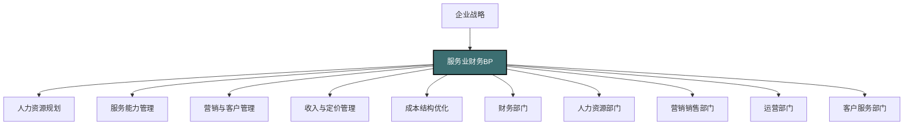

---
{"dg-publish":true,"permalink":"/08-财务专业/财务BP/笔记/行业应用/服务业BP特点/"}
---

#财务BP #行业应用 #服务业 #人力资源规划 #收入管理

## 概述

服务业财务BP（Business Planning）是针对服务型企业特点设计的财务规划与预算管理体系。与制造业相比，服务业具有无形性、不可存储性、同时性、异质性等特征，这些特性使得服务业的财务BP在结构设计、重点关注领域、编制方法和执行管理上表现出独特之处。服务业财务BP的核心是将企业战略有效转化为资源配置决策，平衡人力资源和服务能力需求，构建适合服务特性的收入和成本管理体系，以支持服务质量提升和企业可持续增长。

## 服务业BP在企业管理中的位置

在服务业企业中，财务BP是战略执行和资源配置的核心工具，具有以下作用：
- 将服务承诺转化为具体的资源需求和财务目标
- 协调人力资源、服务能力和客户需求的平衡
- 建立以客户为中心的收入管理和成本控制体系
- 支持服务创新和差异化的资源投入决策
- 平衡短期运营效率和长期服务品质的财务管理

## 服务业的行业特性及对BP的影响

### 1. 无形性特征

**行业特点**：
- 服务产品不可见、不可触摸
- 服务价值难以量化和标准化
- 服务成果与客户体验紧密相关
- 品牌和声誉是关键无形资产

**对BP的影响**：
- 收入预测需关注服务承诺与兑现能力
- 服务品质投入与收益关系难以精确量化
- 声誉和品牌建设成为重要预算项目
- 客户满意度与财务指标需协同规划
- 无形资产投资回报评估方法特殊

### 2. 人力资源密集特性

**行业特点**：
- 人力成本占总成本比重高
- 服务质量与人员素质直接相关
- 服务能力与员工规模紧密关联
- 人才获取和保留是核心挑战
- 生产力和效率受人因素影响大

**对BP的影响**：
- 人力资源规划成为BP核心环节
- 员工生产力是关键预算假设
- 人员扩张与培训投入需精细规划
- 薪酬结构与激励机制影响预算执行
- 需考虑人员流动对服务连续性的影响

### 3. 不可存储性特征

**行业特点**：
- 服务产能无法库存储存
- 供需不平衡导致产能浪费
- 需求波动对资源利用率影响大
- 服务交付具有时效性限制
- 峰谷差异管理是运营挑战

**对BP的影响**：
- 需关注服务能力规划与需求预测匹配
- 收入管理需考虑季节性和时间分布
- 成本结构中固定成本比例通常较高
- 产能利用率成为关键财务指标
- 需设计灵活的资源调配和定价机制

### 4. 同时性特征

**行业特点**：
- 服务生产与消费同时发生
- 客户参与服务交付过程
- 服务质量实时监控难度大
- 标准化与个性化需求并存
- 客户互动是服务价值的一部分

**对BP的影响**：
- 服务交付能力与客户需求匹配度预算
- 客户参与对成本效率的影响需量化
- 服务质量监控投入需特别预算
- 标准服务与定制服务的成本区分管理
- 前台与后台资源配比需合理设计

### 5. 异质性特征

**行业特点**：
- 服务标准难以完全统一
- 个体差异导致服务质量波动
- 客户需求多样性高
- 服务交付存在不确定性
- 流程标准化与个性化服务平衡难

**对BP的影响**：
- 服务标准化与流程优化投入预算
- 质量波动风险缓释成本考量
- 个性化服务的差异化定价与成本核算
- 服务保障和补救机制的财务准备
- 需求细分与精准资源配置的预算安排

## 服务业BP的主要组成部分

### 1. 收入与定价预算

**特点与重点**：
- 服务容量与定价策略结合
- 多元收入结构管理
- 客户生命周期价值规划
- 需求管理与收益优化
- 服务组合优化

**预算技术要点**：
- 服务定价模型设计（成本导向/价值导向/市场导向）
- 客户细分收入贡献分析
- 动态定价策略财务影响评估
- 交叉销售与增值服务收入规划
- 会员制与订阅模式收入预测

### 2. 人力资源预算

**特点与重点**：
- 基于服务量的人员配置计划
- 直接服务人员与支持人员配比
- 人力成本结构（基本薪酬/浮动/福利）
- 人员技能提升投入
- 生产力提升目标与激励机制

**预算技术要点**：
- 服务人员配置模型（队列理论应用）
- 人员扩张阶梯成本计算
- 业务量-人力需求弹性系数设定
- 关键人才投资回报评估
- 人力成本控制与服务质量平衡分析

### 3. 服务能力与运营预算

**特点与重点**：
- 服务场所与设施规划
- 服务工具与设备投入
- IT系统与技术支持预算
- 服务流程优化投入
- 运营效率提升目标

**预算技术要点**：
- 服务能力瓶颈分析
- 扩容时机与规模经济测算
- 技术投入对服务效率的影响评估
- 固定资产与灵活资源的配置优化
- 运营指标与财务指标关联模型

### 4. 营销与客户获取预算

**特点与重点**：
- 客户获取成本规划
- 营销渠道效率评估
- 品牌建设长期投入
- 客户体验提升预算
- 市场拓展与渗透策略

**预算技术要点**：
- 客户获取成本与生命周期价值比较
- 营销投放效果预测模型
- 品牌投资的长期价值评估
- 客户转化率与获客成本关系模型
- 口碑效应的财务价值量化

### 5. 客户服务与保留预算

**特点与重点**：
- 客户满意度提升投入
- 客户服务团队建设预算
- 服务失败补救机制
- 客户忠诚度项目投入
- 客户保留率目标与资源配置

**预算技术要点**：
- 客户满意度与保留率关系模型
- 服务质量投入回报曲线分析
- 客户流失预警与干预成本评估
- 忠诚度项目投资回报分析
- 客户细分服务策略的成本效益分析

### 6. 供应商与合作伙伴预算

**特点与重点**：
- 外包服务成本规划
- 合作伙伴佣金结构设计
- 供应商质量管理预算
- 战略伙伴关系投入
- 服务交付网络优化

**预算技术要点**：
- 自营与外包服务的成本比较
- 合作伙伴激励机制的财务影响评估
- 供应商管理成本与质量收益平衡
- 战略合作的长期财务价值评估
- 服务网络扩展的边际回报分析

### 7. 创新与发展预算

**特点与重点**：
- 服务创新项目投入
- 新市场开发预算
- 服务升级与改进投资
- 数字化转型资源配置
- 试点与推广阶段资金规划

**预算技术要点**：
- 创新项目投资组合管理
- 新服务开发阶段性预算控制
- 数字化投入的效率提升量化
- 试错成本与风险缓释预算
- 服务创新的财务可持续性分析

## 服务业BP的编制方法与技术

### 1. 需求预测与收入规划方法

**方法与步骤**：
1. 建立客户细分与服务类型矩阵
2. 分析历史需求模式与波动规律
3. 识别需求驱动因素与外部影响因素
4. 建立多情景需求预测模型
5. 结合产能约束进行可行性调整
6. 设计收入优化策略与定价调整计划

**技术要点**：
- 时间序列分析与季节性调整
- 客户行为模型与转化率预测
- 价格弹性测算与收入优化
- 市场渗透率与份额预测方法
- 预测准确性与灵活调整机制设计

### 2. 服务能力规划与人力资源预算

**方法与步骤**：
1. 将需求预测转化为服务量指标
2. 制定服务标准与质量目标
3. 计算所需直接服务人员配置
4. 确定支持与管理人员比例
5. 评估现有团队能力与缺口
6. 制定人才获取、培养与保留计划
7. 编制详细人力成本预算

**技术要点**：
- 服务量-人力需求转换模型
- 队列理论在服务人员配置中的应用
- 高峰期服务能力规划方法
- 人员生产力提升路径规划
- 关键岗位胜任力投资回报分析

### 3. 多维度成本管理体系

**方法与步骤**：
1. 建立服务成本结构分析框架
2. 区分直接服务成本与间接支持成本
3. 识别固定成本与变动成本构成
4. 设计成本分配与归因方法
5. 建立服务单位成本计算模型
6. 制定成本控制目标与优化路径

**技术要点**：
- 作业成本法在服务业的应用
- 客户服务成本分析方法
- 共享资源成本分配模型
- 边际成本与定价决策关系
- 成本结构优化与杠杆分析

### 4. 服务业绩效评估与预算监控

**方法与步骤**：
1. 设计平衡计分卡指标体系
2. 建立财务与非财务指标的关联
3. 设定关键绩效指标(KPI)目标值
4. 分解部门与个人绩效责任
5. 建立预算执行监控机制
6. 设计激励与问责体系

**技术要点**：
- 服务质量指标与财务指标的关联分析
- 客户满意度与财务业绩的因果链分析
- 员工满意度与服务质量的关系模型
- 预算偏差分析与责任追踪方法
- 绩效改进循环与预算调整机制

### 5. 敏感性分析与情景规划

**主要分析维度**：
- 需求波动对收入和成本的影响
- 人员生产力变化对盈利能力的影响
- 服务质量投入与客户满意度的关系
- 定价策略变动对需求和收入的影响
- 固定成本结构对盈亏平衡点的影响

**分析方法**：
- 多变量敏感性分析矩阵
- 盈亏平衡点与边际贡献分析
- 大客户依赖度风险评估
- 服务能力弹性与财务弹性规划
- 关键指标相关性与波动性分析

## 服务业细分行业BP特点

### 1. 专业服务业（咨询、法律、会计等）

**行业特点**：
- 高度依赖知识工作者
- 项目型与长期合约并存
- 人均产值是核心绩效指标
- 声誉和专业能力是核心竞争力
- 客户关系与服务个性化程度高

**BP重点**：
- 生产力与计费率优化
- 人才梯队与项目配置规划
- 专业知识管理与培训投入
- 项目预算与实施管控
- 客户组合与专业领域发展平衡

### 2. 金融服务业（银行、保险、投资等）

**行业特点**：
- 强监管环境下的合规成本高
- 风险管理是核心能力
- 产品与服务高度标准化
- 技术投入与创新压力大
- 客户信任与安全至关重要

**BP重点**：
- 风险调整后的收益目标设定
- 监管资本与经济资本规划
- 数字化转型与效率提升投入
- 多渠道协同的客户服务成本
- 产品组合与风险平衡管理

### 3. 零售与消费服务业

**行业特点**：
- 高客户流量与交易频次
- 店面位置与体验至关重要
- 季节性波动明显
- 供应链与库存管理复杂
- 多渠道融合是发展趋势

**BP重点**：
- 店面网络与扩张节奏规划
- 客单价与客流量平衡策略
- 季节性波动的资源弹性配置
- 线上线下渠道协同投入
- 营销推广与销售转化预算

### 4. 酒店与旅游服务业

**行业特点**：
- 严格的固定成本结构
- 高度季节性与周期性
- 动态定价与收益管理复杂
- 服务标准化与体验个性化并重
- 资产密集与品牌管理并重

**BP重点**：
- 收益管理与动态定价策略
- 季节性波动的成本结构管理
- 品牌标准维护与客户体验投入
- 分销渠道成本与效益优化
- 资产维护与更新长期规划

### 5. 医疗健康服务业

**行业特点**：
- 专业人员与设备投入高
- 服务质量与安全至上
- 支付方式复杂（保险、自费等）
- 监管严格与合规要求高
- 高度专业化与细分化

**BP重点**：
- 医疗资源配置与效率优化
- 服务质量与患者安全投入
- 支付方组合管理与价格谈判
- 专科发展与整体平衡
- 医疗技术创新与设备更新规划

## 案例分析：某连锁教育培训机构的财务BP实践

### 背景介绍

某全国性连锁教育培训机构，主要提供K12课外辅导和素质教育服务，拥有超过200家直营校区，覆盖50个城市，年收入约15亿元，学员总数超过20万人。近年来面临市场竞争加剧、监管政策变化和线上教育兴起的多重挑战。

### BP面临的主要挑战

1. 教育服务标准化与个性化需求的平衡
2. 学习成果与家长满意度的可量化性弱
3. 教师资源质量与数量的双重压力
4. 校区选址与装修的重资产投入
5. 季节性招生周期与固定成本结构的矛盾
6. 线上线下融合的业务转型

### BP框架设计

企业构建了"SPE"财务BP框架：

**S-战略导向(Strategy-oriented)**：
- 以企业五年发展战略为指引
- 按区域、科目和学龄段设定差异化目标
- 资源分配与战略优先级保持一致

**P-绩效驱动(Performance-driven)**：
- 连接财务与非财务指标
- 建立教学质量与财务成果的因果链
- 关注长期发展与短期绩效平衡

**E-生态系统思维(Ecosystem-thinking)**：
- 整合学生、家长、教师、管理者多方利益
- 考虑内部生态与外部环境协同
- 培养可持续发展的组织能力

### 具体BP实践与方法

**1. 收入预测与招生规划**

采用多维度收入预测模型：
- 基于学生留存模型预测续费收入
- 结合招生转化漏斗模型预测新生收入
- 按课程类型设定不同价格策略与增长目标
- 利用"学员生命周期价值"模型优化营销投放
- 建立季节性招生波动的预测调整机制

**成效**：收入预测准确率从±20%提升至±8%，招生策略针对性提升，营销投入产出比提高30%。

**2. 教师资源规划与人力成本预算**

实施"分层级人才规划"模式：
- 基于班级数量与教学标准设定核心师资需求
- 通过"教师-班级"矩阵优化师资排课效率
- 建立明星教师IP培养与普通教师发展双轨制
- 实施"固定+浮动"的薪酬结构，与教学质量和学生留存挂钩
- 引入"备用师资池"应对波峰需求

**成效**：教师利用率提升25%，师资成本占收入比例降低3个百分点，教师留存率提高至85%。

**3. 校区网络与运营成本预算**

建立校区全生命周期财务管理模型：
- 将校区分为培育期、成长期、成熟期和重塑期四个阶段
- 根据校区阶段设定差异化的财务目标和资源配置
- 实施标准化校区装修与设备配置体系，控制开办成本
- 建立校区运营效率指标库，实现标杆管理
- 通过"大校区+小卫星"模式优化资源共享

**成效**：新校区达到盈亏平衡的时间从18个月缩短至12个月，校区运营成本降低15%，资源利用率提高30%。

**4. 课程研发与内容投入预算**

采用产品组合管理方法：
- 按"现金牛、明星、问题儿童、瘦狗"对课程产品分类管理
- 建立课程研发的阶段门控预算释放机制
- 内容投入与市场测试结果挂钩，快速迭代
- 设置内容资产重用率指标，提高研发投入回报
- 线上内容与线下教学协同开发，降低边际成本

**成效**：课程研发效率提升40%，内容投入产出比提高50%，新课程上市成功率从60%提升至85%。

**5. 营销与获客预算管理**

实施精准营销资源配置：
- 建立"获客成本-转化率-生命周期价值"三维决策模型
- 按区域和目标客群细分营销预算与KPI
- 建立"线上营销漏斗+线下体验转化"的整合获客模型
- 将营销费用与阶段性转化指标挂钩，实现动态调整
- 建立品牌投入与直接获客投入的平衡机制

**成效**：获客成本降低25%，营销投入产出比提升35%，品牌溢价能力增强。

### BP执行监控与调整机制

**1. 多层次KPI体系**

建立四层级联KPI体系：
- 公司财务层：收入、利润、现金流、投资回报率
- 业务单元层：招生人数、续费率、客单价、师资效率
- 校区运营层：班级人数、满班率、教室利用率、教师满意度
- 教学质量层：学习效果、家长满意度、考试成绩提升

**2. 动态预算调整机制**

实施"1+3+12"滚动预算体系：
- 年度基础预算框架
- 季度预算评审与调整
- 月度业绩追踪与预警
- 建立关键业务指标预警阈值
- 设置预算调整授权分级制度

**3. 激励与问责机制**

将BP执行与绩效考核紧密关联：
- 校区管理团队考核70%与财务BP目标挂钩
- 建立超额完成与未完成的非对称激励机制
- 实施校区之间的"学习型竞争"制度
- 定期举行最佳实践分享与经验交流
- 将BP执行能力纳入管理者晋升评估体系

### 案例总结与启示

**实施成果**：
- 三年内利润率从8%提升至15%
- 校区单店经营效率提升35%
- 教师人均产值提高40%
- 获客成本降低25%，续费率提升至85%
- 成功应对政策变化带来的经营压力

**关键经验**：
1. 将教育服务特性与财务目标有效融合
2. 重视人力资源质量与效率的平衡
3. 注重长期品牌建设与短期业绩增长的协调
4. 建立教学质量与财务成果的正向循环
5. 充分运用数据分析指导决策

**对其他服务企业的启示**：
1. 服务业BP需关注人才质量与效率的平衡
2. 客户生命周期价值应成为收入规划核心
3. 分散化校区网络需标准化与本地化结合
4. 季节性波动管理是服务业BP的核心挑战
5. 服务质量指标应与财务指标紧密关联

## 服务业BP的未来发展趋势

### 1. 数字化转型影响

**服务数字化趋势**：
- 从线下服务到线上线下融合
- 客户自助服务占比提升
- 大数据驱动的个性化服务
- 服务流程自动化与智能化
- 远程服务能力扩展

**BP创新方向**：
- 线上线下融合的多渠道预算整合
- 数字化投入ROI的精确评估
- 自动化对人力资源结构的影响预算
- 数据资产价值的量化与投资规划
- 数字化获客与传统渠道的资源优化配置

### 2. 订阅经济与会员模式

**商业模式变革**：
- 从一次性交易到持续订阅
- 会员经济与忠诚度管理
- 服务包装与定价创新
- 客户终身价值最大化
- 社区建设与用户粘性

**BP应对策略**：
- 递延收入确认与现金流管理
- 客户获取成本与生命周期收益平衡
- 会员服务的阶梯成本结构设计
- 长期客户关系投资回报评估
- 社区运营与口碑效应的价值量化

### 3. 生态系统与平台战略

**商业生态趋势**：
- 从单一服务到生态系统
- 平台模式与网络效应
- 伙伴协作与价值共创
- 跨界边界模糊与融合
- 生态位竞争与拓展

**BP应对策略**：
- 平台投入与收益的长期规划
- 多边市场的资源配置优化
- 伙伴激励与利益分配机制设计
- 生态系统健康度指标管理
- 平台扩张路径与资源需求预测

### 4. 个性化与规模化并行

**服务创新趋势**：
- 大规模定制服务能力
- 服务模块化与即插即用
- 人工智能辅助的个性化
- 用户参与服务设计
- 体验经济与情感连接

**BP应对策略**：
- 个性化服务与规模效应平衡
- 模块化服务组件的成本效益分析
- AI赋能的人机协作效率规划
- 客户共创与服务创新投入
- 体验提升投资的价值量化

### 5. 可持续发展与社会责任

**服务业新要求**：
- 环境友好型服务设计
- 社会责任与共享价值
- 员工福祉与人本服务
- 包容性服务与普惠金融
- ESG标准与评估

**BP应对策略**：
- 可持续发展投入与品牌价值关联
- 社会责任项目的价值平衡
- 员工福祉与生产力关系规划
- 普惠服务的成本结构与补贴机制
- ESG指标与财务绩效整合框架

## 与其他财务BP工具的结合

- [[08-财务专业/财务BP/笔记/行业应用/制造业BP特点\|制造业BP特点]] - 通过对比理解服务业与制造业BP的本质区别
- [[08-财务专业/财务BP/笔记/预算编制基础/收入预测方法\|收入预测方法]] - 服务业收入预测需考虑客户生命周期和服务能力限制
- [[08-财务专业/财务BP/笔记/预算编制基础/人员预算\|人员预算]] - 服务业人力资源密集特性决定了人员预算的核心地位
- [[08-财务专业/财务BP/笔记/财务预测与模型/财务指标预测\|财务指标预测]] - 服务业需关注特有指标如客户留存率、人均产值等
- [[08-财务专业/财务BP/笔记/财务预测与模型/情景分析\|情景分析]] - 服务业需特别关注需求波动与固定服务能力的匹配
- [[08-财务专业/财务BP/笔记/行业应用/科技企业BP特点\|科技企业BP特点]] - 数字化服务企业可借鉴科技企业的BP方法

## 思考与练习

1. 分析一家服务企业如何平衡服务质量投入与财务效益，并设计一个决策框架来支持相关资源配置。
2. 比较不同类型服务企业（如专业服务与大众服务）在财务BP方面的主要差异，并探讨适合各自的预算管理方法。
3. 设计一个服务企业的峰谷季节性应对机制，包括资源弹性配置策略和收入平滑化方法。
4. 讨论数字化转型对传统服务业BP的影响，并提出服务业BP的创新方向。
5. 研究一个服务企业从交易型向订阅型模式转变的案例，分析其对财务BP体系的挑战和应对策略。 