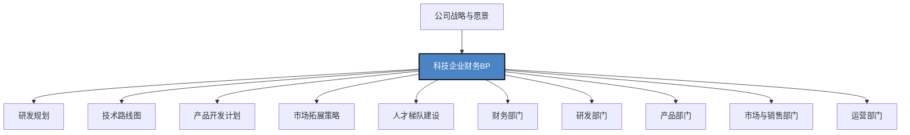

---
{"dg-publish":true,"permalink":"/08-财务专业/财务BP/笔记/行业应用/科技企业BP特点/"}
---

# 科技企业BP特点

#财务BP #行业应用 #科技企业 #研发投入 #业务模式

## 概述

科技企业财务BP（Business Planning）是针对科技行业特性设计的财务规划与预算管理体系。科技企业普遍具有高度创新性、快速迭代、重研发投入、商业模式多元化等特点，这些特性使得科技企业的财务BP在结构设计、关注重点、编制方法和执行管理上呈现出独特之处。科技企业财务BP的核心是平衡创新驱动与财务可持续性，支持企业在技术迭代与市场变化中保持竞争优势，同时实现稳健的财务表现。

## 科技企业BP在企业管理中的位置

在科技企业中，财务BP是连接战略、资源配置与绩效监控的核心工具，具有以下作用：
- 将创新战略与技术路线图转化为具体的资源配置计划
- 平衡短期业绩目标与长期技术投资需求
- 优化资源分配以支持产品开发与市场拓展
- 构建灵活的预算框架以应对快速变化的市场环境
- 提供多情景分析以支持关键决策与风险管理

## 科技企业的行业特性及对BP的影响

### 1. 高度创新性与技术驱动

**行业特点**：
- 持续的技术创新是核心竞争力
- 技术更新迭代速度快
- 研发投入比例高
- 创新成果转化为商业价值的周期长短不一
- 技术路线选择具有高度不确定性

**对BP的影响**：
- 研发预算占比高且管理复杂
- 需建立创新投资组合管理机制
- 预算周期可能需要与产品/技术开发周期匹配
- 建立技术投资回报评估体系
- 设计阶段性里程碑与弹性预算机制

### 2. 人才密集与知识资本主导

**行业特点**：
- 关键人才是核心资产
- 人力成本在总成本中占比高
- 人均创造价值差异大
- 人才市场竞争激烈
- 团队协作与创新文化至关重要

**对BP的影响**：
- 人才获取与保留成本需精细规划
- 股权激励等长期激励机制纳入BP考量
- 人才生产力是关键预算指标
- 团队扩张与人力结构调整需前瞻规划
- 核心人才流失风险需在BP中评估

### 3. 业务模式多元与快速演进

**行业特点**：
- 从产品导向到服务导向的转型
- 订阅模式、平台模式等新型商业模式普及
- 收入结构多元且复杂
- 业务模式试错与迭代频繁
- 价值创造方式与盈利点不断演变

**对BP的影响**：
- 多元业务模式下的收入预测复杂
- 递延收入确认对现金流规划的影响
- 客户获取成本与客户终身价值成为关键指标
- 需设计敏捷的业务模式调整机制
- 预算结构需适应收入模式转型

### 4. 高增长预期与资本市场压力

**行业特点**：
- 高速增长是行业标配
- 资本市场估值偏重增长指标
- 烧钱换增长的策略普遍存在
- 规模效应与网络效应显著
- 投资者关注指标多元（ARR、MAU、CAC等）

**对BP的影响**：
- 增长目标与盈利目标的平衡管理
- 资本支出与营运资金需求关系复杂
- 融资节奏与预算周期的协调
- 建立增长指标与财务指标的关联
- 设计多情景的路径规划以满足不同利益相关者需求

### 5. 市场环境变化迅速

**行业特点**：
- 产品生命周期短
- 市场竞争格局变化快
- 颠覆性技术不断涌现
- 监管政策变化频繁
- 客户需求与偏好快速转变

**对BP的影响**：
- 预算周期需更灵活（季度滚动、敏捷预算）
- 设置预算弹性机制与快速调整通道
- 建立市场变化的预警指标体系
- 关注现金储备与财务弹性
- 构建情景规划与敏感性分析框架

## 科技企业BP的主要组成部分

### 1. 研发与产品开发预算

**特点与重点**：
- 研发投入战略定位
- 技术路线图与资源分配
- 产品开发阶段性里程碑
- 创新项目组合管理
- 技术债务治理投入

**预算技术要点**：
- 研发资本化与费用化规则设定
- 项目级ROI与风险评估模型
- 敏捷开发周期的预算控制方法
- 研发效率指标设计与监控
- "探索-利用"两种创新模式的资源分配平衡

### 2. 市场拓展与客户获取预算

**特点与重点**：
- 市场扩张战略与节奏
- 客户获取渠道组合
- 产品市场匹配度验证
- 品牌建设与市场教育
- 定价策略与收入增长模型

**预算技术要点**：
- 客户获取成本与生命周期价值比较
- 增长模型构建与投入产出分析
- 渠道效率评估与资源优化配置
- 市场教育投入回报周期设定
- 增长曲线预测与资金需求匹配

### 3. 人才与组织能力预算

**特点与重点**：
- 关键岗位人才引进计划
- 团队扩张阶梯设计
- 人才发展与培训体系
- 激励机制（现金+股权）
- 组织结构演进规划

**预算技术要点**：
- 不同增长阶段的组织扩张模型
- 人才市场竞争因素的薪酬弹性设置
- 股权激励成本的摊销与现金流影响
- 人才生产力变化对财务影响的量化
- 关键人才流失风险的财务缓冲设计

### 4. 技术基础设施与运营预算

**特点与重点**：
- 技术架构扩展与升级
- 数据基础设施建设
- 安全与合规投入
- 运营效率提升项目
- 技术负债清理计划

**预算技术要点**：
- 基础设施扩张的阶梯成本模型
- 云服务等可变成本的弹性规划
- 技术债务的量化与投资回报分析
- 自建vs外购的成本效益分析
- 安全与合规投入的风险定价方法

### 5. 商业模式转型与创新预算

**特点与重点**：
- 新业务模式试验
- 收入结构转型规划
- 价值捕获机制优化
- 战略合作与生态建设
- 颠覆性创新探索

**预算技术要点**：
- 新旧业务模式转型的财务桥梁设计
- 商业实验的投资组合管理方法
- 平台/生态战略的网络效应量化
- 递延收入模式下的现金流规划
- "试错-学习-调整"循环的预算管理机制

### 6. 资本结构与融资预算

**特点与重点**：
- 融资节奏与规模规划
- 资本结构优化
- 投资者关系管理
- 退出策略准备
- 并购与战略投资

**预算技术要点**：
- 增长阶段与融资需求匹配模型
- 股权融资稀释影响分析
- 债务杠杆使用的风险评估
- 战略并购的财务建模与协同分析
- 不同增长路径下的资本需求测算

### 7. 风险管理与合规预算

**特点与重点**：
- 技术风险防控
- 知识产权保护
- 数据安全与隐私
- 监管合规准备
- 业务连续性保障

**预算技术要点**：
- 风险事件财务影响量化方法
- 合规成本与违规成本比较分析
- 不同风险情景的财务压力测试
- 风险缓释措施的投入回报评估
- 知识产权保护的价值与成本平衡

## 科技企业BP的编制方法与技术

### 1. 增长导向的收入预测方法

**方法与步骤**：
1. 建立多维度增长指标体系(ARR/MRR、DAU/MAU、转化率等)
2. 分析历史增长模式与驱动因素
3. 构建增长引擎模型(获客-激活-留存-变现-推荐)
4. 设定关键增长假设并进行敏感性测试
5. 建立渠道组合与产品矩阵的收入贡献模型
6. 设计不同增长情景下的资源需求曲线

**技术要点**：
- 增长会计(Growth Accounting)方法应用
- 用户/客户同期群分析(Cohort Analysis)
- 单位经济学模型(Unit Economics)构建
- 增长天花板(TAM/SAM/SOM)评估
- 递延收入确认与现金流转换模型

### 2. 研发投入与产品开发预算方法

**方法与步骤**：
1. 结合技术路线图确定研发战略重点
2. 将产品开发路线与研发里程碑对齐
3. 按创新类型分配研发投入比例(70/20/10原则)
4. 建立项目级ROI评估框架
5. 设计敏捷开发周期的资源分配机制
6. 构建研发效率与价值交付评估体系

**技术要点**：
- 研发投入比例基准(R&D Intensity)设定
- 创新项目组合管理(Innovation Portfolio)
- 价值流图(Value Stream Mapping)在预算中的应用
- 敏捷预算(Agile Budgeting)实践
- 研发资本化标准设定与影响分析

### 3. 扩张期的组织与人力资源规划

**方法与步骤**：
1. 构建业务增长与团队规模关系模型
2. 设计组织结构演进路径与阶梯点
3. 制定关键岗位招聘与培养计划
4. 建立人才市场竞争因素的薪酬弹性机制
5. 设计长短期结合的激励体系
6. 预测组织效率变化对财务表现的影响

**技术要点**：
- 扩张阶段人员效能曲线分析
- 组织规模临界点效应评估
- 人才投资回报周期设定
- 股权激励价值评估与摊销规划
- 人力资源弹性与业务波动匹配模型

### 4. 多情景分析与弹性预算机制

**方法与步骤**：
1. 识别关键不确定性因素与假设
2. 构建基准(Base)、乐观(Upside)、保守(Downside)情景
3. 为每个情景设定资源分配策略与优先级调整机制
4. 建立情景触发指标与预警体系
5. 设计跨情景的资源重分配机制
6. 将预算弹性与业务决策权限体系对接

**技术要点**：
- 敏感性分析矩阵与蒙特卡洛模拟
- 决策树分析在预算中的应用
- 预算分级授权与快速调整机制
- 财务弹性与业务弹性的平衡设计
- 关键指标预警阈值设定方法

### 5. 基于里程碑的阶段性资源释放

**方法与步骤**：
1. 将业务计划分解为关键里程碑序列
2. 设定每个里程碑的成功标准与量化指标
3. 将总预算分解为基础预算与里程碑触发预算
4. 制定里程碑评估机制与决策流程
5. 设计不同路径下的资源调整方案
6. 建立里程碑回顾与学习反馈机制

**技术要点**：
- 里程碑预算释放门控机制设计
- 成功/失败标准的量化界定
- "快速失败"机制的财务支持设计
- 里程碑评估的指标体系构建
- 资源重分配的优先级框架

## 科技企业细分行业BP特点

### 1. SaaS企业

**行业特点**：
- 订阅收入模式主导
- 高前期获客成本与长期客户价值
- 规模效应显著
- 产品驱动增长策略
- 客户成功对续约至关重要

**BP重点**：
- ARR/MRR增长与现金流规划平衡
- 获客效率(CAC)与回收周期(CAC Payback)管控
- 客户留存策略与续约率提升投入
- 产品开发与客户成功团队资源平衡
- 规模效应临界点的财务规划

### 2. 电子商务与互联网平台

**行业特点**：
- 平台双边市场特性
- 网络效应价值显著
- 高度依赖流量与转化
- 用户体验与供应链协同
- 多元化变现模式

**BP重点**：
- 流量获取成本与变现能力的平衡
- 平台补贴与网络效应培育投入
- 供应链与物流能力的扩张规划
- 用户增长与留存的投入平衡
- 多元变现模式的财务效率优化

### 3. 硬科技企业(半导体/新能源/生物科技)

**行业特点**：
- 研发周期长、资本密集
- 技术壁垒高且专业性强
- 产业链协同依赖度高
- 规模化生产是盈利关键
- 政策与监管影响大

**BP重点**：
- 长周期研发投入与里程碑管理
- 产能规划与资本支出优化
- 产业链协同与供应安全投入
- 技术路线选择的财务评估框架
- 政策变化的财务风险缓释

### 4. 人工智能与大数据企业

**行业特点**：
- 数据资产是核心价值
- 算力需求与成本高
- 应用落地与商业化挑战
- 高端人才稀缺且成本高
- 行业应用多元化

**BP重点**：
- 数据资产获取与价值评估
- 计算资源扩展的阶梯成本规划
- 技术研发与商业化路径平衡
- 差异化人才策略与激励机制
- 垂直行业应用的投资组合管理

### 5. 游戏与内容企业

**行业特点**：
- 产品成功率波动大
- IP价值长期积累
- 用户获取与变现模式多样
- 创意与技术结合密切
- 全球市场机会与挑战并存

**BP重点**：
- 产品管线与开发组合的资源配置
- 用户获取与内容营销策略
- IP培育与商业化的长期投入
- 变现模式创新与优化
- 全球市场拓展的阶段性投入

## 案例分析：某B2B SaaS企业的财务BP实践

### 背景介绍

某企业服务SaaS公司，主要提供人力资源管理云平台，成立5年，目前处于快速扩张期。年度经常性收入(ARR)约1.2亿元，客户数超过2000家，团队规模300人。公司刚完成B轮融资，面临规模化扩张与提高运营效率的双重挑战。

### BP面临的主要挑战

1. 订阅收入模式下的现金流与增长平衡
2. 高增长阶段的销售效率与客户获取成本控制
3. 产品开发速度与质量的平衡
4. 组织扩张中的人才结构与效能
5. 多产品线与多市场细分的资源分配
6. 向中大型企业客群扩张的策略调整

### BP框架设计

公司构建了"GEM"财务BP框架：

**G-增长导向(Growth-oriented)**：
- 以ARR增长为核心设计预算框架
- 客户终身价值最大化为资源分配原则
- 增长引擎效率作为关键评估指标

**E-效率优先(Efficiency-first)**：
- 单位经济学模型为基础分析决策
- 投入产出比作为资源分配考量
- 规模效应提升作为重要优化目标

**M-里程碑触发(Milestone-triggered)**：
- 基于关键业务里程碑设计分阶段预算
- 结果导向的资源释放机制
- 敏捷调整与快速响应机制

### 具体BP实践与方法

**1. 收入预测与增长规划**

建立多层次增长预测模型：
- 基于客户同期群(Cohort)的留存与扩张收入预测
- 销售漏斗转化率模型预测新客户获取
- 产品交叉销售与上销模型预测ARPU提升
- 垂直行业渗透策略的收入贡献预测
- 结合产品路线图的功能变现预测

**成效**：同期群续约率从82%提升至93%，客户单价提升25%，收入预测准确率提高至±10%以内。

**2. 销售与市场预算优化**

实施"效率增长"框架：
- 基于CAC回收周期设定获客投入上限
- 按客户规模分层设计差异化获客策略与预算
- 通过产品引导销售(PLG)策略降低小客户获客成本
- 建立销售团队扩张与生产力预测模型
- 市场预算与销售漏斗各环节效率直接挂钩

**成效**：CAC回收周期从18个月缩短至12个月，销售人员产能提升40%，市场投入产出比提高35%。

**3. 产品与研发资源分配**

采用"70-20-10"投资法则：
- 70%资源用于核心产品迭代与性能优化
- 20%资源用于相邻功能拓展与生态整合
- 10%资源用于创新实验与新技术探索
- 通过两周冲刺的敏捷开发与预算释放
- 建立基于客户反馈与使用数据的功能优先级评分体系

**成效**：产品开发周期缩短30%，新功能采用率提高45%，客户满意度NPS提升15分。

**4. 人才与组织扩张规划**

设计"分阶段组织扩张"模型：
- 将300人扩张至600人分解为三个关键阶段
- 建立每个部门的扩张触发指标与阈值
- 制定核心岗位"领先招聘"策略与竞争性薪酬预算
- 建立管理层梯队培养计划与预算
- 设计基于里程碑的股权激励释放计划

**成效**：关键岗位招聘周期缩短40%，员工留存率提高至90%，组织效能指标在扩张期保持稳定。

**5. 运营效率与规模经济投资**

实施"先投后效"规划：
- 前瞻性投资客户成功团队降低长期支持成本
- 产品自助化与服务流程自动化投入
- 实施数据驱动运营的基础设施建设
- 建立共享服务中心提升内部效率
- 技术架构升级以支持更大规模客户基数

**成效**：客户支持成本降低35%，运营自动化率提高50%，单客户服务成本随规模扩大降低40%。

### BP执行监控与调整机制

**1. OKR与BP目标联动**

建立目标与预算的双向联动机制：
- 公司OKR分解为部门KPI并与预算执行挂钩
- 季度OKR评估结果直接影响下季度资源分配
- 设置关键结果的预警阈值触发预算调整
- 建立月度业务评审与预算调整会议
- 重大偏差启动根本原因分析与资源重分配

**2. 数据驱动的动态调整**

实施"实时预算仪表盘"：
- 核心业务指标(KPI)与财务指标实时可视化
- 预算执行差异自动预警与风险评估
- 建立推动型与结果型指标的因果链监控
- 为决策层提供多维度分析与钻取能力
- 设置自动化的预算调整建议机制

**3. 敏捷与渐进式预算调整**

采用"滚动预算+敏捷调整"机制：
- 12个月滚动预算框架，季度更新
- 月度预算执行评估与小幅调整
- 季度深度评估与资源重大调整
- 设置10-15%的策略性预算池用于快速响应机会
- 建立跨部门资源借调与共享机制

### 案例总结与启示

**实施成果**：
- 两年内ARR从1.2亿增长至4亿，同时毛利率提升8个百分点
- 客户获取成本降低30%，客户生命周期价值提高60%
- 产品开发效率提高40%，上市时间缩短35%
- 实现规模扩张下的组织效能稳步提升
- 资本效率大幅改善，经营现金流转正提前6个月实现

**关键经验**：
1. 将SaaS业务模型特性与财务规划紧密整合
2. 注重单位经济学分析与规模经济效应规划
3. 平衡短期增长速度与长期经营可持续性
4. 敏捷预算调整与业务快速迭代相匹配
5. 数据驱动决策提高资源分配效率

**对其他科技企业的启示**：
1. 科技企业BP需建立独特的业务-财务模型
2. 增长投资与效率提升需根据发展阶段平衡
3. 敏捷与弹性是科技企业BP的核心特性
4. 人才战略与产品战略应在BP中协同规划
5. 不确定性管理能力是BP成功的关键因素

## 科技企业BP的未来发展趋势

### 1. 融合商业与产品逻辑的预算模型

**趋势特点**：
- 从财务视角转向业务-产品-财务整合视角
- 产品开发路线图与预算规划深度融合
- 产品指标与财务指标建立精确映射关系
- 基于产品数据反馈的预算动态调整
- 产品驱动增长(PLG)策略下的资源配置模型

**BP创新方向**：
- 构建产品度量-业务度量-财务度量的三维映射
- 开发基于产品使用数据的预算优化算法
- 将用户反馈直接纳入资源分配决策流程
- 建立产品研发与商业化的统一预算视图
- 设计产品生命周期导向的财务规划模型

### 2. AI驱动的预测与决策支持

**趋势特点**：
- AI辅助预测模型提高准确性
- 机器学习优化资源分配组合
- 智能情景生成与评估
- 实时异常检测与预警
- 预算自动化调整建议

**BP创新方向**：
- 开发混合预测模型(人工+机器学习)
- 实施基于AI的多情景动态生成与评估
- 构建智能预算调整推荐引擎
- 应用因果推断模型优化资源配置
- 建设预算决策的自动化支持系统

### 3. 持续预算与实时调整机制

**趋势特点**：
- 从周期性预算到持续规划
- 实时数据与即时决策反馈
- 短周期小增量调整代替大规模修订
- 分布式决策授权与中央协调并存
- 消除传统预算周期边界

**BP创新方向**：
- 构建资源持续分配与审视机制
- 开发实时预算执行监控平台
- 建立灵活预算池与动态调整机制
- 设计分层授权的快速资源调配体系
- 实施价值流导向的持续预算方法

### 4. 生态系统与网络效应导向

**趋势特点**：
- 从企业中心转向生态系统思维
- 合作伙伴网络成为预算考量重点
- 生态价值创造与分配机制创新
- 平台战略主导资源分配决策
- 网络效应培育成为核心投资

**BP创新方向**：
- 开发生态系统价值评估模型
- 构建基于网络效应的投资回报框架
- 设计多方参与的价值分配预算机制
- 建立生态健康度与财务绩效关联体系
- 实施平台扩张的阶段性投资策略

### 5. 可持续发展与影响力预算整合

**趋势特点**：
- ESG因素纳入BP核心框架
- 长期价值创造超越短期财务绩效
- 多重利益相关者平衡成为决策基础
- 社会与环境影响作为预算考量维度
- 可持续商业模式创新需求增加

**BP创新方向**：
- 开发综合价值评估与资源分配框架
- 建立ESG指标与财务绩效关联模型
- 设计多重影响维度的投资决策方法
- 构建长期价值创造的激励与预算机制
- 实施双重底线(财务+影响力)的BP体系

## 与其他财务BP工具的结合

- [[08-财务专业/财务BP/笔记/行业应用/制造业BP特点\|制造业BP特点]] - 科技硬件企业可借鉴制造业BP的产能规划方法
- [[08-财务专业/财务BP/笔记/行业应用/服务业BP特点\|服务业BP特点]] - 科技服务企业需结合服务业人力密集型特点进行规划
- [[08-财务专业/财务BP/笔记/预算编制基础/现金流预测\|现金流预测]] - 科技企业的高投入期与回报期错配需特别关注现金流规划
- [[研发预算管理\|研发预算管理]] - 科技企业的研发预算是核心组成部分
- [[08-财务专业/财务BP/笔记/预算编制基础/人员预算\|人员预算]] - 人才密集型特点决定了人员预算的重要性
- [[08-财务专业/财务BP/笔记/高级分析方法/价值驱动因素分析\|价值驱动因素分析]] - 科技企业需识别独特的价值驱动因素并据此分配资源

## 思考与练习

1. 分析一家SaaS企业如何平衡短期增长投入与长期盈利能力，设计一个决策框架支持相关资源分配。
2. 比较不同发展阶段科技企业(初创期、快速增长期、成熟期)的BP重点差异，并提出针对性的预算管理建议。
3. 探讨如何将产品数据与用户反馈整合到科技企业的BP流程中，提高资源分配效率。
4. 设计一个科技企业的多情景预算框架，包括触发机制、资源调整方法和决策流程。
5. 研究一个科技企业从传统预算向敏捷预算转型的案例，分析关键成功因素与实施挑战。 