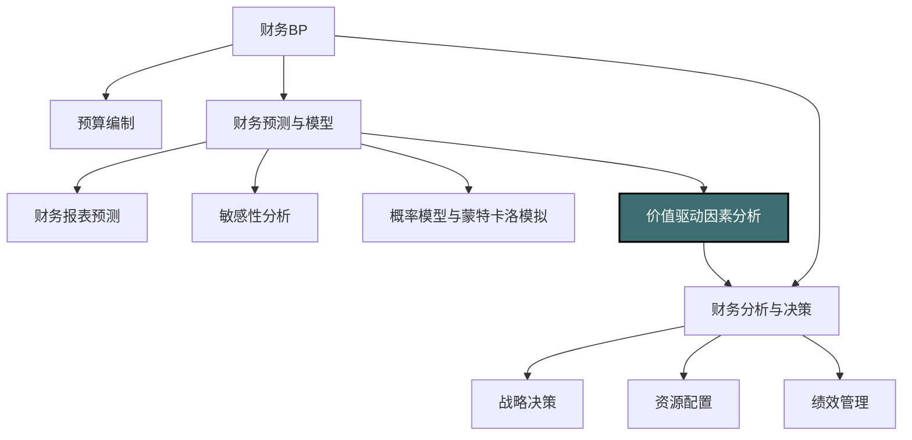
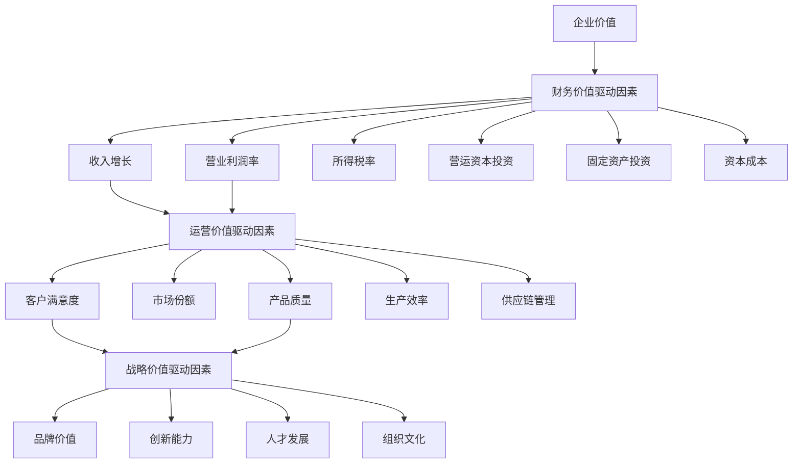
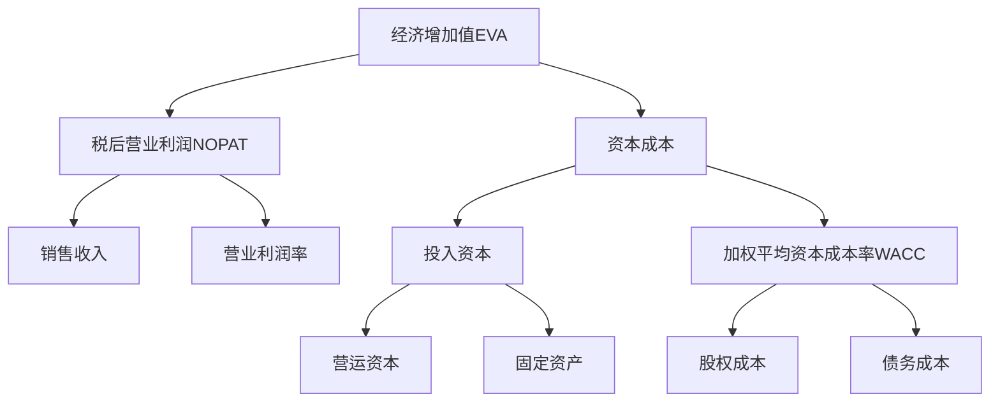
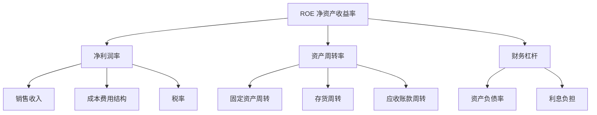
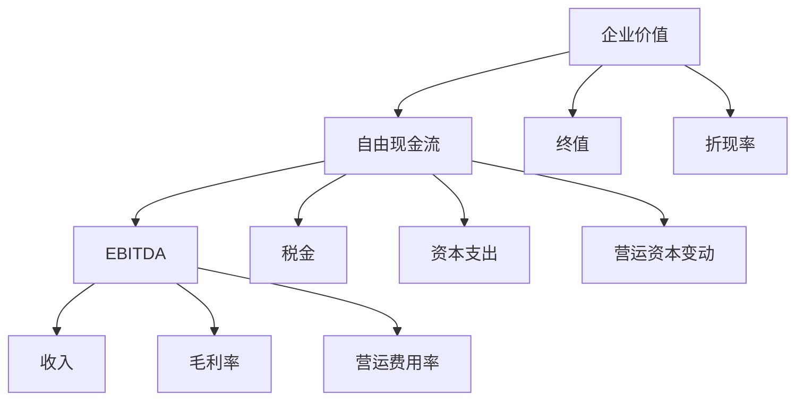
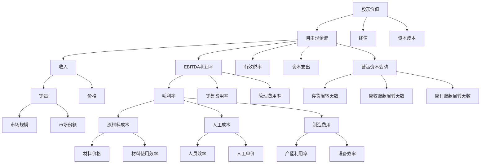
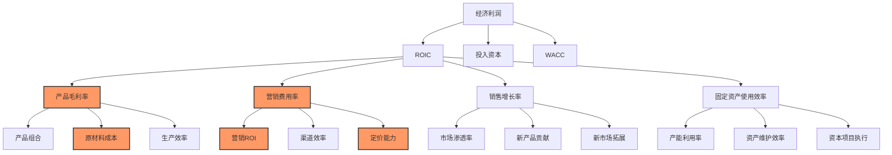

---
{"dg-publish":true,"permalink":"/08-财务专业/财务BP/笔记/财务预测与模型/价值驱动因素分析/"}
---

#财务BP #财务预测 #价值驱动 #价值创造 #绩效管理

## 概述

价值驱动因素分析是财务BP中的核心分析工具，旨在识别、量化和管理对企业价值产生重大影响的关键变量。这些驱动因素是连接企业运营决策与最终股东价值创造的桥梁。通过系统性分析这些驱动因素，管理层可以更准确地了解价值创造的来源，优化资源配置，制定更有效的战略决策，并设计与价值创造直接相关的绩效评估体系。价值驱动因素分析将财务与运营联系起来，帮助企业从战略高度进行财务规划，形成"以价值为导向"的管理文化。

## 价值驱动因素分析在财务BP中的位置

价值驱动因素分析处于财务BP的核心位置：
- 为预算编制提供价值导向的框架
- 支持财务预测中的关键变量识别
- 指导战略决策和资源配置
- 为绩效管理体系提供理论基础

## 价值驱动因素的类型与层次

### 价值驱动因素的定义

价值驱动因素(Value Drivers)是指能够显著影响企业价值的变量，具有以下特征：
- 对企业价值有重大影响（高敏感度）
- 可被管理层通过决策影响（可控性）
- 可被量化和测量（可度量性）
- 与企业战略和业务模式直接相关（相关性）

### 价值驱动因素的层次结构

价值驱动因素通常呈现出层次化结构，从财务层面逐步深入到运营层面：

### 价值驱动因素分类

1. **财务层面价值驱动因素**
   - 收入增长率
   - EBITDA利润率
   - 有效税率
   - 固定资产投资比率
   - 营运资本占收入比
   - 加权平均资本成本(WACC)

2. **运营层面价值驱动因素**
   - 价格与数量
   - 产品组合
   - 客户获取成本
   - 客户保留率
   - 产能利用率
   - 库存周转率
   - 应收账款周期

3. **战略层面价值驱动因素**
   - 市场份额
   - 品牌强度
   - 研发投入效率
   - 专利数量与质量
   - 员工生产力

4. **行业特定价值驱动因素**
   - 零售业：同店销售增长、每平米销售额、库存周转
   - 制造业：产能利用率、原材料成本比例、生产效率
   - 服务业：客户获取成本、续约率、客户终身价值
   - 科技业：研发投入比例、新产品上市时间、用户增长率

## 价值驱动因素分析框架

### 1. 经济增加值(EVA)框架

经济增加值(Economic Value Added, EVA)是衡量企业真实经济利润的指标，计算公式为：

EVA = 税后营业利润(NOPAT) - (投入资本 × 资本成本率)

基于EVA的价值驱动因素分解：

### 2. DuPont分析框架

杜邦分析法将ROE(净资产收益率)分解为多个驱动因素：

基本公式：ROE = 净利润率 × 资产周转率 × 财务杠杆

扩展公式：ROE = (净利润/销售收入) × (销售收入/总资产) × (总资产/股东权益)

### 3. 现金流价值驱动模型

基于自由现金流(FCF)的价值驱动因素分析：

企业价值 = 未来自由现金流的现值总和

## 价值驱动因素分析流程

### 1. 识别阶段

**目标**：确定对企业价值有重大影响的关键驱动因素

**方法**：
- 财务敏感性分析：测试各变量变化对企业价值的影响程度
- 专家意见法：访谈行业专家、高管和财务分析师
- 同行业标杆分析：对比竞争对手的关键成功因素
- 统计相关性分析：分析历史数据中变量与价值的相关性

**输出**：初步价值驱动因素清单，按影响程度排序

### 2. 分解与量化阶段

**目标**：将高层次财务驱动因素分解为可操作的运营驱动因素

**方法**：
- 构建价值树(Value Tree)：自上而下分解价值创造路径
- 确定数学关系：建立驱动因素间的定量关系
- 设置基准值：确定每个驱动因素的当前表现和目标值
- 建立计算模型：整合各驱动因素的关系模型

**输出**：分层级的价值驱动因素体系，包含量化关系

### 3. 分析与诊断阶段

**目标**：深入理解各驱动因素的现状、潜力和制约因素

**方法**：
- 历史趋势分析：评估驱动因素的历史表现轨迹
- 差距分析：与行业最佳实践对比，识别改进空间
- 瓶颈诊断：识别限制价值创造的关键瓶颈
- 交互影响分析：评估驱动因素间的相互作用

**输出**：价值创造机会和制约点的详细诊断报告

### 4. 战略制定与资源配置阶段

**目标**：确定价值最大化的战略方向和资源配置方案

**方法**：
- 投资回报分析：评估不同改进方案的投资回报率
- 情景模拟：模拟不同战略选择对价值的影响
- 优先级排序：根据影响力和可行性确定优先次序
- 行动计划制定：为每个关键驱动因素制定具体改进计划

**输出**：价值导向的战略规划和资源配置方案

### 5. 目标设定与绩效管理阶段

**目标**：将价值驱动转化为明确的绩效目标和激励机制

**方法**：
- 关键绩效指标(KPI)设计：基于价值驱动因素设计KPI体系
- 目标级联：将企业总体目标分解至各级部门和个人
- 激励方案设计：将薪酬激励与价值创造直接挂钩
- 跟踪与反馈机制：建立定期监测和调整机制

**输出**：价值导向的绩效管理和激励体系

## 价值驱动树(Value Tree)构建方法

价值驱动树是价值驱动因素分析的核心工具，它以树状结构展示企业价值的层级分解。

### 价值驱动树构建步骤

1. **确定价值衡量指标**：
   - 选择合适的价值衡量指标（如EVA、股东价值或自由现金流）
   - 确定价值计算方法和公式

2. **自上而下分解**：
   - 根据数学关系分解顶层价值指标
   - 逐层细化至可操作的运营指标
   - 确保每层分解的完整性和逻辑性

3. **确定关联关系**：
   - 建立驱动因素间的数学关系
   - 验证不同层级间的逻辑一致性
   - 检查是否存在交叉影响或重复计算

4. **量化敏感度**：
   - 计算每个驱动因素对上层指标的敏感性
   - 确定最具影响力的关键驱动因素
   - 标注价值杠杆最高的环节

### 价值驱动树示例（制造企业）

## 价值驱动因素分析的应用场景

### 1. 战略规划与投资决策

**应用方式**：
- 识别价值创造的战略聚焦点
- 评估战略方案的价值创造潜力
- 为并购与剥离决策提供分析框架
- 指导业务组合的优化调整

**具体工具**：
- 战略价值地图：关联战略举措与价值驱动
- 价值创造模拟：预测不同战略对企业价值的影响
- 业务组合价值分析：评估各业务单元的价值贡献

### 2. 预算规划与资源配置

**应用方式**：
- 基于价值驱动的预算制定
- 价值优先的资源分配
- 资本支出的价值导向评估
- 确定价值优化的成本结构

**具体工具**：
- 价值导向预算模板：将预算项目与价值驱动直接关联
- 资源配置决策矩阵：基于价值影响和资源需求排序
- 投资回报比较分析：评估不同投资方案的价值创造能力

### 3. 绩效管理与激励体系

**应用方式**：
- 设计基于价值驱动的KPI体系
- 将薪酬激励与价值创造直接关联
- 实施价值导向的组织变革
- 建立价值创造的问责制度

**具体工具**：
- 价值导向平衡记分卡：整合财务与非财务价值驱动指标
- 价值贡献评估模型：量化个人和团队的价值贡献
- 长期价值创造激励计划：将长期激励与持续价值增长挂钩

### 4. 业务流程改进

**应用方式**：
- 识别价值创造的关键流程
- 定位流程中的价值泄漏点
- 优先改进高价值影响的流程环节
- 量化流程改进的价值贡献

**具体工具**：
- 价值流程图：标注流程各环节的价值贡献
- 价值损耗分析：识别并量化价值流失点
- 六西格玛与精益管理：聚焦价值驱动的流程优化

### 5. 风险管理

**应用方式**：
- 评估关键价值驱动的波动风险
- 设计针对价值风险的缓解策略
- 构建价值保护的预警机制
- 制定价值韧性计划

**具体工具**：
- 价值风险热图：可视化价值驱动的风险暴露
- 价值风险情景分析：评估极端情况下的价值影响
- 价值保护策略：针对关键价值驱动的风险对冲方案

## 行业特定价值驱动因素分析

### 1. 制造业

**关键价值驱动因素**：
- 产能利用率
- 原材料成本占比
- 能源效率
- 质量成本（返工率、废品率）
- 设备综合效率(OEE)
- 供应链响应时间
- 新产品导入速度

**分析重点**：
- 生产效率与规模经济
- 供应链整合度
- 精益生产实施水平
- 自动化与数字化程度

### 2. 零售业

**关键价值驱动因素**：
- 同店销售增长
- 每平方米销售额
- 存货周转率
- 毛利率
- 客单价
- 顾客转化率
- 顾客忠诚度（复购率）

**分析重点**：
- 选址质量与店铺网络优化
- 商品组合与定价策略
- 营销效率
- 全渠道整合度

### 3. 服务业

**关键价值驱动因素**：
- 客户获取成本
- 客户终身价值
- 客户留存率
- 服务交付效率
- 员工生产力
- 客户满意度
- 交叉销售率

**分析重点**：
- 客户关系管理
- 服务标准化与个性化平衡
- 人才发展与保留
- 服务创新能力

### 4. 科技行业

**关键价值驱动因素**：
- 研发投入回报率
- 新产品收入占比
- 知识产权价值
- 用户增长率
- 平台活跃度
- 用户获取成本
- 开发周期时间

**分析重点**：
- 创新能力与技术领先性
- 网络效应与规模经济
- 生态系统建设
- 知识资本管理

## 案例分析：消费品企业价值驱动因素分析

### 企业背景

某消费品企业主要从事食品饮料生产与销售，年销售收入50亿元，净利润4亿元，近年来面临增长放缓和利润率下降的挑战。管理层希望通过价值驱动因素分析，识别价值创造的关键杠杆，制定价值增长战略。

### 分析过程

**第一步：构建初始价值模型**

公司采用经济利润模型作为价值衡量指标：
- 经济利润 = 投入资本 × (ROIC - WACC)
- 当前ROIC (投入资本回报率) = 14%
- 当前WACC (加权平均资本成本) = 9%
- 投入资本 = 40亿元
- 经济利润 = 40亿 × (14% - 9%) = 2亿元

**第二步：识别关键价值驱动因素**

通过敏感性分析，确定对ROIC影响最大的因素：

| 驱动因素 | 当前值 | 变化幅度 | ROIC影响 | 敏感度排名 |
|---------|-------|---------|---------|----------|
| 产品毛利率 | 35% | ±2% | ±1.8% | 1 |
| 销售增长率 | 5% | ±2% | ±0.7% | 3 |
| 营销费用率 | 15% | ±1% | ±0.9% | 2 |
| 存货周转率 | 8次/年 | ±1次/年 | ±0.4% | 5 |
| 应收账款周转率 | 12次/年 | ±1次/年 | ±0.3% | 6 |
| 固定资产使用效率 | 2.5x | ±0.2x | ±0.5% | 4 |

**第三步：构建价值驱动树**

根据分析结果，构建三层价值驱动树，重点关注高敏感度的驱动因素：

**第四步：运营诊断与对标分析**

对重点价值驱动因素进行深入诊断：

1. **产品毛利率**：
   - 现状：35%，行业领先企业为40%
   - 诊断：高价值SKU占比低，原材料采购分散，生产自动化程度不足
   - 改进空间：+3-5个百分点

2. **营销费用率**：
   - 现状：15%，行业最佳实践为12%
   - 诊断：数字营销ROI低，促销效率不高，渠道激励机制不合理
   - 改进空间：-2-3个百分点

3. **定价能力**：
   - 现状：新产品定价权弱，价格传导滞后
   - 诊断：品牌溢价不足，消费者洞察能力弱，定价策略被动
   - 改进空间：提升品牌溢价1-2个百分点

**第五步：价值提升行动计划**

基于诊断结果，制定具体行动计划：

1. **产品毛利率提升计划**：
   - 优化产品组合：淘汰低毛利SKU，增加高价值产品比例
   - 实施战略采购：整合供应商，建立长期战略合作
   - 提升生产效率：推进精益生产，提高自动化水平

2. **营销效率优化计划**：
   - 改革数字营销：引入ROI评估体系，优化媒体组合
   - 精简促销活动：基于消费者响应分析，聚焦高效促销方式
   - 优化渠道策略：调整渠道激励机制，发展直销渠道

3. **提升定价能力计划**：
   - 品牌建设：增强品牌差异化，提升品牌资产
   - 加强消费者洞察：建立消费者价格敏感度模型
   - 实施价值定价：基于消费者感知价值制定定价策略

**第六步：价值影响预测与目标设定**

模拟行动计划的价值影响：

| 改进领域 | 目标改善 | ROIC影响 | 经济利润影响 |
|---------|---------|---------|------------|
| 产品毛利率 | +3% | +2.7% | +1.08亿元 |
| 营销费用率 | -2% | +1.8% | +0.72亿元 |
| 定价能力 | +1.5% | +1.35% | +0.54亿元 |
| 总计 | - | +5.85% | +2.34亿元 |

预计三年后：
- ROIC从14%提升至19.85%
- 经济利润从2亿元增长至4.34亿元
- 企业价值增加约23.4亿元（按10倍经济利润乘数计算）

**第七步：绩效管理体系调整**

基于价值驱动分析，重新设计绩效管理体系：

1. **关键绩效指标(KPI)调整**：
   - 销售团队：从销售额为主调整为毛利额与客户利润率并重
   - 生产部门：从产量为主调整为质量成本与生产效率并重
   - 采购部门：从采购成本为主调整为总拥有成本与供应保障并重

2. **激励机制改革**：
   - 建立基于经济利润的长期激励计划
   - 将40%的管理层奖金与价值驱动指标挂钩
   - 引入关键岗位的价值贡献分享机制

### 分析结果与价值

通过价值驱动因素分析，该消费品企业：
- 明确了价值创造的关键杠杆和优先改进领域
- 制定了可操作的价值提升行动计划
- 建立了价值导向的绩效管理体系
- 预计三年内可实现企业价值增长超过50%

## 价值驱动因素分析实施挑战与对策

### 实施挑战

1. **数据质量与可获取性**：
   - 缺乏关键运营数据
   - 财务与运营数据分离
   - 数据口径不一致

2. **分析能力与工具局限**：
   - 复杂关系建模困难
   - 缺乏适当的分析工具
   - 分析人员技能不足

3. **组织与文化阻力**：
   - 部门壁垒与信息孤岛
   - 短期导向的管理文化
   - 对价值驱动分析结果的抵触

4. **实施与执行障碍**：
   - 行动计划执行不力
   - 缺乏持续追踪机制
   - 中层管理者参与度不足

### 应对策略

1. **数据基础建设**：
   - 构建整合的数据平台
   - 统一关键指标定义与口径
   - 建立数据质量控制机制

2. **分析能力提升**：
   - 引入专业分析工具
   - 培训财务团队价值分析技能
   - 建立财务业务伙伴机制

3. **组织变革管理**：
   - 高层领导的明确支持
   - 跨部门价值创造团队
   - 价值导向的企业文化建设

4. **实施保障机制**：
   - 价值驱动的项目管理办公室
   - 定期价值创造回顾会议
   - 关键价值驱动的预警机制

## 与其他财务BP工具的结合

- [[08-财务专业/财务BP/笔记/财务预测与模型/财务报表预测\|财务报表预测]] - 价值驱动因素是财务预测模型的灵魂，提供了预测假设的逻辑基础
- [[08-财务专业/财务BP/笔记/财务预测与模型/敏感性分析\|敏感性分析]] - 敏感性分析是识别关键价值驱动因素的重要工具
- [[08-财务专业/财务BP/笔记/财务预测与模型/情景分析\|情景分析]] - 情景分析可评估不同战略情境下价值驱动因素的表现
- [[08-财务专业/财务BP/笔记/财务预测与模型/概率模型与蒙特卡洛模拟\|概率模型与蒙特卡洛模拟]] - 可以评估价值驱动因素的不确定性及其对价值的影响
- [[08-财务专业/财务BP/笔记/预算编制基础/资本支出预算\|资本支出预算]] - 价值驱动分析为资本支出决策提供价值导向框架
- [[战略财务规划\|战略财务规划]] - 价值驱动树是连接战略目标与财务成果的桥梁

## 思考与练习

1. 选择一个你熟悉的企业，尝试识别其3-5个最关键的价值驱动因素，并说明这些因素如何相互关联。
2. 比较传统财务分析和价值驱动因素分析的区别。价值驱动分析如何弥补传统财务分析的不足？
3. 针对某个行业（如零售、制造或服务业），构建一个详细的价值驱动树，并解释各层级驱动因素间的关系。
4. 讨论如何将价值驱动因素分析与企业绩效管理体系结合，设计一套能够促进长期价值创造的KPI体系。
5. 分析价值驱动因素分析在不同企业生命周期阶段（如创业期、成长期、成熟期和衰退期）的应用重点有何不同？ 