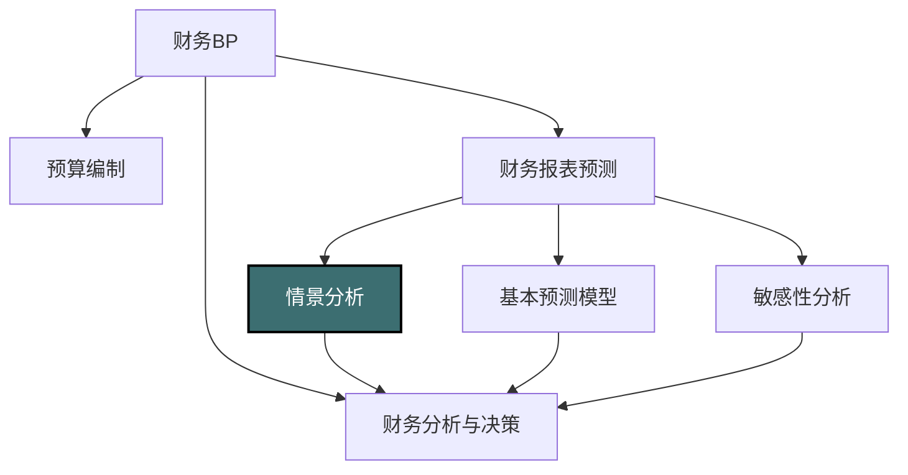
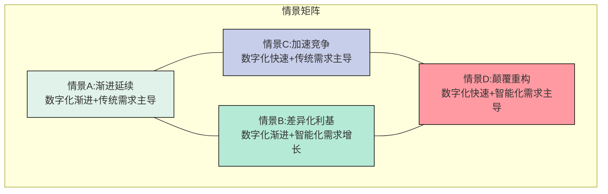

---
{"dg-publish":true,"dg-home":false,"permalink":"/08-财务专业/财务BP/笔记/财务预测与模型/情景分析/","dgPassFrontmatter":true}
---

#财务BP #财务预测 #情景分析 #决策支持

## 概述

情景分析是财务BP中的高级分析工具，通过构建多个可能的未来情景，并评估每种情景下的财务表现，为管理层提供全面的决策支持。与敏感性分析侧重于单个变量变化不同，情景分析同时调整多个相关变量，创建完整、一致且有意义的商业情境，更贴近复杂多变的现实世界。情景分析有助于企业应对不确定性，提前制定应对策略，增强组织的适应性和韧性。在战略规划、风险管理和资源配置中，情景分析已成为不可或缺的决策工具。

## 情景分析在财务BP中的位置

情景分析连接基础预测和战略决策：
- 超越单一预测，提供多维决策视角
- 整合多种内外部因素的综合影响
- 评估极端事件和结构性变化的影响
- 为制定应急预案和韧性策略提供依据

## 情景分析与敏感性分析的区别

情景分析与[[08-财务专业/财务BP/笔记/财务预测与模型/敏感性分析\|敏感性分析]]虽然相关但有本质区别：

| 特征 | 敏感性分析 | 情景分析 |
|-----|-----------|---------|
| 变量数量 | 通常关注少数关键变量 | 同时考虑多个相互关联的变量 |
| 变量关系 | 独立变化，忽略相关性 | 考虑变量间的相互作用和逻辑关系 |
| 分析深度 | 技术性分析，关注数值敏感度 | 战略性分析，关注商业逻辑和故事 |
| 分析视角 | 参数变化的机械组合 | 完整、连贯的未来商业情境 |
| 分析目的 | 识别关键驱动因素 | 探索可能的未来状态和应对策略 |
| 时间维度 | 通常短中期 | 可延伸至长期战略视角 |

## 情景分析的类型与方法

### 基本类型

1. **标准三情景分析**
   - 基准情景（Base Case）：最可能出现的情况
   - 乐观情景（Upside Case）：比预期更好的情况
   - 悲观情景（Downside Case）：比预期更差的情况
   - 适用于初步评估和简单决策

2. **多情景概率分析**
   - 定义3-5个或更多情景
   - 为每个情景分配发生概率
   - 计算概率加权结果
   - 适用于有概率估计基础的情况

3. **战略情景规划**
   - 构建4-6个截然不同但均有可能的长期情景
   - 关注外部环境和战略定位的结构性变化
   - 不一定分配概率，而是评估每种情景的战略意义
   - 适用于长期战略规划和重大战略决策

4. **风险特定情景分析**
   - 针对特定风险事件的发生及其影响
   - 例如：金融危机、自然灾害、供应链中断等
   - 侧重于韧性评估和应急预案制定
   - 适用于风险管理和业务连续性规划

### 分析方法

#### 1. 情景构建法

**基于关键不确定性构建情景**：
1. 识别关键不确定性因素（通常2-3个）
2. 为每个因素设定不同状态
3. 组合这些状态创建情景矩阵
4. 选择最有意义的组合作为核心情景

**应用示例**：
如果关键不确定性是"市场增长"和"竞争强度"，则可构建四个情景：
- 高增长+低竞争：快速扩张情景
- 高增长+高竞争：竞争优势情景
- 低增长+低竞争：稳健经营情景
- 低增长+高竞争：生存挑战情景

#### 2. 趋势外推与冲击法

**基于现有趋势和潜在冲击构建情景**：
1. 分析关键指标的历史趋势
2. 设定基准情景为趋势的合理延续
3. 考虑可能的正面/负面冲击因素
4. 构建包含这些冲击的变体情景

**应用示例**：
- 基准情景：GDP增长5%，行业增长7%
- 正面冲击：新政策刺激，行业增长达12%
- 负面冲击：经济衰退，行业萎缩3%

#### 3. 德尔菲法与专家意见整合

**基于专家共识构建情景**：
1. 邀请内外部专家参与情景构建
2. 通过多轮匿名问卷收集观点
3. 分析意见差异和集中点
4. 基于集中点构建核心情景，基于差异点构建备选情景

**应用优势**：
- 吸收多领域专业知识
- 减少个人偏见影响
- 增强情景的可信度和接受度

#### 4. 因果逻辑路径法

**通过事件链构建情景**：
1. 确定起点（当前状态）和不同终点（情景结果）
2. 构建从起点到每个终点的因果事件链
3. 验证每条路径的内在逻辑一致性
4. 为每个完整路径命名为一个情景

**应用优势**：
- 确保情景内部逻辑严密
- 关注事件间的因果关系
- 有助于识别关键决策节点和转折点

## 情景分析的设计与执行

### 情景分析流程

### 1. 确定分析目的与范围

开始情景分析前，需明确：

**分析目的**：
- 支持特定决策（如投资、扩张）
- 评估战略方向
- 制定应急预案
- 识别新机会或风险

**时间范围**：
- 短期（1年内）
- 中期（1-3年）
- 长期（3-10年或更长）

**分析边界**：
- 公司整体
- 特定业务单元
- 特定地理区域
- 特定产品线

### 2. 识别关键驱动因素

选择真正影响业务结果的重要因素，可分为：

**内部因素**：
- 产品开发能力
- 运营效率
- 人才储备
- 资金状况

**行业因素**：
- 竞争格局
- 供应链稳定性
- 技术变革速度
- 客户需求变化

**宏观环境因素**：
- 经济增长
- 政策法规
- 社会人口变化
- 地缘政治状况

**识别方法**：
- PESTEL分析（政治、经济、社会、技术、环境、法律）
- 波特五力分析
- SWOT分析
- 德尔菲专家调查

### 3. 构建情景框架

基于关键驱动因素，创建具有内部一致性的情景：

**情景数量**：
- 通常3-5个情景最为实用
- 太少无法充分展示可能性
- 太多则难以管理和理解

**情景结构**：
- 每个情景应有明确的叙事主线
- 包含定性描述和定量参数
- 确保内部逻辑一致性
- 相互之间有足够差异性

**情景命名**：
- 使用简洁、形象的名称
- 反映情景的核心特征
- 便于沟通和记忆

### 4. 量化情景影响

将情景转化为财务预测和业务指标：

**关键指标设定**：
- 收入增长率
- 毛利率和净利率
- 现金流和投资回报
- 市场份额和客户指标
- 运营效率指标

**财务预测方法**：
- 调整基准财务模型的关键假设
- 确保各假设间的一致性
- 计算完整的财务报表
- 进行特定情景下的现金流压力测试

**输出格式**：
- 多情景财务摘要表
- 关键指标对比图表
- 现金流波动范围
- 各情景下的战略定位

### 5. 评估结果与制定策略

基于情景分析结果，制定韧性战略和应对措施：

**战略评估方法**：
- 韧性测试（在最差情景下是否存活）
- 机会成本分析（最佳情景下是否充分受益）
- 决策灵活性评估（能否快速调整）
- 资源分配优先级（在多数情景下有价值的投资）

**战略应对类型**：
- 稳健型战略（在大多数情景下表现良好）
- 弹性型战略（可根据实际情况快速调整）
- 对冲型战略（分散风险，兼顾多种可能性）
- 赌注型战略（押注特定情景，高风险高回报）

**具体策略工具**：
- 决策树
- 实物期权分析
- 分阶段投资计划
- 风险缓解措施清单

## 情景分析的应用场景

### 1. 战略规划与资源配置

**目标**：制定能适应多种未来环境的长期战略

**关键应用**：
- 长期业务组合规划
- 核心能力投资决策
- 市场进入与退出策略
- 长期研发方向确定

**决策支持方式**：
- 识别在多数情景下有价值的"无悔"投资
- 确定具有战略灵活性的阶段性措施
- 设计适应性资源配置机制

### 2. 并购与重大投资决策

**目标**：评估重大资本配置决策在不同未来环境下的表现

**关键应用**：
- 并购目标评估
- 新市场拓展
- 产能大幅扩张
- 技术平台转型

**决策支持方式**：
- 评估交易的战略契合度
- 测试不同情景下的协同效应
- 确定风险承受能力和退出策略

### 3. 风险管理与业务连续性

**目标**：提前识别潜在风险并制定应对预案

**关键应用**：
- 市场剧变应对
- 供应链风险管理
- 流动性危机预案
- 竞争威胁应对

**决策支持方式**：
- 确定预警指标和触发点
- 制定分层次应对预案
- 建立风险缓冲机制

### 4. 产品组合与创新管理

**目标**：优化产品组合以适应不同市场环境

**关键应用**：
- 产品线规划
- 研发项目组合
- 创新资源配置
- 产品生命周期管理

**决策支持方式**：
- 平衡增长型与防御型产品
- 确定核心产品与选择性机会
- 制定产品退出和转型计划

### 5. 长期融资规划

**目标**：确保在各种环境下的财务稳健性

**关键应用**：
- 资本结构设计
- 长期债务规划
- 股利政策制定
- 股权融资时机

**决策支持方式**：
- 测试不同情景下的偿债能力
- 优化融资成本与灵活性平衡
- 建立财务缓冲和融资备用方案

## 实际案例：制造企业的战略情景分析

### 背景
某制造企业正面临产业变革，需要决定是继续扩大传统产品线，还是向智能制造转型。管理层需要评估未来5年不同路径的战略风险和回报。

### 情景分析设计

**分析目的**：
评估不同战略方向在各种可能的未来环境中的表现，为战略决策提供依据。

**时间范围**：5年

**关键不确定性识别**：
通过PESTEL分析和行业专家访谈，确定两个关键不确定性：
1. 行业数字化转型速度（快速/渐进）
2. 市场需求结构变化（传统占主导/智能化占主导）

### 情景构建

基于两个关键不确定性构建四个情景：

**情景A：渐进延续**
- 行业数字化进程缓慢，3-5年内影响有限
- 客户仍以传统产品为主，智能化需求仅在小众市场
- 成本压力增加，但不存在根本性市场结构变化
- *战略含义*：传统扩张仍然可行，适度智能化试水

**情景B：差异化利基**
- 行业整体数字化速度温和
- 部分细分市场对智能产品需求快速增长
- 市场分化明显，传统与智能产品长期共存
- *战略含义*：双线发展，在保持传统业务同时发展智能化利基市场

**情景C：加速竞争**
- 行业数字化转型加速，但主要体现在生产环节
- 传统产品需求韧性强，但对成本和效率要求提高
- 规模化和成本控制成为竞争核心
- *战略含义*：生产智能化改造，在传统产品线保持成本领先

**情景D：颠覆重构**
- 数字化迅速渗透产业链各环节
- 智能化产品快速替代传统产品
- 新进入者通过颠覆性模式获取市场份额
- *战略含义*：需要全面转型，传统模式难以持续

### 量化情景影响

**关键假设设定**：

| 关键参数 | 情景A | 情景B | 情景C | 情景D |
|---------|-------|-------|-------|-------|
| 传统产品市场年增长率 | 3% | 1% | 2% | -5% |
| 智能产品市场年增长率 | 8% | 15% | 10% | 25% |
| 行业平均毛利率变化 | -1%点/年 | 稳定 | -2%点/年 | -3%点/年(传统)/+2%点/年(智能) |
| 智能化投资回报期 | 5年+ | 3-4年 | 4-5年 | 2-3年 |
| 市场集中度变化 | 微增 | 保持 | 明显增加 | 重构后再集中 |

**不同战略路径在各情景下的表现**（5年累计）：

| 指标 | 战略路径 | 情景A | 情景B | 情景C | 情景D |
|-----|---------|-------|-------|-------|-------|
| 收入复合增长率 | 传统扩张 | 4% | 2% | 3% | -3% |
|  | 双线发展 | 3% | 6% | 4% | 5% |
|  | 全面转型 | 0% | 5% | 2% | 12% |
| 累计投资回报率 | 传统扩张 | 18% | 10% | 12% | -5% |
|  | 双线发展 | 15% | 20% | 14% | 15% |
|  | 全面转型 | 5% | 15% | 8% | 25% |
| 市场份额变化 | 传统扩张 | +2%点 | -1%点 | -2%点 | -8%点 |
|  | 双线发展 | +1%点 | +3%点 | 0%点 | -1%点 |
|  | 全面转型 | -3%点 | +2%点 | -2%点 | +5%点 |

### 战略评估与建议

**韧性分析**：
- "双线发展"战略在所有情景下均保持正增长和投资回报
- "传统扩张"战略在情景D下不可持续
- "全面转型"战略在情景A下回报不足，但在D情景中表现最佳

**风险与机会评估**：
1. 最大风险：过早完全放弃传统业务，导致情景A/C下现金流不足
2. 最大机会：在确保传统业务稳健同时，抢占智能化转型先机

**战略建议**：
1. **分阶段"双线发展"战略**：
   - 短期：传统产能优化与智能产品试点并行
   - 中期：根据市场实际情况调整两条业务线投资比例
   - 设定明确的决策检查点和转型加速触发条件

2. **具体实施措施**：
   - 启动小规模智能产品线，控制在总投资20%以内
   - 提高传统生产线的自动化和数字化水平
   - 组建专门的智能产品创新团队
   - 每半年评估市场向哪个情景发展，调整资源配置

3. **风险缓解**：
   - 与关键客户合作开发智能化解决方案，降低市场不确定性
   - 建立模块化产品平台，增强产品线间协同
   - 保持合理的财务杠杆和现金储备，应对转型阵痛

### 情景监测指标

确定关键指标，持续监测实际情况向哪个情景演进：
- 智能产品市场渗透率变化速度
- 行业领导者的战略动向
- 客户产品规格要求变化
- 传统产品价格压力程度
- 智能化解决方案利润率趋势

## 情景分析的高级应用

### 1. 实物期权与情景分析结合

**实物期权思维**将战略决策视为一系列期权，而非一次性承诺：

- **延期期权**：在不确定性降低前推迟重大投资
- **分阶段期权**：将大型项目分解为多个决策点
- **转换期权**：保持改变战略方向的灵活性
- **放弃期权**：设定明确的退出标准

**结合情景分析**：
- 识别各情景下的关键决策点
- 设计具有战略灵活性的行动路径
- 量化不同期权策略的价值

### 2. 动态情景监测与调整

情景不是一次性分析，而应是持续更新的过程：

**动态监测框架**：
- 设定情景关键指标和早期预警信号
- 定期评估实际发展与情景预测的偏差
- 在重大偏差出现时更新情景假设

**适应性战略执行**：
- 建立明确的战略调整触发条件
- 预先设计针对不同情景转变的调整措施
- 培养组织的感知和适应能力

### 3. 共创型情景规划

将情景分析从管理工具扩展为组织学习和创新平台：

**参与式情景构建**：
- 跨部门、跨层级参与情景讨论
- 融合多元视角和专业知识
- 培养集体战略思维和未来意识

**创新孵化器**：
- 基于不同情景设计创新实验
- 测试可能的业务模式和产品概念
- 培养应对不确定性的创新能力

## 与其他概念的关系

- [[08-财务专业/财务BP/笔记/财务预测与模型/敏感性分析\|敏感性分析]] - 情景分析常建立在敏感性分析基础上，将关键敏感变量整合为连贯情景
- [[战略规划\|战略规划]] - 情景分析为战略规划提供多维度的未来可能性考量
- [[风险管理\|风险管理]] - 情景分析是系统性识别和评估战略风险的有效方法
- [[08-财务专业/财务BP/笔记/财务预测与模型/财务报表预测\|财务报表预测]] - 情景分析为财务预测提供多元视角，超越单一基准预测
- [[资本配置\|资本配置]] - 情景分析帮助优化跨情景的资本配置决策，平衡风险和机会
- [[业务连续性规划\|业务连续性规划]] - 极端情景分析是制定业务连续性计划的基础

## 思考与练习

1. 选择一个你熟悉的行业，识别其未来5年面临的两个最关键不确定性因素，并构建四个可能的情景矩阵。
2. 比较情景分析与传统单一路径规划的优缺点。在什么情况下情景分析的价值最为突出？
3. 针对一个具体的战略决策（如市场扩张、产品转型），设计一个完整的情景分析框架，包括关键变量、情景构建和评估方法。
4. 讨论如何在组织文化中融入情景思维，使团队习惯于考虑多种可能性而非单一预测。
5. 研究一个成功企业如何通过情景分析度过重大行业变革或经济危机，并总结其关键成功因素。 