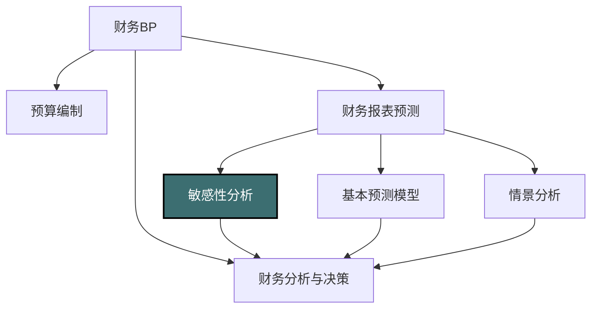

---
{"dg-publish":true,"dg-home":false,"permalink":"/08-财务专业/财务BP/笔记/财务预测与模型/敏感性分析/","dgPassFrontmatter":true}
---

#财务BP #财务预测 #敏感性分析 #风险评估

## 概述

敏感性分析是财务BP中的重要分析工具，通过系统性地改变一个或多个关键变量并观察其对财务预测结果的影响，评估财务模型对各种假设变化的敏感度。这种分析有助于识别财务预测中最具影响力的变量，揭示潜在风险和机会，为决策者提供更全面的信息，增强决策的稳健性。在不确定性日益增加的商业环境中，敏感性分析已成为财务BP不可或缺的组成部分。

## 敏感性分析在财务BP中的位置



敏感性分析连接基础预测和决策分析：
- 评估基本预测假设的稳健性
- 识别需要重点关注的关键变量
- 揭示模型假设中的潜在风险
- 为战略决策提供多维度信息

## 敏感性分析的类型与方法

### 基本类型

1. **单因素敏感性分析**
   - 一次改变一个变量，其他变量保持不变
   - 评估单一因素变化对结果的独立影响
   - 直观简单，实施成本低
   - 忽略变量间的相互作用

2. **多因素敏感性分析**
   - 同时改变多个变量，观察组合效应
   - 能够捕捉变量间的交互影响
   - 实施复杂度较高，解释难度增加
   - 更接近真实商业环境的多变量变化

3. **情景敏感性分析**
   - 基于特定情景（如经济衰退、突发事件）设置一组相关变量变化
   - 评估在特定商业环境下的整体影响
   - 与战略规划和风险管理紧密结合
   - 通常包括最佳、最差和基准情景

### 分析方法

#### 1. 变动幅度法

对关键变量进行上下一定百分比的调整，如±5%、±10%、±20%等，观察结果变化。

**适用场景**：
- 初步快速评估
- 变量关系较为线性
- 需要直观展示影响程度

**公式示例**：
如果销售收入为基准值的90%、95%、105%、110%，分别计算对应的净利润变化情况。

#### 2. 临界点分析法

计算使关键财务指标达到临界点（如盈亏平衡点）时的变量取值。

**适用场景**：
- 评估安全边际
- 确定风险承受能力
- 制定预警机制

**公式示例**：
销售量降低多少百分比会导致净现值(NPV)为零或内部收益率(IRR)等于资本成本？

#### 3. 弹性系数法

计算关键指标对变量变化的弹性，即变量变化百分比与结果变化百分比的比值。

**适用场景**：
- 比较不同变量的相对重要性
- 量化敏感度大小
- 进行标准化比较

**公式**：
弹性系数 = (结果变化百分比) ÷ (变量变化百分比)

例如：如果销售价格上升5%导致净利润上升15%，则弹性系数为3，表明净利润对销售价格变化非常敏感。

#### 4. 蒙特卡洛模拟法

通过概率分布随机生成大量变量组合，模拟各种可能结果的分布情况。

**适用场景**：
- 多变量复杂分析
- 需要概率分布而非点估计
- 评估极端情况的可能性

**实施步骤**：
1. 为关键变量设定概率分布
2. 使用计算机生成随机值组合
3. 运行大量迭代（通常几千次）
4. 分析结果分布特征（均值、方差、分位数等）

## 敏感性分析的设计与执行

### 敏感性分析流程


### 1. 识别关键变量

选择真正影响财务结果的重要变量进行分析，主要包括：

**收入相关变量**：
- 销售单价
- 销售数量
- 市场增长率
- 市场份额

**成本相关变量**：
- 原材料成本
- 直接人工成本
- 能源成本
- 固定成本比例

**运营相关变量**：
- 应收账款周转天数
- 存货周转天数
- 产能利用率
- 良品率

**财务相关变量**：
- 贷款利率
- 汇率波动
- 税率变化
- 资本成本

**宏观经济变量**：
- GDP增长率
- 通货膨胀率
- 行业景气度
- 政策变化

### 2. 设计变量变动范围

变量变动范围的设定应基于：

- **历史波动区间**：分析变量过去的波动范围
- **行业经验**：参考行业典型波动情况
- **专家判断**：综合内外部专家意见
- **极端情况考虑**：评估极端但合理的变动可能

典型设计方法：
- 基准值±一定百分比（如±10%、±20%）
- 基于历史标准差设置（如±1σ、±2σ）
- 根据业务特点设置非对称区间

### 3. 执行分析计算

计算执行中的关键考虑因素：
- 确保模型公式和逻辑的准确性
- 保持除目标变量外其他变量不变（单因素分析）
- 记录每组变量组合的计算结果
- 验证计算过程无错误

### 4. 结果整理与可视化

**结果呈现方式**：

1. **敏感性表格**
   
   展示变量不同取值下的结果变化：

   | 变量变化 | -20% | -10% | 基准值 | +10% | +20% |
   |---------|------|------|-------|------|------|
   | 净利润  | ... | ... | ... | ... | ... |
   | ROI     | ... | ... | ... | ... | ... |

2. **蜘蛛图**
   
   直观显示多个变量的敏感性比较：

   ```mermaid
   graph TD
   style A fill:#f9f9f9,stroke:#666,stroke-width:1px
   A[蜘蛛图示意 - 各变量敏感度比较]
   ```

3. **龙卷风图**
   
   按敏感度从高到低排列变量影响：

   ```mermaid
   graph TD
   style B fill:#f9f9f9,stroke:#666,stroke-width:1px
   B[龙卷风图示意 - 变量敏感度排序]
   ```

4. **散点图或热力图**
   
   适用于多因素分析，展示变量交互影响。

### 5. 分析解读与决策应用

敏感性分析结果解读要点：

- **区分高敏感变量与低敏感变量**
  识别对结果影响最大的关键驱动因素

- **评估上行与下行风险不对称性**
  某些变量可能在变好时影响有限，但变差时影响巨大

- **关注临界点和拐点**
  识别模型行为发生显著变化的变量取值

- **综合考虑变量可控性与敏感度**
  高敏感但可控的变量是管理重点，高敏感但不可控的变量是风险重点

## 敏感性分析的应用场景

### 1. 投资决策评估

**目标**：评估投资项目对关键假设变化的敏感度

**关键变量**：
- 初始投资额
- 预期现金流
- 项目寿命
- 折现率

**决策应用**：
- 判断投资项目稳健性
- 确定投资风险承受度
- 设计投资保障措施

### 2. 定价策略制定

**目标**：评估价格变化对销量和利润的影响

**关键变量**：
- 产品价格
- 销量弹性
- 竞争对手反应
- 成本结构

**决策应用**：
- 寻找最优定价点
- 制定差异化定价策略
- 评估价格调整风险

### 3. 产能规划与扩张

**目标**：评估不同产能利用率下的财务表现

**关键变量**：
- 产能利用率
- 固定成本分摊
- 市场需求变化
- 产能扩张时机

**决策应用**：
- 确定最佳产能规模
- 制定分阶段扩张策略
- 评估产能闲置风险

### 4. 运营杠杆管理

**目标**：评估固定成本与可变成本比例对利润的影响

**关键变量**：
- 固定成本比例
- 销售波动性
- 边际贡献率
- 盈亏平衡点

**决策应用**：
- 优化成本结构
- 提高成本弹性
- 降低运营风险

### 5. 融资方案选择

**目标**：评估不同融资结构对财务指标的影响

**关键变量**：
- 债务比例
- 利率变化
- 偿债能力
- 财务杠杆

**决策应用**：
- 优化资本结构
- 降低融资风险
- 提高股东回报

## 敏感性分析的高级应用

### 1. 敏感性分析与情景分析结合

将敏感性分析与情景分析结合，可以更全面地评估决策风险：


**结合步骤**：
1. 通过单因素敏感性分析识别关键变量
2. 对关键变量进行多因素分析
3. 基于分析结果构建有意义的业务情景
4. 制定针对各情景的应对策略

### 2. 使用数字工具增强分析能力

现代敏感性分析通常依赖于强大的数字工具：

**常用工具**：
- Excel数据表和目标寻求功能
- 专业财务建模软件（如@Risk、Crystal Ball）
- 业务智能(BI)和数据可视化工具
- 统计分析软件（如R、Python）

**工具优势**：
- 处理大量变量组合
- 执行复杂的蒙特卡洛模拟
- 提供专业的可视化展示
- 支持自动化敏感性报告生成

### 3. 敏感性分析与优化分析

将敏感性分析与优化分析结合，不仅了解风险，还能找到最优解：

**优化目标示例**：
- 在保持ROI≥15%的情况下，最大化市场份额
- 在满足现金流安全边际的前提下，最小化融资成本
- 在确保产品质量的条件下，优化成本结构

**实施方法**：
- 定义目标函数和约束条件
- 使用线性规划或其他优化算法
- 对优化结果进行敏感性测试
- 确保解决方案具有稳健性

## 实际案例：零售连锁企业的扩张决策敏感性分析

### 背景
某零售连锁企业计划未来三年在新区域开设15家新门店，初始投资预计为3亿元。管理层需要评估该扩张计划的财务可行性和风险。

### 敏感性分析设计

**关键评估指标**：
- 投资回收期
- 三年累计净现金流
- 第三年ROI（投资回报率）

**选择的关键变量**：
1. 新店单店销售额（较基准值±20%）
2. 毛利率（较基准值±5个百分点）
3. 运营费用率（较基准值±3个百分点）
4. 新店开业时间（平均延迟0/3/6个月）
5. 初始投资成本（较基准值±15%）

### 单因素敏感性分析结果

**投资回收期敏感性（月）**：

| 变量变化 | -20%/-5%/-3% | -10%/-2.5%/-1.5% | 基准值 | +10%/+2.5%/+1.5% | +20%/+5%/+3% |
|---------|-------------|-----------------|-------|-----------------|-------------|
| 单店销售额 | 45.6 | 38.2 | 33.0 | 28.9 | 25.7 |
| 毛利率 | 42.3 | 37.1 | 33.0 | 29.8 | 27.2 |
| 运营费用率 | 27.5 | 30.1 | 33.0 | 36.4 | 40.8 |

**第三年ROI敏感性（%）**：

| 变量变化 | -20%/-5%/-3% | -10%/-2.5%/-1.5% | 基准值 | +10%/+2.5%/+1.5% | +20%/+5%/+3% |
|---------|-------------|-----------------|-------|-----------------|-------------|
| 单店销售额 | 10.2% | 14.6% | 18.5% | 22.4% | 26.3% |
| 毛利率 | 11.8% | 15.2% | 18.5% | 21.9% | 25.2% |
| 运营费用率 | 23.1% | 20.8% | 18.5% | 16.2% | 13.9% |
| 初始投资 | 21.8% | 20.0% | 18.5% | 17.1% | 16.0% |

### 敏感性分析可视化

**龙卷风图分析**显示变量对ROI影响从大到小的排序：
1. 单店销售额（影响幅度：±8.1个百分点）
2. 毛利率（影响幅度：±6.7个百分点）
3. 运营费用率（影响幅度：±4.6个百分点）
4. 初始投资成本（影响幅度：±2.9个百分点）
5. 新店开业时间（影响幅度：±1.8个百分点）

### 多因素敏感性分析

组合"单店销售额"和"毛利率"这两个最敏感变量的变化：

| ROI(%) | 毛利率-5% | 毛利率-2.5% | 毛利率基准 | 毛利率+2.5% | 毛利率+5% |
|--------|----------|------------|----------|------------|----------|
| 销售额-20% | 5.3% | 7.7% | 10.2% | 12.6% | 15.1% |
| 销售额-10% | 8.5% | 11.5% | 14.6% | 17.6% | 20.7% |
| 销售额基准 | 11.8% | 15.2% | 18.5% | 21.9% | 25.2% |
| 销售额+10% | 15.0% | 18.9% | 22.4% | 26.1% | 29.8% |
| 销售额+20% | 18.2% | 22.6% | 26.3% | 30.4% | 34.3% |

### 临界点分析

- ROI至少需要达到12%才能满足公司投资要求
- 单店销售额不得低于基准值的85%
- 毛利率不得低于基准值的4个百分点
- 运营费用率上升不得超过基准值的5个百分点
- 初始投资可上浮不超过25%

### 分析结论与决策建议

**风险评估**：
- 项目对销售额和毛利率高度敏感
- 若销售额下降10%且毛利率下降2.5%，ROI将低于投资门槛
- 运营费用控制具有较大缓冲空间

**决策建议**：
1. **分阶段实施**：先开设5家试点店，验证销售假设
2. **强化销售管理**：加强新店营销和客户关系管理
3. **供应链优化**：重点保障毛利率稳定性
4. **建立预警机制**：设定销售和毛利率的监控阈值
5. **灵活调整策略**：准备应对不同情况的扩张速度调整方案

**风险缓解措施**：
- 与物业方协商基于销售额的租金模式，降低固定成本
- 建立新店盈利能力评估体系，不达标店及时调整或关闭
- 加强员工培训，提高人效，控制运营费用率
- 优化门店面积和布局，降低单店初始投资

## 与其他概念的关系

- [[08-财务专业/财务BP/笔记/财务预测与模型/财务报表预测\|财务报表预测]] - 敏感性分析是财务报表预测的延伸，用于评估预测的稳健性
- [[风险管理\|风险管理]] - 敏感性分析是识别和量化财务风险的重要工具
- [[08-财务专业/财务BP/笔记/财务预测与模型/情景分析\|情景分析]] - 敏感性分析常与情景分析结合，提供更全面的决策支持
- [[08-财务专业/财务BP/笔记/预算编制基础/预算编制流程\|预算编制流程]] - 在预算编制过程中，敏感性分析有助于确定合理的预算目标和范围
- [[08-财务专业/财务BP/笔记/预算编制基础/资本支出预算\|资本支出预算]] - 资本支出决策通常需要进行详细的敏感性分析
- [[财务决策支持\|财务决策支持]] - 敏感性分析为管理层决策提供风险和机会的量化评估

## 思考与练习

1. 选择一个投资项目，识别至少五个关键变量，设计一个完整的敏感性分析。
2. 比较单因素敏感性分析和多因素敏感性分析的优缺点。在什么情况下应该使用哪种方法？
3. 如何将敏感性分析的结果有效地传达给非财务背景的决策者？设计一个直观的可视化方案。
4. 某项目的NPV对销售价格的弹性系数为2.5，对固定成本的弹性系数为-1.2。解释这意味着什么，并讨论管理重点应该放在哪里。
5. 讨论数字化工具如何改进传统敏感性分析。你认为人工智能将如何影响未来的敏感性分析方法？ 