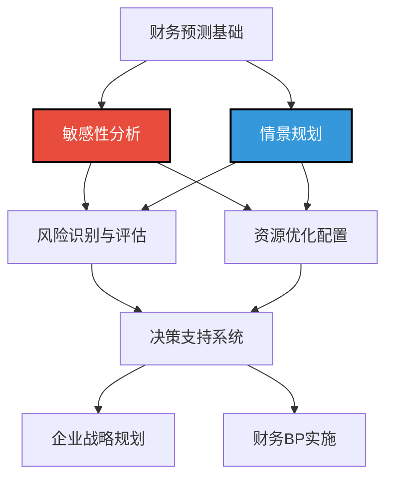
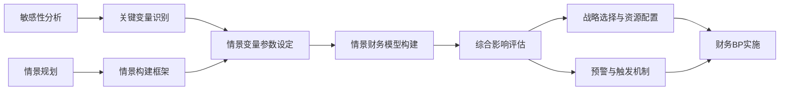
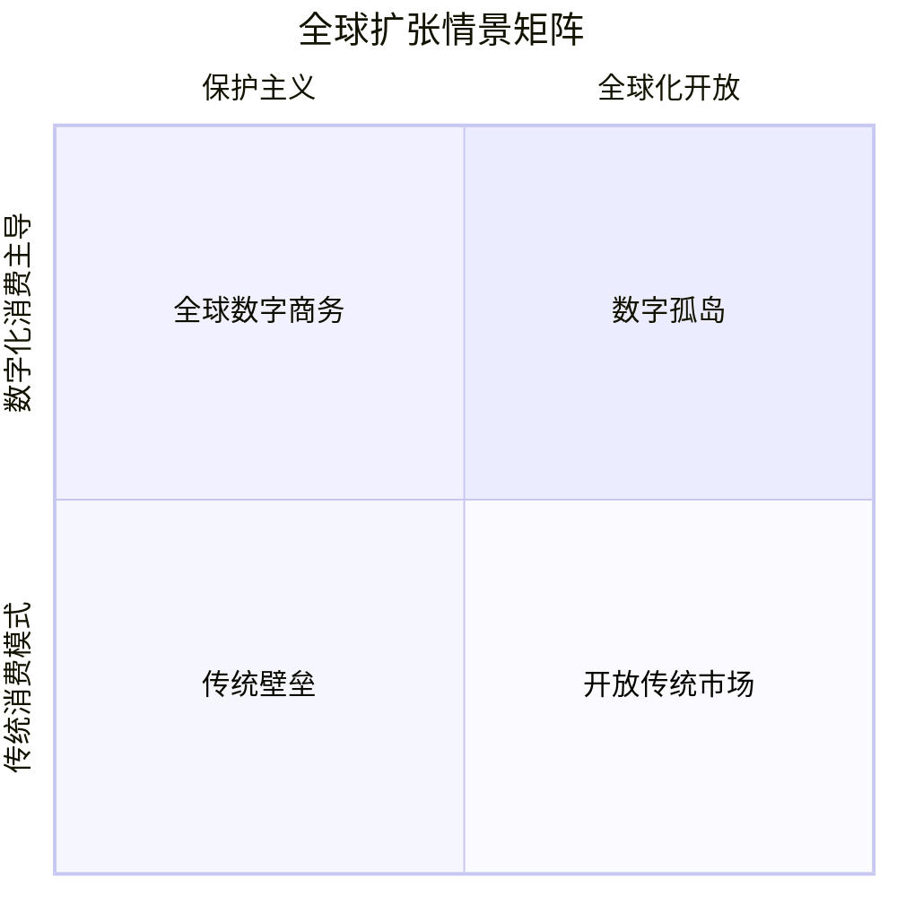

---
{"dg-publish":true,"dg-home":false,"permalink":"/08-财务专业/财务BP/笔记/财务预测与模型/敏感性分析与情景规划/","dgPassFrontmatter":true}
---

#财务BP #预测分析 #敏感性分析 #情景规划 #决策支持

## 概述

敏感性分析与情景规划是财务BP（Business Planning）中应对不确定性的核心方法工具。在复杂多变的商业环境中，单一静态的财务预测往往难以应对现实中的各种可能性。敏感性分析通过评估关键变量变动对财务结果的影响程度，识别最具风险敏感性的因素；情景规划则通过构建多种可能的未来情境，帮助企业提前准备应对策略。两者结合使用，可以大幅提升企业财务规划的韧性与适应性，为管理决策提供更全面的信息支持。

## 敏感性分析与情景规划的位置与价值

在财务BP体系中，敏感性分析与情景规划具有以下核心价值：

- **应对不确定性**：识别和量化关键不确定因素，提高预测的可靠性
- **风险管理增强**：前瞻性识别潜在风险点，提前设计应对措施
- **决策质量提升**：提供多维度决策支持信息，避免单一预测导致的决策偏差
- **战略思维培养**：促进管理团队思考多种可能性，提升战略思维能力
- **资源配置优化**：支持弹性资源分配，提高资源使用效率
- **危机应对能力**：预设多种应对方案，提高企业应对突发事件的反应速度

## 敏感性分析的方法与技术

### 1. 敏感性分析基本概念

**核心定义**：
敏感性分析是通过系统性地改变模型中的关键变量值，评估这些变化对模型输出结果产生的影响程度，从而确定哪些变量对结果最为敏感的分析方法。

**应用目标**：
- 识别对财务结果影响最大的关键变量
- 量化变量变动与财务结果间的关系
- 确定财务模型的稳健性与可靠区间
- 为风险管理提供量化基础
- 支持制定弹性预算与资源分配策略

### 2. 主要分析方法

#### (1) 单因素敏感性分析

**方法描述**：
- 在其他变量保持不变的情况下，仅改变一个变量的值
- 观察并记录该变量变化对结果的影响程度
- 通常以百分比变动展示（如±5%、±10%、±15%）
- 通过敏感性系数等指标量化影响程度

**应用技巧**：
- 选择合理的变动区间，既要覆盖可能的波动范围，又不能过于极端
- 变量变动步长应适当，既能捕捉细微影响又不会计算过于繁琐
- 关注非线性影响关系，某些变量可能存在临界点
- 计算敏感性系数，便于直观比较不同变量的影响程度

**敏感性系数计算**：
敏感性系数 = (结果变动百分比) ÷ (变量变动百分比)

#### (2) 多因素敏感性分析

**方法描述**：
- 同时改变两个或多个变量的值
- 分析这些变量组合变化对结果的综合影响
- 识别变量间的交互效应
- 通常采用矩阵或图表形式展示结果

**应用技巧**：
- 优先选择相互关联的变量组合进行分析
- 使用二维或三维图表直观展示多变量影响
- 寻找变量间的协同效应或抵消效应
- 设计敏感性分析矩阵，展示不同变量组合下的结果

#### (3) 蒙特卡洛模拟分析

**方法描述**：
- 为关键变量设定概率分布函数
- 通过随机抽样生成大量模拟数据
- 运行模型计算每次模拟的结果
- 分析结果的统计分布特征
- 评估不同结果的概率

**应用技巧**：
- 科学选择变量的概率分布类型
- 考虑变量间的相关性设计
- 确保模拟次数足够大以获得可靠结果
- 使用统计分析工具处理模拟数据
- 结合置信区间解释模拟结果

#### (4) 敏感性图表与分析工具

**常用图表工具**：
- 敏感性蛛网图：直观展示多个变量敏感性对比
- 龙卷风图：按敏感性大小排序展示变量影响
- 敏感性热图：二维展示两个变量组合影响
- 临界点分析图：识别变量变动的临界值
- 敏感性弹性曲线：展示非线性敏感性关系

**分析工具应用**：
- Excel数据表与Goal Seek功能
- 专业财务模型软件中的敏感性分析模块
- 统计分析软件（R、Python等）
- 商业智能工具中的敏感性分析仪表盘
- 蒙特卡洛模拟专用软件

### 3. 敏感性分析的实施步骤

**标准流程**：
1. **准备阶段**：明确分析目标，确定需要分析的财务指标
2. **变量识别**：识别影响目标指标的关键变量
3. **基准确定**：建立基准情景的财务模型与参数设置
4. **变量范围设定**：确定各变量的合理变动范围
5. **敏感性测试**：执行各类敏感性分析计算
6. **结果整理**：汇总分析结果，制作敏感性图表
7. **解释与应用**：解释分析发现，确定关键敏感因素
8. **策略建议**：基于分析结果提出管理建议

**实施要点**：
- 分析之前明确决策目标与关注重点
- 变量选择要基于业务理解而非纯粹数据驱动
- 变量范围设定要结合历史数据、行业经验与专家判断
- 分析复杂度要与实际决策需求匹配
- 结果呈现要直观、清晰，便于决策者理解
- 定期更新敏感性分析，反映最新业务环境变化

## 情景规划的方法与技术

### 1. 情景规划基本概念

**核心定义**：
情景规划是一种战略性规划方法，通过构建多个合理但明显不同的未来情景，帮助企业准备应对各种可能的经营环境，并制定相应的战略与资源配置方案。

**应用目标**：
- 突破单一预测的局限，考虑多种可能的未来
- 识别环境变化中的机遇与威胁
- 检验战略与财务计划的稳健性
- 准备应对不同情景的预案与资源配置策略
- 培养组织面对不确定性的思维能力
- 提高决策的前瞻性与灵活性

### 2. 情景构建方法

#### (1) 标准情景组合法

**方法描述**：
- 基于基准预测构建乐观、中性、悲观三种基本情景
- 确定关键变量在各情景下的取值设定
- 构建各情景下的完整财务模型
- 比较分析不同情景下的财务表现与风险点

**应用技巧**：
- 基准情景应以最可能发生的未来为基础
- 乐观与悲观情景不应仅是简单的百分比调整
- 各情景间应有明显差异，但均应合理可信
- 情景设计要考虑关键变量间的相互关系
- 结合战略目标评价各情景下的财务表现

#### (2) 关键不确定性矩阵法

**方法描述**：
- 识别影响企业未来的两个最关键但高度不确定的因素
- 为每个因素设定两个可能的极端状态
- 通过2×2矩阵组合形成四个截然不同的情景
- 为每个情景创建叙述性描述与财务模型
- 分析各情景对企业战略与财务的影响

**应用技巧**：
- 选择真正具有高不确定性且高影响力的关键因素
- 情景名称应具描述性，便于沟通与记忆
- 每个情景都应有内在逻辑一致性
- 情景描述应包括行业环境、竞争格局、客户行为等
- 避免将最喜欢的情景视为最可能发生的情景

#### (3) 系统动力学情景法

**方法描述**：
- 建立包含关键变量和它们之间相互关系的系统模型
- 识别系统中的反馈循环、时滞效应与非线性关系
- 设定不同初始条件或外部冲击
- 通过模型模拟系统随时间演化的不同路径
- 基于模拟结果构建不同演化情景

**应用技巧**：
- 关注系统变量间的因果关系与反馈机制
- 考虑时间维度，分析短期与长期效应差异
- 识别可能的转折点与突变点
- 结合定性与定量分析方法
- 利用专业软件建立系统动力学模型

#### (4) 德尔菲法与专家情景构建

**方法描述**：
- 组织行业专家、管理团队等进行结构化研讨
- 通过多轮匿名调查收集对未来关键驱动因素的意见
- 综合专家判断构建多个可能的未来情景
- 为每个情景制定详细描述与关键指标预测
- 评估各情景发生的相对概率

**应用技巧**：
- 确保专家组成员背景多元化，避免思维同质性
- 设计结构化的情景构建流程与问卷
- 促进不同观点的充分表达与融合
- 避免仅关注最可能情景，忽视低概率高影响事件
- 定期更新情景，反映新信息与环境变化

### 3. 情景规划的实施步骤

**标准流程**：
1. **范围界定**：明确情景规划的时间范围、决策领域与关键问题
2. **因素识别**：识别可能影响未来的内外部关键驱动因素
3. **不确定性评估**：评估各因素的不确定性程度与潜在影响
4. **情景构建**：构建3-5个有显著差异的合理情景
5. **情景发展**：为每个情景创建叙述性描述与关键指标预测
6. **影响分析**：评估各情景对企业战略、运营与财务的影响
7. **响应策略**：为各情景设计适当的响应策略与资源配置方案
8. **预警指标**：确定显示特定情景正在展开的早期预警指标

**实施要点**：
- 管理层积极参与情景构建与讨论过程
- 关注情景的多样性、合理性与内部一致性
- 避免将情景简化为单纯的乐观/悲观预测
- 重视情景描述的叙事性与生动性，提升决策者共鸣
- 建立情景监测机制，持续跟踪现实发展路径
- 定期回顾与更新情景设定，保持与环境变化同步

## 敏感性分析与情景规划的整合应用

### 1. 整合框架与方法

**整合框架**：

**整合方法**：
- 利用敏感性分析识别关键变量，为情景规划提供定量基础
- 在情景框架内进行敏感性测试，验证情景的稳健性
- 为每个情景建立完整的财务模型与敏感性分析
- 结合定性情景描述与定量财务分析进行决策支持
- 建立基于关键变量的情景转换预警系统

### 2. 财务BP中的应用场景

#### (1) 预算编制与资源分配

**应用方式**：
- 构建多情景预算框架，为不同经营环境做准备
- 设计预算弹性区间，基于敏感性分析确定弹性范围
- 建立资源优先级分配机制，应对不同情景需求
- 设计情景触发的预算调整机制
- 将敏感性分析嵌入滚动预算流程

**实施技巧**：
- 确定核心业务与必要资源的最低保障水平
- 设计资源分配的阶段性释放机制
- 明确不同情景下的预算调整授权流程
- 建立预算敏感性监控仪表盘
- 定期进行情景预算回顾与调整

#### (2) 投资决策与资本支出

**应用方式**：
- 对投资项目进行多情景财务评估
- 通过敏感性分析识别投资关键风险因素
- 计算不同情景下的投资回报指标（NPV、IRR等）
- 设计分阶段投资决策点，根据情景发展调整
- 建立投资组合的情景优化模型

**实施技巧**：
- 计算项目关键变量的盈亏平衡点
- 设计实物期权方案，增加投资灵活性
- 建立投资组合在不同情景下的表现矩阵
- 使用蒙特卡洛模拟评估复杂投资风险
- 设计情景触发的投资调整机制

#### (3) 财务风险管理

**应用方式**：
- 进行情景压力测试，评估极端情况下的财务影响
- 识别各情景下的关键财务风险点
- 设计风险缓释策略与应急资金需求
- 建立基于敏感性分析的风险预警体系
- 评估各类风险对策的成本效益比

**实施技巧**：
- 设计针对关键敏感变量的风险对冲策略
- 建立流动性风险的情景应急预案
- 评估各情景下的融资需求与融资渠道
- 构建财务风险敏感性热图
- 设计跨情景的风险平衡策略

#### (4) 战略规划与长期发展

**应用方式**：
- 评估不同战略选择在各情景下的财务表现
- 识别"无悔策略"（在各情景下均有正面效果的选择）
- 设计情景适应性战略组合
- 将情景思维融入长期财务规划
- 建立战略韧性评估框架

**实施技巧**：
- 关注跨情景的战略共性要素
- 设计情景转换下的战略调整机制
- 评估战略选择的长期财务影响
- 建立战略项目的情景评估矩阵
- 将敏感性分析作为战略评估标准工具

### 3. 实施中的关键成功因素

**组织与文化因素**：
- 高层管理团队对不确定性的认识与接受度
- 跨职能团队参与情景构建与分析
- 培养"超越单一预测"的组织思维方式
- 建立鼓励多元思考与建设性质疑的文化
- 将情景思维融入日常决策流程

**方法与技术因素**：
- 敏感性分析与情景规划方法的科学性与适用性
- 定性分析与定量模型的有效结合
- 数据质量与模型准确性的保障
- 情景更新与调整的及时性
- 分析结果的可视化与沟通有效性

**流程与管理因素**：
- 将分析结果有效转化为具体决策与行动
- 建立情景监测与预警的闭环机制
- 资源分配的灵活性与适应性
- 定期回顾与学习反馈机制
- 与组织其他管理流程的有效衔接

## 行业应用特点与差异

### 1. 制造业应用重点

**关键敏感变量**：
- 原材料价格波动
- 产能利用率变化
- 产品价格弹性
- 固定成本结构
- 供应链中断风险

**特色情景框架**：
- 供应链韧性情景
- 产能扩张时机情景
- 原材料价格周期情景
- 技术升级路径情景
- 全球化生产布局情景

**应用策略**：
- 原材料战略采购与价格锁定
- 产能弹性设计与生产布局优化
- 产品组合敏感性分析
- 供应链多情景设计
- 成本结构优化与自动化投资决策

### 2. 科技企业应用重点

**关键敏感变量**：
- 用户增长率与获客成本
- 研发投入产出比
- 平台扩展速度
- 产品生命周期变化
- 技术迭代与替代风险

**特色情景框架**：
- 技术颠覆情景
- 商业模式演化情景
- 用户行为转变情景
- 数据监管环境情景
- 平台生态系统情景

**应用策略**：
- 研发投资的阶段性决策机制
- 用户经济学多情景分析
- 商业模式弹性设计
- 技术路线图的敏感性评估
- 成长与盈利平衡的多情景规划

### 3. 服务业应用重点

**关键敏感变量**：
- 人力成本变化
- 客户保留率
- 服务价格弹性
- 服务能力利用率
- 客户获取成本

**特色情景框架**：
- 客户行为变化情景
- 服务数字化程度情景
- 人才市场变化情景
- 服务模式创新情景
- 客户价值迁移情景

**应用策略**：
- 服务定价敏感性分析
- 客户生命周期价值的多情景评估
- 服务能力与需求匹配的弹性规划
- 人力资源组合策略
- 服务交付模式的情景适应性设计

### 4. 金融行业应用重点

**关键敏感变量**：
- 利率变动
- 信用风险变化
- 市场流动性
- 资产估值波动
- 监管政策变化

**特色情景框架**：
- 货币政策环境情景
- 信用周期情景
- 市场流动性情景
- 金融科技影响情景
- 监管框架变化情景

**应用策略**：
- 资产负债结构的敏感性管理
- 资本充足率的情景压力测试
- 流动性风险的多情景应急预案
- 投资组合的情景优化
- 产品定价的敏感性分析

## 案例分析：某跨国消费品企业的全球扩张决策

### 背景介绍

某跨国消费品企业计划在未来5年内将业务扩展到10个新兴市场。企业面临多重不确定性：全球经济环境变化、消费者偏好差异、原材料价格波动、汇率风险、地缘政治影响等。管理层需要设计一个稳健但灵活的扩张策略，优化资源配置，同时控制风险。

### 敏感性分析实施

**关键变量识别**：
通过初步分析，确定以下关键敏感变量：
- 各目标市场的销售增长率
- 各区域的毛利率变化
- 市场开发成本（营销与渠道建设）
- 汇率波动影响
- 原材料价格变化

**单因素敏感性分析**：
对每个变量进行±10%、±20%、±30%的变动测试，结果显示：
- 毛利率变化对整体ROI的敏感性系数最高(2.3)
- 销售增长率次之(1.8)
- 汇率波动影响显著但各市场间有对冲效应
- 开发成本变化敏感性较低(0.7)

**多因素敏感性分析**：
考虑变量组合影响，发现：
- 毛利率下降与营销成本上升的组合情景风险最高
- 销售增长与毛利率有正相关关系，共同提升可带来超额回报
- 部分市场对汇率与原材料价格波动表现出反向变动特征

**敏感性分析发现**：
- 东南亚市场的投资回报对销售增长最敏感
- 南美市场对汇率风险暴露度最高
- 东欧市场的毛利率稳定性最佳
- 各市场间存在投资回报的非完全相关性，提供多元化效益

### 情景规划框架

**关键不确定性识别**：
通过专家研讨，确定两个最关键的不确定性因素：
- 全球贸易环境（开放vs.保护主义）
- 消费行为变化（传统消费延续vs.数字化消费主导）

**情景矩阵构建**：
基于两个关键不确定性，构建四个核心情景：

**情景详细描述**：

1. **"全球数字商务"情景**：
   - 全球贸易持续开放，关税壁垒降低
   - 数字化消费模式成为主流，电商渗透率高
   - 消费者全球品牌认知度提高
   - 供应链全球化整合度高
   - 数字营销效率提升

2. **"开放传统市场"情景**：
   - 全球贸易环境开放，国际贸易便利
   - 线下零售仍占主导，消费习惯保守
   - 本地分销渠道与合作伙伴重要性高
   - 品牌本地化适应要求高
   - 传统营销渠道投入需求大

3. **"数字孤岛"情景**：
   - 各国贸易保护政策增强，跨境贸易复杂
   - 数字消费主导，但各市场数字生态独立
   - 需要本地化数字战略与合作伙伴
   - 区域供应链与生产基地需求增加
   - 跨境数据流动受限

4. **"传统壁垒"情景**：
   - 高度贸易保护主义，关税与非关税壁垒增加
   - 传统消费模式延续，市场高度本地化
   - 本地生产与供应需求增加
   - 品牌需高度本地化调整
   - 与当地分销商合作至关重要

### 整合分析与决策支持

**情景财务模型**：
为每个情景构建完整财务模型，结合敏感性分析结果：
- "全球数字商务"情景下ROI最高(28%)，但需前期数字化基础设施投入
- "传统壁垒"情景下ROI最低(12%)，且风险最高
- "数字孤岛"和"开放传统市场"情景下ROI相近(18-20%)

**分阶段扩张策略**：
基于综合分析，设计了"核心-选择-适应"的分阶段扩张策略：

1. **核心市场优先**（前2年）：
   - 进入东南亚与东欧的4个敏感性分析表现最佳的市场
   - 建立数字化与传统渠道并行的混合模式
   - 密切监控全球贸易环境与消费趋势变化
   - 投资建设区域供应链弹性

2. **选择性扩张**（第3-4年）：
   - 基于情景发展与市场表现，选择性进入下一批4-5个市场
   - 调整投资组合向实际展开的情景倾斜
   - 根据敏感性分析结果优化资源分配比例
   - 调整供应链布局与产品组合

3. **适应性微调**（第5年）：
   - 完成剩余市场布局，形成全球网络
   - 根据主导情景深化相应能力建设
   - 优化全球资源配置与风险对冲机制
   - 建立长期市场地位

**预警与调整机制**：
设计了基于关键指标的情景预警系统：
- 全球贸易指数与主要市场关税变化率
- 数字渠道销售占比变化趋势
- 各市场毛利率波动监控
- 汇率风险暴露度季度评估
- 市场开发成本效率指标

**资源配置与风险管理**：
针对不确定性设计了资源弹性配置机制：
- 数字化投资分阶段释放，可根据情景发展加速或减缓
- 建立多区域供应基地，提供供应链弹性
- 设计汇率对冲策略组合
- 市场开发资源池设计，允许在市场间动态调配
- 建立战略储备资金，应对突发风险

### 实施成果与经验总结

**实施一年后的成果**：
- 成功进入首批3个目标市场，整体投资回报超预期15%
- 数字消费趋势增速超预期，资源配置向数字渠道倾斜
- 全球贸易环境波动，通过供应链弹性策略有效应对
- 预警系统成功捕捉2个市场的提前信号，及时调整策略

**关键经验**：
1. 敏感性分析与情景规划的结合极大提升了决策质量
2. 分阶段投资策略增强了适应环境变化的能力
3. 预警系统的设置为及时调整提供了科学依据
4. 资源弹性配置机制是应对不确定性的关键工具
5. 跨职能团队参与情景分析大幅提升了战略执行力

**对其他企业的启示**：
1. 面对复杂决策，应超越单一预测，采用多情景思维
2. 敏感性分析可以提供情景构建的定量基础
3. 战略韧性比预测准确性更为重要
4. 预警与调整机制是战略成功的保障
5. 将敏感性分析与情景规划嵌入常规决策流程，培养组织应对不确定性的能力

## 与其他财务BP工具的结合

- [[08-财务专业/财务BP/笔记/财务预测与模型/财务报表预测\|财务报表预测]] - 为敏感性分析与情景规划提供基础模型框架
- [[08-财务专业/财务BP/笔记/财务预测与模型/价值驱动因素分析\|价值驱动因素分析]] - 帮助识别关键敏感变量与价值杠杆
- [[08-财务专业/财务BP/笔记/财务预测与模型/财务模型构建技术\|财务模型构建技术]] - 为多情景分析提供模型构建方法
- [[08-财务专业/财务BP/笔记/实施与评价/财务BP实施与绩效评价\|财务BP实施与绩效评价]] - 将情景分析结果转化为预算执行机制
- [[08-财务专业/财务BP/笔记/预算编制基础/资本支出预算\|资本支出预算]] - 在投资决策中应用敏感性分析与情景规划
- [[风险管理框架\|风险管理框架]] - 将情景分析作为风险识别与评估工具

## 思考与练习

1. 分析一家企业当前面临的主要不确定性因素，设计一个2×2情景矩阵，并描述各情景下的业务环境特征。
2. 以某新产品投资项目为例，设计一个敏感性分析框架，识别关键变量并量化其影响程度。
3. 比较单一预测、敏感性分析与情景规划三种方法的优缺点，探讨它们在不同决策场景中的适用性。
4. 设计一个将敏感性分析与情景规划整合到预算编制流程中的实施框架，包括关键步骤与工具。
5. 研究一个因未能有效应对不确定性而失败的商业案例，分析如何通过敏感性分析与情景规划改进决策过程。 