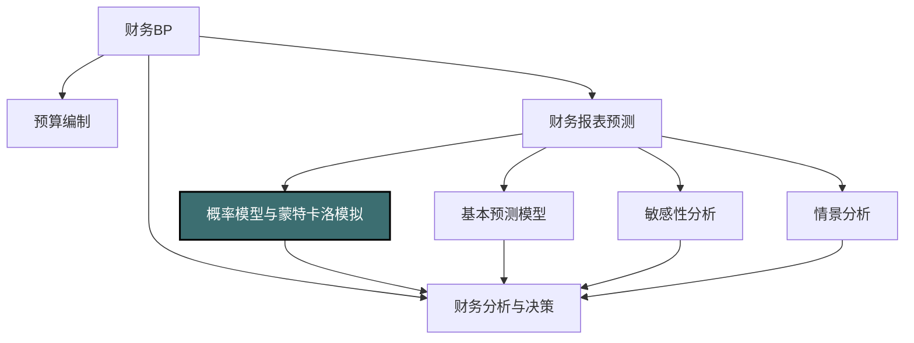

---
{"dg-publish":true,"permalink":"/08-财务专业/财务BP/笔记/财务预测与模型/概率模型与蒙特卡洛模拟/"}
---

#财务BP #财务预测 #概率模型 #蒙特卡洛模拟 #风险分析

## 概述

概率模型与蒙特卡洛模拟是财务BP中的高级量化工具，通过引入随机性和概率分布，使财务预测从确定性单点预测转变为概率性区间预测。与传统预测方法相比，概率模型能更准确地反映现实世界的不确定性，蒙特卡洛模拟则通过大量随机抽样计算，生成关键财务指标的完整概率分布。这些方法不仅提供更全面的风险评估，还能量化不确定性对决策的影响，帮助管理层在复杂多变的环境中做出更科学的决策。随着计算能力的提升和决策环境的复杂化，概率模型与蒙特卡洛模拟已成为现代财务分析的重要组成部分。

## 概率模型与蒙特卡洛模拟在财务BP中的位置

概率模型与蒙特卡洛模拟处于财务预测方法的最高层次：
- 超越确定性预测，提供完整概率分布
- 整合多个不确定变量的综合影响
- 量化风险和机会的统计特性
- 为风险偏好明确的决策提供客观依据

## 基本概念与原理

### 确定性模型VS概率模型

传统财务预测模型与概率模型的根本区别：

| 特征 | 确定性模型 | 概率模型 |
|-----|-----------|---------|
| 输入变量 | 单一"最佳估计"值 | 概率分布（范围和概率） |
| 计算方法 | 直接计算公式 | 随机抽样和统计分析 |
| 输出结果 | 单一点估计 | 完整概率分布 |
| 不确定性表达 | 不直接表达 | 明确量化 |
| 风险度量 | 有限（通常通过情景） | 丰富（方差、分位数、尾部风险等） |
| 计算复杂度 | 较低 | 较高 |

### 概率分布的基本类型

在财务建模中常用的概率分布：

1. **正态分布（Normal/Gaussian）**
   - 特点：钟形曲线，完全对称
   - 适用场景：许多自然和经济现象，如市场收益率
   - 参数：均值μ和标准差σ
   - 适用变量：经济增长率、通胀率

2. **三角分布（Triangular）**
   - 特点：由最小值、最可能值和最大值定义
   - 适用场景：专家估计的不确定变量
   - 参数：最小值a、最可能值m、最大值b
   - 适用变量：销售增长率、项目完成时间

3. **均匀分布（Uniform）**
   - 特点：在区间内等概率
   - 适用场景：完全不确定的变量
   - 参数：最小值a、最大值b
   - 适用变量：新产品定价范围、市场份额变动

4. **PERT分布（Program Evaluation and Review Technique）**
   - 特点：类似三角分布但更平滑，中间权重更大
   - 适用场景：专家估计的不确定性
   - 参数：最小值、最可能值、最大值
   - 适用变量：成本估计、销售预测

5. **对数正态分布（Lognormal）**
   - 特点：非对称，只有正值，有长尾
   - 适用场景：价格、资产价值等永远为正的变量
   - 参数：均值和标准差（对数变换后）
   - 适用变量：股票价格、资产价值、损失规模

### 蒙特卡洛模拟的基本原理

蒙特卡洛模拟是一种通过大量随机采样来近似求解复杂问题的计算方法：

**基本步骤**：
1. 识别关键不确定输入变量
2. 为每个变量确定合适的概率分布
3. 生成每个变量的随机值（一次"模拟"）
4. 使用这些随机值计算模型输出
5. 重复步骤3-4数千次或数万次
6. 分析结果的统计特性（均值、方差、分位数等）

**核心特点**：
- 通过重复随机抽样逼近真实概率分布
- 能处理多个相互关联的不确定变量
- 无需简化复杂的模型结构
- 可处理非线性关系和极端情况

## 概率模型的构建方法

### 1. 确定模型结构和关键变量

构建概率模型的第一步是确定清晰的模型框架：

**模型结构确定**：
- 识别预测的核心输出变量（如NPV、ROI、销售收入）
- 确定输入变量与输出变量的数学关系
- 建立计算公式和逻辑关系

**关键不确定变量识别**：
- 进行敏感性分析，识别高敏感度变量
- 评估各变量的不确定性程度
- 筛选同时具有高敏感度和高不确定性的变量
- 通常选择3-8个关键变量进行概率建模

### 2. 概率分布选择与参数估计

为关键不确定变量选择适当的概率分布：

**分布选择考虑因素**：
- 变量的物理或经济特性（如只有正值）
- 历史数据的统计特性
- 分布的适用性和解释性
- 建模复杂度与精度的平衡

**参数估计方法**：

1. **基于历史数据**
   - 收集足够的历史数据
   - 使用统计拟合方法确定最佳分布
   - 估计分布参数（如均值、标准差）
   - 进行优度检验验证拟合效果

2. **基于专家判断**
   - 询问领域专家提供估计范围
   - 获取最小值、最可能值、最大值
   - 转换为适当的概率分布（如PERT或三角分布）
   - 必要时使用德尔菲法整合多位专家意见

3. **混合方法**
   - 结合历史数据和专家判断
   - 使用贝叶斯方法更新先验分布
   - 调整历史分布以反映未来可能的变化

### 3. 相关性处理

现实世界中的变量往往相互关联，忽略相关性会导致错误结果：

**相关性类型**：
- 正相关：一个变量增加时另一个也增加
- 负相关：一个变量增加时另一个减少
- 非线性相关：变量间存在复杂的关系模式

**相关性建模方法**：
- 使用相关系数矩阵（如Pearson相关系数）
- 引入copula函数处理非线性相关
- 设置条件概率关系（如"如果GDP增长超过3%，则销售增长率分布改变"）

**实施技巧**：
- 基于历史数据计算相关系数
- 咨询专家判断相关性强弱
- 避免过度复杂的相关结构
- 进行相关性敏感性测试

### 4. 模型验证

概率模型在使用前需要进行充分验证：

**验证方法**：
- 与历史数据对比检验
- 极端情况测试
- 合理性检查（结果是否符合逻辑）
- 与其他模型或方法比较

**常见验证问题**：
- 分布选择不当导致不合理结果
- 忽略重要相关性导致风险低估
- 模型结构错误导致系统性偏差
- 抽样次数不足导致统计不稳定

## 蒙特卡洛模拟的实施步骤

### 1. 模拟设计

蒙特卡洛模拟前需要进行详细规划：

**关键设计决策**：
- 确定模拟次数（通常5,000-10,000次）
- 选择合适的随机数生成方法
- 确定结果记录与分析方式
- 规划敏感性测试和情景组合

**模拟质量保证**：
- 使用高质量的随机数生成器
- 实施方差减少技术提高效率
- 使用Latin Hypercube等抽样方法提高覆盖度
- 设置适当的收敛标准

### 2. 模拟执行

执行蒙特卡洛模拟的技术考虑：

**执行流程**：
1. 初始化模拟环境和参数
2. 对每次模拟迭代：
   - 生成所有不确定变量的随机值
   - 考虑变量间的相关性
   - 计算模型结果
   - 保存结果
3. 收集所有迭代的结果集

**性能优化**：
- 使用高效编程语言或专业软件
- 实施并行计算加速模拟
- 优化模型计算逻辑减少运算量
- 采用增量式模拟方法

### 3. 结果分析与解释

蒙特卡洛模拟后的结果分析是关键价值所在：

**基本统计分析**：
- 计算均值、中位数、标准差
- 确定各百分位数（如P10、P50、P90）
- 分析极端值和异常值
- 观察分布形状（偏度、峰度）

**图形化分析**：
- 绘制频率分布直方图
- 生成累积概率分布曲线
- 制作箱线图比较不同情景
- 散点图分析变量关系

**风险度量**：
- 计算各类风险指标（VaR、CVaR等）
- 分析下行风险概率（低于目标的概率）
- 评估上行潜力（超过目标的可能性）
- 分析极端情况（尾部风险）

**决策支持分析**：
- 成功/失败概率分析
- 条件价值分析（"如果A发生，B的分布是什么"）
- 关键驱动因素排序
- 阈值分析（实现目标所需的最低值）

## 蒙特卡洛模拟的高级技术

### 1. 随机过程模拟

模拟随时间变化的不确定性：

**常见随机过程**：
- 几何布朗运动（GBM）：适用于资产价格
- 均值回归过程：适用于利率、商品价格
- 跳跃扩散过程：模拟突发事件
- 时间序列模型（ARIMA等）：一般经济变量

**实施方法**：
- 定义适当的随机微分方程
- 使用离散时间步长模拟轨迹
- 确保路径相关性和时间一致性
- 生成多条可能的未来路径

### 2. 条件模拟与动态决策

模拟具有决策点的复杂流程：

**条件模拟技术**：
- 在关键时点评估条件
- 基于条件结果改变模拟路径
- 模拟不同决策策略的结果
- 评估最优决策规则

**与实物期权结合**：
- 模拟具有灵活性的投资决策
- 评估扩张、收缩、放弃等选项价值
- 确定最优执行策略
- 量化决策灵活性的价值

### 3. 贝叶斯更新与自适应模拟

随新信息到来更新模型：

**贝叶斯更新机制**：
- 设定先验概率分布
- 随新数据到来更新为后验分布
- 持续调整模型参数和预测
- 量化预测不确定性的变化

**自适应模拟技术**：
- 根据中间结果调整模拟方向
- 对高价值或高风险区域增加抽样密度
- 动态调整相关性结构
- 更高效地探索决策空间

## 在财务BP中的应用场景

### 1. 资本预算与投资评估

**目标**：评估投资项目的预期收益和风险特性

**关键应用**：
- 净现值(NPV)和内部收益率(IRR)的概率分布
- 投资回收期的不确定性分析
- 项目成功/失败概率评估
- 最差情况分析和尾部风险评估

**决策支持方式**：
- 比较不同项目的风险调整收益
- 设定风险偏好一致的投资标准
- 识别提高成功概率的关键因素
- 设计风险缓解措施

### 2. 财务预测与预算制定

**目标**：生成更可靠的财务预测和合理的预算目标

**关键应用**：
- 收入和利润预测的置信区间
- 预算达成概率分析
- 财务指标（如EPS）的分布预测
- 不同业务单元贡献的风险分析

**决策支持方式**：
- 设定既有挑战性又有合理达成概率的目标
- 识别影响预算实现的关键风险因素
- 建立更科学的资源分配机制
- 设计绩效激励与风险承担的平衡机制

### 3. 估值与并购分析

**目标**：更准确地评估企业价值和并购风险

**关键应用**：
- 目标公司估值的不确定性分析
- 协同效应实现概率的评估
- 整合风险的量化分析
- 不同支付方式的风险收益对比

**决策支持方式**：
- 确定合理的出价范围和最高出价
- 设计基于风险的交易结构（如或有支付）
- 评估不同融资方案的风险特性
- 识别需重点关注的尽职调查领域

### 4. 战略规划与资源配置

**目标**：制定在不确定环境下最优的资源配置策略

**关键应用**：
- 业务组合风险收益分析
- 不同战略路径的概率评估
- 资源配置效率与风险平衡分析
- 战略转型成功概率评估

**决策支持方式**：
- 构建风险效率前沿的业务组合
- 识别具有共同风险因素的业务单元
- 优化风险分散与战略聚焦的平衡
- 设计阶段性投资和动态调整机制

### 5. 风险管理与压力测试

**目标**：评估极端情况下的财务韧性和制定风险应对策略

**关键应用**：
- 流动性风险和偿债能力分析
- 宏观经济冲击对财务状况的影响
- 融资能力和债务契约违约风险
- 市场风险和信用风险的综合评估

**决策支持方式**：
- 确定风险缓冲资源（如现金储备）的适当水平
- 设计多层次风险缓解策略
- 建立早期预警指标和触发机制
- 优化资本结构和债务期限结构

## 实际案例：能源投资项目蒙特卡洛分析

### 背景
某能源公司计划投资20亿元开发一个新能源项目，预期使用寿命15年。管理层需要全面评估项目的风险收益特性，并确定在不确定性下的投资决策。

### 模型设计

**关键不确定变量识别**：
通过敏感性分析和专家访谈，确定以下关键不确定变量：
1. 初始投资成本
2. 能源价格及其长期趋势
3. 产能利用率
4. 运营成本增长率
5. 系统效率衰减率
6. 折现率

**概率分布设定**：

| 变量 | 分布类型 | 参数 |
|-----|---------|------|
| 初始投资成本 | 三角分布 | 最小=18亿元，最可能=20亿元，最大=24亿元 |
| 能源价格初始值 | 对数正态 | 均值=0.65元/度，标准差=0.08元/度 |
| 能源价格年增长率 | 正态分布 | 均值=3%，标准差=1.5% |
| 产能利用率 | PERT分布 | 最小=60%，最可能=75%，最大=85% |
| 运营成本增长率 | 正态分布 | 均值=2.5%，标准差=1% |
| 系统效率衰减率 | 三角分布 | 最小=0.5%/年，最可能=1%/年，最大=1.8%/年 |
| 折现率 | 三角分布 | 最小=6%，最可能=8%，最大=10% |

**相关性设定**：
- 能源价格与运营成本增长率：+0.4（正相关）
- 初始投资成本与系统效率衰减率：-0.3（负相关）
- 其他变量间假设独立

### 模拟执行

**模拟设计**：
- 执行10,000次蒙特卡洛模拟
- 使用Latin Hypercube采样提高效率
- 时间步长为1年，模拟完整15年周期
- 计算净现值(NPV)、内部收益率(IRR)和回收期

**模拟执行与验证**：
- 使用专业蒙特卡洛模拟软件
- 验证收敛性和统计稳定性
- 进行边界条件检查和合理性测试
- 确保所有相关性正确实现

### 模拟结果分析

**NPV分析结果**：

| 统计指标 | 数值（亿元） |
|---------|------------|
| 均值 | 3.24 |
| 中位数 | 3.15 |
| 标准差 | 2.78 |
| 最小值 | -4.62 |
| 最大值 | 12.36 |
| P10（10%分位数） | -0.35 |
| P90（90%分位数） | 6.83 |
| 负值概率（NPV<0） | 14.3% |

**IRR分析结果**：

| 统计指标 | 数值（%） |
|---------|----------|
| 均值 | 12.6% |
| 中位数 | 12.4% |
| 标准差 | 3.8% |
| P10（10%分位数） | 7.8% |
| P90（90%分位数） | 17.4% |
| 低于目标IRR(8%)概率 | 11.7% |

**回收期分析结果**：

| 统计指标 | 数值（年） |
|---------|----------|
| 均值 | 8.3 |
| 中位数 | 8.1 |
| 标准差 | 1.9 |
| P10（10%分位数） | 6.2 |
| P90（90%分位数） | 10.7 |
| 超过10年概率 | 15.6% |

### 图形化分析

**NPV概率分布直方图**：

**累积概率分布曲线**：

**不同变量的敏感度雷达图**：

### 关键发现与决策建议

**风险收益分析**：
- 项目平均NPV为3.24亿元，具有良好的预期收益
- 项目有14.3%的概率出现负NPV，风险较为可控
- P10-P90区间较宽（-0.35亿至6.83亿），表明结果的高不确定性
- 关键风险是能源价格变化和产能利用率波动

**关键驱动因素分析**：
根据变量对NPV影响程度排序：
1. 能源价格及其增长率（37%的方差贡献）
2. 产能利用率（24%的方差贡献）
3. 初始投资成本（18%的方差贡献）
4. 折现率（12%的方差贡献）
5. 其他因素（9%的方差贡献）

**情景条件分析**：
- 当能源价格平均增长率>4.5%时，项目NPV几乎肯定为正
- 当产能利用率<65%时，项目有50%以上概率NPV为负
- 如初始投资超预算20%，项目IRR将降至平均10.3%

**决策建议**：
1. **批准投资但实施分阶段执行策略**：
   - 第一阶段投资70%，保留扩展或缩减的选择权
   - 设定明确的继续/暂停/扩展决策点和标准

2. **风险缓解措施**：
   - 探索能源价格对冲或长期供应协议
   - 设计灵活的运营模式，可根据市场条件调整产能
   - 建立严格的成本控制机制，特别关注初期投资

3. **监控指标与触发条件**：
   - 关键监控指标：前两年的价格趋势、产能爬坡率、实际投资偏差
   - 正面触发点：如果第一年产能>80%，加速第二阶段投资
   - 负面触发点：如果价格增长<1%，重新评估项目规模

### 与传统分析的比较

对比同一项目使用传统单点估计和蒙特卡洛模拟的结果差异：

| 分析维度 | 传统单点估计 | 蒙特卡洛模拟 |
|---------|------------|------------|
| NPV结果 | 3.5亿元(单一值) | 3.24亿元(均值)，-0.35至6.83亿元(P10-P90) |
| 风险评估 | 基于情景的有限分析 | 完整概率分布，明确量化风险 |
| 决策依据 | 项目有吸引力（NPV>0） | 综合预期收益和风险，设计灵活执行策略 |
| 风险缓解 | 一般性建议 | 针对特定风险因素的具体措施 |
| 管理洞见 | 有限 | 丰富（关键驱动因素、概率阈值、风险来源等） |

## 概率模型与蒙特卡洛模拟的实施挑战与解决方案

### 1. 数据质量与可获取性

**挑战**：获取足够的历史数据或可靠的专家估计

**解决方案**：
- 使用替代数据源（如类似项目、行业基准）
- 结合多种信息源（历史数据+专家意见+市场预测）
- 应用贝叶斯方法整合先验信息和有限样本
- 进行数据敏感性测试，理解数据质量对结果的影响

### 2. 分布选择与参数估计

**挑战**：为变量选择合适分布并准确估计参数

**解决方案**：
- 使用统计测试选择最佳拟合分布
- 应用引导法(bootstrapping)评估参数估计不确定性
- 在缺乏信息时使用更保守的分布（如三角分布）
- 验证分布尾部行为的合理性

### 3. 相关性建模

**挑战**：捕捉变量间复杂依赖关系

**解决方案**：
- 使用历史数据计算相关矩阵
- 应用copula函数处理非线性依赖
- 实施层次相关结构减少复杂度
- 进行相关性敏感度分析

### 4. 计算效率与技术实现

**挑战**：管理复杂模型的计算负担

**解决方案**：
- 使用专业蒙特卡洛模拟软件（@Risk、Crystal Ball等）
- 应用方差减少技术提高效率
- 实施并行计算加速模拟
- 优化模型结构减少不必要的复杂性

### 5. 结果解释与沟通

**挑战**：向非专业人士解释概率结果

**解决方案**：
- 使用直观可视化（如瀑布图、热力图、箱线图）
- 翻译技术指标为业务含义（如"90%确信项目回报率>X%"）
- 将结果与熟悉的风险概念联系
- 提供交互式仪表板允许决策者探索不同假设

## 实用工具与软件

### 电子表格与插件
- Excel + @Risk (Palisade)
- Excel + Crystal Ball (Oracle)
- Excel + ModelRisk (Vose)

### 专业统计与模拟软件
- R（开源统计计算环境）
- Python（pandas, numpy, scipy等库）
- MATLAB（金融领域常用）
- SimulAr（专注财务模拟）

### 企业级解决方案
- Oracle Crystal Ball Enterprise Performance Management
- SAS Financial Management
- IBM Planning Analytics

## 与其他分析方法的关系

- [[08-财务专业/财务BP/笔记/财务预测与模型/敏感性分析\|敏感性分析]] - 蒙特卡洛模拟可视为敏感性分析的高级扩展，同时考虑多变量变化和概率
- [[08-财务专业/财务BP/笔记/财务预测与模型/情景分析\|情景分析]] - 概率模型提供比离散情景更连续的可能性范围，但通常缺乏情景分析的叙事逻辑
- [[08-财务专业/财务BP/笔记/财务预测与模型/财务报表预测\|财务报表预测]] - 概率模型为传统财务预测添加不确定性维度，从单点预测扩展为区间预测
- [[风险管理\|风险管理]] - 蒙特卡洛模拟是现代风险管理的核心量化工具，提供风险度量和尾部风险评估
- [[实物期权分析\|实物期权分析]] - 蒙特卡洛模拟是评估复杂实物期权价值的主要方法
- [[资本配置\|资本配置]] - 概率模型帮助在风险调整基础上优化资本配置决策

## 思考与练习

1. 选择一个投资项目，识别关键不确定变量，并设计一个基本的蒙特卡洛模拟模型。讨论如何选择每个变量的概率分布和参数。
2. 比较蒙特卡洛模拟与传统敏感性分析和情景分析的优缺点。在哪些情况下蒙特卡洛模拟价值最大？
3. 讨论相关性在蒙特卡洛模拟中的重要性。举例说明忽略相关性可能导致的错误结论。
4. 设计一个简单的产品定价策略案例，使用蒙特卡洛模拟评估不同定价方案的风险收益特性。
5. 探讨如何将蒙特卡洛模拟结果有效整合到企业决策流程中。有哪些常见的沟通障碍，如何克服？ 