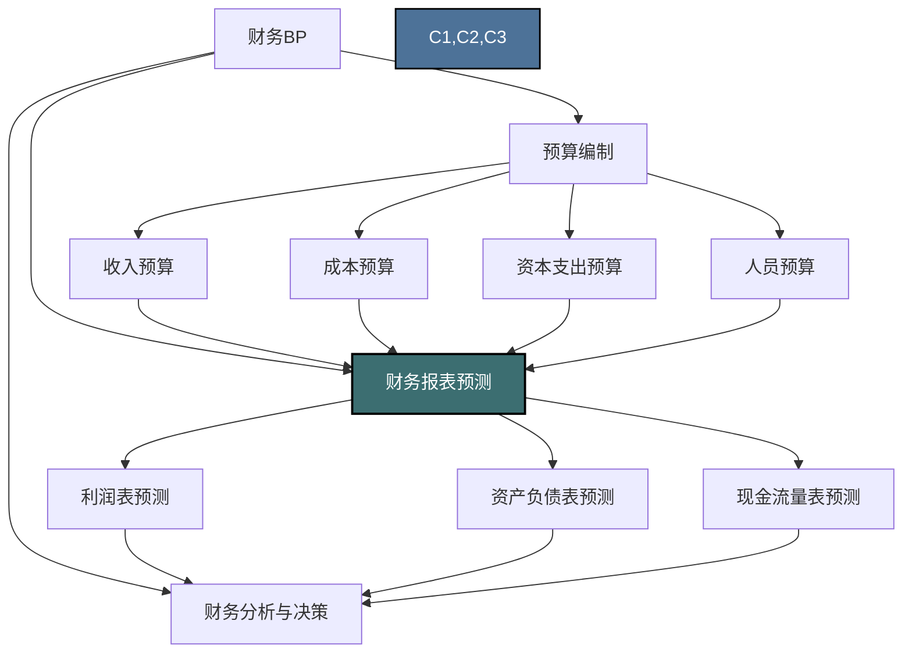
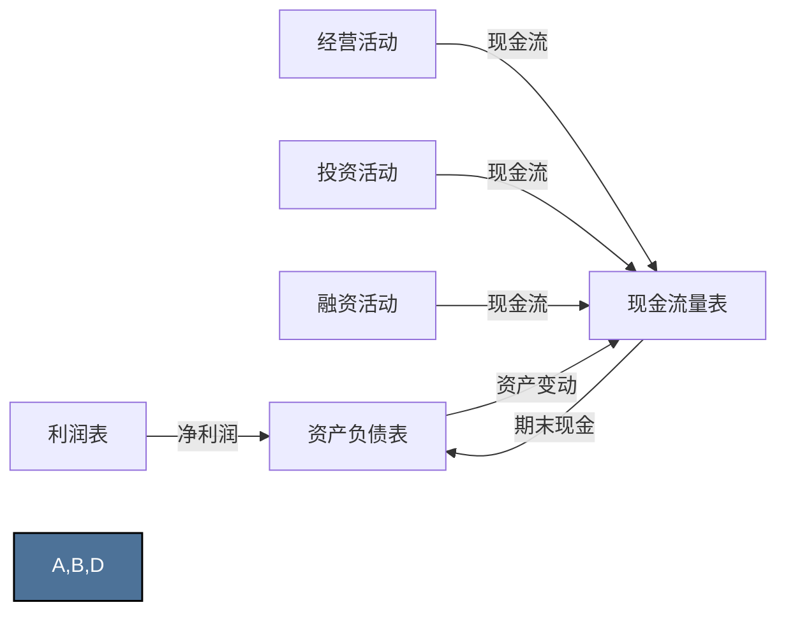
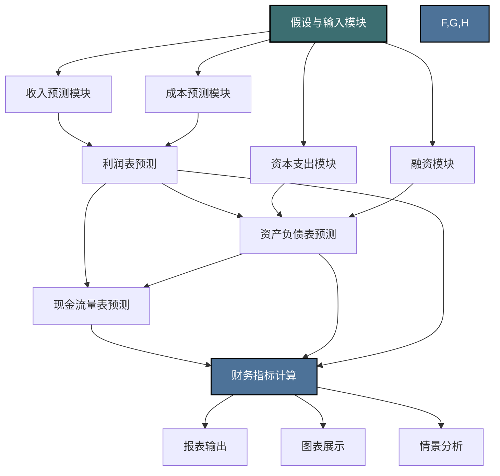

---
{"dg-publish":true,"permalink":"/08-财务专业/财务BP/笔记/财务预测与模型/财务报表预测/"}
---

#财务BP #财务预测 #报表预测 #财务模型

## 概述

财务报表预测是财务BP中的核心环节，通过对未来期间的损益表、资产负债表和现金流量表进行预测，形成企业未来财务状况、经营成果和现金流量的完整画像。财务报表预测是连接各类预算的枢纽，不仅整合了收入预算、成本预算、资本支出预算等各项子预算，还能反映企业战略规划的财务影响，为管理决策、投资分析和融资规划提供关键依据。高质量的财务报表预测模型，需要合理的假设、科学的方法和对企业内外部环境的深刻理解。

## 财务报表预测在财务BP中的位置

财务报表预测是各项预算工作的集大成者：
- 整合所有预算模块的输出
- 验证各项预算之间的逻辑一致性
- 反映战略决策对财务状况的综合影响
- 提供管理层、股东和投资者关注的财务指标

## 财务报表预测的基本框架

### 三大报表之间的关系

三大财务报表相互关联，形成闭环系统：
- 利润表反映经营成果，净利润影响所有者权益
- 资产负债表反映财务状况，资产和负债的变动影响现金流
- 现金流量表反映现金流动，期末现金余额影响资产负债表

### 预测的时间跨度

财务报表预测通常涵盖不同时间跨度，精度与详细程度也相应变化：

1. **短期预测（1年以内）**
   - 通常按月或季度预测
   - 高度详细，包含具体科目
   - 与年度预算直接关联
   - 主要用于经营控制和短期决策

2. **中期预测（1-3年）**
   - 通常按季度或年度预测
   - 中等详细程度，合并相关科目
   - 包含主要经营计划和投资项目
   - 用于业务规划和资源配置

3. **长期预测（3-5年或更长）**
   - 通常按年度预测
   - 低详细度，聚焦关键指标
   - 基于战略规划和市场趋势
   - 用于战略决策和长期融资

## 财务报表预测的方法

### 1. 利润表预测方法

利润表预测通常采用自上而下与自下而上相结合的方法：

**基本预测逻辑**：
- 收入预测 → 成本费用预测 → 税前利润预测 → 税后净利润预测

**常用方法**：

1. **收入预测方法**
   - 销量与单价法：预期销量 × 预期单价
   - 增长率法：上期收入 × (1 + 增长率)
   - 市场份额法：市场总量 × 预期市场份额
   - 产能驱动法：预期产能 × 利用率 × 单价

2. **成本预测方法**
   - 毛利率法：收入 × (1 - 预期毛利率)
   - 成本结构分析法：分别预测各成本项目再汇总
   - 单位成本驱动法：单位成本 × 预期销量
   - 固定与变动成本分离法：固定成本 + 变动成本率 × 收入

3. **期间费用预测方法**
   - 销售费用：收入 × 销售费用率，或详细预算汇总
   - 管理费用：通常根据人员计划和行政预算预测
   - 研发费用：基于研发计划和历史费用率
   - 财务费用：根据债务规模和预期利率预测

4. **利润预测汇总**
   - 营业利润 = 收入 - 成本 - 期间费用
   - 税前利润 = 营业利润 + 其他收益 - 资产减值
   - 净利润 = 税前利润 × (1 - 所得税率)

**预测技巧**：
- 关注收入成本的匹配性
- 考虑规模效应对固定成本分摊的影响
- 注意季节性因素对季度业绩的影响
- 合理预测非经常性损益

### 2. 资产负债表预测方法

资产负债表预测需要考虑资产投入、负债变化和利润积累：

**基本预测逻辑**：
- 资产变动预测 + 负债变动预测 + 权益变动预测 = 平衡表

**常用方法**：

1. **流动资产预测**
   - 货币资金：通过现金流量表预测计算
   - 应收账款：收入 × 平均收款周期 / 365
   - 存货：成本 × 平均存货周期 / 365
   - 其他流动资产：基于历史比例或具体计划

2. **非流动资产预测**
   - 固定资产：期初余额 + 资本支出 - 折旧 - 处置
   - 无形资产：期初余额 + 新增 - 摊销
   - 长期投资：基于投资计划和战略规划
   - 其他非流动资产：通常保持稳定或基于特定计划

3. **流动负债预测**
   - 短期借款：基于融资计划和现金需求
   - 应付账款：成本 × 平均付款周期 / 365
   - 预收款项：基于销售模式和客户结构
   - 应付职工薪酬：基于人员预算

4. **非流动负债预测**
   - 长期借款：基于长期融资计划
   - 应付债券：根据债券发行和偿还计划
   - 长期应付款：基于融资租赁等长期付款安排

5. **所有者权益预测**
   - 股本：基于增发计划
   - 资本公积：基于融资计划和股权激励
   - 未分配利润：期初 + 本期净利润 - 分配股利

**预测技巧**：
- 注意资产负债表的平衡性检查
- 关注营运资金与业务规模的匹配关系
- 考虑资本结构优化和财务安全性
- 与融资规划和投资计划保持一致

### 3. 现金流量表预测方法

现金流量表预测是财务预测的重要组成部分，在[现金流预测](/notes/预算编制基础/现金流预测.md)中已有详细介绍。在财务报表预测中，现金流量表主要用于验证三大表之间的一致性。

**基本预测逻辑**：
- 经营活动现金流 + 投资活动现金流 + 融资活动现金流 = 现金净增加额

**预测方法整合**：
1. **直接法预测**：直接预测各项现金收支
2. **间接法预测**：从净利润调整到经营活动现金流
3. **资产负债表变动法**：利用资产负债表科目变动推导现金流

**与三表整合的关键检查点**：
- 净利润与经营现金流的合理匹配
- 资本支出与固定资产变动的一致性
- 借款变动与融资现金流的匹配
- 期末现金余额与资产负债表货币资金的一致性

### 4. 财务报表预测的整合技术

为确保三大报表之间的一致性，通常采用以下技术：

1. **平衡项技术**
   - 设定自动平衡项（通常为短期借款或现金）
   - 当资产≠负债+所有者权益时，平衡项自动调整

2. **检查公式设置**
   - 利润表净利润 = 资产负债表未分配利润变动 + 分配的股利
   - 现金流量表期末现金 = 资产负债表货币资金
   - 资产合计 = 负债合计 + 所有者权益合计

3. **比率分析验证**
   - 使用关键财务比率验证预测合理性
   - 与历史数据和行业标准比较
   - 识别异常波动并解释或调整

## 财务报表预测模型构建

### 1. 模型设计原则

构建有效的财务报表预测模型需遵循以下原则：

1. **模块化设计**
   - 将模型分解为相互连接的功能模块
   - 各模块可独立维护和更新
   - 模块间通过清晰的接口传递数据

2. **假设透明化**
   - 关键假设集中管理，清晰标识
   - 假设变更简单直接，影响自动传导
   - 提供假设合理性的支持数据

3. **灵活性与可扩展性**
   - 易于调整预测期限和粒度
   - 能够添加新的产品线或业务单元
   - 支持多情景对比分析

4. **错误追踪与验证**
   - 内置一致性检查和错误提示
   - 重要计算进行交叉验证
   - 提供审计轨迹和计算依据

### 2. 财务报表预测模型结构

**基本模型结构**：

**各模块功能说明**：

1. **假设与输入模块**
   - 宏观经济假设（GDP增长、通胀率等）
   - 行业假设（市场规模、竞争格局）
   - 公司特定假设（市场份额、价格策略）
   - 运营参数（产能、人员规划等）

2. **业务预测模块**
   - 收入预测（按产品线、客户类型等）
   - 成本预测（直接成本、间接成本）
   - 费用预测（销售、管理、研发等）
   - 资本支出规划

3. **财务报表计算模块**
   - 利润表计算引擎
   - 资产负债表计算引擎
   - 现金流量表计算引擎

4. **分析与输出模块**
   - 财务指标计算（盈利能力、运营效率等）
   - 敏感性分析工具
   - 情景比较分析
   - 图表与报告生成

### 3. 预测模型开发步骤

构建财务报表预测模型的典型步骤：

1. **需求分析与规划**
   - 确定模型目的和使用者
   - 明确预测期限和粒度
   - 确定需要的报表和分析维度

2. **历史数据收集与分析**
   - 收集3-5年历史财务数据
   - 分析关键财务指标的历史趋势
   - 识别变动规律和异常情况

3. **假设制定**
   - 基于战略规划确定业务假设
   - 结合市场研究确定外部假设
   - 与各部门协作制定运营假设

4. **模型框架搭建**
   - 设计整体架构和模块
   - 建立核心计算逻辑
   - 设计数据流转路径

5. **模块开发与测试**
   - 按模块逐步开发计算引擎
   - 使用历史数据验证模型准确性
   - 进行压力测试和边界测试

6. **整合与校验**
   - 连接各模块，确保数据流转
   - 验证三大报表的平衡性
   - 检查关键指标的合理性

7. **用户界面与报告**
   - 设计易用的输入界面
   - 创建标准化报告模板
   - 开发可视化分析图表

8. **文档与培训**
   - 编写模型使用手册
   - 提供计算逻辑说明
   - 培训相关人员使用模型

## 财务报表预测的常见挑战与解决方案

### 1. 数据质量与一致性

**挑战**：历史数据不完整、不准确或格式不一致

**解决方案**：
- 建立数据质量检查程序
- 标准化数据格式和定义
- 使用数据库管理系统存储和处理历史数据
- 建立数据变更审计trail

### 2. 预测准确性

**挑战**：预测结果与实际情况偏差较大

**解决方案**：
- 定期比较预测与实际结果，分析偏差原因
- 不断优化预测方法和参数
- 使用多种预测方法交叉验证
- 采用区间预测而非点预测
- 进行情景分析，展示可能的结果范围

### 3. 模型复杂性

**挑战**：模型过于复杂难以维护，或过于简单缺乏准确性

**解决方案**：
- 遵循"足够复杂但不过度复杂"原则
- 关注核心业务驱动因素和重大财务项目
- 使用模块化设计降低复杂度
- 提供清晰文档说明各模块功能

### 4. 假设管理

**挑战**：假设分散、不透明或难以更新

**解决方案**：
- 集中管理所有关键假设
- 明确假设来源和制定依据
- 建立假设审批和更新机制
- 使用情景分析评估不同假设的影响

### 5. 业务变化适应性

**挑战**：业务模式变化导致预测模型失效

**解决方案**：
- 设计可扩展的模型架构
- 定期审视和更新预测逻辑
- 建立模型变更管理流程
- 保持模块间的松耦合，便于部分更新

## 行业特点与财务报表预测

不同行业的财务报表预测有各自特点：

| 行业 | 关键预测重点 | 特殊考虑因素 | 预测难点 |
|-----|------------|------------|---------|
| 制造业 | 产能利用率、原材料成本 | 资本支出周期、存货周转 | 原材料价格波动、产能扩张时机 |
| 零售业 | 同店增长率、季节性 | 租赁成本、营运资金需求 | 消费趋势变化、线上线下融合 |
| 科技业 | 研发投入、产品生命周期 | 知识产权价值、高增长率 | 技术更新快、商业模式变革 |
| 服务业 | 人力成本、客户留存率 | 轻资产模式、服务产能 | 人才成本上升、差异化竞争 |
| 金融业 | 利差、风险准备金 | 监管资本要求、风险管理 | 利率环境变化、信贷周期 |
| 房地产 | 项目周期、土地成本 | 预售模式特点、融资约束 | 政策变化、市场周期性强 |

## 实际案例：制造企业的财务报表预测

### 背景
某中型制造企业A，主要生产工业零部件，年销售额约5亿元，计划未来3年业务扩张，需要建立完整的财务报表预测模型，用于评估扩张计划的财务影响。

### 预测假设设定

**宏观经济假设**：
- GDP年增长率：5%
- 行业增长率：7%
- 通货膨胀率：3%

**业务假设**：
- 销量增长：第一年10%，第二年15%，第三年12%
- 产品价格：年均上涨2%（低于通胀，考虑竞争因素）
- 产能扩张：第二年投资8000万元新生产线
- 市场份额：从当前8%提升至三年后的10%

**运营假设**：
- 毛利率：保持在40%左右，第二年因新产线投产初期略有下降
- 销售费用率：11%，随规模扩大略有下降
- 管理费用：相对固定部分占60%，变动部分随收入增长
- 存货周转天数：从当前的90天优化至75天
- 应收账款周转天数：保持在60天水平
- 应付账款周转天数：从45天延长至55天

**财务假设**：
- 资本支出：维持性支出每年2000万，第二年扩张性支出8000万
- 债务融资：第二年新增长期贷款5000万，年利率5.5%
- 股利政策：每年分配上年净利润的30%
- 所得税率：25%

### 预测结果摘要

#### 1. 利润表预测（单位：万元）

| 项目 | 基期 | 第一年 | 第二年 | 第三年 |
|-----|-----|-------|-------|-------|
| 营业收入 | 50,000 | 56,100 | 65,877 | 75,402 |
| 营业成本 | 30,000 | 33,660 | 39,855 | 45,241 |
| 毛利 | 20,000 | 22,440 | 26,022 | 30,161 |
| 销售费用 | 5,500 | 6,171 | 7,181 | 8,142 |
| 管理费用 | 4,000 | 4,366 | 4,927 | 5,483 |
| 财务费用 | 800 | 780 | 1,080 | 1,030 |
| 利润总额 | 9,700 | 11,123 | 12,834 | 15,506 |
| 所得税 | 2,425 | 2,781 | 3,209 | 3,877 |
| 净利润 | 7,275 | 8,342 | 9,626 | 11,630 |
| 净利率 | 14.6% | 14.9% | 14.6% | 15.4% |

#### 2. 资产负债表关键项目预测（单位：万元）

| 项目 | 基期 | 第一年 | 第二年 | 第三年 |
|-----|-----|-------|-------|-------|
| **资产** |  |  |  |  |
| 货币资金 | 8,000 | 9,283 | 6,559 | 13,698 |
| 应收账款 | 8,219 | 9,230 | 10,839 | 12,402 |
| 存货 | 7,397 | 7,991 | 9,126 | 9,300 |
| 固定资产净值 | 30,000 | 28,600 | 33,480 | 31,652 |
| 资产总计 | 58,000 | 59,784 | 64,879 | 72,138 |
| **负债与所有者权益** |  |  |  |  |
| 应付账款 | 3,699 | 4,541 | 5,396 | 6,122 |
| 短期借款 | 6,000 | 5,000 | 3,000 | 2,000 |
| 长期借款 | 10,000 | 8,000 | 13,000 | 11,000 |
| 实收资本 | 15,000 | 15,000 | 15,000 | 15,000 |
| 未分配利润 | 19,400 | 23,340 | 24,780 | 34,210 |
| 负债与所有者权益合计 | 58,000 | 59,784 | 64,879 | 72,138 |
| 资产负债率 | 36.1% | 33.3% | 35.4% | 31.4% |

#### 3. 现金流量表关键项目预测（单位：万元）

| 项目 | 第一年 | 第二年 | 第三年 |
|-----|-------|-------|-------|
| 经营活动现金流量净额 | 8,928 | 9,107 | 14,209 |
| 投资活动现金流量净额 | -2,000 | -10,000 | -2,000 |
| 筹资活动现金流量净额 | -5,645 | -1,830 | -5,069 |
| 现金净增加额 | 1,283 | -2,723 | 7,140 |
| 期末现金余额 | 9,283 | 6,559 | 13,698 |

#### 4. 关键财务指标预测

| 指标 | 基期 | 第一年 | 第二年 | 第三年 |
|-----|-----|-------|-------|-------|
| 营业收入增长率 | - | 12.2% | 17.4% | 14.5% |
| 净利润增长率 | - | 14.7% | 15.4% | 20.8% |
| 毛利率 | 40.0% | 40.0% | 39.5% | 40.0% |
| 净利率 | 14.6% | 14.9% | 14.6% | 15.4% |
| 总资产周转率 | 0.86 | 0.94 | 1.02 | 1.05 |
| 净资产收益率(ROE) | 21.1% | 22.4% | 23.4% | 25.1% |
| 存货周转天数 | 90 | 85 | 80 | 75 |
| 应收账款周转天数 | 60 | 60 | 60 | 60 |
| 应付账款周转天数 | 45 | 49 | 52 | 55 |

### 分析与洞见

**业务增长与盈利能力**：
- 收入预计三年复合增长率达14.7%，高于行业平均
- 净利润增速超过收入增速，表明规模效应显现
- 第二年因新产线投产，毛利率略有下降，第三年恢复

**资本效率与运营改善**：
- 存货周转明显加快，释放营运资金
- 总资产周转率逐年提升，资产利用效率改善
- 净资产收益率持续提高，股东回报增加

**财务状况与风险**：
- 资产负债率总体可控，保持在35%左右
- 第二年因扩产资金需求大，现金流偏紧
- 第三年现金流充沛，有能力进一步扩张或提高股东回报

**决策建议**：
- 扩产计划财务上可行，三年后公司各项指标更优
- 建议加强第二年的现金流管理，确保流动性安全
- 可考虑优化融资结构，减少短期借款占比
- 第三年可评估提高股利支付比例或加大再投资

## 与其他概念的关系

- [[08-财务专业/财务BP/笔记/预算编制基础/预算编制流程\|预算编制流程]] - 财务报表预测是预算编制成果的整合与输出
- [[08-财务专业/财务BP/笔记/预算编制基础/收入预测方法\|收入预测方法]] - 收入预测是利润表预测的基础和起点
- [[08-财务专业/财务BP/笔记/预算编制基础/成本预测方法\|成本预测方法]] - 成本预测决定了利润表的成本部分和毛利水平
- [[08-财务专业/财务BP/笔记/预算编制基础/资本支出预算\|资本支出预算]] - 资本支出影响固定资产变动和投资现金流
- [[08-财务专业/财务BP/笔记/预算编制基础/现金流预测\|现金流预测]] - 现金流预测是财务报表预测的重要组成部分
- [[08-财务专业/财务BP/笔记/预算编制基础/人员预算\|人员预算]] - 人员预算影响工资费用和相关负债预测

## 思考与练习

1. 分析你所在企业或熟悉的企业如何进行财务报表预测，评估其预测方法和准确性。
2. 对于一个新创立的企业，哪些因素最可能导致财务预测与实际结果的偏差？如何降低这些偏差？
3. 比较不同行业（如制造业、互联网企业、零售业）财务报表预测的侧重点有何不同？
4. 设计一个简单的Excel财务模型框架，要求能够预测未来三年的三大报表。
5. 讨论人工智能和大数据技术如何提升财务预测的准确性和效率。 