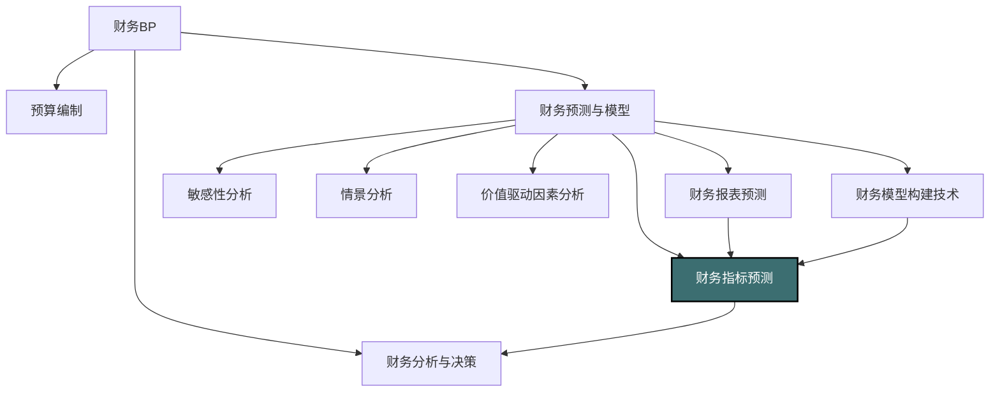

---
{"dg-publish":true,"permalink":"/08-财务专业/财务BP/笔记/财务预测与模型/财务指标预测/"}
---

#财务BP #财务预测 #KPI #绩效管理 #决策支持

## 概述

财务指标预测是财务BP中的关键环节，它将财务报表预测转化为更具分析价值和决策导向的指标体系。通过对关键财务指标进行科学预测，企业能够评估未来财务健康状况、识别潜在风险和机遇、设定合理的业绩目标，并为战略决策提供量化支持。财务指标预测不仅是对未来的展望，更是企业战略目标与财务表现之间的桥梁，为企业提供了检验战略可行性和评估业务发展路径的重要工具。

## 财务指标预测在财务BP中的位置



财务指标预测在财务BP中的核心作用：
- 将原始财务数据转化为更易理解和决策的指标体系
- 建立企业战略目标与财务表现之间的量化联系
- 为管理层绩效考核提供目标设定依据
- 为投资者和债权人提供企业未来价值和风险的评估工具
- 支持资源配置和业务组合优化决策

## 主要财务指标分类与预测重点

### 1. 盈利能力指标

**关键指标**：
- 毛利率：毛利/营业收入
- 营业利润率：营业利润/营业收入
- EBITDA利润率：EBITDA/营业收入
- 净利率：净利润/营业收入
- ROE（净资产收益率）：净利润/平均股东权益
- ROIC（投入资本回报率）：税后营业利润/平均投入资本
- ROA（资产回报率）：净利润/平均总资产

**预测重点**：
- 产品结构变化对毛利率的影响
- 规模效应和运营效率对营业利润率的作用
- 资本结构变化对ROE的影响
- 行业竞争格局变化对整体盈利能力的影响

### 2. 运营效率指标

**关键指标**：
- 应收账款周转率：营业收入/平均应收账款
- 存货周转率：营业成本/平均存货
- 总资产周转率：营业收入/平均总资产
- 固定资产周转率：营业收入/平均固定资产
- 营运资本周转率：营业收入/平均营运资本

**预测重点**：
- 信用政策调整对应收账款周转的影响
- 供应链和库存管理优化对存货周转的改善
- 资产结构变化对资产利用效率的影响
- 经营策略调整对整体运营效率的作用

### 3. 偿债能力与财务稳健性指标

**关键指标**：
- 流动比率：流动资产/流动负债
- 速动比率：(流动资产-存货)/流动负债
- 资产负债率：总负债/总资产
- 利息保障倍数：EBIT/利息费用
- 债务/EBITDA比率：总债务/EBITDA
- 净债务/权益比率：(总债务-现金)/股东权益

**预测重点**：
- 业务扩张对短期偿债能力的压力
- 融资计划对资本结构的影响
- 利率环境变化对利息负担的影响
- 现金流波动对债务偿还能力的影响

### 4. 现金流指标

**关键指标**：
- 经营现金流/销售收入
- 自由现金流：经营现金流-资本支出
- 现金转换率：经营现金流/净利润
- 资本支出/折旧比率
- 股息支付率：股息/净利润
- 债务偿还覆盖率：自由现金流/债务偿还额

**预测重点**：
- 利润转化为现金的能力变化
- 资本支出计划对自由现金流的影响
- 运营效率提升对现金转换率的改善
- 融资与分红政策对现金流平衡的影响

### 5. 增长与可持续性指标

**关键指标**：
- 收入增长率
- 利润增长率
- 可持续增长率：ROE×(1-股息支付率)
- 再投资率：资本支出/EBITDA
- 研发投入比率：研发费用/营业收入
- 市场份额变化率

**预测重点**：
- 市场需求与竞争对收入增长的影响
- 盈利能力提升对利润增长的贡献
- 资金需求与融资能力对可持续增长的约束
- 创新投入对长期增长潜力的支持

### 6. 估值相关指标

**关键指标**：
- 市盈率(P/E)：股价/每股收益
- 企业价值/EBITDA(EV/EBITDA)
- 市净率(P/B)：股价/每股净资产
- 股息收益率：每股股息/股价
- 经济增加值(EVA)：税后营业利润-(投入资本×资本成本率)

**预测重点**：
- 盈利增长对估值倍数的支持
- 资本回报率改善对企业价值的提升
- 资本结构优化对股东价值的影响
- 现金分配政策对投资者回报的影响

## 财务指标预测方法

### 1. 基于财务报表的推导法

通过对未来财务报表的预测，运用财务指标计算公式直接推导出相应指标预测值。

**方法步骤**：
1. 建立完整的财务报表预测模型
2. 基于财务报表预测数据和指标计算公式计算各期指标值
3. 分析指标趋势和变化驱动因素
4. 检验指标间的相互一致性

**适用场景**：
- 战略规划和长期财务预测
- 全面预算编制
- 融资需求分析
- 投资价值评估

**优缺点**：
- **优点**：系统性强，指标间保持一致性，能反映企业整体财务状况
- **缺点**：依赖于财务报表预测的准确性，对非财务指标预测支持有限

### 2. 趋势外推与统计分析法

基于历史数据趋势，通过统计技术预测未来指标走势。

**常用技术**：
- 移动平均法：适用于波动不大的指标
- 指数平滑法：对近期数据赋予更高权重
- 线性回归：分析指标的线性发展趋势
- 时间序列分析：考虑季节性、周期性因素

**适用场景**：
- 短期预测和预警
- 相对稳定环境下的指标预测
- 初步估计和基准设定
- 历史数据丰富的成熟企业

**优缺点**：
- **优点**：操作简单，计算快速，适合多种指标快速预测
- **缺点**：难以捕捉结构性变化和拐点，对历史数据依赖性强

### 3. 驱动因素分解法

将财务指标分解为多个基础驱动因素，分别预测各个驱动因素，再合成得到财务指标预测值。

**典型应用**：
- **ROE分解**：ROE = 净利率 × 资产周转率 × 财务杠杆
- **自由现金流分解**：FCF = EBIT × (1-税率) + 折旧摊销 - Δ营运资本 - 资本支出
- **净债务/EBITDA分解**：分别预测债务计划和EBITDA驱动因素

**适用场景**：
- 价值驱动分析
- 战略选择评估
- 绩效改进目标设定
- 目标融合与协调

**优缺点**：
- **优点**：分析深入，能识别核心驱动因素，便于设定改进措施
- **缺点**：需要更复杂的模型和更多判断，驱动因素间可能存在相互影响

### 4. 对标分析与目标导向法

基于行业标杆企业或战略目标设定的指标水平，确定合理的预测目标并规划实现路径。

**方法步骤**：
1. 选择合适的对标企业或目标水平
2. 分析当前与目标之间的差距
3. 确定实现目标的时间路径
4. 分解为具体行动计划和阶段性目标

**适用场景**：
- 战略转型与业务升级
- 业绩改进计划制定
- 高管绩效目标设定
- 新业务或新市场规划

**优缺点**：
- **优点**：目标明确，战略导向强，能激励组织变革
- **缺点**：可能设定过于激进或不切实际的目标，需平衡挑战性与可行性

### 5. 情景分析与蒙特卡洛模拟法

构建多情景预测或通过概率模拟，获得指标的可能分布范围和风险特征。

**方法技术**：
- 情景定义：设定悲观、基准、乐观等情景假设
- 敏感性分析：测试关键假设变化对指标的影响
- 蒙特卡洛模拟：设定关键变量的概率分布，生成大量模拟结果
- 风险分析：评估指标达到特定阈值的概率

**适用场景**：
- 高不确定性环境下的决策
- 风险管理与应急规划
- 投资组合评估
- 融资风险评估

**优缺点**：
- **优点**：能够量化不确定性，提供更全面的风险评估
- **缺点**：需要专业分析工具和技能，对假设设定要求高

## 财务指标预测流程

### 1. 准备与分析阶段

**目标**：建立预测基础，理解历史表现和关键影响因素

**关键活动**：
- 收集整理历史财务指标数据
- 分析历史指标表现与波动原因
- 识别关键驱动因素与相互关系
- 评估行业环境与竞争态势
- 明确预测目的与时间范围

**输出**：指标历史分析报告，预测框架设计

### 2. 方法选择与模型构建阶段

**目标**：确定适当的预测方法和建立预测模型

**关键活动**：
- 选择适合的预测方法组合
- 确定关键假设和参数
- 构建预测模型和计算逻辑
- 设计情景和敏感性分析框架
- 准备模型输入数据

**输出**：财务指标预测模型，预测假设说明

### 3. 基准预测与调整阶段

**目标**：生成初步预测并进行合理性调整

**关键活动**：
- 运行预测模型生成基准预测
- 检验指标间的一致性和合理性
- 与战略目标和行业对标比较
- 根据专业判断进行必要调整
- 确定最终基准预测数据

**输出**：基准财务指标预测结果，合理性分析报告

### 4. 情景分析与风险评估阶段

**目标**：评估不同环境下的指标表现和关键风险

**关键活动**：
- 设计关键不确定因素的多种情景
- 计算各情景下的指标预测值
- 进行关键指标的敏感性分析
- 评估达不到目标水平的风险因素
- 制定指标预警阈值和响应措施

**输出**：情景分析报告，风险评估矩阵，预警监控方案

### 5. 目标设定与行动规划阶段

**目标**：将预测转化为具体目标和行动计划

**关键活动**：
- 确定关键财务指标的目标值
- 分解为业务单元和职能部门子目标
- 识别改善指标所需的具体行动
- 制定资源配置和实施时间表
- 建立跟踪评估和调整机制

**输出**：指标目标体系，实施路径图，行动计划

## 财务指标预测的应用场景

### 1. 战略规划与目标设定

**应用方式**：
- 量化战略目标的财务效果
- 评估不同战略路径的财务可行性
- 分解战略目标为阶段性指标
- 校准长期发展愿景与财务实力

**关键指标焦点**：
- 增长指标：收入增长率、市场份额
- 价值创造指标：ROE、ROIC、EVA
- 可持续性指标：可持续增长率、资本充足率
- 行业地位指标：市场份额、相对优势指标

### 2. 预算编制与资源配置

**应用方式**：
- 将指标目标转化为具体预算要求
- 评估资源配置方案的财务影响
- 为预算审批提供量化评判标准
- 平衡短期目标与长期健康发展

**关键指标焦点**：
- 运营指标：毛利率、营业利润率、费用率
- 效率指标：各类资产周转率、人均效率指标
- 投入产出指标：投资回报率、营销投入产出比
- 资源约束指标：资本支出比率、融资能力指标

### 3. 融资规划与资本结构优化

**应用方式**：
- 预测未来融资需求规模和时机
- 评估不同融资方案对财务状况的影响
- 优化债务组合和偿还计划
- 制定股利政策和股权融资规划

**关键指标焦点**：
- 偿债能力指标：利息保障倍数、债务覆盖率
- 财务结构指标：资产负债率、债务/EBITDA比率
- 现金流指标：现金流充足率、自由现金流
- 融资成本指标：加权平均资本成本、边际融资成本

### 4. 风险管理与压力测试

**应用方式**：
- 识别可能导致财务困境的风险因素
- 模拟极端情况下的财务表现
- 制定风险缓解和应急措施
- 确定关键指标的安全阈值和预警点

**关键指标焦点**：
- 流动性指标：流动比率、现金覆盖率
- 财务弹性指标：债务空间、融资渠道多样性
- 敏感性指标：对利率、汇率、需求波动的敏感度
- 盈亏平衡指标：保本点、安全边际

### 5. 投资者关系与价值沟通

**应用方式**：
- 向投资者传达未来财务表现预期
- 展示价值创造路径和潜力
- 提供对比竞争对手的相对优势
- 解释战略举措对长期指标的正面影响

**关键指标焦点**：
- 股东回报指标：每股收益增长、ROE
- 估值相关指标：EBITDA增长、自由现金流增长
- 资本分配指标：股息支付率、回购收益率
- 行业特定指标：用户价值、研发效率等

## 财务指标预测的高级应用技术

### 1. 财务指标敏感性矩阵

构建关键财务指标与影响因素之间的敏感性关系矩阵，量化各因素变化对指标的影响程度。

**构建步骤**：
1. 识别需要分析的关键财务指标（如ROE、自由现金流等）
2. 确定影响指标的主要因素（如收入增长率、毛利率、资本支出等）
3. 对每个因素设定变化范围和步长
4. 计算各因素不同变化水平下的指标值
5. 生成敏感性矩阵和热力图

**分析应用**：
- 识别最具影响力的杠杆因素
- 确定优化改进的优先次序
- 评估多个因素组合变化的复合效应
- 设定关键监控指标和变量

### 2. 指标预测交互式仪表板

创建动态、可交互的指标预测分析工具，支持管理层快速评估不同决策方案的财务影响。

**功能设计**：
- 假设调整滑块和输入控件
- 多维指标实时计算与展示
- 情景保存与比较功能
- 图表可视化和趋势分析
- 关键阈值警示提醒

**实施技术**：
- Excel高级数据表和VBA
- 商业智能工具（Power BI、Tableau）
- 定制化财务分析系统
- 云端协作解决方案

### 3. 指标分解树与目标级联

将高层次财务指标分解为多层运营指标，形成指标分解树，支持目标的垂直级联和横向协调。

**构建方法**：
- **垂直分解**：将公司层面指标分解至业务单元、部门和团队
- **水平分解**：将综合指标分解为组成要素和驱动因素
- **时间分解**：将长期目标分解为年度、季度和月度阶段目标
- **协调优化**：确保各分解目标的内部一致性和相互支持

**应用价值**：
- 明确各层级的责任和贡献
- 促进跨部门协作与目标一致
- 实现战略目标与日常运营的连接
- 支持绩效管理与激励体系设计

### 4. 概率模型与信心区间

通过概率统计方法预测财务指标可能的分布范围和置信水平，提供更全面的风险评估。

**技术方法**：
- 历史波动性分析：基于历史数据的标准差和波动特征
- 蒙特卡洛模拟：基于驱动因素的概率分布进行随机模拟
- 贝叶斯方法：结合主观判断和历史数据的概率更新
- 压力情景分析：评估极端情况下的尾部风险

**输出应用**：
- 指标预测的信心区间（如90%可能区间）
- 达到目标的概率评估
- 违反约束条件的风险分析
- 风险调整后的决策支持

## 案例分析：科技企业的转型期财务指标预测

### 背景

某中型科技企业正从传统硬件产品向"硬件+软件服务"模式转型，需要制定未来三年的财务规划，预测关键指标变化，评估转型战略的财务可行性。

### 指标预测流程

**第一阶段：历史分析与模型设计**

团队分析了公司过去五年的财务指标表现：
- 收入增长率：平均15%，但硬件产品增速放缓至8%
- 毛利率：硬件产品30%，新增软件服务60%
- ROE：稳定在18%左右
- 研发投入比率：逐年上升，达到收入的12%
- 经营现金流/净利润比率：波动在0.8-1.2之间

基于分析，设计了三大类关键指标的预测模型：
1. 增长与盈利能力指标
2. 投资效率与资本回报指标
3. 财务健康与风险指标

**第二阶段：驱动因素识别与情景设计**

识别的关键驱动因素：
- 软件服务收入占比的提升速度
- 研发投入转化为收入的效率和时滞
- 新服务客户获取成本和留存率
- 传统硬件业务的衰减速度
- 人才结构转型的成本和效率提升

设计三个主要情景：
1. **基准情景**：转型平稳推进，软件服务占比三年内达到30%
2. **加速情景**：转型快速推进，软件服务占比达到45%
3. **保守情景**：转型遇阻，软件服务占比仅达到20%

**第三阶段：关键指标预测模型与结果**

对ROE变化的分解预测：

1. 净利率预测：
```
净利率 = Σ(各业务线收入占比 × 各业务线利润率) - 公共费用率
```

基准情景下净利率的演变：
- 第一年：10.5%（当前10%）
- 第二年：11.8%
- 第三年：13.2%

2. 资产周转率预测：
```
资产周转率 = 收入 ÷ (固定资产 + 无形资产 + 营运资本)
```

基准情景下的变化：
- 第一年：1.05（当前1.1）
- 第二年：1.0
- 第三年：1.08

3. 财务杠杆预测：
```
财务杠杆 = 总资产 ÷ 股东权益
```

基准情景下的变化：
- 保持在1.6左右（公司决定维持目前稳健的资本结构）

4. ROE综合预测：
```
ROE = 净利率 × 资产周转率 × 财务杠杆
```

三种情景下ROE的预测结果：

| 年份 | 基准情景 | 加速情景 | 保守情景 |
|-----|----------|----------|----------|
| 第一年 | 17.6% | 16.8% | 17.9% |
| 第二年 | 18.9% | 17.2% | 17.8% |
| 第三年 | 22.7% | 25.6% | 18.1% |

转型期间的ROE变化特点：
- 前期投入导致短期ROE略有下降
- 随着服务业务增长，中期ROE开始回升
- 长期来看，新模式的ROE潜力显著高于传统模式

**第四阶段：敏感性分析与风险评估**

关键敏感因素分析：

1. 软件服务定价策略的影响：
   - 降价10%：第三年ROE降至20.5%
   - 提价10%：第三年ROE提升至25.1%

2. 研发投入效率的影响：
   - 研发效率提升20%：第三年ROE提升至24.3%
   - 研发效率下降20%：第三年ROE降至19.8%

3. 转型速度的影响：
   - 转型速度加快1年：ROE曲线前移，第二年即可见显著改善
   - 转型速度延迟1年：ROE改善延后，三年内仅能达到19.5%

最大风险因素：
- 传统业务衰减速度超预期
- 新业务客户获取成本持续高企
- 核心技术人才流失影响产品竞争力

**第五阶段：目标设定与行动规划**

基于预测结果，管理层制定的目标指标：
- 第三年ROE：22%（略低于基准预测，考虑实施风险）
- 软件服务收入占比：35%（高于基准预测，体现战略决心）
- 研发投入产出比：每增加1元研发，创造4元收入（监控转型效率）
- 客户续约率：80%以上（确保服务业务可持续性）

支持目标实现的关键行动计划：
1. 前端销售团队转型培训和激励机制改革
2. 核心技术人才引进和留存计划
3. 产品模块化设计，提高软硬件协同效率
4. 客户成功团队建设，提升服务体验和续约率
5. 内部系统升级，支持订阅模式的运营和财务管理

### 预测价值与管理应用

该财务指标预测帮助企业：
- 验证了转型战略的财务可行性，克服了短期ROE下降的顾虑
- 识别了软件服务定价和客户续约率为最关键的价值驱动因素
- 为不同部门设定了协调一致的阶段性目标
- 提供了转型过程中的预警指标和风险管理框架
- 优化了资源配置，加大对客户成功和研发领域的投入

## 财务指标预测的常见挑战与解决方案

### 1. 指标间相互依存的复杂性

**挑战**：财务指标间存在复杂的相互关联和影响，单独预测易导致不一致。

**解决方案**：
- 采用整合的财务模型确保指标间的逻辑一致性
- 建立指标关系图谱，明确因果和相关关系
- 使用平衡记分卡方法确保多维指标的协调性
- 引入交叉验证机制检查指标预测的内部一致性
- 定期回顾和调整，保持指标体系的动态平衡

### 2. 结构性变化与拐点预测

**挑战**：业务模式变革、行业颠覆或宏观环境重大变化导致历史趋势失效。

**解决方案**：
- 结合定性判断和市场前瞻信息
- 参考类似企业或行业的转型案例数据
- 采用情景规划方法应对多种可能的结构变化
- 设计早期预警指标识别潜在拐点
- 保持预测的适度灵活性和快速迭代机制

### 3. 数据质量与可比性问题

**挑战**：历史数据不完整、口径不一致或可比性差影响预测基础。

**解决方案**：
- 建立标准化的指标定义和计算方法
- 实施数据清洗和调整，增强历史可比性
- 开发替代数据源和代理指标
- 采用相对预测和增量变化分析
- 提升数据治理水平，确保长期数据一致性

### 4. 平衡短期表现与长期价值

**挑战**：过度关注短期指标可能牺牲长期价值创造，预测难以捕捉长期投资回报。

**解决方案**：
- 构建多时间维度的指标预测框架
- 加入先导指标和长期价值指标
- 设计阶段性里程碑和过渡期容忍区间
- 将长期价值驱动因素纳入分析框架
- 设计能平衡短期与长期的综合评估体系

### 5. 有效沟通与管理应用

**挑战**：财务指标预测结果难以有效传达给非财务人员，影响管理决策应用。

**解决方案**：
- 开发可视化和交互式呈现工具
- 将财务语言转化为业务语言，强调价值而非数字
- 构建不同层次和视角的报告体系
- 提供决策支持解读和行动建议
- 组织跨部门沟通研讨，促进共识和理解

## 与其他财务BP工具的结合

- [[08-财务专业/财务BP/笔记/财务预测与模型/财务报表预测\|财务报表预测]] - 提供财务指标预测的基础数据
- [[08-财务专业/财务BP/笔记/财务预测与模型/敏感性分析\|敏感性分析]] - 评估不同因素对财务指标的影响程度
- [[08-财务专业/财务BP/笔记/财务预测与模型/情景分析\|情景分析]] - 在不同情景下预测指标表现
- [[08-财务专业/财务BP/笔记/财务预测与模型/价值驱动因素分析\|价值驱动因素分析]] - 识别影响财务指标的关键价值驱动因素
- [[08-财务专业/财务BP/笔记/财务预测与模型/财务模型构建技术\|财务模型构建技术]] - 提供构建财务指标预测模型的技术平台
- [[08-财务专业/财务BP/笔记/预算编制基础/资本支出预算\|资本支出预算]] - 分析投资决策对财务指标的长期影响

## 财务指标预测的未来趋势

1. **数据驱动与人工智能**
   - 大数据分析增强预测准确性
   - 机器学习算法自动识别指标影响因素
   - 自然语言处理分析非结构化信息
   - 预测系统自我学习和优化能力

2. **整合非财务指标**
   - ESG指标与财务指标的关联预测
   - 客户体验和品牌价值指标的量化
   - 人力资本和创新能力指标的整合
   - 生态系统健康度的监测与预测

3. **实时动态预测**
   - 连续滚动预测替代静态周期预测
   - 关键事件触发的自动预测更新
   - 快速反馈和适应性预测调整
   - 协作式实时预测与决策平台

4. **指标预测民主化**
   - 自助式预测工具的普及
   - 非财务专业人员参与预测过程
   - 跨部门协作预测模式
   - 集体智慧与多元视角的整合

## 思考与练习

1. 选择一家上市公司，分析其过去5年的ROE变化，并尝试使用DuPont分解法预测未来2年的ROE变化趋势。
2. 比较传统行业和新兴行业企业在财务指标预测方面的不同挑战。哪些行业特性会影响预测的难度和方法选择？
3. 设计一个简化的财务指标预测模型，集中于2-3个核心指标，说明各指标间的关系和主要驱动因素。
4. 讨论如何将财务指标预测与绩效管理体系结合，以促进组织行为与战略目标一致。
5. 研究一个经历重大业务转型的企业案例，分析其转型前后关键财务指标的变化，并探讨预测这种变化的可能方法。 