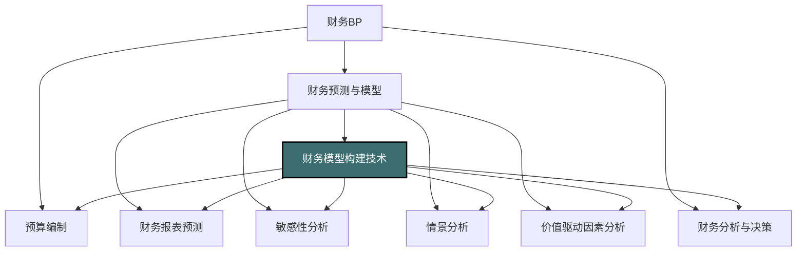
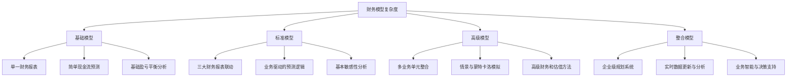
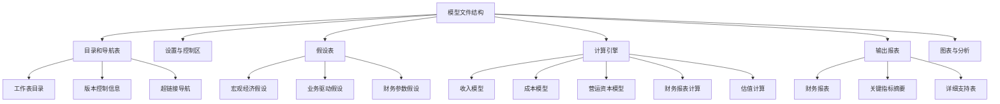
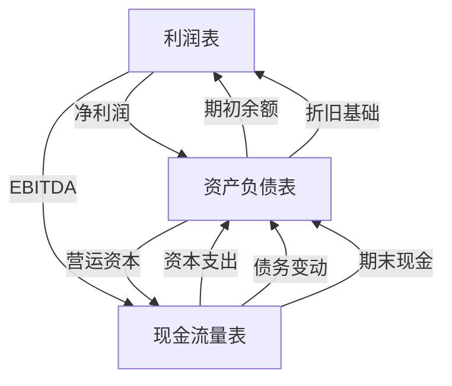
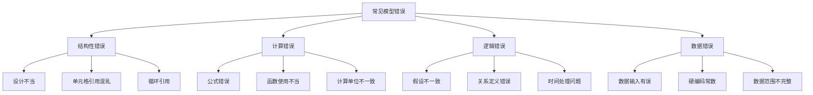
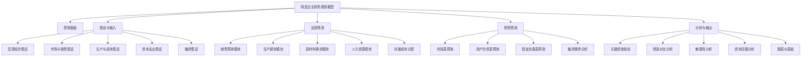
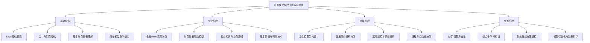

---
{"dg-publish":true,"permalink":"/08-财务专业/财务BP/笔记/财务预测与模型/财务模型构建技术/"}
---

#财务BP #财务预测 #财务模型 #Excel技术 #决策支持

## 概述

财务模型是财务BP过程中的核心工具，是对企业财务运营的数学抽象和逻辑表达。一个高质量的财务模型能够模拟企业在不同条件下的财务表现，支持战略规划、投资决策、财务预测和风险评估等关键业务活动。财务模型构建技术涉及财务专业知识、业务逻辑理解、数据分析能力和软件工具应用等多种技能的综合运用，是财务专业人员的核心竞争力之一。

## 财务模型在财务BP中的位置



财务模型构建技术是财务BP各环节的基础支撑：
- 为预算编制提供计算框架和数据处理能力
- 支持财务报表预测的逻辑关系构建
- 使敏感性分析和情景分析具备可操作性
- 为价值驱动因素分析提供量化测试平台
- 为决策分析提供数据基础和模拟能力

## 财务模型的类型与应用场景

### 按目的分类

1. **运营模型**
   - 目的：预测和模拟日常业务运营
   - 应用：销售预测、成本规划、现金流管理
   - 特点：高度详细的业务驱动因素、较短的预测期间、定期更新

2. **估值模型**
   - 目的：确定企业、项目或资产的价值
   - 应用：并购分析、业务单元评估、股权定价
   - 特点：聚焦未来现金流、终值计算、折现率确定

3. **决策支持模型**
   - 目的：比较不同方案的财务影响
   - 应用：投资决策、扩张战略、资源配置
   - 特点：清晰的决策变量、多情景对比、敏感性分析

4. **财务规划模型**
   - 目的：综合预测企业整体财务状况
   - 应用：年度预算、长期规划、融资需求预测
   - 特点：整合多个业务单元、完整的财务报表、与战略目标一致

### 按结构复杂度分类



## 财务模型构建的基本原则

### 1. 结构性原则

- **模块化设计**：将模型分解为独立但相互关联的组件
- **清晰的信息流**：明确输入、计算和输出之间的逻辑关系
- **一致的格式**：采用统一的色彩编码、字体和格式约定
- **分离假设与计算**：将输入参数与公式计算分开存放

### 2. 功能性原则

- **目标导向**：模型设计应直接服务于预期目标
- **适当的粒度**：细节水平应与决策需求相匹配
- **面向用户**：考虑最终用户的技能水平和使用场景
- **可扩展性**：设计时考虑未来可能的功能扩展需求

### 3. 技术性原则

- **计算效率**：优化公式和函数，避免过度复杂的计算
- **数据验证**：包含输入检查和结果合理性验证机制
- **错误处理**：设计适当的错误捕获和提示机制
- **版本控制**：建立明确的版本管理和变更记录机制

### 4. 质量保证原则

- **审核轨迹**：提供清晰的计算逻辑和决策依据
- **文档完善**：详细记录假设、方法和使用说明
- **压力测试**：通过极端情况测试模型的稳健性
- **同行评审**：引入第三方检查模型的准确性和合理性

## 财务模型构建的关键步骤

### 1. 需求分析与设计阶段

**目标**：明确模型目的、范围和结构

**关键活动**：
- 与利益相关者确认模型目标和决策需求
- 识别必要的输入数据及其来源
- 确定适当的模型结构和复杂度
- 设计主要输出报表和分析视图

**输出**：模型规格说明书，包含结构设计和功能描述

### 2. 数据准备与假设制定阶段

**目标**：收集和组织模型所需的基础数据和假设

**关键活动**：
- 收集历史财务和运营数据
- 整理和验证数据质量
- 定义关键假设及其合理范围
- 设计假设表和数据输入区域

**输出**：验证后的数据集和结构化的假设表

### 3. 核心构建阶段

**目标**：实现模型的基本计算逻辑和报表结构

**关键活动**：
- 构建基础计算模块和财务报表框架
- 实现各模块间的联动关系
- 建立输入与计算的分离机制
- 设计用户界面和导航系统

**输出**：功能性财务模型的初始版本

### 4. 测试与验证阶段

**目标**：确保模型的准确性和可靠性

**关键活动**：
- 执行单元测试验证各计算模块
- 进行集成测试检查模块间的联动
- 使用历史数据进行回测
- 执行边界条件和异常值测试

**输出**：经验证的模型和测试报告

### 5. 文档与部署阶段

**目标**：确保模型可被正确使用和维护

**关键活动**：
- 编写详细的用户说明和技术文档
- 提供模型假设和限制的说明
- 培训用户正确使用模型
- 建立模型更新和维护机制

**输出**：完整的模型文档和培训材料

## 财务模型的核心组成部分

### 1. 输入区域

- **假设表**：包含所有关键预测参数和假设
- **历史数据**：作为预测基础的已知信息
- **场景选择器**：允许用户选择不同假设组合
- **控制面板**：集中管理关键输入参数

### 2. 计算区域

- **收入预测模块**：基于销量、价格和增长假设
- **成本预测模块**：基于直接和间接成本驱动因素
- **营运资本计算**：应收账款、存货和应付账款预测
- **资本支出模型**：固定资产和折旧计算
- **融资结构**：债务和权益融资安排

### 3. 财务报表区域

- **损益表**：收入、成本和利润预测
- **资产负债表**：资产、负债和权益结构
- **现金流量表**：经营、投资和融资现金流
- **财务比率分析**：流动性、盈利能力、杠杆比率等
- **估值计算**：基于DCF或相对估值方法

### 4. 分析与输出区域

- **敏感性分析**：关键变量影响评估
- **情景分析**：预定义情景的比较
- **图表仪表板**：关键指标的可视化展示
- **摘要报告**：主要结果和建议的概述
- **风险评估**：重点风险因素和影响分析

## Excel中的高级财务模型构建技术

### 1. 模型结构与组织



**最佳实践**：
- 使用一致的颜色编码：输入单元格蓝色，公式单元格黑色，链接单元格绿色
- 采用统一的命名约定：工作表、区域和变量名
- 在每个工作表顶部添加导航链接
- 使用工作表分组组织相关内容

### 2. 关键Excel函数与技术

**数据管理函数**：
- `VLOOKUP`/`HLOOKUP`/`INDEX`+`MATCH`：动态数据检索
- `INDIRECT`/`OFFSET`：创建动态引用区域
- `SUMIFS`/`COUNTIFS`/`AVERAGEIFS`：条件汇总分析
- 数据透视表：多维数据分析和汇总

**财务分析函数**：
- `NPV`/`XNPV`：净现值计算
- `IRR`/`XIRR`：内部收益率计算
- `PMT`/`IPMT`/`PPMT`：债务偿还分析
- `SLN`/`DB`/`DDB`：不同折旧方法计算

**逻辑与控制函数**：
- `IF`/`IFS`/`SWITCH`：条件逻辑处理
- `AND`/`OR`/`NOT`：复合条件测试
- `IFERROR`/`IFNA`：错误处理和优雅降级
- `CHOOSE`：多选项条件选择

**高级技术**：
- 数据验证：限制输入值范围和类型
- 条件格式：视觉突显关键信息
- 命名区域：增强公式可读性和可维护性
- 数据表：一维和二维敏感性分析

### 3. 模型的动态特性设计

- **时间轴灵活性**：可调整的预测期间和时间段
- **选择器与控制器**：使用下拉列表、复选框和单选按钮
- **情景管理**：定义和储存多个预测情景
- **滚动预测**：能够随时间自动更新的预测期间

### 4. 公式构建最佳实践

- **保持简单性**：每个单元格的公式尽量简短
- **避免嵌套**：嵌套超过3层的公式应分解
- **消除硬编码**：常数应放在假设表中引用
- **维护一致性**：整行或整列使用一致的公式
- **使用局部引用**：优先使用相对引用和相邻单元格

## 高级财务模型构建方法

### 1. 集成驱动因素模型

通过明确定义关键业务驱动因素并建立它们与财务结果的量化关系，创建自下而上的预测模型。

**关键元素**：
- **驱动因素层级结构**：从详细运营指标到高级财务结果
- **因果关系映射**：明确每个驱动因素的影响路径
- **敏感度校准**：基于历史数据调整因素权重
- **驱动因素协同效应**：考虑因素间的交互作用

**示例**：零售企业销售收入预测
```
销售收入 = Σ(门店数量 × 每店面积 × 每平米销售额)
每平米销售额 = 基准销售额 × (1 + 同店增长率) × 季节性因子 × 促销效应
```

### 2. 三表联动模型

将利润表、资产负债表和现金流量表通过财务逻辑关系紧密集成，确保模型内部一致性和财务闭环。

**关键联动关系**：
- 净利润从利润表流向资产负债表的留存收益
- 折旧从资产负债表影响利润表和现金流量表
- 资本支出在现金流量表和资产负债表间联动
- 负债变动同时影响资产负债表和现金流量表
- 营运资本变动连接所有三张表



### 3. 蒙特卡洛模拟技术

通过定义关键变量的概率分布并进行大量随机模拟，评估财务结果的可能范围和概率分布。

**实施步骤**：
1. 确定关键不确定变量（增长率、毛利率、汇率等）
2. 为每个变量定义概率分布和参数
3. 设置变量间的相关性矩阵
4. 执行大量迭代模拟（通常1000-10000次）
5. 分析结果分布并生成概率报告

**应用场景**：
- 投资回报风险评估
- 债务违约概率分析
- 项目完成时间和成本预测
- 战略决策的概率成功率评估

### 4. 情景规划模型

构建能够快速评估多种战略情景的模型框架，支持"假如"分析和战略选择对比。

**模型架构**：
- **情景定义矩阵**：预定义的假设组合集
- **动态切换机制**：在情景间快速转换的控制器
- **交互式调整界面**：允许用户自定义情景参数
- **结果比较视图**：并列展示不同情景的关键指标

**典型情景类型**：
- 基准情景：最可能的预期结果
- 乐观情景：有利条件下的潜在上行空间
- 悲观情景：不利条件下的下行风险
- 破坏性情景：结构性变化或黑天鹅事件
- 策略情景：特定战略举措的潜在影响

## 财务模型的质量保障

### 1. 模型审核框架

对财务模型进行系统性检查的结构化方法。

**审核维度**：
- **逻辑完整性**：模型结构和计算逻辑的一致性
- **技术准确性**：公式和函数使用的正确性
- **合理性**：假设和结果的业务合理性
- **易用性**：界面设计和用户体验
- **稳健性**：对异常输入和极端情况的处理能力

**常用审核技术**：
- 单元格依赖箭头追踪
- 公式审计工具
- 一致性检查公式
- 对照计算验证
- 极限值测试

### 2. 常见错误与防范



**防范策略**：
- 实施模块化和标准化设计
- 使用一致的命名和格式约定
- 分离数据输入、计算和输出
- 建立内部一致性检查
- 实施版本控制和变更管理

### 3. 文档标准

完善的模型文档是确保模型可用性和可维护性的关键。

**文档组成**：
- **概述文档**：模型目的、结构和使用场景
- **假设文档**：关键假设及其来源和合理性
- **技术规格**：详细的计算方法和公式说明
- **用户指南**：操作指引和常见问题解答
- **变更日志**：版本更新和修改记录

**文档最佳实践**：
- 在模型内嵌入工作表级说明和单元格注释
- 创建假设来源和合理性的审计线索
- 为关键计算步骤提供方法论解释
- 包含示例使用场景和结果解释
- 定期更新文档以反映模型变化

## 案例分析：制造企业全面财务规划模型

### 背景

某中型制造企业正在编制未来五年的战略财务规划，需要一个全面的财务模型来评估不同增长策略的财务影响，并支持投资决策和融资规划。

### 模型构建流程

**第一阶段：需求分析与结构设计**

管理团队确定的关键需求：
- 按产品线和地区细分的收入预测
- 基于产能和效率的成本结构模型
- 资本支出规划和产能扩张分析
- 多情景对比和敏感性分析
- 现金流和融资需求预测

基于需求设计的高级模型结构：



**第二阶段：详细设计与关键假设**

关键假设设计：

1. 收入假设：
   - 产品线增长率（按区域）
   - 价格趋势与弹性
   - 市场份额变动
   - 新产品贡献

2. 生产假设：
   - 产能利用率
   - 原材料价格趋势
   - 人工效率改进
   - 技术升级影响

3. 资本支出假设：
   - 维护性资本支出
   - 扩张性投资计划
   - 折旧政策
   - 资产处置计划

4. 财务假设：
   - 目标资本结构
   - 借款利率预测
   - 股息政策
   - 营运资本需求

**第三阶段：核心模型构建**

关键计算关系示例：

1. 产能利用与产量关系：
```
产量 = 理论最大产能 × 产能利用率 × (1 - 计划停机率) × (1 - 不良品率)
```

2. 单位成本计算：
```
单位成本 = (直接材料成本 + 直接人工成本 + 分配的制造费用) / 产量
直接材料成本 = Σ(原材料用量 × 原材料单价 × (1 + 损耗率))
```

3. 资本支出与产能关系：
```
新增产能 = 扩张性资本支出 ÷ 单位产能投资成本
产能替代 = 维护性资本支出 ÷ 设备更新单位成本
```

4. 融资需求测算：
```
融资缺口 = 累计现金流缺口 + 最低现金余额要求
债务融资 = 融资缺口 × 目标债务比例
权益融资 = 融资缺口 × (1 - 目标债务比例)
```

**第四阶段：情景分析与决策支持**

设计的三个主要情景：

1. **基准情景**：
   - 年均复合增长率5%
   - 产能利用率稳定在80%
   - 现有设备正常更新
   - 保持当前资本结构

2. **高增长情景**：
   - 年均复合增长率10%
   - 产能扩张投资2亿元
   - 原材料战略采购降本5%
   - 额外债务和权益融资

3. **成本优化情景**：
   - 年均复合增长率3%
   - 自动化升级投资1亿元
   - 人工效率提升15%
   - 精益生产降本项目

情景分析关键指标对比：

| 指标 | 基准情景 | 高增长情景 | 成本优化情景 |
|------|---------|-----------|------------|
| 五年累计收入 | 50亿元 | 60亿元 | 46亿元 |
| 五年累计EBITDA | 10亿元 | 12.5亿元 | 10.8亿元 |
| EBITDA利润率 | 20% | 21% | 23.5% |
| 资本支出 | 5亿元 | 8亿元 | 7亿元 |
| 净债务/EBITDA | 2.0x | 2.8x | 1.8x |
| 五年平均ROI | 12% | 14% | 15% |

**第五阶段：敏感性分析与风险评估**

关键敏感因素分析：

1. 原材料价格敏感性：
   - 原材料成本每上升1%，EBITDA下降0.4%
   - 高度敏感的成本项：铜材、能源成本

2. 产能利用率敏感性：
   - 产能利用率每下降5%，固定成本分摊增加3%
   - 盈亏平衡点产能利用率：65%

3. 汇率敏感性：
   - 人民币对美元每贬值1%，出口利润率提升0.3%
   - 进口原材料成本同时上升0.2%

4. 融资成本敏感性：
   - 借款利率每上升100个基点，利息支出增加0.5亿元
   - 利息保障倍数临界点：借款利率上升200个基点

**第六阶段：最终决策支持**

基于模型分析，财务团队向管理层提出以下建议：

1. 采用成本优化作为基础策略，辅以有选择的扩张
2. 优先投资自动化升级项目，提高ROCE
3. 实施原材料战略采购计划，降低成本波动风险
4. 保持较为保守的资本结构，维持足够债务容量
5. 建立滚动预测机制，定期更新市场假设和财务预测

### 模型价值与影响

该财务模型帮助企业：

- 系统评估了不同增长路径的财务可行性
- 识别了最具价值创造潜力的投资机会
- 优化了资本支出的时间和规模安排
- 建立了与战略目标一致的财务规划框架
- 提供了风险管理的量化基础

## 财务模型构建中的常见挑战与解决方案

### 1. 数据质量与可获取性挑战

**常见问题**：
- 历史数据不完整或不准确
- 不同系统数据口径不一致
- 关键运营数据缺失
- 数据更新频率不足

**解决方案**：
- 建立数据需求清单和质量标准
- 实施数据清洗和验证流程
- 使用统计方法填补数据缺口
- 建立自动化数据获取机制
- 开发备选数据源和代理指标

### 2. 模型复杂度管理

**常见问题**：
- 模型过度复杂难以维护
- 计算速度慢导致效率低下
- 难以追踪错误和问题来源
- 用户理解和使用困难

**解决方案**：
- 采用模块化和分层设计
- 实施"足够好"原则，避免过度精确
- 优化计算密集型公式和函数
- 提供不同复杂度的视图和接口
- 使用文档和视觉提示增强可理解性

### 3. 模型维护与版本控制

**常见问题**：
- 多人编辑导致版本混乱
- 模型更新缺乏记录和跟踪
- 模型假设变更未同步更新
- 模型功能扩展破坏现有结构

**解决方案**：
- 实施正式的版本控制系统
- 建立变更管理和审批流程
- 维护详细的变更日志
- 设计模块化结构便于功能扩展
- 定期进行模型健康检查

### 4. 平衡准确性与实用性

**常见问题**：
- 过度追求理论完美牺牲可用性
- 细节过多掩盖关键见解
- 模型过于复杂难以解释
- 计算速度与精度的权衡

**解决方案**：
- 明确定义准确性要求和容忍度
- 基于重要性确定不同要素的精度
- 提供多层次详细程度的输出视图
- 建立关键指标的验证机制
- 保持模型简明性与透明度的平衡

## 财务模型构建职业发展路径



## 财务模型构建的未来趋势

1. **数据自动化与实时更新**
   - API连接实现自动数据获取
   - 与企业系统的无缝集成
   - 实时数据更新和动态调整
   - 历史数据与预测的无缝衔接

2. **协作与云端模型**
   - 基于云的多用户模型协作
   - 角色与权限的精细管理
   - 实时共享和反馈机制
   - 版本控制的革新

3. **人工智能与机器学习整合**
   - 自动识别异常值和模式
   - 智能预测算法辅助
   - 自然语言解释财务结果
   - 机器学习驱动的假设优化

4. **可视化与交互性提升**
   - 高级数据可视化技术
   - 交互式仪表板和控制器
   - 定制化报告与视图
   - 动态数据探索能力

5. **跨平台与工具融合**
   - Excel与专业建模软件结合
   - 数据科学工具集成
   - 移动端查看与互动
   - 跨平台兼容性提升

## 与其他财务BP工具的结合

- [[08-财务专业/财务BP/笔记/财务预测与模型/财务报表预测\|财务报表预测]] - 财务模型是实现财务报表预测的核心工具
- [[08-财务专业/财务BP/笔记/财务预测与模型/敏感性分析\|敏感性分析]] - 财务模型提供敏感性分析的技术平台
- [[08-财务专业/财务BP/笔记/财务预测与模型/情景分析\|情景分析]] - 财务模型支持多情景比较和评估
- [[08-财务专业/财务BP/笔记/财务预测与模型/价值驱动因素分析\|价值驱动因素分析]] - 财务模型可量化验证价值驱动因素的影响
- [[08-财务专业/财务BP/笔记/预算编制基础/资本支出预算\|资本支出预算]] - 财务模型评估资本支出的财务影响
- [[战略财务规划\|战略财务规划]] - 财务模型是战略规划的量化支撑工具

## 思考与练习

1. 针对你所在行业的企业，设计一个财务模型的整体结构，包括主要模块和关键驱动因素。
2. 讨论财务模型中敏感性分析与情景分析的区别和互补关系。如何在实际模型中有效实施这两种分析？
3. 选择一个具体的业务决策（如产品定价、投资项目或融资方案），设计一个决策支持模型的框架。
4. 分析财务模型在不同规模企业中的应用差异。小型企业、中型企业和大型企业在财务模型构建上有哪些不同的重点和挑战？
5. 探讨数据科学和人工智能技术如何改变传统财务模型构建方法。这些新技术带来哪些机遇和挑战？ 