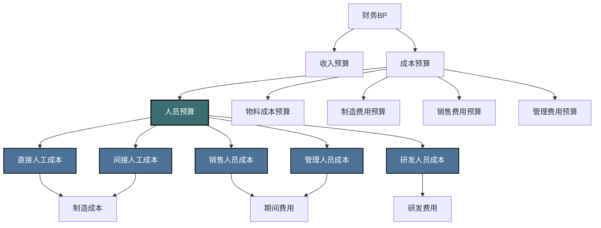
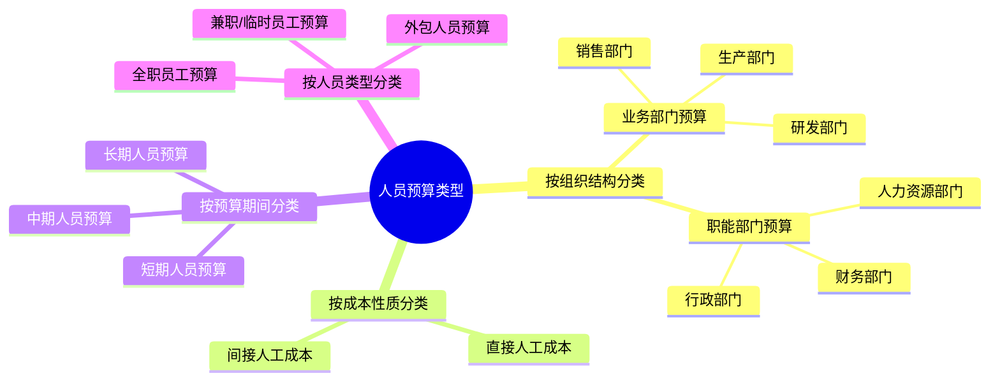

---
{"dg-publish":true,"dg-home":false,"permalink":"/08-财务专业/财务BP/笔记/预算编制基础/人员预算/","dgPassFrontmatter":true}
---

编制 #人力资源 #成本管理

## 概述

人员预算是企业财务BP中至关重要的组成部分，专注于规划和预测企业在人力资源方面的投入和支出。对于大多数企业而言，人力成本是最大的经营成本之一，精确的人员预算有助于企业合理配置人力资源，控制成本，同时确保业务发展所需的人才供应。人员预算不仅包括薪酬支出，还涉及招聘、培训、福利、绩效奖金等多个方面，是企业人力资源管理与财务管理的重要交汇点。

## 人员预算在财务BP中的位置

人员预算与其他预算组成部分紧密相连：
- 与收入预算关联：销售人员编制和薪酬激励通常基于销售目标
- 与生产预算关联：生产人员配置基于产量预测和生产计划
- 与费用预算关联：各职能部门人员成本是管理费用和销售费用的主要部分
- 与现金流预算关联：薪酬支付是重要的经营性现金流出项目

## 人员预算的类型与结构

### 按组织结构分类

1. **业务部门人员预算**
   - 特点：直接与业务活动相关，通常基于业务量预测
   - 示例：生产工人、销售人员、研发工程师

2. **职能部门人员预算**
   - 特点：支持业务运营，相对固定，不直接随业务量波动
   - 示例：人力资源、财务、行政、法务人员

### 按成本构成分类

1. **基本工资预算**
   - 固定薪酬部分，包括基本工资、职务工资等
   - 通常按月度/季度/年度预算

2. **绩效奖金预算**
   - 与绩效挂钩的浮动薪酬部分
   - 通常基于业绩目标或KPI设定

3. **法定福利预算**
   - 社会保险（养老、医疗、失业、工伤、生育）
   - 住房公积金
   - 法定假期工资

4. **补充福利预算**
   - 商业保险（补充医疗、意外等）
   - 员工福利（餐补、交通补贴、通讯补贴等）
   - 节日福利、团建活动等

5. **人力发展预算**
   - 招聘费用（广告、猎头、面试等）
   - 培训费用（内训、外训、学习平台等）
   - 员工发展计划（职业规划、晋升体系等）

## 人员预算编制方法

### 1. 人员需求预测

**方法描述**：预测未来期间内各部门、各职位的人员需求数量

**预测技术**：

1. **历史数据分析法**
   - 分析过去人员与业务量的关系
   - 例：销售人员数量与销售额的比例关系

2. **工作量分析法**
   - 基于预期工作量和人均效率估算所需人数
   - 例：客服人员 = 预计来电量 ÷ 人均处理能力

3. **战略规划法**
   - 基于企业发展战略和业务计划确定人员需求
   - 例：新市场拓展计划对销售团队的人员需求

4. **比率分析法**
   - 利用历史比率预测人员需求
   - 例：人均产值、人均销售额、管理幅度等

### 2. 薪酬预算编制

**方法描述**：基于人员需求预测，结合薪酬体系，预测各类薪酬支出

**编制步骤**：

1. **基本工资预算**
   - 现有员工：当前工资 × (1 + 年度调薪率)
   - 新增员工：岗位标准薪资 × 计划入职月数 / 12

2. **绩效奖金预算**
   - 销售人员：销售预算 × 提成比例
   - 非销售人员：基本工资 × 目标绩效比例 × 预期达成率

3. **法定福利预算**
   - 社保：工资总额 × 法定缴费比例（地区差异）
   - 公积金：工资总额 × 公积金缴费比例

4. **补充福利预算**
   - 固定福利：人均福利标准 × 人数
   - 浮动福利：根据公司政策和历史数据预测

### 3. 人员编制和人力成本控制方法

1. **定编定岗法**
   - 设定各部门、各职位的标准编制数
   - 严格控制超编情况，实施编制审批

2. **弹性用工策略**
   - 核心岗位：保持稳定的全职员工队伍
   - 非核心岗位：灵活采用兼职、外包等方式
   - 季节性波动岗位：根据业务波动调整临时员工数量

3. **优化人均产出**
   - 设定并提高人均产值/效率目标
   - 通过流程优化、自动化等手段提升效率

4. **人力成本分级控制**
   - 设立部门层级的人力成本上限
   - 在总成本控制下，赋予部门内部调配自主权

### 4. 人员预算的滚动调整

人员预算通常需要根据实际情况进行动态调整：

1. **业务变化触发调整**
   - 销售预测调整导致销售人员需求变化
   - 生产计划变更导致生产人员安排调整

2. **定期检视与更新**
   - 月度/季度检视实际人员费用与预算差异
   - 预测年度剩余期间的人力需求和成本
   - 根据实际情况调整招聘计划和薪酬预算

3. **应急调整机制**
   - 应对突发业务变化的人员预算调整程序
   - 设置特殊情况下的预算变更审批流程

## 人员预算管理的关键因素

### 1. 人员流动因素

员工流动对人员预算有显著影响，需要考虑以下因素：

**离职率预测与影响**：
- 历史离职率分析（按部门、职级、季节性）
- 离职成本估算（招聘成本、培训成本、生产力损失）
- 离职率对薪酬支出的影响（离职空缺期间的节约）

**招聘周期与成本**：
- 不同岗位的平均招聘周期
- 招聘渠道及成本（内部推荐、招聘网站、猎头费用）
- 新员工生产力爬坡期的成本影响

### 2. 薪酬增长因素

薪酬增长是人员预算中的重要动态因素：

**影响因素分析**：
- **市场薪酬水平变化**：行业薪酬调查数据
- **通货膨胀率**：物价指数变化
- **企业支付能力**：利润预测和现金流状况
- **员工绩效分布**：绩效评级与加薪矩阵

**薪酬增长预算方法**：
- 普遍调薪：全员基本工资 × 调薪比例
- 差异化调薪：按绩效等级设置不同调薪比例
- 职级晋升：设定晋升比例和晋升带来的薪资增长

### 3. 组织结构变化

组织结构调整对人员预算有直接影响：

**结构变化类型**：
- 部门合并或拆分
- 新设部门或职能
- 管理层级变动
- 业务转型或调整

**预算应对策略**：
- 建立组织变更的人员预算调整流程
- 设计过渡期预算安排
- 评估结构变化对长期人力成本的影响

## 人员预算与其他预算的协同

### 与销售预算的关联

销售预算直接影响销售人员配置和薪酬：

**关联机制**：
- 销售目标 → 销售人员数量需求
- 销售业绩 → 销售提成预算
- 市场拓展计划 → 区域销售团队配置

**协同策略**：
- 销售人员招聘计划与销售目标同步调整
- 销售激励计划与销售预算直接挂钩
- 协同制定销售费用与人员预算

### 与生产预算的关联

生产预算决定生产人员需求：

**关联机制**：
- 产量计划 → 生产线人员配置
- 生产效率 → 人均产能与人员需求
- 季节性生产波动 → 临时工需求

**协同策略**：
- 根据产能利用率优化人员排班
- 平衡正式工与临时工比例
- 生产自动化投资与人员预算协同规划

### 与费用预算的关联

人员成本是费用预算的重要组成部分：

**关联机制**：
- 各职能部门人员成本 → 管理费用预算
- 销售团队成本 → 销售费用预算
- 研发团队成本 → 研发费用预算

**协同策略**：
- 统一的人员成本分摊标准
- 协调费用控制目标与人员政策
- 设计兼顾费用控制与人才激励的薪酬体系

## 不同行业人员预算的特点

| 行业 | 人员结构特点 | 预算重点 | 典型挑战 |
|-----|------------|---------|---------|
| 制造业 | 生产工人占比高，薪酬结构简单 | 直接人工成本，工时与产量关系 | 季节性产能波动，工人技能培养 |
| 科技业 | 研发人员占比高，薪酬水平高 | 核心技术人才保留，股权激励 | 人才市场竞争激烈，成本上升快 |
| 零售业 | 门店员工为主，区域分布广 | 门店人员效率，弹性排班 | 高流动率，区域薪酬差异大 |
| 咨询业 | 以专业人才为主，级别差异大 | 人均产值，项目人员配置 | 行业周期性，项目波动大 |
| 金融业 | 前中后台人员结构，合规要求高 | 绩效激励，专业资格 | 监管要求变化，高薪人才保留 |

## 人员预算的数字化工具与方法

现代企业常使用专业工具进行人员预算：

1. **人力资源信息系统(HRIS)**
   - 员工数据管理
   - 预算编制与跟踪
   - 实际与预算对比分析

2. **人力资源分析工具**
   - 人员效能分析
   - 流动率预测
   - 薪酬竞争力分析

3. **集成预算系统**
   - 人员预算与其他预算模块集成
   - 自动化数据同步
   - 多维度报表分析

## 实际案例：服务型企业的人员预算编制

### 背景
某IT服务企业，员工规模300人，计划下一财年业务增长20%，需要编制详细的人员预算以支持业务发展。

### 人员预算编制过程

#### 1. 人员需求预测

**业务驱动分析**：
- 项目数量预计增加：当前50个项目 → 预计60个项目
- 客户服务量增加：当前客户200家 → 预计240家
- 新增业务领域：计划拓展数据分析服务

**人员配置标准**：
- 项目实施：平均每个项目需4名工程师
- 客户服务：每40个客户需1个客户经理
- 销售团队：每名销售负责15个客户
- 支持部门：按10:1的比例配置支持人员

**人员需求预测结果**：

| 部门 | 当前人数 | 需求人数 | 新增需求 | 考虑离职率后需招聘 |
|-----|---------|---------|---------|------------------|
| 项目实施 | 160 | 192 | 32 | 42 (考虑25%离职率) |
| 客户服务 | 50 | 60 | 10 | 13 (考虑30%离职率) |
| 销售团队 | 30 | 36 | 6 | 8 (考虑35%离职率) |
| 数据分析(新) | 0 | 15 | 15 | 15 (新团队) |
| 支持部门 | 60 | 65 | 5 | 7 (考虑15%离职率) |
| 合计 | 300 | 368 | 68 | 85 |

#### 2. 薪酬预算制定

**基本假设**：
- 现有员工平均调薪5%
- 新员工按市场水平定薪
- 社保及公积金按工资总额的30%计算
- 绩效奖金按基本工资的20%计提

**薪酬预算明细**（单位：万元）：

| 成本类别 | Q1 | Q2 | Q3 | Q4 | 全年合计 |
|---------|-----|-----|-----|-----|---------|
| 基本工资 | 1,550 | 1,600 | 1,650 | 1,680 | 6,480 |
| 绩效奖金 | 310 | 320 | 330 | 336 | 1,296 |
| 社保公积金 | 465 | 480 | 495 | 504 | 1,944 |
| 福利费用 | 155 | 160 | 165 | 168 | 648 |
| 招聘费用 | 60 | 40 | 30 | 20 | 150 |
| 培训费用 | 50 | 55 | 60 | 65 | 230 |
| 合计 | 2,590 | 2,655 | 2,730 | 2,773 | 10,748 |

#### 3. 招聘与培训计划

**阶段性招聘计划**：
- Q1：计划招聘45人（优先项目实施和数据分析团队）
- Q2：计划招聘25人（客户服务和销售团队为主）
- Q3：计划招聘10人（补充招聘和替代离职）
- Q4：计划招聘5人（应对年末业务高峰）

**培训预算分配**：
- 新员工入职培训：90万元
- 技术培训：80万元
- 管理技能培训：40万元
- 认证与专业发展：20万元

#### 4. 敏感性分析

进行人员预算的敏感性分析，评估不同情景下的影响：

**业务增长低于预期情景**：
- 业务仅增长10%（而非20%）
- 人员需求相应减少，仅需增加34人
- 总人力成本降至9,800万元（减少约948万元）

**薪资增长高于预期情景**：
- 市场竞争激烈，平均调薪需达8%（而非5%）
- 新招聘薪酬水平提高10%
- 总人力成本增至11,200万元（增加约452万元）

**离职率上升情景**：
- 离职率比预期高出5个百分点
- 额外招聘成本增加70万元
- 培训成本增加40万元
- 生产力损失（难以量化）

#### 5. 人员效率提升计划

为控制人力成本增长，同时实现业务目标，制定效率提升计划：

**流程优化**：
- 项目管理流程自动化，提高项目交付效率5%
- 客户服务标准化，提高客户经理服务能力10%

**技术赋能**：
- 实施服务自动化工具，减少20%的重复工作
- 开发内部知识库，加速新员工生产力提升

**结构优化**：
- 建立共享服务中心，整合行政功能
- 优化管理层级，提高管理跨度

通过效率提升措施，预计可降低新增人员需求约10人，节约人力成本约500万元。

### 效果评估

实施一年后的评估结果：

- 实际业务增长达到22%，略高于预期
- 通过效率提升，实际增加人员65人（计划68人）
- 人员预算执行率为98.5%，总成本控制在预算范围内
- 人均产值提升3.5%，高于行业平均水平
- 员工流动率控制在预期范围内，招聘计划顺利完成
- 关键挑战：数据分析人才招聘难度大，薪资水平高于预算

## 与其他概念的关系

- [[08-财务专业/财务BP/笔记/预算编制基础/预算编制流程\|预算编制流程]] - 人员预算是整体预算编制流程的一个重要环节
- [[08-财务专业/财务BP/笔记/预算编制基础/成本预测方法\|成本预测方法]] - 人力成本预测是成本预测的重要组成部分
- [[08-财务专业/财务BP/笔记/预算编制基础/现金流预测\|现金流预测]] - 人员薪酬支付是经营性现金流出的主要项目
- [[费用预算\|费用预算]] - 人力成本通常是费用预算的最大组成部分
- [[绩效管理\|绩效管理]] - 人员预算与企业绩效管理体系紧密关联

## 思考与练习

1. 分析你所在企业或熟悉的企业中，人员预算与业务目标的关联程度，有哪些可以改进的地方？
2. 讨论在经济下行期，企业如何平衡成本控制与人才保留的矛盾？
3. 设计一个销售团队的薪酬预算模型，考虑基本工资、提成和奖金三个部分。
4. 比较不同行业（制造业、互联网、服务业等）的人员预算特点，分析其中的异同。
5. 探讨数字化转型如何影响企业的人员预算编制和人力资源规划。 