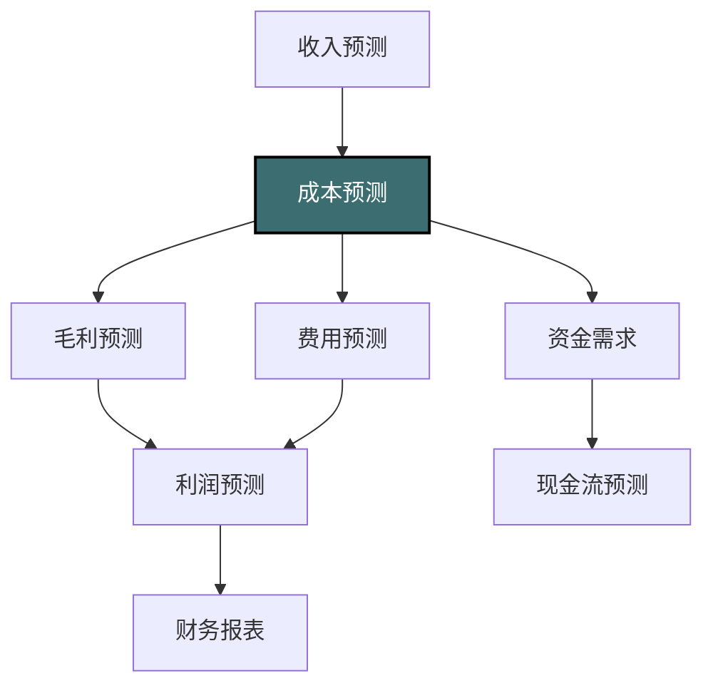
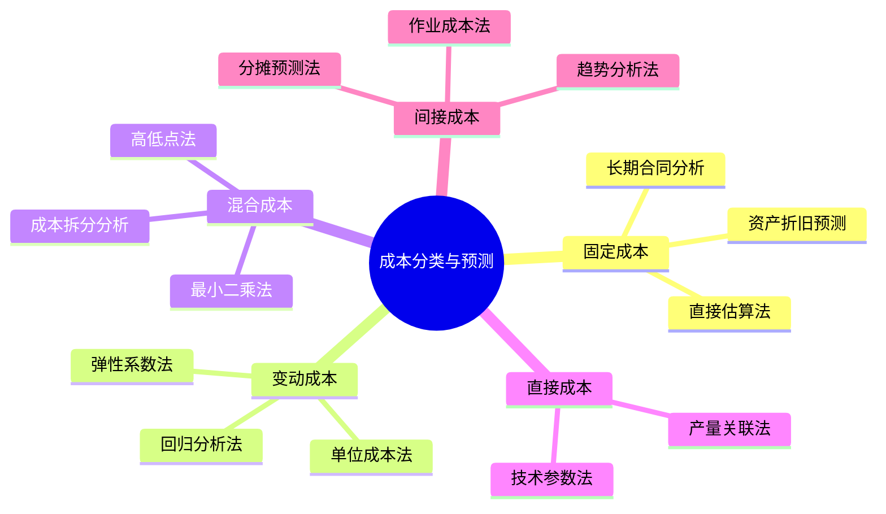
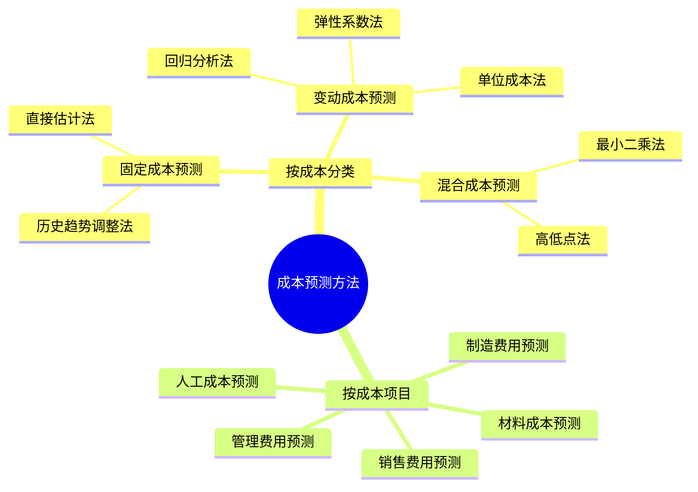
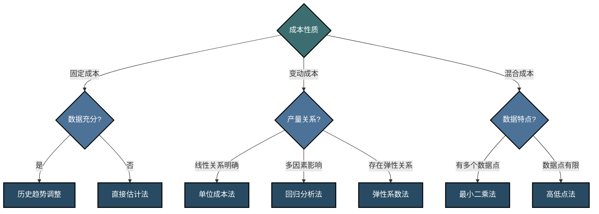

---
{"dg-publish":true,"dg-home":false,"permalink":"/08-财务专业/财务BP/笔记/预算编制基础/成本预测方法/","dgPassFrontmatter":true}
---

#财务BP #预算编制 #成本预测 #预测技术

## 概述

成本预测是财务BP的核心环节之一，直接影响企业的盈利能力和决策制定。本文将详细介绍各类成本预测方法，包括成本分类、预测技术、适用场景，并通过实际案例展示不同方法的应用。

## 成本预测在预算编制中的位置

成本预测在预算编制中具有关键作用：
- 与收入预测共同构成企业的盈利预测核心
- 影响价格策略和产品组合决策
- 为成本控制和优化提供基准
- 影响投资决策和资金需求预测

## 成本分类与预测方法选择

成本的不同分类方式对应不同的预测方法，正确理解成本性质是选择合适预测方法的基础。

### 按性质分类的成本预测方法选择

## 1. 基于成本性质的预测方法

### 1.1 固定成本预测方法

**定义**：固定成本在相关范围内保持相对稳定，不随产量或销售量变化。

#### 1.1.1 直接估算法

**方法描述**：根据现有合同、政策和计划直接估算未来固定成本。

**适用成本项目**：
- 租金支出
- 基本工资
- 资产折旧
- 保险费用
- 长期服务合同费用

**实施步骤**：
1. 收集相关合同和政策文件
2. 考虑计划中的变更和调整
3. 评估通货膨胀等外部因素影响
4. 汇总各项估算结果

**优缺点**：
- **优点**：简单直接，适合有明确依据的固定成本
- **缺点**：对于缺乏明确依据的项目，准确性较低

#### 1.1.2 历史趋势调整法

**方法描述**：基于历史数据的趋势，考虑调整因素预测未来固定成本。

**计算公式**：
预测成本 = 基期成本 × (1 + 调整因子)

**调整因子考虑因素**：
- 通货膨胀率
- 规模变化
- 效率改进
- 政策调整

**适用场景**：
- 相对稳定的组织结构
- 无重大业务模式变化
- 中期预测（1-3年）

### 1.2 变动成本预测方法

**定义**：变动成本随着产量或销售量的变化而变化，通常呈线性关系。

#### 1.2.1 单位成本法

**方法描述**：确定每单位产出的变动成本，然后乘以预计产量。

**计算公式**：
总变动成本 = 单位变动成本 × 预计产量

**适用场景**：
- 生产型企业
- 单位成本相对稳定的产品
- 标准化生产流程

**实施步骤**：
1. 分析历史单位变动成本
2. 考虑原材料价格、工艺变化等因素调整单位成本
3. 将调整后的单位成本乘以预计产量

#### 1.2.2 弹性系数法

**方法描述**：分析成本与销售量或产量变化的敏感度，确定成本弹性系数。

**计算公式**：
成本弹性系数 = 成本变化百分比 ÷ 产量变化百分比
预测成本变化 = 预计产量变化百分比 × 成本弹性系数 × 基期成本

**适用场景**：
- 非严格线性变动的成本
- 规模效应明显的生产环境
- 需要考虑边际成本变化的情况

#### 1.2.3 回归分析法

**方法描述**：建立成本与产量的回归方程，基于统计关系预测未来成本。

**计算公式**：
成本 = a + b × 产量 + ε
其中，a为固定成本部分，b为单位变动成本，ε为误差项

**适用场景**：
- 混合成本分析
- 需要精确量化成本驱动因素的情况
- 有足够历史数据支持的成本项

**优缺点**：
- **优点**：数学上更精确，可以分离固定和变动成本
- **缺点**：需要较多数据点和统计处理能力

### 1.3 混合成本预测方法

**定义**：包含固定和变动两部分的成本，需要先进行成本拆分，再分别预测。

#### 1.3.1 高低点法

**方法描述**：选取历史数据中产量最高和最低的两个点，计算变动成本率。

**计算步骤**：
1. 确定高产量点和低产量点的成本和产量
2. 计算变动成本率：(高点成本 - 低点成本) ÷ (高点产量 - 低点产量)
3. 计算固定成本：总成本 - 变动成本率 × 产量
4. 基于公式预测：预测成本 = 固定成本 + 变动成本率 × 预计产量

**优缺点**：
- **优点**：计算简单，易于实施
- **缺点**：仅使用两个数据点，可能不够代表性

#### 1.3.2 最小二乘法

**方法描述**：利用多个数据点的信息，拟合最佳线性关系。

**计算原理**：
使用统计回归，找出使所有数据点到拟合线距离平方和最小的直线。

公式形式：y = a + bx
其中y是总成本，x是产量，a是固定成本，b是单位变动成本率

**实施步骤**：
1. 收集足够的历史成本和产量数据点
2. 使用统计软件或电子表格计算回归参数
3. 检验模型拟合度和显著性
4. 应用参数进行预测：预测成本 = a + b × 预计产量

**优缺点**：
- **优点**：利用所有数据点信息，统计上更可靠
- **缺点**：实施复杂度稍高，需要基本统计知识

## 2. 按成本项目的预测方法

不同类型的成本项目需要采用不同的预测方法和考虑因素。

### 2.1 材料成本预测

**关键因素**：
- 原材料价格趋势
- 产品材料消耗量
- 报废和损耗率
- 库存政策变化
- 供应链调整

**预测方法**：

#### 2.1.1 技术定额法

**方法描述**：基于产品技术规格和材料定额标准，计算材料需求和成本。

**计算公式**：
材料成本 = Σ(各材料单耗 × 预计产量 × 预计单价) × (1 + 损耗率)

**适用场景**：
- 制造业标准化生产
- 有明确物料清单(BOM)的产品
- 材料消耗相对稳定的工艺

#### 2.1.2 价格趋势调整法

**方法描述**：分析原材料价格趋势和影响因素，预测未来价格变动。

**实施步骤**：
1. 收集历史价格数据和行业价格指数
2. 分析影响价格的关键因素（如供需关系、资源限制、政策变化）
3. 根据分析建立价格预测模型
4. 结合材料消耗量计算总成本

**适用场景**：
- 价格波动较大的大宗商品
- 需要应对市场风险的战略材料
- 中长期预测（1年以上）

### 2.2 人工成本预测

**关键因素**：
- 员工人数和结构变化
- 薪酬政策调整
- 行业薪资水平变动
- 加班需求变化
- 社保政策变动

**预测方法**：

#### 2.2.1 人员编制法

**方法描述**：基于人员编制计划和薪酬标准，详细预测各类人员成本。

**计算步骤**：
1. 确定预测期内各部门人员编制计划
2. 应用薪酬标准和晋升计划计算基本工资
3. 根据历史数据和政策预测奖金、津贴等变动薪酬
4. 计算社保、福利等附加成本
5. 汇总得出总人工成本

**适用场景**：
- 人员结构稳定的企业
- 详细人力资源预算
- 人工成本占比较高的服务业

#### 2.2.2 产值比率法

**方法描述**：基于人工成本与产值或收入的历史比率关系进行预测。

**计算公式**：
人工成本率 = 历史人工成本 ÷ 历史产值（或收入）
预测人工成本 = 预测产值（或收入）× 人工成本率 × 调整系数

**适用场景**：
- 人工成本与产值高度相关的行业
- 初步预算估算
- 缺乏详细人员规划的情况

### 2.3 制造费用预测

**主要内容**：
- 间接材料和人工
- 设备折旧
- 能源消耗
- 维修维护费用
- 车间管理费用

**预测方法**：

#### 2.3.1 作业成本法(ABC)

**方法描述**：识别主要作业活动，分析成本动因，建立作业量与成本关系模型。

**实施步骤**：
1. 识别关键作业活动（如设备运行、质量检验、物料搬运）
2. 确定各作业的成本动因（如机器小时、检验批次、搬运次数）
3. 计算各作业的单位成本率
4. 预测未来作业量
5. 计算预测期内各作业成本并汇总

**适用场景**：
- 复杂多产品生产环境
- 间接成本占比高的企业
- 需要精确成本归集的决策分析

#### 2.3.2 比率预测法

**方法描述**：分析制造费用与产量、直接成本或收入的比率关系，应用于预测。

**常用比率**：
- 制造费用/产量
- 制造费用/直接材料成本
- 制造费用/直接人工成本
- 制造费用/主营业务收入

**计算流程**：
1. 分析历史比率数据和变动趋势
2. 确定预测使用的比率和必要调整
3. 应用比率公式计算预测值

**适用场景**：
- 初步估算或验证
- 制造费用结构相对稳定的企业
- 缺乏详细数据支持的快速预测

### 2.4 销售费用预测

**主要内容**：
- 销售人员薪酬
- 广告与促销费用
- 物流配送费用
- 销售佣金
- 售后服务成本

**预测方法**：

#### 2.4.1 销售关联法

**方法描述**：分析销售费用与销售收入或销售量的关系，建立预测模型。

**分析维度**：
- 固定销售费用：不随销售变化的部分（如基本广告投入、销售团队基本工资）
- 变动销售费用：与销售直接相关的部分（如销售佣金、运费）

**计算公式**：
预测销售费用 = 固定销售费用 + 变动销售费用率 × 预测销售额

**适用场景**：
- 销售费用与销售收入高度相关的企业
- 销售团队结构稳定的情况
- 中短期预测（3-12个月）

#### 2.4.2 营销计划法

**方法描述**：基于详细的营销活动计划和预算，自下而上构建销售费用预测。

**实施步骤**：
1. 确定预测期内的营销计划（如广告投放、促销活动、市场开发）
2. 估算每项活动的费用
3. 预测销售人员薪酬（基本工资、佣金、奖金）
4. 预测物流配送等支持性费用
5. 汇总各项费用形成总预测

**适用场景**：
- 需要精细控制营销费用的企业
- 营销活动多样且变化较大的情况
- 新产品上市或新市场开拓

### 2.5 管理费用预测

**主要内容**：
- 行政管理人员薪酬
- 办公费用
- 研发费用
- 咨询服务费
- 差旅会议费

**预测方法**：

#### 2.5.1 零基预算法

**方法描述**：不以历史费用为基础，而是从零开始分析每项管理活动的必要性和预期成本。

**实施步骤**：
1. 识别必要的管理活动和职能
2. 确定每项活动的最佳完成方式和资源需求
3. 为每项活动设定成本预算
4. 按优先级排序和筛选
5. 汇总批准的活动预算

**适用场景**：
- 组织变革或重组
- 成本控制压力大的时期
- 需要深入审视管理效率的情况

#### 2.5.2 趋势分析法

**方法描述**：分析管理费用的历史趋势和影响因素，预测未来变化。

**影响因素分析**：
- 企业规模变化
- 管理层级和结构调整
- 通货膨胀因素
- 业务复杂度变化
- 技术和流程创新

**计算方法**：
1. 分析历史管理费用数据和变动趋势
2. 识别关键影响因素并量化影响
3. 构建预测模型并应用于未来期间

**适用场景**：
- 管理结构相对稳定的企业
- 缺乏开展零基预算资源的情况
- 中长期趋势预测

## 3. 高级成本预测技术与方法

### 3.1 战略成本管理预测

**方法描述**：基于价值链和竞争优势分析，从战略角度预测和管理成本。

**核心思想**：
- 关注成本结构对竞争力的影响
- 分析价值链各环节的成本贡献
- 预测成本驱动因素的变化和影响

**实施框架**：
1. 价值链成本分析：确定各环节成本和价值贡献
2. 战略定位分析：明确成本领先或差异化策略
3. 成本驱动因素分析：识别结构性驱动因素和执行性驱动因素
4. 构建战略成本预测模型
5. 结合竞争情报调整预测

**适用场景**：
- 战略转型期的企业
- 高度竞争行业
- 中长期成本规划（3-5年）

### 3.2 目标成本预测法

**方法描述**：从市场可接受价格反推产品成本目标，为成本预测设定目标和约束。

**计算公式**：
目标成本 = 目标市场价格 - 目标利润率 × 目标市场价格

**实施步骤**：
1. 市场研究确定产品目标价格
2. 基于战略确定目标利润率
3. 计算允许成本上限
4. 分解目标成本至各组成部分
5. 与预测成本比较，识别差距并制定行动计划

**适用场景**：
- 新产品开发阶段
- 价格敏感市场
- 利润压力大的成熟产品

### 3.3 生命周期成本预测

**方法描述**：基于产品完整生命周期的视角，预测从设计到淘汰各阶段的成本。

**成本分解**：
- 研发设计成本
- 生产制造成本
- 营销销售成本
- 运营维护成本
- 废弃处理成本

**预测方法**：
1. 确定产品生命周期各阶段及时间跨度
2. 分别预测各阶段的成本结构和水平
3. 计算全生命周期总成本现值
4. 分析成本敏感因素和优化机会

**适用场景**：
- 长生命周期产品（如航空、建筑、大型设备）
- 后续服务成本高的产品
- 环保要求高的产品

## 4. 成本预测中的不确定性管理

### 4.1 敏感性分析

**方法描述**：分析关键成本驱动因素变化对总成本的影响程度。

**实施步骤**：
1. 识别关键成本变量（如原材料价格、人工费率、产量）
2. 设定各变量的合理变动范围
3. 单因素分析：保持其他因素不变，计算单一因素变化对成本的影响
4. 多因素分析：分析多个因素同时变化的组合影响
5. 绘制敏感性图表，显示影响程度排序

**应用价值**：
- 识别最需关注的成本风险因素
- 为成本预测设定合理的置信区间
- 支持稳健性决策和风险应对规划

### 4.2 情景分析法

**方法描述**：构建多种可能的未来情景，分别预测在不同情景下的成本状况。

**标准情景设置**：
- 基本情景：最可能发生的未来状态
- 乐观情景：有利因素更为突出的状态
- 悲观情景：不利因素更为突出的状态
- 极端情景：罕见但影响重大的极端状况

**实施流程**：
1. 确定关键不确定性因素
2. 构建各情景的叙述性描述和数量参数
3. 在各情景下进行成本预测
4. 分析情景间的差异和应对策略
5. 确定预算采用的情景或加权组合

**适用场景**：
- 高度不确定环境
- 战略性成本决策
- 需要考虑多种可能性的弹性预测

### 4.3 蒙特卡洛模拟

**方法描述**：通过计算机模拟大量随机样本，分析成本预测的概率分布。

**实施步骤**：
1. 确定关键成本变量及其概率分布
2. 设置变量间的相关关系
3. 运行大量模拟（通常几千到几万次）
4. 分析模拟结果的统计特性（平均值、标准差、分位数）
5. 生成成本预测的概率区间和分布图

**输出示例**：
- 成本超过特定值的概率
- 成本预测的90%置信区间
- 成本分布的偏度和峰度特性

**适用场景**：
- 复杂系统的成本预测
- 高风险决策分析
- 需要精确量化不确定性的情况

## 5. 实际案例：制造企业综合成本预测

### 背景
某中型制造企业生产家电产品，年营业额5亿元，需要编制下一财年的成本预算。

### 成本结构分析

| 成本类别 | 占比 | 特点 | 预测难点 |
|---------|-----|------|---------|
| 直接材料 | 60% | 主要为铜、铝、塑料，价格波动较大 | 大宗商品价格变化 |
| 直接人工 | 15% | 一线工人工资，部分计件制 | 最低工资标准调整，产量波动 |
| 制造费用 | 10% | 设备折旧、能源、车间管理 | 新增设备投资，能源价格 |
| 销售费用 | 8% | 销售团队薪酬，物流，广告 | 新市场开拓，电商转型 |
| 管理费用 | 7% | 行政人员薪酬，办公，IT | 组织结构优化 |

### 预测方法选择与实施

**直接材料成本**：
- 采用方法：材料技术定额法 + 价格趋势分析
- 实施步骤：
  1. 基于产品BOM和生产计划计算各材料需求量
  2. 分析主要原材料价格走势和供应商报价
  3. 建立价格区间预测和敏感性分析
  4. 预测结果：材料成本预计增长7%，达到3.21亿元

**人工成本**：
- 采用方法：人员编制法 + 弹性系数分析
- 实施步骤：
  1. 根据生产需求预测劳动工时
  2. 考虑最低工资标准上调5%的政策影响
  3. 分析产量与加班工时的弹性关系
  4. 预测结果：人工成本增长9%，达到8,175万元

**制造费用**：
- 采用方法：分项预测 + 比率法验证
- 实施步骤：
  1. 计算现有设备折旧和新增设备投资影响
  2. 基于能源消耗定额和价格预测能源成本
  3. 分析维修费与设备运行时间的关系
  4. 预测结果：制造费用增长5%，达到5,250万元

**销售费用**：
- 采用方法：营销计划法 + 销售关联分析
- 实施步骤：
  1. 收集营销部门的活动计划和广告预算
  2. 分析销售人员薪酬结构和激励制度
  3. 预测电商渠道物流成本变化
  4. 预测结果：销售费用增长12%，达到4,480万元

**管理费用**：
- 采用方法：零基预算 + 趋势分析
- 实施步骤：
  1. 审查各管理部门职能和必要性
  2. 分析行政人员编制变化
  3. 评估IT系统升级成本
  4. 预测结果：管理费用降低3%，为3,395万元

### 综合预测结果与验证

1. 汇总各类成本预测，总成本预计达到4.54亿元，增长6.8%
2. 与销售收入预测（5.4亿元，增长8%）对比，预计毛利率略有提升
3. 进行敏感性分析，识别铜价和人工费率为最敏感因素
4. 情景分析显示：
   - 基本情景：成本率84.1%
   - 乐观情景：成本率82.5%
   - 悲观情景：成本率86.7%
5. 建立季度成本审视机制，关注大宗商品价格变动和产量达成情况

### 成本优化建议

1. 针对材料成本：考虑签订长期采购合同锁定部分材料价格
2. 针对人工成本：研究自动化升级方案，降低对人工依赖
3. 针对制造费用：实施设备预防性维护计划，延长使用寿命
4. 针对销售费用：优化物流配送路线，提高车辆装载率
5. 针对管理费用：推进管理流程数字化，提高行政效率

## 与其他概念的关系

- [[08-财务专业/财务BP/笔记/预算编制基础/收入预测方法\|收入预测方法]] - 成本预测与收入预测共同构成盈利预测
- [[08-财务专业/财务BP/笔记/预算编制基础/预算编制流程\|预算编制流程]] - 成本预测是预算编制的关键环节
- [[08-财务专业/财务BP/笔记/财务预测与模型/敏感性分析\|敏感性分析]] - 评估成本预测不确定性的重要工具
- [[08-财务专业/财务BP/笔记/基础概念/财务BP的组成部分\|财务BP的组成部分]] - 成本预测关系到多个BP组成部分
- [[管理会计工具\|管理会计工具]] - 许多成本预测方法源自管理会计理论

## 思考与练习

1. 某企业过去三年的成本数据显示，销售费用与销售收入之间存在非线性关系，应如何构建合适的预测模型？
2. 比较零基预算法和趋势调整法在管理费用预测中的优缺点，哪些情况下应优先考虑零基预算法？
3. 设计一个处理原材料价格波动风险的成本预测方案，包括预测方法和风险对冲策略。
4. 如何将活动基础成本法(ABC)应用于服务型企业的成本预测？请结合具体行业案例说明。

## 成本预测方法概览

## 成本预测方法选择框架

