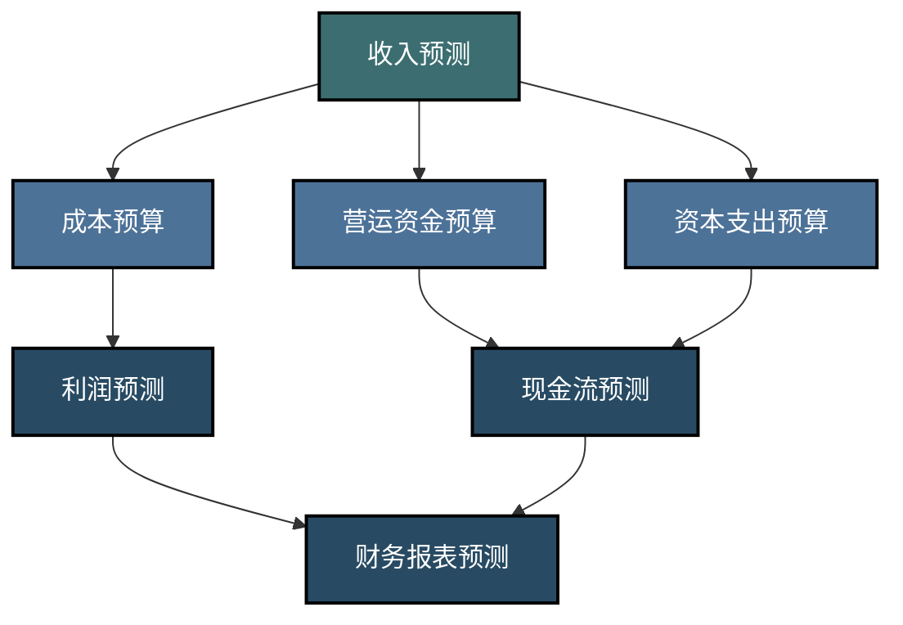
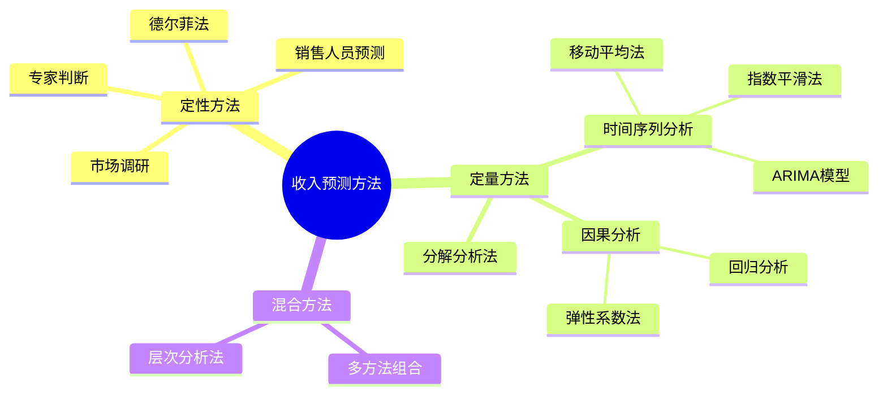
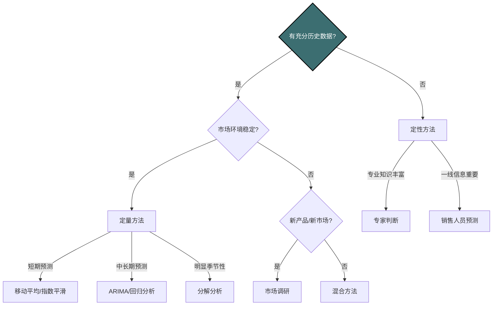

---
{"dg-publish":true,"dg-home":false,"permalink":"/08-财务专业/财务BP/笔记/预算编制基础/收入预测方法/","dgPassFrontmatter":true}
---

#财务BP #预算编制 #收入预测 #预测技术

## 概述

收入预测是财务BP编制的核心环节和起点，其准确性直接影响整个预算的质量和可实现性。本文将全面介绍各类收入预测方法，包括定性和定量方法，并通过案例分析展示不同预测方法的应用场景和技巧。

## 收入预测在预算编制中的位置

收入预测是财务BP的基础和起点，它决定了企业的资源总量，并直接影响其他预算组成部分：
- 成本预算依赖于收入预测确定生产规模和服务能力
- 营运资金需求取决于销售规模和收款政策
- 资本支出预算需要根据收入增长预期确定产能扩张
- 现金流预测以收入为主要现金流入来源

## 收入预测方法概览

## 1. 定性预测方法

定性预测方法主要基于专业判断、经验和市场调研，适用于历史数据有限、市场环境变化大或新产品/新市场的情况。

### 1.1 市场调研法

**方法描述**：通过问卷调查、焦点小组、客户访谈等方式了解市场需求和客户意向。

**实施步骤**：
1. 明确调研目标和问题
2. 设计调研方案和工具
3. 选取代表性样本
4. 收集和分析数据
5. 基于结果估计市场需求和销售潜力

**适用场景**：
- 新产品上市前的销售预测
- 进入新市场前的市场规模评估
- 消费品行业的客户需求预测

**优缺点**：
- **优点**：直接获取客户意见，了解真实需求
- **缺点**：耗时费力，可能存在样本偏差

### 1.2 专家判断法

**方法描述**：依靠行业专家或企业内资深管理者的经验和判断进行预测。

**实施步骤**：
1. 选择合适的专家组
2. 提供相关市场和产品信息
3. 获取专家对销售前景的判断
4. 综合各专家意见形成统一预测

**适用场景**：
- 高度不确定或变革性市场环境
- 战略性新业务领域
- 缺乏历史数据参考的情况

**优缺点**：
- **优点**：能够整合专家经验和隐性知识
- **缺点**：主观性强，可能受个人偏见影响

### 1.3 销售人员预测法

**方法描述**：基于一线销售人员对客户需求和市场动态的直接了解进行预测。

**实施步骤**：
1. 由各销售人员预测自己负责区域/客户的销售额
2. 销售管理层审核和调整
3. 汇总形成整体销售预测
4. 与历史业绩对比验证合理性

**适用场景**：
- B2B业务模式
- 客户关系导向型行业
- 项目型销售业务

**优缺点**：
- **优点**：基于一手客户信息，贴近市场实际
- **缺点**：销售人员可能过于乐观或保守，预测不一致

### 1.4 德尔菲法

**方法描述**：通过多轮匿名问卷调查，让专家组不断修正自己的预测，最终达成共识。

**实施步骤**：
1. 组建多领域专家团队
2. 第一轮：专家独立提供预测和理由
3. 汇总结果并反馈给专家
4. 第二轮：专家修正预测，解释变更理由
5. 重复3-4步骤，直至达成合理共识

**适用场景**：
- 需要综合多领域专业知识的复杂预测
- 长期战略性收入预测
- 新兴产业或颠覆性创新的市场预测

**优缺点**：
- **优点**：避免了面对面讨论中的从众心理，集思广益
- **缺点**：过程耗时，需要专家持续参与

## 2. 定量预测方法

定量预测方法基于历史数据和统计模型，通过数学方法分析数据规律并预测未来趋势，适用于有充分历史数据且环境相对稳定的情况。

### 2.1 时间序列分析

#### 2.1.1 移动平均法

**方法描述**：通过计算过去一定期间的平均值来预测未来，平滑短期波动。

**计算公式**：
N期移动平均值 = (T1 + T2 + ... + TN) / N
其中，T1、T2...TN代表过去N期的实际值

**适用场景**：
- 短期预测（1-3个月）
- 波动较小的成熟产品销售
- 作为其他复杂方法的初步分析

**优缺点**：
- **优点**：计算简单，易于理解和实施
- **缺点**：不能反映趋势变化，滞后性强

#### 2.1.2 指数平滑法

**方法描述**：给予最近数据更高的权重，随着时间推移权重呈指数衰减。

**计算公式**：
Ft+1 = αYt + (1-α)Ft
其中，Ft+1为下期预测值，Yt为当期实际值，Ft为当期预测值，α为平滑系数(0<α<1)

**适用场景**：
- 短中期预测（1-6个月）
- 具有一定季节性或趋势性的产品销售
- 需要对最新数据更为敏感的情况

**优缺点**：
- **优点**：计算简单，能更好地反映最新变化
- **缺点**：平滑系数选择较为主观

#### 2.1.3 ARIMA模型

**方法描述**：综合自回归(AR)、差分(I)和移动平均(MA)三种时间序列模型的特点。

**实施步骤**：
1. 检验时间序列的平稳性
2. 对非平稳序列进行差分处理
3. 确定模型参数(p,d,q)
4. 估计模型系数
5. 模型诊断与预测

**适用场景**：
- 中长期预测（6个月以上）
- 具有复杂时间模式的销售数据
- 有足够历史数据支持的成熟产品

**优缺点**：
- **优点**：预测精度高，能捕捉复杂时间模式
- **缺点**：实施复杂，需要统计专业知识

### 2.2 因果分析方法

#### 2.2.1 回归分析

**方法描述**：分析销售量与一个或多个影响因素间的定量关系，建立数学模型。

**常见模型**：
- 线性回归：Y = a + bX + ε
- 多元回归：Y = a + b1X1 + b2X2 + ... + bnXn + ε
- 非线性回归：Y = f(X) + ε

其中，Y为销售额，X为影响因素（如价格、广告投入、GDP等）

**适用场景**：
- 明确了关键驱动因素的销售预测
- 分析价格、促销等因素对销售的影响
- 评估市场环境变化对收入的影响

**优缺点**：
- **优点**：能量化分析因素影响，模型有理论支持
- **缺点**：需要准确识别关键因素，数据要求高

#### 2.2.2 弹性系数法

**方法描述**：通过计算销售量与影响因素之间的弹性系数，预测未来销售量。

**计算公式**：
弹性系数 = (销售量变化百分比) / (影响因素变化百分比)

**适用场景**：
- 受多个因素影响且关系复杂的产品销售预测
- 需要分析不同因素对销售的影响程度

**优缺点**：
- **优点**：考虑多个因素的综合影响，预测更全面
- **缺点**：计算复杂，需要大量历史数据支持

### 2.3 分解分析法

**方法描述**：将时间序列分解为趋势、季节性、周期性和随机因素，分别分析后再组合预测。

**实施步骤**：
1. 收集多期（通常至少3年）历史销售数据
2. 识别和分离季节性模式
3. 分析长期趋势
4. 识别周期性波动
5. 综合各组成部分进行预测

**分解公式**：
Y = T × S × C × I
其中，Y为原始数据，T为趋势，S为季节因素，C为周期因素，I为不规则因素

**适用场景**：
- 具有明显季节性和趋势性的销售
- 中长期销售预测
- 需要分析不同影响因素的情况

**优缺点**：
- **优点**：能够分别识别和处理不同类型的变化
- **缺点**：需要较长时间序列的历史数据

## 3. 混合预测方法

混合预测方法结合了定性和定量方法的优势，通常能获得更平衡的预测结果。

### 3.1 多方法组合

**方法描述**：综合使用多种预测方法，根据不同方法的优点进行组合预测。

**实施步骤**：
1. 选择多种预测方法
2. 分别计算每种方法的预测值
3. 根据方法的准确性和适用性，分配权重
4. 加权平均得到最终预测值

**适用场景**：
- 多种方法各有优势，需要综合考虑
- 需要平衡不同预测方法的偏差和误差

**优缺点**：
- **优点**：综合多种方法的优势，预测更全面
- **缺点**：需要大量计算和权重分配

### 3.2 层次分析法

**方法描述**：通过层次结构，综合考虑多个层次的影响因素，进行预测。

**实施步骤**：
1. 建立层次结构，确定各层次的影响因素
2. 对每个层次进行单独预测
3. 综合各层次预测结果，形成最终预测

**适用场景**：
- 复杂多层次影响因素的销售预测
- 需要考虑多个层次的决策和影响

**优缺点**：
- **优点**：全面考虑多层次影响因素，预测更系统化
- **缺点**：层次结构复杂，需要专业知识和大量数据

## 4. 预测方法选择框架

选择适当的预测方法需要考虑多种因素，以下框架可以辅助决策：

| 预测方法 | 数据需求 | 预测周期 | 适用产品特性 | 复杂性 | 准确性 |
|---------|---------|---------|------------|-------|-------|
| 移动平均法 | 低 | 短期 | 稳定成熟 | 低 | 中低 |
| 指数平滑法 | 中 | 短中期 | 轻微波动 | 低 | 中 |
| ARIMA模型 | 高 | 中长期 | 复杂模式 | 高 | 高 |
| 回归分析 | 中高 | 中长期 | 受明确因素影响 | 中高 | 中高 |
| 市场调研 | 低 | 不限 | 新产品/消费品 | 中 | 因情况而异 |
| 专家判断 | 低 | 不限 | 高度不确定 | 低 | 因专家而异 |
| 销售人员预测 | 低 | 短中期 | B2B/项目型 | 低 | 中 |
| 多方法组合 | 中 | 中长期 | 多因素影响 | 中 | 中高 |

## 5. 收入预测的误差管理

### 5.1 常见预测误差指标

1. **平均绝对误差(MAE)**：
   MAE = Σ|实际值 - 预测值| / n

2. **平均绝对百分比误差(MAPE)**：
   MAPE = Σ|(实际值 - 预测值) / 实际值| × 100% / n

3. **均方误差(MSE)**：
   MSE = Σ(实际值 - 预测值)² / n

4. **均方根误差(RMSE)**：
   RMSE = √MSE

### 5.2 提高预测准确性的策略

1. **组合预测法**：综合多种预测方法的结果
2. **持续迭代**：定期更新模型和假设
3. **区隔预测**：对不同产品线、客户群或地区分别预测
4. **异常数据处理**：识别和调整非典型数据点
5. **预测误差学习**：分析历史预测误差模式，进行修正

## 6. 实际案例：科技公司产品销售预测

### 背景
某科技公司拥有三条产品线：成熟产品A（已上市5年）、成长期产品B（上市2年）和新产品C（计划下季度上市）。

### 选择预测方法

**产品A**：
- 特点：历史数据充分，销售相对稳定，有季节性波动
- 采用方法：分解法 + 回归分析
- 实施步骤：
  1. 分解历史销售数据，识别季节模式（每年Q4销售高峰）
  2. 分析销售趋势（近两年增长放缓，年增长率降至5%）
  3. 建立回归模型，纳入价格调整和竞争产品因素
  4. 综合预测下年销售5,200万元，同比增长4%

**产品B**：
- 特点：快速增长期，数据有限，市场竞争加剧
- 采用方法：指数平滑 + 市场调研
- 实施步骤：
  1. 使用指数平滑法分析增长趋势（近6个月月均增长8%）
  2. 进行客户满意度调研和竞争对手分析
  3. 整合定量预测和市场反馈
  4. 预测下年销售3,800万元，同比增长35%

**产品C**：
- 特点：全新产品，无历史数据
- 采用方法：类比分析 + 专家判断 + 销售人员预测
- 实施步骤：
  1. 分析类似产品历史上市表现
  2. 召集产品、营销和销售专家进行判断
  3. 收集和整合销售团队各区域预测
  4. 设定三种情景预测：乐观（1,500万元）、基本（1,200万元）、保守（900万元）
  5. 采用基本情景作为正式预测

### 综合预测结果与验证

1. 汇总三个产品线，预算总收入10,200万元
2. 与公司战略目标（增长30%）对比：预测增长27%
3. 自上而下检验：行业预计增长20%，公司市场份额提升策略支持高于行业的增长
4. 敏感性分析：即使产品C推迟上市1个季度，总收入仍能达到9,600万元

### 预测调整与最终应用

1. 根据验证结果，维持产品A和B的预测不变
2. 产品C采用更保守的上市时间表，调整为1,000万元
3. 最终预测总收入10,000万元，作为公司预算的基础
4. 设立季度审视机制，根据产品C实际上市进展调整整体预测

## 与其他概念的关系

- [[08-财务专业/财务BP/笔记/预算编制基础/预算编制流程\|预算编制流程]] - 收入预测是预算编制流程的起点
- [[08-财务专业/财务BP/笔记/基础概念/BP类型与分类\|BP类型与分类]] - 不同类型的BP对收入预测的要求不同
- [[08-财务专业/财务BP/笔记/预算编制基础/成本预测方法\|成本预测方法]] - 收入预测结果直接影响成本预测
- [[08-财务专业/财务BP/笔记/财务预测与模型/财务报表预测\|财务报表预测]] - 收入预测是财务报表预测的基础
- [[08-财务专业/财务BP/笔记/财务预测与模型/敏感性分析\|敏感性分析]] - 评估收入预测不确定性的重要工具

## 思考与练习

1. 对于一家新成立的电子商务公司，应该如何选择和实施收入预测方法？
2. 分析某产品历史销售数据显示明显的季节性波动，如何利用分解法进行未来12个月的预测？
3. 比较回归分析和时间序列分析在收入预测中的适用场景和优缺点。
4. 设计一个融合定性和定量方法的收入预测流程，适用于多产品线的制造企业。 