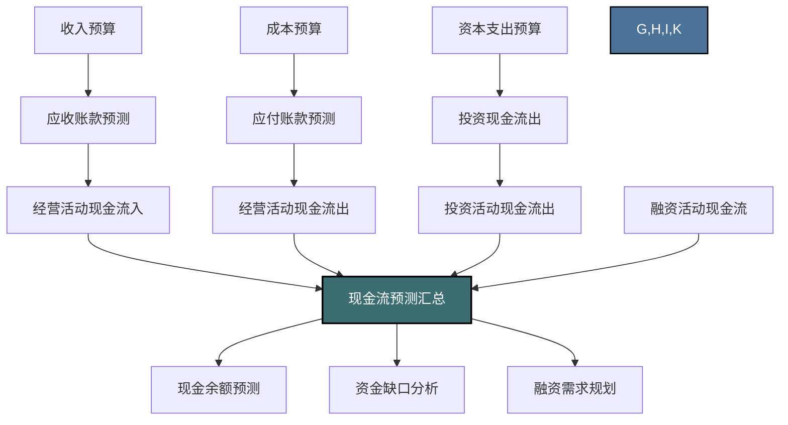
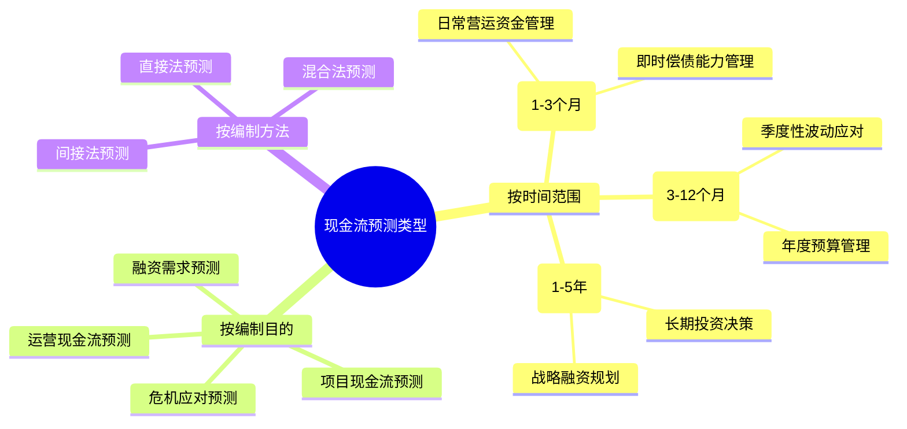
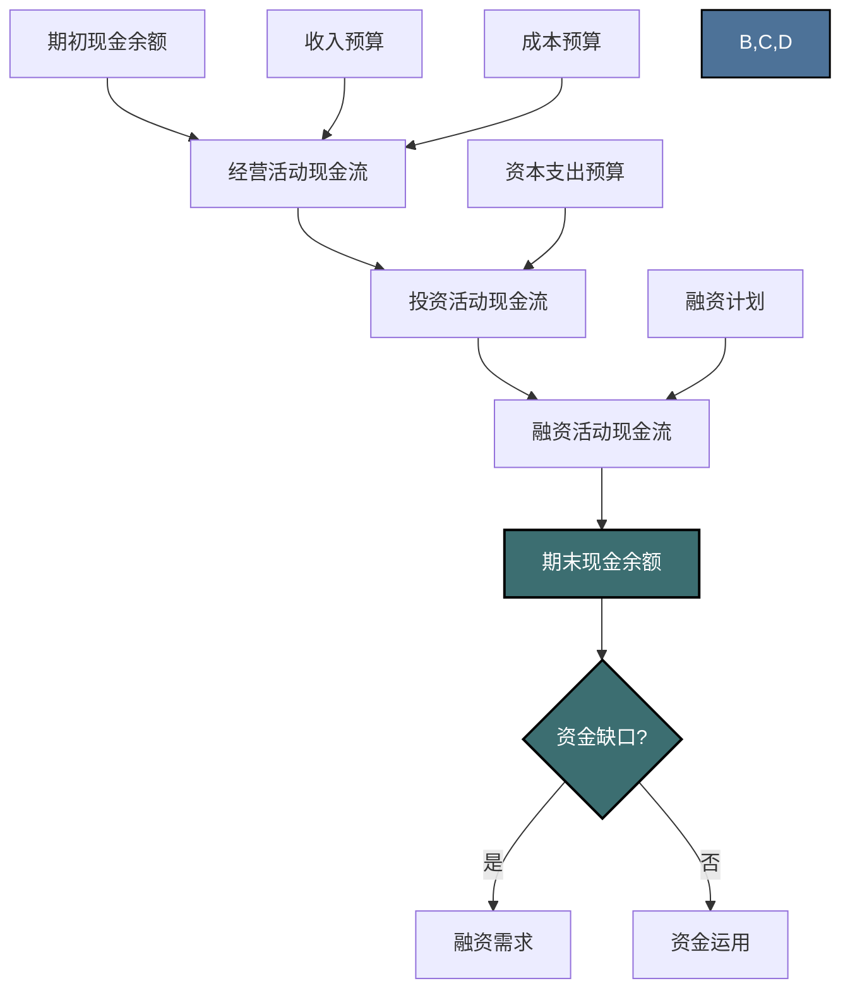

---
{"dg-publish":true,"permalink":"/08-财务专业/财务BP/笔记/预算编制基础/现金流预测/"}
---

# 现金流预测

#财务BP #预算编制 #现金流 #流动性管理

## 概述

现金流预测是企业财务BP中的关键环节，用于规划和预测未来一段时间内企业的现金流入与流出。与利润预测不同，现金流预测关注的是企业实际收付的现金，而非会计意义上的收入和成本。高质量的现金流预测能够帮助企业确保资金流动性，避免资金短缺或过剩，优化资金使用效率，并为投资和融资决策提供依据。

## 现金流预测在财务BP中的位置

现金流预测与其他预算组成部分密切相关：
- 收入预算转化为现金流入（考虑收款条件和账期）
- 成本预算转化为现金流出（考虑付款条件和账期）
- 资本支出预算直接影响投资活动现金流
- 现金预测结果直接影响融资决策和资金管理策略

## 现金流预测的类型

### 按时间范围分类

1. **短期现金流预测（1-3个月）**
   - 目的：确保日常运营资金充足，管理即时偿债能力
   - 特点：精度高，细节多，通常按周或日预测
   - 重点关注：销售收款、供应商付款、工资支付、税费缴纳等

2. **中期现金流预测（3-12个月）**
   - 目的：协调季节性波动，支持年度预算管理
   - 特点：平衡精度与广度，通常按月预测
   - 重点关注：季节性销售波动、大额付款时点、融资到期情况

3. **长期现金流预测（1-5年）**
   - 目的：支持战略规划和长期投资决策
   - 特点：关注趋势而非精确数字，通常按季度或年度预测
   - 重点关注：业务增长资金需求、长期融资规划、战略投资回报

### 按现金流组成分类

1. **经营活动现金流预测**
   - 内容：与企业日常经营相关的现金流入与流出
   - 主要项目：销售收款、采购付款、薪资支付、税费缴纳等

2. **投资活动现金流预测**
   - 内容：与资产购置、处置相关的现金流
   - 主要项目：固定资产购置、无形资产投资、长期投资、资产处置收入等

3. **融资活动现金流预测**
   - 内容：与融资相关的现金流入与流出
   - 主要项目：贷款收到与偿还、发行股票收入、支付股利、支付利息等

## 现金流预测的方法

### 1. 直接法现金流预测

**方法描述**：直接预测各类现金收支项目，汇总得出净现金流

**适用场景**：短期现金流预测，详细程度要求高的场景

**步骤与内容**：
1. **现金流入预测**：
   - 销售收款预测（基于收入预算和应收账款周转情况）
   - 利息和股利收入
   - 其他营业收入现金流入
   - 资产处置收入

2. **现金流出预测**：
   - 采购付款预测（基于成本预算和应付账款周转情况）
   - 工资及福利支付
   - 税费支付
   - 其他营业支出
   - 资本支出

3. **净现金流计算**：现金流入 - 现金流出

**优缺点**：
- **优点**：直观清晰，便于短期管理和控制
- **缺点**：工作量大，对数据要求高

### 2. 间接法现金流预测

**方法描述**：从预测净利润出发，加回非现金项目（如折旧），调整营运资金变化，得出现金流

**适用场景**：中长期现金流预测，与财务报表预测结合

**基本公式**：
经营活动现金流 = 净利润 + 折旧摊销 - 营运资金增加额

**主要调整项目**：
- **加回**：折旧和摊销费用
- **加/减**：非现金收益或损失
- **减/加**：应收账款增加/减少
- **减/加**：存货增加/减少
- **加/减**：应付账款增加/减少

**优缺点**：
- **优点**：与会计利润预测关联紧密，工作量相对较小
- **缺点**：不能反映具体现金流动细节，精度较低

### 3. 滚动预测法

**方法描述**：定期（如每月）更新未来12个月的现金流预测，保持预测区间相对固定

**适用场景**：需要持续维护和更新的中期现金流预测

**实施要点**：
1. 每月更新一次未来12个月预测
2. 近期月份预测更精细，远期月份可粗略
3. 将实际数据与预测对比，分析差异原因
4. 基于差异分析调整未来预测方法和参数

**优缺点**：
- **优点**：预测的持续性和适应性强，能及时反映新情况
- **缺点**：持续维护成本高，需要制度化流程支持

## 现金流预测的关键影响因素

### 1. 收款政策与客户结构

收款政策和客户结构直接影响销售收入转化为现金流入的速度：

**影响因素分析**：
- **信用政策**：不同客户类型的信用期限设定
- **客户组合**：大客户vs小客户的比例（大客户通常账期较长）
- **行业惯例**：所处行业的普遍付款条件和惯例
- **促销活动**：折扣、促销对收款速度的影响
- **季节性因素**：销售季节性对现金流入的影响

**预测方法**：
- 应收账款账龄分析法
- 历史收款比率法
- 客户类型加权平均法

### 2. 采购与付款条件

采购政策和供应商关系影响企业的现金流出节奏：

**影响因素分析**：
- **供应商条件**：不同供应商的付款要求
- **批量采购**：采购规模对付款条件的影响
- **关键物料**：核心原材料的付款优先级
- **季节性采购**：季节性原材料储备对现金流的影响

**预测方法**：
- 采购合同分析法
- 应付账款周转天数法
- 供应商组合分析法

### 3. 存货管理

存货政策直接影响营运资金需求和现金流：

**影响因素分析**：
- **存货周转率**：不同品类存货的周转速度
- **安全库存**：维持不同水平安全库存的资金需求
- **季节性备货**：季节性产品对资金的占用
- **供应链策略**：JIT等策略对存货资金占用的影响

**预测方法**：
- 存货周转天数分析
- 生产计划衍生法
- 销售预测驱动法

### 4. 资本支出时点

大型资本支出的时点安排对现金流有重大影响：

**影响因素分析**：
- **项目进度**：建设项目的进度和付款节点
- **设备采购**：大型设备的订购和付款时间安排
- **技术更新**：技术改造和系统升级的时间规划

**预测方法**：
- 项目管理里程碑法
- 历史支出模式分析
- 供应商付款条件分析

## 现金流预测模型构建

### 基本模型框架

### 详细建模步骤

1. **基础数据收集**
   - 历史现金流数据分析
   - 销售、采购和费用预算获取
   - 资本支出计划了解
   - 融资和还款计划确认

2. **参数设定**
   - 收款周期和比率设定
   - 付款周期和比率设定
   - 存货周转参数确定
   - 资本支出时点规划
   - 季节性因素调整

3. **模型构建**
   - 设计计算逻辑和公式
   - 建立各类现金流的计算表格
   - 整合到统一现金流预测表
   - 设计资金缺口分析方法

4. **情景分析设计**
   - 基准情景：最可能出现的情况
   - 乐观情景：销售增长、收款加快等有利情况
   - 悲观情景：销售下滑、收款延迟等不利情况
   - 压力测试：极端情况下的现金流状况

5. **敏感性分析**
   - 销售收入变动对现金流的影响
   - 收款周期变化的敏感度
   - 原材料价格波动的影响
   - 资本支出延迟或提前的影响

### 预测准确性提升方法

1. **差异分析与持续改进**
   - 定期比对实际现金流与预测值
   - 分析差异原因（时间差异、量差异、结构差异）
   - 基于差异调整预测参数和方法
   - 持续改进预测准确度

2. **外部因素监控**
   - 市场环境变化监控
   - 行业支付习惯变化跟踪
   - 金融环境和利率走势关注
   - 政策法规变化的影响评估

## 现金流预测在企业管理中的应用

### 1. 流动性风险管理

现金流预测是企业流动性风险管理的核心工具：

**应用方式**：
- 设定最低现金余额警戒线
- 识别潜在现金短缺期，提前安排融资
- 建立短期流动性缓冲机制（如信用额度）
- 设计针对性的现金管理策略

**实施要点**：
- 关注短期（1-3个月）现金流预测的精确度
- 重点监控大额收支项目的时点
- 建立现金流预警指标体系

### 2. 融资规划

现金流预测为企业融资决策提供依据：

**应用方式**：
- 预测融资需求的金额和时点
- 确定合适的融资方式（短期vs长期）
- 优化债务结构和到期分布
- 降低融资成本和财务风险

**实施要点**：
- 关注中长期现金流预测的趋势
- 分析业务增长对资金需求的影响
- 评估不同融资方案的成本和风险

### 3. 投资决策支持

现金流预测帮助企业优化投资组合和时点：

**应用方式**：
- 评估企业承担投资的资金能力
- 优化投资项目的启动时点和资金分配
- 分析投资对长期现金流的影响
- 平衡短期流动性和长期投资需求

**实施要点**：
- 整合资本支出预算与现金流预测
- 进行投资组合的现金流情景分析
- 评估投资方案对融资需求的影响

### 4. 股东回报规划

现金流预测是制定股利政策和股东回报的基础：

**应用方式**：
- 评估企业的分红能力
- 规划股利支付的金额和时点
- 平衡再投资需求与股东回报
- 设计可持续的长期回报政策

**实施要点**：
- 分析自由现金流的长期稳定性
- 考虑业务增长对现金需求的影响
- 评估不同股利方案的可行性

## 不同行业现金流预测的特点

| 行业 | 现金流特点 | 预测重点 | 典型挑战 |
|-----|----------|---------|---------|
| 制造业 | 存货占用资金大，周期性强 | 存货周转、采购付款、资本支出 | 原材料价格波动、生产周期长 |
| 零售业 | 现金流入稳定，季节性明显 | 季节性销售波动、库存管理 | 促销活动影响、假日季资金需求 |
| 建筑业 | 项目周期长，预付和进度款模式 | 项目进度付款、履约保证金 | 项目延期风险、垫资压力大 |
| 科技业 | 研发投入大，收入增长快 | 研发支出、快速扩张资金需求 | 技术更新快、市场变化大 |
| 服务业 | 资产轻，人力成本高 | 人力成本支出、低资本支出 | 人才流动影响、扩张模式轻资产 |

## 实际案例：零售企业的季节性现金流预测

### 背景
某连锁零售企业年销售额5亿元，具有明显的季节性特征，每年第四季度（尤其是节假日）销售占全年的40%以上。企业需要提前做好现金流预测，以应对季节性波动。

### 现金流预测模型构建

#### 1. 销售收款预测
- 历史销售数据分析：过去3年各月销售占比分别为：
  - Q1（1-3月）：15%
  - Q2（4-6月）：20%
  - Q3（7-9月）：25%
  - Q4（10-12月）：40%
- 收款模式分析：
  - 现金/银行卡/微信支付宝：80%（当月收回）
  - 企业客户/分期付款：20%（平均45天收回）

#### 2. 采购付款预测
- 季节性备货规律：
  - Q3初开始为Q4旺季备货，提前60-90天
  - 平均供应商付款周期：30天（70%），60天（30%）
- 采购预算分布：
  - Q1：18%
  - Q2：22%
  - Q3：35%（包含旺季备货）
  - Q4：25%

#### 3. 费用支出预测
- 人力成本：基本固定+旺季临时工（Q4增加20%）
- 租金：季度预付，每年增长5%
- 营销费用：与销售同比例，但需提前1个月支出

#### 4. 现金流量表预测（单位：万元）

| 项目 | Q1 | Q2 | Q3 | Q4 | 全年 |
|-----|-----|-----|-----|-----|-----|
| 期初现金余额 | 3,000 | 2,850 | 2,620 | 1,720 | 3,000 |
| **经营活动现金流** |  |  |  |  |  |
| 销售收款 | 7,800 | 10,000 | 12,200 | 19,500 | 49,500 |
| 采购付款 | -7,200 | -8,800 | -11,500 | -8,500 | -36,000 |
| 工资及费用 | -1,500 | -1,600 | -1,700 | -2,000 | -6,800 |
| 税费支付 | -250 | -330 | -400 | -620 | -1,600 |
| 经营活动现金流小计 | -1,150 | -730 | -1,400 | 8,380 | 5,100 |
| **投资活动现金流** |  |  |  |  |  |
| 门店装修 | -500 | -300 | -200 | 0 | -1,000 |
| 设备购置 | -200 | -100 | -100 | -100 | -500 |
| 投资活动现金流小计 | -700 | -400 | -300 | -100 | -1,500 |
| **融资活动现金流** |  |  |  |  |  |
| 借款收到 | 2,000 | 1,500 | 1,000 | 0 | 4,500 |
| 偿还借款 | 0 | 0 | 0 | -5,000 | -5,000 |
| 支付利息 | -300 | -300 | -200 | -200 | -1,000 |
| 支付股利 | 0 | -300 | 0 | 0 | -300 |
| 融资活动现金流小计 | 1,700 | 900 | 800 | -5,200 | -1,800 |
| **现金净增加额** | -150 | -230 | -900 | 3,080 | 1,800 |
| **期末现金余额** | 2,850 | 2,620 | 1,720 | 4,800 | 4,800 |

#### 5. 现金流管理策略
基于预测结果，企业制定以下现金流管理策略：

- **Q1-Q3资金安排**：
  - Q3现金余额预计降至低位（1,720万），提前安排银行授信
  - 第三季度控制非必要资本支出
  - 与主要供应商协商延长Q3备货商品的付款期限

- **Q4资金使用规划**：
  - 使用Q4旺季现金盈余集中偿还贷款，减少财务费用
  - 预留年末现金余额不低于3,000万，以应对年初资金需求
  - Q4末评估是否增加设备投资和门店扩张

### 效果评估
通过精准的现金流预测与管理，企业成功应对了季节性波动：

- 将最低现金点提升了20%，避免了流动性风险
- 优化了融资结构，减少了30%的财务费用
- 为次年的业务扩张预留了充足资金
- 提高了与供应商和银行的议价能力

## 与其他概念的关系

- [[08-财务专业/财务BP/笔记/预算编制基础/预算编制流程\|预算编制流程]] - 现金流预测是整体预算编制流程的重要组成
- [[08-财务专业/财务BP/笔记/预算编制基础/收入预测方法\|收入预测方法]] - 收入预测结果是现金流入预测的基础
- [[08-财务专业/财务BP/笔记/预算编制基础/成本预测方法\|成本预测方法]] - 成本预测结果是现金流出预测的基础
- [[08-财务专业/财务BP/笔记/预算编制基础/资本支出预算\|资本支出预算]] - 资本支出直接影响投资活动现金流
- [[08-财务专业/财务BP/笔记/财务预测与模型/财务报表预测\|财务报表预测]] - 现金流预测是三大报表预测的重要部分

## 思考与练习

1. 分析你所在企业或熟悉的企业的现金流周期特点，并思考如何改善其现金流管理。
2. 某公司预计销售收入稳定增长，但现金流持续紧张，可能的原因有哪些？提出改进建议。
3. 比较直接法和间接法进行现金流预测的适用场景，并举例说明。
4. 设计一个简单的Excel模型，用于预测小型企业的月度现金流。
5. 讨论现金流预测在不同行业的应用差异，并分析为什么会产生这些差异。 