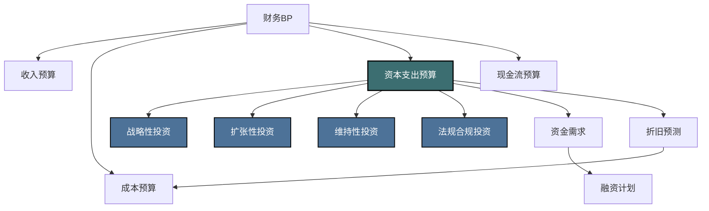
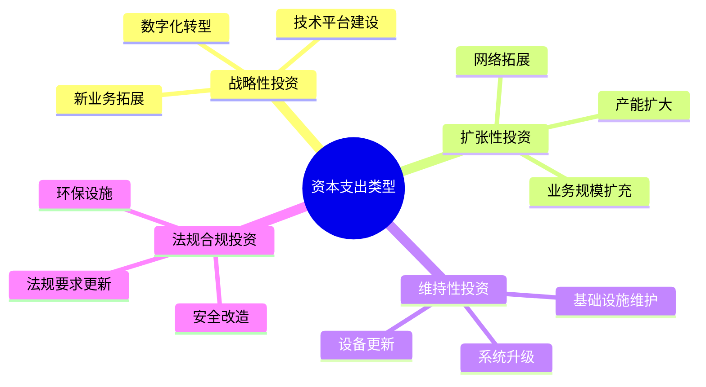
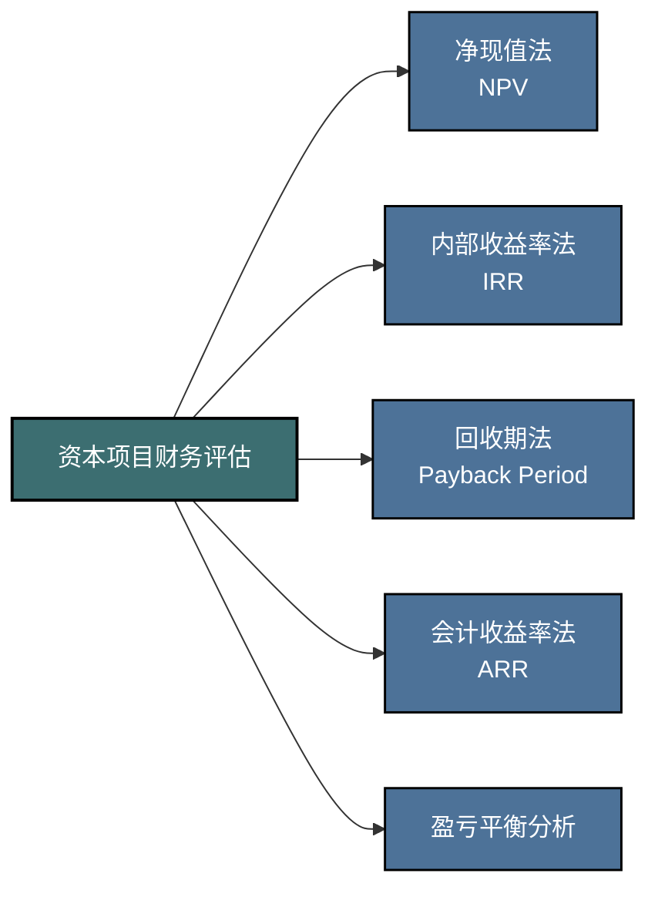
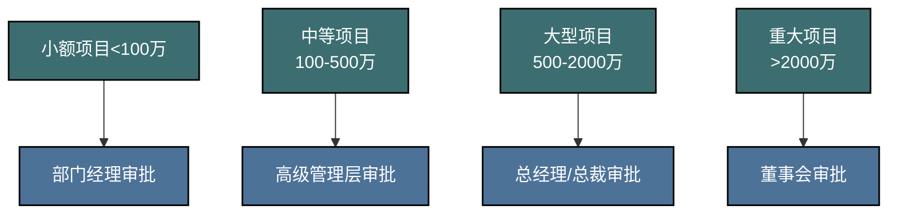

---
{"dg-publish":true,"permalink":"/08-财务专业/财务BP/笔记/预算编制基础/资本支出预算/"}
---

# 资本支出

#财务BP #预算编制 #资本支出 #投资评估

## 概述

资本支出预算是财务BP中的核心组成部分，专注于企业长期资产投资的规划与管理。与日常运营支出不同，资本支出通常金额较大、影响期限长、具有不可逆性，对企业的长期发展和战略实施具有重要影响。本文将详细介绍资本支出预算的编制流程、评估方法和管理技巧。

## 资本支出预算在财务BP中的位置

资本支出预算与其他预算组成部分密切相关：
- 影响成本预算：通过折旧和运营成本
- 影响现金流预算：通过投资支出和融资需求
- 支持收入预算：通过产能扩张和新产品开发
- 反映战略重点：通过资源分配的优先次序

## 资本支出的分类

### 按投资目的分类

1. **战略性投资**
   - 定义：支持企业长期战略目标的投资
   - 特点：回报周期长，风险较高，战略价值大
   - 例如：新业务领域拓展、研发中心建设、数字化转型

2. **扩张性投资**
   - 定义：扩大现有业务规模的投资
   - 特点：相对可预测，中等回报周期
   - 例如：产能扩张、销售网络扩展、新市场进入

3. **维持性投资**
   - 定义：维持现有业务运营能力的投资
   - 特点：必要性强，回报不明显但缺失风险大
   - 例如：设备更新、系统升级、基础设施维护

4. **法规合规投资**
   - 定义：满足监管要求和合规标准的投资
   - 特点：强制性，不直接产生经济回报
   - 例如：环保设施、安全改造、法规要求的系统更新

### 按资产类型分类

- **有形资产投资**：土地、厂房、设备、办公场所
- **无形资产投资**：软件系统、专利技术、品牌建设
- **金融资产投资**：长期股权投资、债权投资
- **研发投资**：新产品开发、技术研究

## 资本支出预算的编制流程

### 1. 投资需求收集

资本支出预算编制通常始于全面收集企业各部门的投资需求：

**收集方式：**
- 标准化的投资提案表格
- 部门资本需求调研
- 战略规划中提出的投资项目
- 设备更新和维护计划

**基本要素：**
- 项目名称与简介
- 投资目的和预期效益
- 所需资金规模和时间安排
- 技术或操作可行性分析
- 风险评估与应对措施

### 2. 项目评估与筛选

对收集到的投资需求进行系统评估，筛选出符合企业战略且经济上可行的项目：

#### 2.1 财务评估方法

**净现值法(NPV)**
- 计算公式：NPV = Σ[CFt / (1+r)^t] - I₀
- 其中，CFt为第t期现金流，r为折现率，I₀为初始投资
- 决策标准：NPV > 0 接受；NPV < 0 拒绝
- 优点：考虑了货币时间价值，直接反映价值创造
- 缺点：对折现率敏感，未考虑非财务因素

**内部收益率法(IRR)**
- 定义：使项目NPV等于零的折现率
- 计算：Σ[CFt / (1+IRR)^t] - I₀ = 0
- 决策标准：IRR > 要求收益率 接受；IRR < 要求收益率 拒绝
- 优点：直观反映投资回报率，便于项目间比较
- 缺点：可能存在多个IRR，不适用于非常规现金流项目

**回收期法**
- 定义：收回初始投资所需的时间
- 计算：找出使累计现金流等于初始投资的时间点
- 决策标准：回收期 < 目标回收期 接受
- 优点：简单直观，关注风险和流动性
- 缺点：忽略回收期之后的现金流，未考虑货币时间价值

**会计收益率法(ARR)**
- 计算：平均年利润 ÷ 平均投资额
- 决策标准：ARR > 目标收益率 接受
- 优点：与会计利润和投资回报率指标一致
- 缺点：基于会计利润而非现金流，未考虑时间价值

#### 2.2 战略评估维度

除财务指标外，还应从战略角度评估资本项目：

- **战略契合度**：项目与企业战略目标的一致性
- **竞争优势**：项目对企业核心竞争力的贡献
- **市场潜力**：项目涉及市场的增长前景和稳定性
- **风险评估**：技术风险、市场风险、执行风险等
- **协同效应**：与现有业务和资产的协同价值

#### 2.3 评分卡示例

| 评估维度 | 权重 | 评分标准 | 
|---------|------|---------|
| 财务回报 | 30% | 5分：NPV>1000万，IRR>20% 3分：NPV>500万，IRR>15% 1分：NPV>0，IRR>10% |
| 战略契合 | 25% | 5分：直接支持核心战略 3分：间接支持战略目标 1分：中性或弱相关 |
| 风险程度 | 20% | 5分：风险极低，技术成熟 3分：风险可控，有应对措施 1分：风险较高，不确定性大 |
| 资源要求 | 15% | 5分：资源需求少，实施简单 3分：资源需求中等 1分：资源需求大，复杂度高 |
| 时间紧迫性 | 10% | 5分：刻不容缓，竞争关键 3分：中等紧迫性 1分：可延期，非紧急 |

### 3. 资本预算编制与资金规划

根据评估结果编制综合资本支出预算：

**预算编制的关键要素：**
- 项目优先级排序
- 分期实施计划
- 年度及季度资金分配
- 融资来源规划
- 应急资金预留

**资金来源考虑：**
- 内部积累：经营现金流、折旧回收
- 外部融资：银行贷款、债券、租赁
- 股权融资：增发股票、引入投资者
- 资产变现：出售非核心资产

### 4. 预算审批与执行

资本支出预算的审批通常分级进行：

**执行控制机制：**
- 项目里程碑设定与跟踪
- 阶段性资金释放
- 定期进度报告
- 变更管理程序
- 超支预警与控制

### 5. 投资后评估

资本项目完成后的评估是改进资本预算过程的重要环节：

- **实际vs计划**：比较实际投资额与预算的差异
- **时间表遵守**：评估项目完成是否按计划进行
- **成果实现**：评估实际收益是否达到预期
- **回顾与学习**：总结经验教训，改进未来预算过程

## 行业特点与资本预算侧重点

不同行业的资本支出预算有不同的侧重点：

| 行业 | 主要资本支出方向 | 关键评估维度 | 典型回收期预期 |
|-----|---------------|------------|--------------|
| 制造业 | 生产设备、厂房建设 | 产能利用率、自动化程度 | 3-7年 |
| 科技业 | 研发设施、IT系统 | 技术先进性、竞争优势 | 2-5年 |
| 零售业 | 门店网络、物流中心 | 客流量、运营效率 | 3-5年 |
| 能源业 | 勘探设备、发电设施 | 资源禀赋、环保合规 | 7-15年 |
| 服务业 | 营业场所、客户体验 | 客户满意度、品牌价值 | 2-4年 |

## 资本支出预算的常见问题与解决方案

### 1. 预算精度问题
- **问题**：实际支出经常超出预算
- **解决方案**：
  - 增加预算准备金（通常为5-15%）
  - 采用分级估算法，项目细化后再精确预算
  - 引入外部专家评估

### 2. 项目延期问题
- **问题**：资本项目经常无法按时完成
- **解决方案**：
  - 设立现实的时间表，包含缓冲期
  - 项目分阶段执行，设立清晰里程碑
  - 强化项目管理，引入专业项目经理

### 3. 效益未达预期
- **问题**：项目完成后未能实现预期收益
- **解决方案**：
  - 在预算评估中使用更保守的假设
  - 建立收益责任制，明确责任人
  - 加强后续运营与收益管理

### 4. 预算过度集中
- **问题**：资源过度集中于少数大项目
- **解决方案**：
  - 设立投资组合管理机制
  - 保障一定比例预算用于小型创新项目
  - 建立项目多样性指标

## 实际案例：制造企业的产能扩张资本预算

### 背景
某中型制造企业计划投资5000万元扩建生产线，以满足增长的市场需求。

### 项目分析过程

**市场需求分析**
- 现有产能：年产10万件
- 市场需求预测：未来5年年增长率12%
- 3年后产能缺口：3.8万件/年

**投资方案选择**
- 方案A：全自动生产线（投资5000万元，年产能8万件）
- 方案B：半自动生产线（投资3000万元，年产能5万件）
- 方案C：委托代工（无固定资产投资，单位成本高20%）

**财务评估**
| 指标 | 方案A | 方案B | 方案C |
|-----|-----|-----|-----|
| 初始投资 | 5000万元 | 3000万元 | 0 |
| 年增加收入 | 9600万元 | 6000万元 | 4800万元 |
| 年增加成本 | 5760万元 | 3900万元 | 3456万元 |
| 年折旧 | 500万元 | 300万元 | 0 |
| NPV(10%) | 1450万元 | 1080万元 | 950万元 |
| IRR | 18.5% | 21.3% | - |
| 回收期 | 4.5年 | 3.8年 | 即时 |

**战略考量**
- 方案A：提供长期竞争优势，自动化程度高
- 方案B：资金需求较少，风险较低
- 方案C：灵活性高，但长期成本劣势

**风险评估**
- 市场风险：需求增长不及预期
- 技术风险：自动化生产线适应性
- 融资风险：大额资金需求的融资压力

### 决策与资金安排
- 采用方案B：半自动生产线
- 资金来源：银行贷款2000万元，自有资金1000万元
- 分期实施：第一年投入2000万元，第二年投入1000万元
- 项目里程碑：
  1. 第一季度：完成设备招标采购
  2. 第二季度：厂房改造
  3. 第三季度：设备安装调试
  4. 第四季度：试生产
  5. 次年第一季度：全面投产

### 投资后评估安排
- 产能达成评估：投产后6个月进行
- 财务绩效评估：投产后12个月进行
- 经验总结报告：项目完成后3个月内提交

## 与其他概念的关系

- [[08-财务专业/财务BP/笔记/预算编制基础/预算编制流程\|预算编制流程]] - 资本支出预算是整体预算编制流程的重要组成部分
- [[08-财务专业/财务BP/笔记/基础概念/财务BP的组成部分\|财务BP的组成部分]] - 资本支出预算是财务BP的核心要素之一
- [[08-财务专业/财务BP/笔记/预算编制基础/现金流预测\|现金流预测]] - 资本支出直接影响企业现金流
- [[08-财务专业/财务BP/笔记/财务预测与模型/财务报表预测\|财务报表预测]] - 资本支出通过折旧、利息等影响财务报表
- [[08-财务专业/商业分析师/笔记/分析方法/投资回报分析\|08-财务专业/商业分析师/笔记/分析方法/投资回报分析]] - 资本支出项目评估的核心方法

## 思考与练习

1. 分析你所在企业或熟悉的企业如何进行资本支出决策，其评估标准和流程是否合理？
2. 不同行业的资本支出预算有何特点和差异？举例说明。
3. 设计一个适合初创企业的轻量级资本预算评估框架。
4. 讨论数字化转型项目的资本预算评估应重点关注哪些指标和维度？ 