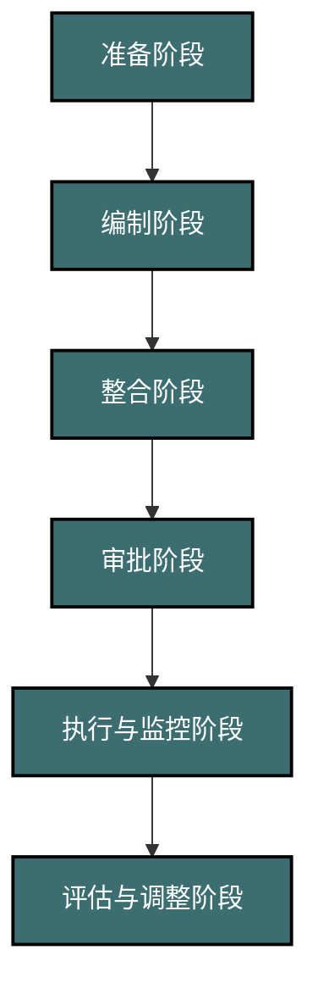
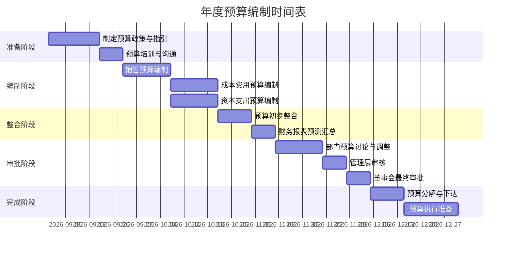
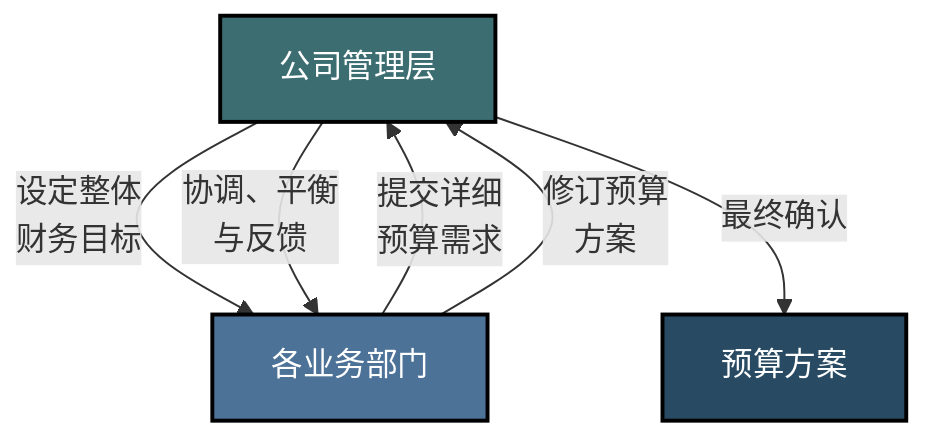

---
{"dg-publish":true,"dg-home":false,"permalink":"/08-财务专业/财务BP/笔记/预算编制基础/预算编制流程/","dgPassFrontmatter":true}
---

#财务BP #预算编制 #流程 #管理流程

## 概述

预算编制流程是财务BP的核心操作环节，涉及从准备工作到最终预算审批的一系列步骤。一个结构清晰、执行有效的预算编制流程，能够确保预算的准确性和可行性，促进战略目标的实现。本文将详细介绍预算编制的完整流程、关键步骤和实操方法。

## 预算编制流程概览

```mermaid
flowchart TD
    A[预算编制流程] --> B[准备工作]
    A --> C[预算编制基本步骤]
    A --> D[预算审批与调整机制]
    
    B --> B1[明确预算目标与战略方向]
    B --> B2[确定预算参数与假设]
    B --> B3[制定预算时间表和责任分工]
    
    C --> C1[自上而下与自下而上结合]
    C --> C2[收入预算]
    C --> C3[成本预算]
    C --> C4[资本支出预算]
    C --> C5[预算整合与平衡]
    
    D --> D1[预算审批流程]
    D --> D2[预算监控方法]
    D --> D3[预算调整条件与程序]
    
    style A fill:#1a5e63,stroke:#000000,stroke-width:2px,color:#ffffff
    style B fill:#2d5277,stroke:#000000,stroke-width:2px,color:#ffffff
    style C fill:#2d5277,stroke:#000000,stroke-width:2px,color:#ffffff
    style D fill:#2d5277,stroke:#000000,stroke-width:2px,color:#ffffff
    
    style B1 fill:#19324c,stroke:#000000,stroke-width:1px,color:#ffffff
    style B2 fill:#19324c,stroke:#000000,stroke-width:1px,color:#ffffff
    style B3 fill:#19324c,stroke:#000000,stroke-width:1px,color:#ffffff
    
    style C1 fill:#19324c,stroke:#000000,stroke-width:1px,color:#ffffff
    style C2 fill:#19324c,stroke:#000000,stroke-width:1px,color:#ffffff
    style C3 fill:#19324c,stroke:#000000,stroke-width:1px,color:#ffffff
    style C4 fill:#19324c,stroke:#000000,stroke-width:1px,color:#ffffff
    style C5 fill:#19324c,stroke:#000000,stroke-width:1px,color:#ffffff
    
    style D1 fill:#19324c,stroke:#000000,stroke-width:1px,color:#ffffff
    style D2 fill:#19324c,stroke:#000000,stroke-width:1px,color:#ffffff
    style D3 fill:#19324c,stroke:#000000,stroke-width:1px,color:#ffffff
```

## 1. 预算编制的准备工作

### 1.1 预算目标与战略对标

在启动预算编制前，首先需要明确企业的战略目标，并将其转化为可量化的财务目标：

- **战略解读**：理解企业年度经营计划和中长期战略规划
- **目标设定**：确定关键绩效指标(KPIs)，如销售增长率、利润率、ROI等
- **战略预算指引**：制定符合战略重点的预算编制指引

### 1.2 预算参数与假设条件

预算编制的准确性很大程度上取决于基础参数和假设的合理性：

| 参数类型 | 内容示例 | 来源/依据 |
|---------|---------|-----------|
| 宏观经济参数 | GDP增速、通货膨胀率、利率预期 | 经济研究报告、央行预测 |
| 行业参数 | 行业增长率、价格趋势、竞争格局 | 行业协会、专业研究机构 |
| 企业内部参数 | 人员增长率、薪资涨幅、生产能力 | 人力资源规划、产能评估 |
| 财务参数 | 税率、折旧政策、汇率假设 | 税务规定、会计政策 |

### 1.3 预算编制时间表与责任分工

制定详细的预算编制计划，包括：

- **时间安排**：预算编制启动、各部门提交、整合审核和最终审批的时间节点
- **责任分工**：各级预算责任人及其职责
- **协调机制**：跨部门沟通和协调的方式与频率

预算编制时间表示例：

## 2. 预算编制的基本步骤

### 2.1 自上而下与自下而上的结合

有效的预算编制通常采用自上而下与自下而上相结合的方法：

**自上而下环节：**
- 管理层制定整体业绩目标和战略重点
- 确定关键资源限制和预算上限
- 为各部门预算提供框架和指引

**自下而上环节：**
- 各部门根据自身情况和业务计划提出预算需求
- 预算需求需有明确的业务逻辑和数据支持
- 充分考虑部门间的协同和依赖关系

### 2.2 收入预算编制

收入预算通常是整个预算编制的起点，主要步骤包括：

1. **市场分析和销售预测**：分析市场趋势、竞争格局和客户需求
2. **产品/服务组合规划**：确定各产品线销售目标和价格策略
3. **销售数量预测**：基于历史数据、市场份额和销售能力预测
4. **销售价格确定**：考虑成本、竞争和客户价值确定价格策略
5. **区域与渠道分布**：分配销售目标至不同区域和销售渠道

### 2.3 成本预算编制

成本预算编制需要深入分析成本结构和驱动因素：

1. **成本分类和结构分析**：识别固定成本、变动成本和混合成本
2. **成本驱动因素分析**：确定影响各类成本的关键驱动因素
3. **直接成本预算**：基于销售预测和生产计划编制
4. **间接费用预算**：按照部门、职能或项目编制
5. **成本优化目标**：设定降本增效的具体目标和行动计划

### 2.4 资本支出预算编制

资本支出预算关注长期投资和资产配置：

1. **投资需求收集**：各部门提交资本投资需求和理由
2. **项目评估和优先级排序**：基于战略价值、财务回报和风险评估
3. **资金来源规划**：确定内部积累、外部融资或租赁等方式
4. **分期实施计划**：制定详细的项目实施和资金支付时间表
5. **折旧与运营成本影响**：计算投资对未来运营成本的影响

### 2.5 预算整合与平衡

将各类预算整合为完整的财务计划：

1. **预算一致性检查**：确保各预算间的假设和数据一致
2. **资源平衡调整**：解决资源需求与供给的不匹配
3. **三大财务报表预测**：编制预测利润表、资产负债表和现金流量表
4. **财务指标评估**：计算关键财务指标并与目标比对
5. **情景分析和敏感性测试**：评估不同假设条件下的预算表现

## 3. 预算审批与调整机制

### 3.1 预算审批流程

预算审批流程确保预算方案符合企业战略和治理要求：

**审批要点：**
- 确保预算与战略目标一致
- 对关键假设和重大项目进行重点审查
- 评估预算的挑战性与可实现性
- 关注跨部门协同和资源分配的合理性

### 3.2 预算执行监控

预算获批后，需建立有效的监控机制：

1. **预算分解**：将年度预算分解为季度、月度目标
2. **责任落实**：明确各级预算执行责任人
3. **定期报告**：建立预算执行情况定期报告机制
4. **偏差分析**：分析实际业绩与预算的差异及原因
5. **预警机制**：设立预算执行风险预警指标和流程

### 3.3 预算调整机制

预算需要在适当情况下进行调整，以适应内外部环境变化：

**预算调整的触发条件：**
- 外部环境发生重大变化（如市场萎缩、政策调整）
- 内部业务策略发生重大调整
- 实际执行与预算持续存在重大偏差
- 新增重大投资或业务机会

**预算调整流程：**
1. 提出调整申请，说明理由和影响
2. 财务部门评估调整的合理性和影响
3. 按照权限级别进行审批
4. 调整预算并通知相关部门
5. 更新预算执行监控基准

## 4. 预算编制方法对比

不同的预算编制方法适用于不同企业和场景：

| 预算方法 | 特点 | 适用场景 | 优势 | 挑战 |
|---------|-----|---------|-----|------|
| 传统预算法 | 基于历史数据，逐年调整 | 稳定行业、成熟企业 | 操作简单，经验借鉴 | 缺乏创新，容易固化低效率 |
| 零基预算法 | 每年从零开始论证所有预算项目 | 成本重组、效率提升 | 挑战现状，识别浪费 | 工作量大，执行复杂 |
| 滚动预算法 | 持续更新未来12个月预算 | 快速变化行业 | 更好适应变化，提高准确性 | 维护成本高，需持续投入 |
| 弹性预算法 | 根据活动量变化调整预算标准 | 业务波动大的企业 | 适应不同业务量，更公平考核 | 设计复杂，需精细化管理 |
| 活动基础预算 | 基于活动分析和成本动因 | 流程型组织、服务业 | 精准反映成本驱动关系 | 需详细活动分析，实施难度大 |

## 5. 实际案例：制造企业年度预算编制流程

### 背景
某中型制造企业，年销售额10亿元，拥有3个生产基地，产品销往国内外市场。

### 准备阶段（9月）
- 召开预算启动会，传达年度战略重点：提高高端产品占比，拓展海外市场
- 设定关键指标目标：销售增长15%，毛利率提高1个百分点，存货周转提升10%
- 成立预算工作组，明确各部门预算协调人
- 制定假设条件：原材料价格上涨3%，人工成本上涨5%，汇率波动区间±3%

### 编制阶段（10月）
- **销售部门**：按产品线、区域提交销售预测，预计总销售11.5亿元
- **生产部门**：根据销售预测制定生产计划，提交原材料、人工、能源等需求
- **研发部门**：提交新产品开发和技术改进计划，预算1000万元
- **人力资源部**：规划人员编制和薪酬调整，预计新增员工30人
- **各生产基地**：提交设备更新和产能扩张投资需求，共计5000万元

### 整合阶段（11月初）
- 财务部整合各部门预算，发现资金缺口2000万元
- 召开协调会议，要求各部门优化预算方案
- 销售部提高销售目标500万元，生产部优化生产计划节约成本300万元
- 资本支出项目分两期实施，第一期投入3000万元

### 审批阶段（11月下旬）
- 预算委员会审核修订后的预算方案
- 总经理办公会最终审定年度预算，调整销售奖励机制以支持高端产品策略
- 董事会批准年度财务计划和重大资本支出

### 执行与监控阶段（次年全年）
- 将年度预算分解为月度和季度目标
- 建立月度预算执行报告制度，每月15日前完成上月分析
- 季度预算执行评估会议，讨论偏差原因并制定纠正措施
- 建立KPI"红绿灯"预警系统，监控关键指标

### 调整案例
第二季度末，由于原材料价格超预期上涨8%，影响毛利率显著下降，触发预算调整机制：
- 生产部门提交原材料替代和工艺优化方案
- 销售部门调整部分产品价格策略
- 预算委员会批准调整全年毛利率目标，但维持利润总额不变
- 更新下半年月度预算指标，强化成本控制措施

## 与其他概念的关系

- [[08-财务专业/财务BP/笔记/基础概念/BP类型与分类\|BP类型与分类]] - 不同类型的BP需要不同的编制流程重点
- [[08-财务专业/财务BP/笔记/基础概念/BP与企业战略\|BP与企业战略]] - 预算编制流程需要与企业战略保持一致
- [[08-财务专业/财务BP/笔记/预算编制基础/收入预测方法\|收入预测方法]] - 预算编制中收入预测的具体方法
- [[08-财务专业/财务BP/笔记/预算编制基础/成本预测方法\|成本预测方法]] - 预算编制中成本预测的具体方法
- [[08-财务专业/财务BP/笔记/基础概念/财务BP的组成部分\|财务BP的组成部分]] - 预算编制流程中需要关注的各个组成部分

## 思考与练习

1. 分析你所在企业或熟悉的企业的预算编制流程，与本文介绍的标准流程有何异同？
2. 预算编制中，如何平衡"挑战性"与"可实现性"，避免预算目标过松或过紧？
3. 设计一个适合初创科技企业的简化预算编制流程，需要特别关注哪些环节？
4. 讨论预算编制中最常见的三个问题及其解决方案。 