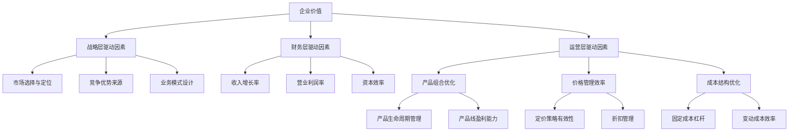

---
{"dg-publish":true,"permalink":"/08-财务专业/财务BP/笔记/高级分析方法/价值驱动因素分析/"}
---

# 价值驱动因素分析

#财务BP #高级分析 #价值驱动因素 #业绩管理 #决策支持

## 概述

价值驱动因素分析是财务BP中的核心分析方法，旨在识别、量化和管理对企业价值创造产生重大影响的关键变量。通过系统性分解企业价值创造过程，确定各层级价值驱动因素之间的逻辑关系，企业能够集中资源于真正能够推动价值增长的业务活动，提高战略决策的精准性和资源配置的有效性。

## 价值驱动因素框架

### 价值驱动因素层级结构

**战略层驱动因素**：
- 市场选择与定位
- 竞争优势来源
- 业务模式设计
- 组织能力建设
- 资源配置策略

**财务层驱动因素**：
- 收入增长率
- 营业利润率
- 资本效率
- 税率优化
- 资本成本管理

**运营层驱动因素**：
- 产品组合优化
- 价格管理效率
- 渠道绩效
- 成本结构优化
- 资产利用效率

**活动层驱动因素**：
- 客户获取成本
- 产品质量指标
- 生产周期时间
- 库存周转率
- 员工生产力

### 价值驱动树构建方法

**自上而下分解法**：
- 从企业价值总量出发
- 逐级分解为构成要素
- 建立数学计算关系
- 识别关键敏感因素
- 确定管理干预点

**自下而上聚合法**：
- 识别基础运营指标
- 建立因果关联图谱
- 追踪影响传导路径
- 聚合形成中层指标
- 最终连接价值创造

**交叉验证方法**：
- 财务视角与运营视角交叉
- 历史数据与预测模型比对
- 内部评估与外部基准对比
- 定量分析与定性判断结合
- 短期指标与长期指标平衡

## 关键财务价值驱动因素深度分析

### 收入增长驱动因素分解

**数量因素**：
- 客户数量增长
- 使用频率变化
- 购买量提升
- 产品渗透率
- 市场份额变化

**价格因素**：
- 基础定价调整
- 产品组合结构变化
- 折扣力度管理
- 渠道价格差异
- 价值定价空间

**组合因素**：
- 高增长品类占比
- 高毛利产品比重
- 新产品贡献率
- 跨销售成功率
- 客户升级转化率

### 利润率驱动因素分解

**毛利率驱动因素**：
- 原材料成本控制
- 劳动力效率提升
- 规模经济效应
- 产品组合优化
- 价格实现能力

**费用率驱动因素**：
- 固定成本杠杆作用
- 销售效率指标
- 管理跨度控制
- 流程优化效果
- 技术投资回报

**特殊项目影响**：
- 一次性成本管理
- 资产减值控制
- 重组费用效益
- 非经常性收益贡献
- 会计政策影响

### 资本效率驱动因素分解

**营运资本管理**：
- 存货周转优化
- 应收账款周期控制
- 应付账款杠杆利用
- 预付与预收平衡
- 现金转换周期缩短

**固定资产效率**：
- 产能利用率提升
- 资产维护有效性
- 设备更新策略
- 闲置资产处置
- 资产轻重结构调整

**投资资本回报率**：
- 项目选择标准
- 资本预算准确性
- 执行效率控制
- 投资组合平衡
- 撤资时机把握

## 行业特定价值驱动分析

### 制造业价值驱动模型

**运营效率驱动因素**：
- 产能利用率
- 良品率提升
- 制造周期缩短
- 设备综合效率(OEE)
- 能源利用效率

**供应链价值驱动**：
- 供应商整合效益
- 采购规模优势
- 库存优化策略
- 物流成本控制
- 供应弹性提升

**产品开发价值驱动**：
- 研发投入回报率
- 新产品上市速度
- 设计优化价值
- 平台共享效益
- 知识产权价值

### 零售业价值驱动模型

**门店绩效驱动因素**：
- 每平方米销售额
- 客流量与转化率
- 客单价提升
- 同店销售增长
- 店面坪效优化

**商品管理驱动因素**：
- 商品组合优化
- 高毛利产品渗透
- 库存周转速度
- 缺货率控制
- 促销效率提升

**全渠道整合价值**：
- 线上线下协同
- 客户获取成本
- 全渠道客户价值
- 数据驱动决策效益
- 配送模式效率

### 科技服务业价值驱动模型

**用户价值驱动因素**：
- 客户获取成本
- 客户生命周期价值
- 月活跃用户增长
- 用户留存率
- 付费转化率

**产品经济学驱动**：
- 单位服务成本
- 产品开发效率
- 功能采用率
- 用户参与度
- 网络效应强度

**规模化价值驱动**：
- 技术平台可扩展性
- 边际成本递减率
- 固定成本摊销效应
- 数据资产价值增长
- 生态系统网络价值

## 价值驱动因素识别方法

### 定量分析技术

**敏感性分析法**：
- 单因素敏感性测试
- 多因素交互分析
- 临界点识别
- 敏感度系数计算
- 价值影响排序

**相关性与回归分析**：
- 历史数据相关性检验
- 多元回归模型构建
- 显著性水平测试
- 解释力评估
- 预测准确性验证

**贡献度分解法**：
- 价值变化分解
- 增量贡献计算
- 归因分析技术
- 组件价值追踪
- 边际贡献评估

### 定性分析方法

**专家评估法**：
- 德尔菲法应用
- 结构化访谈设计
- 专家权重分配
- 一致性检验
- 经验提取与整合

**竞争对标分析**：
- 行业领先者价值分析
- 价值驱动差异识别
- 竞争优势根源追溯
- 最佳实践提取
- 绩效差距评估

**场景分析法**：
- 多场景价值驱动变化
- 战略假设测试
- 颠覆性变化模拟
- 非线性效应评估
- 黑天鹅事件影响

### 综合评估框架

**价值驱动因素评分卡**：
- 影响力评分标准
- 可控性评估维度
- 时效性评级
- 资源需求评估
- 战略一致性评价

**优先级矩阵**：
- 影响-努力矩阵
- 短期-长期平衡图
- 风险-回报评估
- 能力-重要性匹配
- 干预紧迫度分析

**动态评估机制**：
- 周期性重评估流程
- 触发式更新机制
- 价值驱动演变追踪
- 新兴驱动因素扫描
- 失效驱动因素淘汰

## 价值驱动模型应用

### 战略规划与资源分配

**战略选择评估**：
- 战略方案价值驱动对比
- 价值创造潜力评估
- 核心驱动因素匹配度
- 竞争优势可持续性
- 价值实现时间框架

**资源优化配置**：
- 基于价值贡献的预算分配
- 项目投资优先级确定
- 组织能力投资重点
- 资源分配动态调整
- 价值创造监控反馈

**机会识别框架**：
- 价值缺口分析
- 未开发价值区域
- 价值泄漏点识别
- 协同效应机会
- 颠覆性价值创新

### 业绩管理与激励设计

**关键绩效指标体系**：
- 价值驱动导向的KPI设计
- KPI层级与责任对应
- 领先与滞后指标平衡
- 短期与长期指标组合
- 财务与非财务指标整合

**目标设定方法**：
- 基于价值潜力的目标设定
- 拉伸目标与基线平衡
- 内部能力与外部期望匹配
- 阶段性里程碑设计
- 动态目标调整机制

**激励机制设计**：
- 价值驱动与薪酬连接
- 短中长期激励结构
- 团队与个人激励平衡
- 负向价值风险控制
- 非线性激励设计

### 业务流程优化

**流程重设优先级**：
- 高价值影响流程识别
- 价值阻碍点分析
- 流程简化价值评估
- 自动化投资回报
- 流程整合协同效应

**价值链优化**：
- 价值链关键环节强化
- 低价值活动外包
- 价值链重构机会
- 垂直整合决策支持
- 合作伙伴选择标准

**持续改进框架**：
- 价值驱动导向改进项目
- 改进投资回报评估
- 试点-验证-推广机制
- 价值实现跟踪方法
- 最佳实践知识管理

## 价值驱动分析工具与技术

### 数据分析与可视化

**驱动因素仪表板**：
- 多层级驱动因素视图
- 实时监控关键指标
- 趋势与偏差分析
- 预警与异常提示
- 交互式钻取功能

**瀑布图分析**：
- 价值变化瀑布分解
- 正负驱动因素可视化
- 计划与实际对比
- 累积效应展示
- 因素贡献排序

**热图分析**：
- 价值驱动敏感度热图
- 交叉影响可视化
- 机会区域标识
- 风险集中度展示
- 资源配置导向图

### 建模与模拟技术

**价值驱动树模型**：
- 数学关系构建方法
- 参数估计技术
- 历史数据校准
- 预测准确性验证
- 模型适应性维护

**蒙特卡洛模拟**：
- 关键驱动因素概率分布
- 相关性结构设计
- 多变量联合模拟
- 置信区间分析
- 极端情况评估

**动态系统建模**：
- 反馈循环识别
- 时滞效应模拟
- 非线性关系处理
- 系统边界设定
- 长期动态预测

### Excel模型构建

**驱动因素模型模板**：
- 模块化结构设计
- 输入-处理-输出分离
- 假设区集中管理
- 敏感性分析自动化
- 情景切换功能

**使用者界面设计**：
- 控制面板布局
- 直观参数调整器
- 结果即时更新
- 警示与提示系统
- 决策支持信息层

**模型质量保证**：
- 公式审计技术
- 一致性检查机制
- 错误捕获与处理
- 模型文档标准
- 版本控制与更新

## 行业实践案例

### 制造企业价值驱动转型

**背景与挑战**：
- 传统制造企业面临增长停滞
- 产品同质化导致价格压力
- 原材料成本波动影响利润
- 资本密集型模式限制回报
- 全球竞争格局变化

**价值驱动分析过程**：
1. 构建企业价值驱动树
2. 识别关键杠杆点
3. 量化驱动因素影响
4. 设计改进干预措施
5. 建立跟踪与反馈机制

**转型成果**：
- 产品组合向高价值领域转型
- 定价策略从成本导向到价值导向
- 精益生产提升资产利用效率
- 服务收入比例提高改善利润结构
- 资本轻型业务模式提升资本回报

### 零售企业全渠道价值重塑

**背景与挑战**：
- 传统实体零售遭遇线上冲击
- 门店网络成本结构缺乏弹性
- 客户购物行为快速变化
- 库存管理复杂度提高
- 数据孤岛限制决策质量

**价值驱动分析过程**：
1. 全渠道客户行为价值映射
2. 触点经济学分析
3. 关键价值泄漏点识别
4. 全渠道协同价值量化
5. 数字化投资回报建模

**转型成果**：
- 多渠道客户价值提升40%
- 门店空间重新定位提升坪效
- 库存周转提高降低资金占用
- 数据驱动决策提升促销ROI
- 客户获取成本降低25%

### 服务企业客户价值最大化

**背景与挑战**：
- 专业服务企业面临增长瓶颈
- 客户获取成本持续上升
- 服务交付模式效率有限
- 高价值人才保留难度增加
- 服务商品化趋势影响利润率

**价值驱动分析过程**：
1. 客户分层价值贡献分析
2. 服务组合盈利能力评估
3. 人才生产力价值驱动研究
4. 服务交付模式经济学比较
5. 客户关系生命周期价值建模

**转型成果**：
- 客户组合优化提升平均利润率
- 高价值服务渗透率提高
- 规模化服务模式降低单位成本
- 人才结构优化提升知识杠杆
- 客户留存率提高减少获客压力

## 价值驱动分析与其他方法整合

### 与战略规划整合

**战略-价值连接点**：
- 战略选择的价值驱动验证
- 价值驱动指导战略重点
- 战略假设的价值测试
- 价值实现路径规划
- 战略执行的价值跟踪

**整合方法论**：
- 价值驱动的情景规划
- 战略选项价值对比
- 能力投资价值评估
- 战略风险-价值权衡
- 阶段性价值里程碑设计

### 与预算规划整合

**预算-价值链接**：
- 基于价值贡献的资源分配
- 价值驱动的预算优先级
- 零基预算价值评估
- 预算调整的价值影响分析
- 弹性预算与价值触发机制

**整合工具**：
- 驱动因素导向预算模板
- 价值敏感度预算调整工具
- 滚动预测与价值跟踪
- 资源重分配决策支持
- 价值缺口预警与响应

### 与风险管理整合

**价值-风险框架**：
- 价值驱动的风险重要性评估
- 关键价值驱动的风险防护
- 风险缓解投资的价值回报
- 风险调整后的价值评估
- 价值机会与风险平衡

**整合方法**：
- 价值风险矩阵
- 关键价值驱动风险情景
- 风险事件价值影响分析
- 价值保护策略优先级
- 风险与价值协同管理

## 价值驱动分析实施路径

### 组织能力建设

**分析能力发展**：
- 价值分析技能培训
- 数据分析工具应用
- 建模与模拟能力
- 业务洞察提取方法
- 决策支持技术

**组织结构支持**：
- 价值管理职责分配
- 跨职能协作机制
- 分析中心设立
- 业务-财务伙伴关系
- 价值创造问责制

**文化与思维培养**：
- 价值创造意识
- 基于事实的决策习惯
- 持续改进心态
- 结果导向问责
- 创新与价值平衡

### 实施路线图

**起步阶段**：
- 价值驱动意识培养
- 基础分析能力建设
- 关键驱动识别试点
- 初步价值模型构建
- 早期成功案例示范

**扩展阶段**：
- 全面价值驱动树构建
- 分析方法标准化
- 工具与模板推广
- 中层管理应用深化
- 跨部门价值协同

**成熟阶段**：
- 价值驱动文化根植
- 高级预测分析应用
- 战略与运营深度整合
- 动态价值管理系统
- 持续创新价值机制

### 常见挑战与应对

**数据质量与可用性**：
- 数据缺口识别与解决
- 数据标准与定义统一
- 多源数据整合方法
- 数据治理机制建立
- 逐步数据质量提升

**组织抵抗与变革**：
- 高管支持与示范
- 早期成功树立信心
- 利益相关方参与设计
- 能力建设减少焦虑
- 激励机制引导行为

**方法论复杂度**：
- 分层次实施降低门槛
- 模板简化应用难度
- 辅助工具提高效率
- 实用性优先于完美
- 逐步提升分析深度

## 价值驱动分析未来趋势

### 技术赋能与数字化

**高级分析技术**：
- 机器学习识别隐藏驱动因素
- 人工智能辅助价值预测
- 大数据挖掘非结构化价值信号
- 自动化建模与模拟
- 实时分析与动态响应

**数字孪生应用**：
- 业务模型数字孪生构建
- 虚拟环境价值假设测试
- 复杂系统价值模拟
- 实时价值监控与优化
- 多维情景动态评估

**移动与云平台**：
- 随时随地价值监控
- 协作分析与决策
- 知识共享与最佳实践
- 弹性计算能力支持
- 价值驱动应用生态

### 新兴方法论发展

**整合性价值框架**：
- 财务与非财务价值统一
- 短期与长期价值平衡
- 股东与利益相关方价值协调
- 有形与无形价值计量
- 经济、社会与环境价值综合

**敏捷价值管理**：
- 快速价值假设验证
- 最小可行价值干预
- 迭代式价值改进
- 价值反馈闭环加速
- 实验导向价值发现

**生态系统价值分析**：
- 跨企业价值创造
- 平台经济价值驱动
- 网络效应价值建模
- 生态位价值贡献
- 共创价值分配机制

## 参考资源

### 核心方法论资源

- 《价值驱动管理》(Value Driven Management)
- 《经济附加值指南》(EVA Guide)
- 《基于价值的管理》(Value Based Management)
- 《驱动因素分析实践》(Driver Analysis in Practice)
- 《战略价值管理》(Strategic Value Management)

### 工具与模板

- 价值驱动树构建工具包
- 关键驱动因素识别模板
- 价值驱动分析Excel模型
- 驱动因素仪表板设计指南
- 价值管理实施检查清单

### 参考案例与研究

- 行业特定价值驱动研究报告
- 领先企业价值管理实践
- 价值创造成功转型案例
- 价值驱动分析方法比较研究
- 新兴价值管理趋势报告 