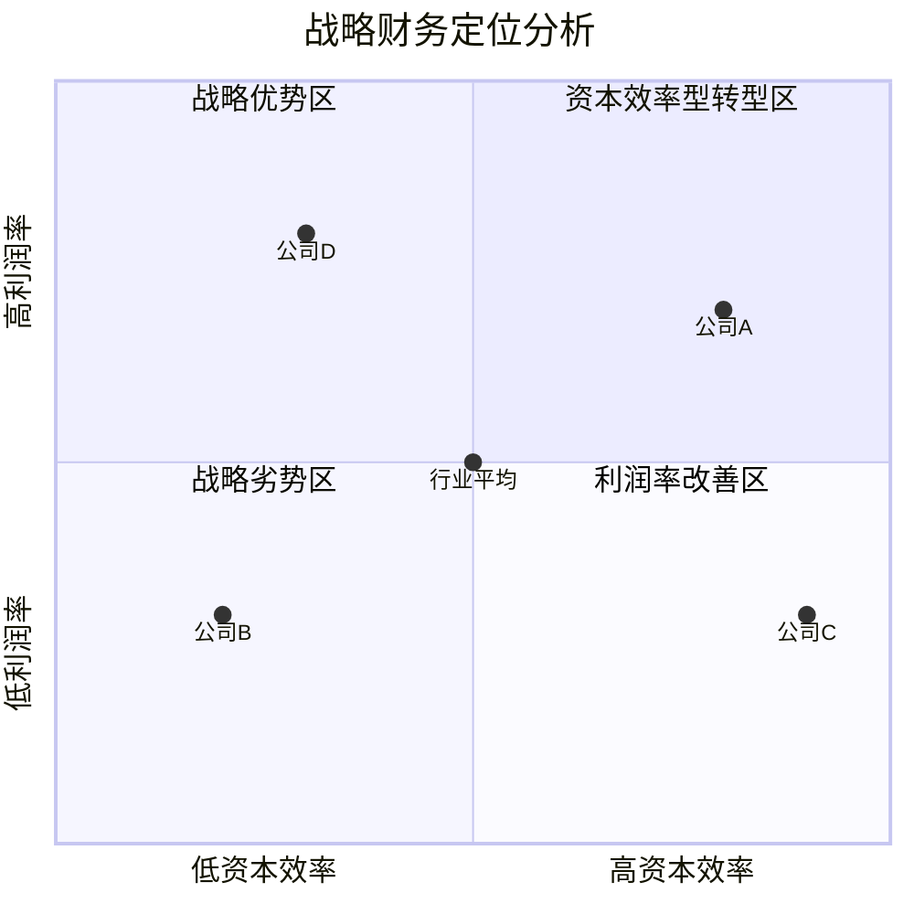

---
{"dg-publish":true,"dg-home":false,"permalink":"/08-财务专业/财务BP/笔记/高级分析方法/战略财务分析/","dgPassFrontmatter":true}
---

#财务BP #高级分析 #战略财务 #商业洞察 #价值创造

## 概述

战略财务分析是财务BP的高级分析技术，通过将财务数据与企业战略紧密结合，揭示业务运营背后的价值创造逻辑和竞争优势来源。与传统财务分析不同，战略财务分析不仅关注历史绩效评估，更着眼于企业未来价值创造能力的系统性分析，为企业战略决策和资源配置提供数据驱动的支持框架。

## 战略财务分析框架

### 战略定位分析

**行业结构分析**：
- 行业价值链利润分布
- 行业集中度与竞争格局
- 行业成熟度与生命周期
- 进入与退出壁垒评估
- 替代品威胁财务影响

**竞争地位财务评估**：
- 相对市场份额趋势
- 财务表现对标分析
- 成本结构比较优势
- 差异化溢价能力
- 资本效率相对表现

**战略群组财务图谱**：
- 价值定位与财务表现
- 商业模式与利润率构成
- 资源配置模式比较
- 增长轨迹与投资回报
- 风险-回报平衡点

### 价值创造模式分析

**经济利润分析**：
- 资本成本调整后利润计算
- 经济附加值(EVA)趋势解读
- 资本回报与成本差异分析
- 价值创造与价值毁损区域识别
- 经济利润敏感因素分解

**商业模式财务解构**：
- 收入模式财务特征
- 成本结构设计逻辑
- 营运资产配置模式
- 现金流产生机制
- 价值获取路径分析

**价值创造动态评估**：
- 持续竞争优势期估计
- 超额回报持续性预测
- 价值创造驱动因素演变
- 商业模式生命周期评估
- 战略转型财务拐点识别

### 增长战略财务分析

**增长向量财务评估**：
- 市场渗透财务效益
- 市场拓展资本需求
- 产品开发投资回报
- 多元化战略风险溢价
- 增长组合投资配比

**内部增长财务评估**：
- 有机增长资本效率
- 研发投资生产率
- 营销投资回报率
- 产能扩张单位经济性
- 渠道发展投资回报

**外部增长财务评估**：
- 并购目标价值评估
- 协同效应财务量化
- 整合成本与时间风险
- 并购溢价合理性分析
- 并购后绩效对标评估

## 战略选择财务分析

### 战略备选方案财务模拟

**情景规划财务投影**：
- 关键战略假设识别
- 多情景财务预测构建
- 弹性预算边界设定
- 基准情景偏差校准
- 临界点与决策触发器设计

**战略路径财务地图**：
- 阶段性财务里程碑
- 投资节奏与回报时间表
- 资源调度优先次序
- 战略选择实物期权
- 调整与退出机制设计

**资源配置组合优化**：
- 战略倡议财务排序
- 资本配置效率最大化
- 资源约束下价值优化
- 风险分散投资组合
- 动态资源再分配机制

### 战略财务风险评估

**竞争反应风险**：
- 竞争对手反制财务影响
- 价格战耐受能力评估
- 市场份额波动敏感性
- 竞争升级财务承受力
- 战略资源优势持久性

**战略执行风险**：
- 执行差距财务影响
- 能力建设投资不足风险
- 关键里程碑延迟成本
- 战略转型现金消耗速率
- 组织变革财务缓冲需求

**外部环境风险**：
- 宏观经济周期影响
- 法规变化财务适应性
- 技术变革价值链冲击
- 消费者偏好转变速度
- 全球化风险敞口评估

## 战略资本配置分析

### 投资组合管理框架

**业务单元投资矩阵**：
- 市场吸引力-竞争地位评分
- 现金流贡献与需求映射
- 业务生命周期定位
- 资源需求优先级分配
- 投资-撤资决策标准

**增长-回报平衡分析**：
- 短期回报与长期增长权衡
- 现金牛与明星业务平衡
- 探索与利用投资比例
- 颠覆性与渐进性项目组合
- 核心与边缘业务资源分配

**资本结构战略匹配**：
- 增长阶段融资策略
- 债务容量与战略灵活性
- 融资成本与战略风险匹配
- 资本结构战略信号作用
- 股东回报与再投资平衡

### 价值创造路径分析

**价值增长分解**：
- 收入增长贡献度
- 利润率改善贡献度
- 资本效率提升贡献度
- 乘数效应与协同贡献
- 时间价值贡献计算

**资本生产率轨迹**：
- 投资密集度与回报率关系
- 资本周转效率演变曲线
- 边际资本回报率趋势
- 再投资率与增长可持续性
- 资本配置学习曲线

**战略实物期权价值**：
- 进入期权财务价值
- 扩张期权价值评估
- 延迟期权机会成本
- 退出期权保护价值
- 转型期权战略价值

## 战略绩效管理与激励

### 战略绩效指标体系

**战略平衡计分卡**：
- 财务视角关键指标
- 客户视角价值度量
- 内部流程效率指标
- 学习与成长能力指标
- 指标间因果链构建

**战略导向价值指标**：
- 经济利润(EP)跟踪
- 股东总回报(TSR)比较
- 现金投资回报率(CFROI)
- 资本效率指数(CEI)
- 战略健康指数(SHI)

**长期价值创造指标**：
- 创新投资回报率
- 客户生命周期价值增长
- 组织能力建设进度
- 战略资产价值增值
- 可持续竞争力指数

### 战略激励机制设计

**价值创造薪酬联动**：
- 长期价值导向激励
- 短期绩效与长期价值平衡
- 战略里程碑奖励机制
- 相对绩效评估框架
- 风险调整回报计量

**战略执行激励机制**：
- 关键战略举措完成奖励
- 跨职能协作激励设计
- 战略学习与适应性奖励
- 资源配置效率激励
- 长期能力建设激励

**价值分享模型设计**：
- 经济利润分享公式
- 价值创造份额分配
- 不同利益相关者价值平衡
- 长期激励递延机制
- 股权与价值增长联结

## 战略沟通与对话

### 战略叙事财务支持

**价值创造故事构建**：
- 战略逻辑数据支撑
- 价值主张财务验证
- 成功路径里程碑量化
- 风险-回报叙事框架
- 愿景财务可行性论证

**投资者沟通框架**：
- 资本市场预期管理
- 长期价值故事一致性
- 业绩波动背景解释
- 战略转型期望管理
- 价值创造时间框架沟通

**内部战略共识建立**：
- 战略财务教育工具
- 资源配置决策透明度
- 价值创造责任分配
- 跨部门战略对话促进
- 战略假设集体检验机制

### 战略学习闭环

**战略假设检验**：
- 关键假设财务验证
- 预期与实际差异分析
- 市场反应校准评估
- 竞争动态财务信号解读
- 战略调整触发阈值

**战略适应性财务支持**：
- 快速试错财务框架
- 战略实验投资规则
- 早期预警指标监测
- 战略灵活性财务缓冲
- 动态资源重新配置机制

**战略财务学习体系**：
- 战略执行回顾流程
- 价值创造知识管理
- 跨业务单元学习平台
- 战略失败分析机制
- 机构性学习融入规划

## 实践应用工具

### 战略财务分析模板

**战略定位财务评估表**：
- 竞争优势财务指标评分
- 行业吸引力多维量表
- 战略群组财务映射工具
- 价值链财务分布图
- 相对竞争地位指数计算

**战略选择财务评估模板**：
- 备选方案财务情景分析
- 战略路径财务里程碑表
- 风险-回报权衡矩阵
- 资源需求与约束图谱
- 战略选择财务决策树

**价值创造追踪模板**：
- 经济利润驱动因素分解
- 价值创造瀑布图
- 战略价值创造计分卡
- 长期价值指标追踪表
- 价值创造归因分析图

### 分析案例研究

**战略转型财务案例**：
- 业务模式转变财务支持
- 增长战略重新定位分析
- 价值链整合财务评估
- 多元化与聚焦战略对比
- 创新投资组合优化案例

**战略并购财务案例**：
- 行业整合价值评估
- 能力获取溢价分析
- 协同效应实现追踪
- 整合挑战财务影响
- 并购后价值创造评估

**战略资源重新配置案例**：
- 业务组合重组分析
- 增长领域资本转移评估
- 成熟业务价值释放策略
- 数字化转型投资回报
- 全球扩张资源配置最优化

## 未来发展趋势

### 数字化战略财务分析

**实时战略财务监控**：
- 动态战略仪表盘设计
- 实时战略执行追踪
- 预警机制与阈值设置
- 关键假设持续验证
- 战略调整敏捷响应

**高级分析与战略财务**：
- 预测性分析战略应用
- 机器学习辅助决策模型
- 战略情景自动化模拟
- 非结构化数据战略洞察
- 复杂系统效应分析

**生态系统价值分析**：
- 平台战略财务评估
- 网络效应价值量化
- 生态系统健康指标
- 多方价值创造分配
- 系统生命周期投资策略

### 可持续战略财务分析

**ESG价值创造分析**：
- 可持续发展投资回报
- 气候风险财务影响
- 社会资本价值评估
- 责任商业战略财务
- 长期韧性价值度量

**多维资本战略配置**：
- 财务资本优化配置
- 人力资本战略投资
- 自然资本风险管理
- 社会资本发展战略
- 智力资本价值增值

**长期价值创造框架**：
- 代际价值评估方法
- 超长期投资回报计算
- 系统性风险财务缓冲
- 适应性容量投资策略
- 变革韧性价值评估 