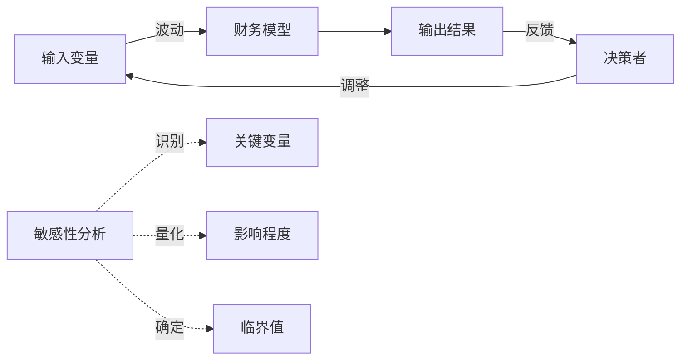
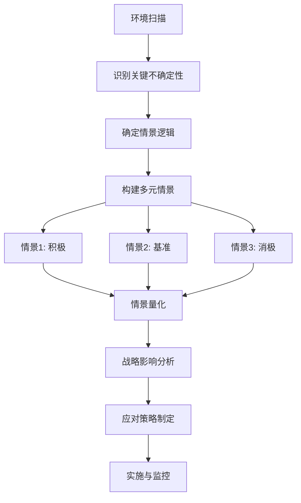

---
{"dg-publish":true,"permalink":"/08-财务专业/财务BP/笔记/高级分析方法/敏感性分析与情景规划/"}
---

#财务BP #高级分析 #敏感性分析 #情景规划 #决策支持

## 概述

敏感性分析与情景规划是财务BP中的关键分析工具，用于评估不确定性对业务计划的潜在影响。在复杂多变的商业环境中，这些方法帮助企业超越单一点预测，深入理解关键变量波动可能带来的结果范围，为更稳健的决策提供支持。

## 敏感性分析基础

### 敏感性分析原理

**核心概念**：
- 变量波动影响测试
- 输入-输出关系量化
- 关键敏感因素识别
- 边际影响评估
- 稳健性界限确定

**分析目的**：
- 识别关键风险变量
- 确定决策弹性区间
- 评估预算假设可靠性
- 指导风险缓解重点
- 支持应急计划制定

**分析局限性**：
- 单因素独立假设简化
- 非线性关系捕捉有限
- 相关性结构常被忽视
- 极端事件覆盖不足
- 静态分析时间维度缺失

### 敏感性分析类型

**单因素敏感性分析**：
- 单变量波动测试
- 其他变量保持不变
- 线性关系假设
- 敏感度系数计算
- 临界点识别

**多因素敏感性分析**：
- 多变量同时波动
- 组合效应评估
- 交互影响分析
- 非线性关系探索
- 复杂系统响应观察

**情景敏感性分析**：
- 基于特定情景
- 一组变量协同变化
- 结构性假设调整
- 内部一致性保持
- 情景间对比分析

**概率敏感性分析**：
- 概率分布指定
- 随机模拟技术
- 结果分布特征
- 风险概率量化
- 信心区间估计

## 敏感性分析实施方法

### 变量选择与设置

**变量筛选原则**：
- 高不确定性因素
- 历史波动显著项
- 管理层关注重点
- 外部环境敏感点
- 战略假设要素

**变量范围设定**：
- 历史波动区间分析
- 极端情况考量
- 行业专家判断
- 统计置信区间
- 战略规划假设范围

**相关性处理**：
- 变量间依赖关系识别
- 正负相关性区分
- 相关系数矩阵构建
- 联动变化机制设计
- 非线性关系特殊处理

### 分析执行与结果解读

**模型准备**：
- 计算关系明确化
- 假设显性标记
- 输入参数区隔离
- 输出指标预定义
- 计算错误检查验证

**分析程序**：
1. 基准情景建立
2. 变量波动范围定义
3. 系统性变量调整
4. 结果差异计算
5. 敏感度量化与排序

**结果可视化**：
- 蜘蛛图(雷达图)
- 龙卷风图排序
- 热图影响强度
- 二维影响矩阵
- 临界点标记图表

**结果解读关键点**：
- 影响方向与幅度
- 非线性响应识别
- 临界转折点标记
- 风险杠杆效应评估
- 稳健区间界定

## 情景规划方法论

### 情景规划基本原理

**核心理念**：
- 多元未来可能性
- 一致性情景构建
- 深层不确定性应对
- 系统性思考框架
- 超越预测的准备

**情景规划目的**：
- 扩展思维边界
- 识别战略机会与威胁
- 测试战略稳健性
- 提前准备应对方案
- 培养组织敏捷性

**情景规划与传统预测区别**：
- 多情景vs单点预测
- 可能性探索vs概率估计
- 系统思考vs线性延伸
- 定性与定量结合vs纯定量分析
- 战略洞察vs战术规划

### 情景构建方法

**关键不确定性识别**：
- 环境扫描技术
- PESTEL分析应用
- 影响-不确定性矩阵
- 专家访谈综合
- 信号事件捕捉

**情景逻辑框架**：
- 双轴情景矩阵
- 关键变量组合
- 内部一致性检验
- 情景间差异最大化
- 故事线索贯穿

**情景叙事开发**：
- 情景命名与特征
- 发展路径描述
- 关键事件时间线
- 利益相关方反应
- 具体指标量化

**情景数量与范围**：
- 典型3-5个情景
- 极端情景包含
- 基准情景锚定
- 黑天鹅事件考量
- 时间跨度明确

## 财务BP中的应用场景

### 预算与资源分配

**预算区间设定**：
- 弹性预算范围确定
- 触发式调整机制
- 资源缓冲规模设计
- 优先级与降级计划
- 关键绩效容忍度

**资本支出决策**：
- 投资回报敏感性
- 回收期波动评估
- 分阶段投资规划
- 扩张时机弹性
- 退出选项保留

**人力资源规划**：
- 人员需求弹性评估
- 技能结构调整预案
- 招聘与外包平衡
- 培训投资优先级
- 组织扩张阶梯设计

### 战略制定与评估

**战略选择分析**：
- 多情景下战略绩效
- 最大后悔值评估
- 战略风险承受度
- 战略期权价值
- 核心能力弹性测试

**市场进入决策**：
- 市场规模敏感性
- 竞争反应情景评估
- 价格敏感度测试
- 渗透率变化影响
- 撤退成本考量

**产品组合管理**：
- 产品线构成敏感性
- 新产品贡献波动
- 渠道组合弹性
- 定价策略测试
- 产品淘汰影响

### 风险管理与应急规划

**下行风险防御**：
- 损益平衡点变化
- 现金流断点分析
- 债务契约合规性
- 信用评级维持要求
- 流动性缓冲需求

**危机情景应对**：
- 极端情况生存测试
- 应急资金需求评估
- 业务连续性选项
- 重组机会预评估
- 核心业务保护策略

**机会捕捉规划**：
- 上行潜力量化
- 快速扩张准备度
- 资源弹性调配
- 加速增长触发点
- 竞争优势放大点

## 行业特定应用模型

### 制造业模型

**供应链敏感性分析**：
- 原材料价格波动影响
- 供应中断持续时间
- 库存策略敏感性
- 运输成本变化
- 供应商集中度风险

**生产规划情景**：
- 产能利用率敏感性
- 生产效率波动影响
- 产品组合变化分析
- 固定成本摊销效应
- 规模经济临界点

**研发投资情景**：
- 技术突破概率
- 研发周期变化影响
- 产品上市时间敏感性
- 竞争技术情景
- 知识产权价值变化

### 零售业模型

**客户行为敏感性**：
- 客流量变化影响
- 客单价弹性测试
- 转化率波动分析
- 在线迁移速度情景
- 客户忠诚度变化

**门店网络情景**：
- 同店销售增长敏感性
- 新店销售爬坡情景
- 租金成本变化影响
- 门店结构优化选项
- 全渠道协同效应

**库存与供应链**：
- 库存周转敏感性
- 季节性波动管理
- 缺货率影响分析
- 促销效果变化
- 产品生命周期缩短

### 科技服务业模型

**客户获取敏感性**：
- 获客成本变化影响
- 转化率波动分析
- 渠道效率敏感性
- 病毒式增长情景
- 客户获取瓶颈

**客户价值情景**：
- 客户留存率变化
- 使用频率敏感性
- 升级率波动分析
- 收入per用户情景
- 客户生命周期变化

**技术与扩展性**：
- 技术债务影响
- 扩展成本敏感性
- 服务中断风险
- 安全事件情景
- 技术采用曲线变化

## 高级分析技术

### 蒙特卡洛模拟

**基本原理**：
- 随机变量模拟
- 大量迭代抽样
- 概率分布生成
- 结果分布特征分析
- 极端情况捕捉

**实施步骤**：
1. 变量概率分布确定
2. 相关性结构设计
3. 随机抽样迭代运行
4. 结果分布统计分析
5. 风险概率量化与解读

**应用场景**：
- 复杂多变量系统
- 非线性关系建模
- 风险分布特征分析
- 极端风险评估
- 价值风险(VaR)计算

### 决策树分析

**基本原理**：
- 多阶段决策路径
- 概率节点与决策节点
- 结果价值计算
- 期望值最大化
- 风险调整回报评估

**实施步骤**：
1. 决策点与不确定点识别
2. 决策树结构构建
3. 概率与结果值估计
4. 期望值回溯计算
5. 最优决策路径确定

**应用场景**：
- 阶段性投资决策
- 新产品开发路径
- 市场进入策略
- 研发投资组合
- 扩张与退出决策

### 实物期权分析

**基本原理**：
- 战略柔性价值
- 不确定性下的价值创造
- 推迟、扩展、收缩、放弃选项
- 决策权价值量化
- 时间价值考量

**实施步骤**：
1. 实物期权类型识别
2. 期权参数估计
3. 期权定价模型选择
4. 期权价值计算
5. 战略决策调整

**应用场景**：
- 大规模资本投资
- 新市场进入决策
- 研发项目组合
- 资源储备战略
- 业务退出机制

## 实施工具与最佳实践

### Excel模型设计

**模型架构**：
- 模块化结构设计
- 输入区集中管理
- 计算逻辑透明化
- 结果区清晰呈现
- 控制面板直观操作

**敏感性分析功能**：
- 数据表分析设置
- 目标寻找功能应用
- 情景管理器配置
- 滚动预测机制
- 宏自动化分析流程

**结果可视化**：
- 动态图表设计
- 仪表板布局优化
- 颜色编码直观性
- 交互式过滤器
- 决策支持信息层

### 专业工具应用

**规划软件**：
- Crystal Ball使用技巧
- @Risk建模方法
- Palisade软件包应用
- 商业智能平台整合
- 企业规划系统功能

**定制化应用开发**：
- Python/R分析脚本
- 网页应用交互设计
- 数据库后端整合
- API连接实时数据
- 移动端监控功能

**协作与共享机制**：
- 云端协作平台
- 版本控制管理
- 结果共享流程
- 权限设置与安全
- 反馈收集机制

### 组织实施最佳实践

**分析团队构建**：
- 跨职能团队组成
- 业务与分析技能平衡
- 职责与权限明确
- 协作流程规范
- 能力发展路径

**流程设计**：
- 定期分析周期
- 触发式深入分析
- 结果沟通机制
- 决策整合流程
- 持续改进反馈

**结果应用**：
- 经营决策整合
- 战略规划输入
- 投资委员会支持
- 风险委员会报告
- 董事会汇报内容

## 案例研究

### 制造企业扩产决策案例

**背景与挑战**：
- 全球市场需求不确定
- 竞争产能扩张信号
- 技术路线选择分歧
- 大额资本支出压力
- 分阶段决策需求

**分析方法**：
1. 关键变量敏感性测试
2. 多情景产能需求预测
3. 分阶段决策树建模
4. 扩产时机实物期权分析
5. 蒙特卡洛模拟投资回报

**决策价值**：
- 分阶段投资策略明确
- 关键风险变量监控指标
- 提前期行动计划设计
- 备选技术路线准备
- 战略柔性价值量化

### 零售商全渠道转型案例

**背景与挑战**：
- 线上竞争快速增长
- 实体店流量持续下降
- 全渠道整合复杂性
- 技术投资回报不确定
- 组织转型阻力

**分析方法**：
1. 渠道迁移速度情景构建
2. 全渠道客户行为敏感性
3. 店铺网络优化情景
4. 数字化投资决策树
5. 转型路径敏感性测试

**决策价值**：
- 差异化渠道战略清晰
- 门店网络调整路径
- 数字化投资优先次序
- 组织能力差距识别
- 阶段性转型目标设定

### 科技企业融资规划案例

**背景与挑战**：
- 增长速度与盈利平衡
- 不同融资选项对比
- 现金消耗率风险
- 融资时机敏感性
- 估值驱动因素复杂

**分析方法**：
1. 增长路径情景规划
2. 现金流敏感性分析
3. 融资选项决策树
4. 估值驱动因素测试
5. 融资失败情景计划

**决策价值**：
- 可持续增长路径确定
- 资金需求时间表明确
- 最佳融资策略选择
- 投资者沟通要点
- 公司控制权影响了解

## 挑战与解决方案

### 分析质量挑战

**数据限制**：
- 历史数据有限
- 数据质量问题
- 新业务缺乏参考
- 极端事件稀少
- 结构性变化干扰

**解决方法**：
- 专家判断结构化整合
- 外部数据源补充
- 类比推理方法应用
- 情景设计替代历史外推
- 假设透明化与检验

### 认知偏见管理

**常见偏见**：
- 确认偏误(寻找支持已有观点的证据)
- 过度自信(低估不确定性)
- 锚定效应(过分依赖初始信息)
- 可得性偏误(高估容易想到的风险)
- 群体思维(压制异见)

**缓解策略**：
- 预先破灭法应用
- 红队/蓝队对抗分析
- 匿名意见收集机制
- 外部视角引入
- 结构化决策流程

### 组织实施障碍

**常见障碍**：
- 分析能力不足
- 时间与资源限制
- 结果沟通挑战
- 决策文化不支持
- 执行跟踪缺失

**解决方案**：
- 渐进式能力建设
- 优先级聚焦关键决策
- 可视化增强沟通效果
- 高层支持与示范
- 闭环反馈机制建立

## 敏感性分析与情景规划整合

### 与财务规划整合

**整合点**：
- 预算区间设定
- 弹性资源分配
- 触发式调整机制
- 关键绩效容忍度
- 滚动预测改进

**实施工具**：
- 情景导向预算模板
- 敏感性驱动的预算调整
- 资源优先级矩阵
- 预警指标与触发点
- 动态资源再分配机制

### 与风险管理整合

**整合框架**：
- 风险识别输入
- 风险量化辅助
- 风险缓解效果测试
- 应急计划情景
- 风险监控指标

**共享工具**：
- 一致性风险情景
- 风险热图敏感性
- 关键风险指标监控
- 应急触发机制
- 风险缓解资源分配

### 与战略管理整合

**整合机制**：
- 战略假设测试
- 战略选项评估
- 实施路径灵活性
- 战略早期预警
- 战略审视触发点

**决策支持工具**：
- 战略选项价值矩阵
- 假设验证仪表板
- 战略弹性评分卡
- 竞争动态模拟
- 关键成功因素敏感性

## 未来趋势

### 技术发展与应用

**高级分析技术**：
- 机器学习情景生成
- 人工智能驱动的敏感性
- 大数据信号挖掘
- 复杂系统建模
- 实时模拟与调整

**可视化创新**：
- 3D情景可视化
- 交互式敏感性图表
- 虚拟现实决策空间
- 增强分析辅助工具
- 移动端监控应用

**计算能力提升**：
- 云计算资源应用
- 分布式模拟技术
- 超复杂模型处理能力
- 大规模情景库
- 实时蒙特卡洛模拟

### 方法论演进

**整合性方法**：
- 敏感性与情景深度融合
- 定性与定量分析平衡
- 跨领域整合分析
- 多层次模型联动
- 系统动力学应用拓展

**人因与行为整合**：
- 行为经济学视角
- 决策心理学应用
- 偏见减缓机制
- 群体决策动态
- 组织学习闭环

**持续适应模型**：
- 动态假设更新机制
- 学习型模型结构
- 实时情景调整
- 敏捷规划方法论
- 适应性分析框架

## 参考资源

### 方法论著作与研究

- 《情景规划:面向不确定未来的战略思考》
- 《敏感性分析:模型输出不确定性的系统探索》
- 《决策与不确定性:心理学、经济学与统计学视角》
- 《系统思考:复杂商业问题的整体解决方案》
- 《实物期权:战略性投资决策的灵活性价值》

### 工具与模板资源

- 敏感性分析Excel模板库
- 情景规划工作坊指南
- 决策树建模工具比较
- 蒙特卡洛模拟指导手册
- 风险分析软件评估报告

### 行业资源与案例

- 行业趋势报告与研究
- 管理咨询最佳实践汇编
- 公司案例研究集
- 行业特定敏感性指南
- 专业协会资源库 