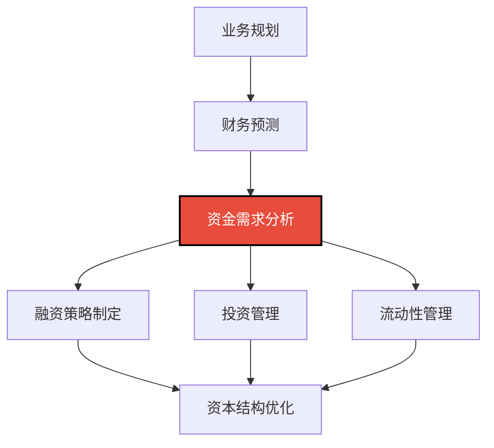

---
{"dg-publish":true,"dg-home":false,"permalink":"/08-财务专业/财务BP/笔记/高级分析方法/资金需求分析/","dgPassFrontmatter":true}
---

#财务BP #高级分析 #资金需求 #融资规划 #现金管理

## 概述

资金需求分析是财务BP中的关键环节，旨在准确预测企业未来各时期的资金缺口或盈余，并制定相应的融资或投资策略。有效的资金需求分析能够确保企业拥有充足的流动性以支持运营和投资活动，同时避免过度融资带来的资金闲置和成本浪费。在动态变化的商业环境中，资金需求分析需要综合考虑业务增长、季节性波动、投资计划、债务结构和外部融资环境等多种因素，为企业财务决策提供科学依据。

## 资金需求分析的位置与价值

在财务BP体系中，资金需求分析具有以下核心价值：

- **确保业务连续性**：预防资金短缺导致的运营中断
- **降低融资成本**：通过预测优化融资时机与结构
- **提高资金效率**：减少闲置资金，提升资金回报
- **风险管理增强**：预测并应对潜在流动性风险
- **战略决策支持**：为扩张、并购等战略提供资金可行性评估
- **与利益相关者沟通**：为与银行、投资者的沟通提供依据

## 资金缺口计算方法

### 1. 资金需求的基本概念

**核心定义**：
资金需求（或资金缺口）是指企业在特定时期内，为支持其运营和投资活动所需的外部资金量，通常通过现金流预测与可用资金来源对比来确定。

**资金需求类型**：
- **短期资金需求**：主要用于支持日常运营活动，期限通常为1年以内
- **中期资金需求**：支持1-3年的业务发展和中等规模投资
- **长期资金需求**：支持大型资本支出和战略投资，期限通常超过3年
- **应急资金需求**：为应对突发事件和风险准备的缓冲资金

**资金需求影响因素**：
- 业务增长速度与模式
- 收入与支出的时间匹配度
- 营运资金效率与周转速度
- 资本支出规模与时机
- 现有债务到期结构
- 股利支付政策
- 季节性波动与周期性变化
- 外部经济环境变化

### 2. 静态资金需求分析

**增量营运资金法**：
- 基于销售增长预测业务扩张所需的增量营运资金
- 计算公式：增量营运资金 = 增量销售额 × 营运资金占销售比率
- 应用情景：业务线性增长、资金周转率稳定的企业
- 计算案例：销售预计增长30%，从1亿元增至1.3亿元；营运资金占销售比为20%，则增量营运资金需求为0.3亿元×20%=600万元

**资产负债表预测法**：
- 基于预测的资产负债表计算资金缺口
- 资金缺口 = 预测资产总额 - 预测负债总额(不含新增融资) - 预测权益总额(不含新增资本)
- 应用情景：有完整财务模型的中大型企业
- 计算流程：预测各资产负债项目 → 计算自动形成负债 → 确定资金缺口

**百分比销售预测法**：
- 假设大多数资产负债项目与销售额成正比
- 基于销售预测计算各项目变化并得出资金缺口
- 应用情景：历史关系稳定、短期预测
- 计算步骤：确定项目占销售百分比 → 预测销售额 → 计算所需资产负债规模 → 确定缺口

### 3. 动态资金需求分析

**现金流预测法**：
- 基于详细现金流入与流出预测计算时序性资金缺口
- 资金缺口 = 累计现金流出 - 累计现金流入 - 期初现金余额
- 应用情景：需要精确时间点资金需求分析的企业
- 预测周期：短期(日/周/月)、中期(季/年)、长期(多年)

**滚动预测法**：
- 保持固定的预测期限，随时间推移不断更新预测
- 结合短期精确预测与长期趋势预测
- 应用情景：波动性较大、需定期调整预测的企业
- 实施频率：月度、季度滚动更新

**情景分析法**：
- 设定不同业务情景，计算各情景下的资金需求
- 基准、乐观、悲观情景组合
- 应用情景：面临高度不确定性的企业
- 设计重点：关键变量识别、相关性分析、概率权重设定

### 4. 高级资金需求分析技术

**蒙特卡洛模拟法**：
- 为关键变量设定概率分布，通过大量模拟得出资金需求概率分布
- 应用场景：高度不确定环境、风险评估需求
- 技术重点：变量分布设定、相关性设置、模拟次数确定
- 结果解读：资金需求的概率区间与风险水平

**敏感性分析法**：
- 测试关键变量变化对资金需求的影响程度
- 识别资金需求的关键驱动因素
- 应用场景：寻找资金需求控制杠杆的企业
- 分析维度：收入增长率、毛利率、存货周转、应收账款周期等

**压力测试法**：
- 测试极端情况下的资金需求与偿债能力
- 设计极端但合理的压力情景
- 应用场景：风险管理与应急计划制定
- 测试重点：收入断崖式下降、主要客户违约、融资渠道突然关闭等

## 融资结构优化

### 1. 融资来源分析

**内部融资渠道**：
- 留存收益与未分配利润
- 资产变现与重组
- 营运资金效率提升
- 内部资金池优化

**外部融资渠道**：
- **股权融资**：
  - 私募股权
  - 公开发行
  - 战略投资者
  - 员工持股计划
  
- **债务融资**：
  - 银行贷款（短期、中长期）
  - 债券发行（公司债、可转债）
  - 融资租赁
  - 贸易融资（应收账款融资、保理）
  
- **混合融资**：
  - 夹层融资
  - 可转换工具
  - 优先股
  - 权证与期权

**创新融资渠道**：
- 供应链融资
- 众筹融资
- 数字资产融资
- 绿色融资工具

### 2. 融资结构设计原则

**资金用途匹配原则**：
- 长期资产使用长期资金
- 短期需求使用短期资金
- 核心资产使用稳定资金
- 临时性需求使用灵活资金

**成本最小化原则**：
- 综合考虑显性与隐性成本
- 税盾效应利用
- 规模效应与议价能力
- 融资时机选择

**风险平衡原则**：
- 债务与权益平衡
- 期限结构分散
- 融资来源多元化
- 币种风险管理

**灵活性保持原则**：
- 预留融资空间
- 避免限制性条款
- 保持再融资能力
- 设计提前还款选项

### 3. 最优融资结构模型

**加权平均资本成本(WACC)最小化**：
- WACC = Ke×(E/(D+E)) + Kd×(1-T)×(D/(D+E))
- 寻找债务权益比下的最低WACC点
- 考虑随负债率变化的融资成本变动
- 结合行业特点与企业状况

**目标债务评级法**：
- 设定目标信用评级
- 根据评级要求的财务指标确定债务上限
- 关注关键指标：利息保障倍数、债务/EBITDA比率
- 评级维持与债务能力平衡

**财务弹性优先法**：
- 重视未来融资能力保持
- 预留应对机会与风险的融资空间
- 建立分层次融资组合
- 评估各融资来源的可持续性

**生命周期适应法**：
- 创业期：股权为主，辅以创业贷款
- 成长期：混合融资，逐步增加债务比例
- 成熟期：高效债务管理，股权回购
- 衰退期：减少融资需求，控制财务风险

### 4. 融资时机与节奏

**市场窗口把握**：
- 资本市场周期分析
- 利率环境预测
- 行业融资趋势观察
- 投资者偏好变化跟踪

**分阶段融资策略**：
- 基于里程碑的资金释放
- 融资轮次设计
- 估值提升时机选择
- 防止稀释与过度融资

**预融资考量**：
- 提前融资的成本与收益分析
- 资金闲置成本计算
- 融资市场不确定性对冲
- 战略机会把握能力

**备用融资安排**：
- 循环信贷额度设立
- 备用信用证
- 融资承诺协议
- 多层次融资备选方案

## 债务管理策略

### 1. 债务结构设计

**期限结构优化**：
- 到期分散原则
- 长短期债务比例设定
- 再融资风险评估
- 利率环境预期整合

**利率结构设计**：
- 固定与浮动利率组合
- 利率风险敏感性分析
- 利率互换策略
- 利率周期性预测应用

**币种结构管理**：
- 自然对冲原则
- 币种分散度控制
- 汇率风险敏感性
- 全球流动性管理

**担保结构优化**：
- 资产担保效率最大化
- 无担保融资比例提升策略
- 交叉担保风险控制
- 担保资源优先级分配

### 2. 债务成本管理

**综合融资成本计算**：
- 有效利率法
- 隐性成本考量
- 税盾效应计算
- 提前还款成本分析

**银行关系管理**：
- 银团贷款策略
- 战略银行合作伙伴发展
- 银行融资额度优化
- 银行综合服务价值评估

**财务契约(Covenant)管理**：
- 契约条款谈判策略
- 契约监控与预警机制
- 违约风险评估
- 重新谈判策略

**债务再融资策略**：
- 最优再融资时机判断
- 债务置换成本效益分析
- 市场窗口把握
- 再融资风险管理

### 3. 特殊债务工具应用

**可转换债务工具**：
- 可转债定价与条款设计
- 转换触发策略
- 稀释效应管理
- 会计与税务处理考量

**项目融资安排**：
- 有限追索融资结构
- 项目现金流评估
- 风险分担机制设计
- 多层次融资架构

**并购融资工具**：
- 杠杆收购融资结构
- 过桥贷款应用
- 夹层融资策略
- 或有对价安排

**资产支持融资**：
- 应收账款证券化
- 存货融资
- 设备融资租赁
- 特许经营权融资

### 4. 债务危机预防与处理

**预警指标体系**：
- 流动性风险指标
- 偿债能力指标
- 债务覆盖指标
- 现金流压力指标

**债务控制机制**：
- 债务上限管理
- 分级授权审批体系
- 债务准入标准
- 定期债务审查

**债务重组策略**：
- 展期谈判技巧
- 债转股方案设计
- 债务豁免与减免策略
- 分期偿还计划制定

**债务危机沟通管理**：
- 债权人沟通预案
- 信息披露策略
- 利益相关方管理
- 声誉风险控制

## 融资能力评估

### 1. 财务指标评估

**偿债能力指标**：
- 利息保障倍数(EBIT/利息)
- 债务/EBITDA比率
- 固定费用保障倍数
- 长期债务比率

**流动性指标**：
- 流动比率与速动比率
- 经营现金流/债务比率
- 现金流量利息保障倍数
- 短期债务覆盖率

**财务弹性指标**：
- 未使用授信额度
- 可抵押资产价值
- 非核心资产变现能力
- 股权融资空间

**盈利质量指标**：
- 现金流与利润比率
- 收入确认质量
- 非经常性项目占比
- 利润波动性

### 2. 信用评级框架

**内部评级模型**：
- 定量与定性因素整合
- 行业特性调整
- 历史违约数据验证
- 风险等级划分标准

**外部评级分析**：
- 评级机构方法论理解
- 关键评级因素识别
- 同行业评级比较
- 评级展望与趋势分析

**影子评级技术**：
- 模拟评级流程
- 评级敏感性分析
- 提升评级的行动计划
- 评级下降的风险缓释

**评级迁移分析**：
- 评级变动历史模式
- 上调/下调触发因素
- 行业评级周期性
- 评级变化对融资成本的影响

### 3. 融资能力提升策略

**财务结构优化**：
- 资产负债比例调整
- 盈利能力提升
- 现金流稳定性增强
- 营运资金效率改善

**资产增信策略**：
- 高质量资产培育
- 资产变现能力提升
- 无形资产价值实现
- 资产重组与优化

**关系资本建设**：
- 投资者关系管理
- 银行关系网络拓展
- 战略合作伙伴发展
- 市场信誉建设

**融资创新能力**：
- 多元化融资渠道开发
- 创新融资工具应用
- 国际融资能力建设
- 前沿融资实践跟踪

### 4. 行业融资能力对比

**制造业**：
- 资产密集特性与抵押价值
- 周期性行业的债务管理
- 设备融资租赁应用
- 供应链融资整合

**科技企业**：
- 轻资产模式的融资挑战
- 知识产权价值实现
- 高成长融资策略
- 风险投资与战略投资结合

**服务行业**：
- 低有形资产下的信用建立
- 现金流稳定性展示
- 品牌与客户关系价值
- 轻资本扩张融资模式

**金融行业**：
- 监管资本要求影响
- 资产负债管理特殊性
- 混合资本工具应用
- 流动性与融资能力平衡

## 案例分析：快速成长企业的资金需求与融资策略

### 背景介绍

某科技制造企业正处于快速成长阶段，过去三年收入年均增长率为40%，从1亿元增长至2.74亿元。企业计划投入2亿元进行产能扩张和新产品开发，同时预计未来三年业务仍将保持30%的年增长率。管理层需要评估未来资金需求并制定合理的融资策略。

### 资金需求分析

**营运资金需求预测**：
- 历史营运资金占销售比例：22%
- 未来三年销售预测：
  - 第1年：3.56亿元（+30%）
  - 第2年：4.63亿元（+30%）
  - 第3年：6.02亿元（+30%）
- 增量营运资金需求：
  - 第1年：0.18亿元
  - 第2年：0.24亿元
  - 第3年：0.31亿元
- 三年累计营运资金需求：0.73亿元

**资本支出需求**：
- 产能扩张项目：1.5亿元
  - 第1年：0.9亿元
  - 第2年：0.4亿元
  - 第3年：0.2亿元
- 新产品开发：0.5亿元
  - 第1年：0.2亿元
  - 第2年：0.2亿元
  - 第3年：0.1亿元
- 三年资本支出总额：2亿元

**现金流预测与资金缺口**：
- 预计经营现金流：
  - 第1年：0.5亿元
  - 第2年：0.7亿元
  - 第3年：0.9亿元
- 三年累计经营现金流：2.1亿元
- 期初现金余额：0.4亿元
- 资金缺口计算：
  - 累计资金需求：2.73亿元（营运资金+资本支出）
  - 可用资金：2.5亿元（期初现金+累计经营现金流）
  - 基本资金缺口：0.23亿元
  
**情景分析与压力测试**：
- 乐观情景（增长率35%）：资金盈余0.12亿元
- 悲观情景（增长率20%）：资金缺口0.87亿元
- 极端情景（第2年增长停滞）：资金缺口1.35亿元

### 融资策略设计

**现有融资结构**：
- 总资产：3亿元
- 总负债：1.2亿元（其中短期负债0.8亿元，长期负债0.4亿元）
- 资产负债率：40%
- 现有银行授信：1亿元（已使用0.6亿元）

**融资能力评估**：
- 信用评级：BB+
- 核心财务指标：
  - 利息保障倍数：8.5倍
  - 债务/EBITDA：1.8倍
  - 固定费用保障倍数：4.2倍
- 评估结论：具有较好的债务融资空间，但需控制短期债务比例

**融资策略建议**：

1. **第一阶段（第1年）**：
   - 股权融资：引入战略投资者，融资0.8亿元
   - 长期银行贷款：新增0.4亿元（5年期）
   - 调整短期贷款结构：将0.3亿元短期贷款转为3年期中期贷款
   - 激活供应商融资：延长付款期获得0.1亿元现金流改善

2. **第二阶段（第2年）**：
   - 基于第一年业绩达成情况，决定是否启动融资租赁计划
   - 准备债券发行条件，评估发行可转债的可能性
   - 优化营运资金，目标将营运资金占比降至20%以下
   - 设立研发支出税收优惠专项规划

3. **第三阶段（第3年）**：
   - 根据IPO计划调整资本结构
   - 准备债务置换，优化债务成本
   - 建立国际融资渠道，支持国际化战略
   - 完善现金池管理，提高内部资金使用效率

**融资风险管理**：
- 建立季度滚动现金流预测机制
- 设定债务警戒线：资产负债率不超过50%
- 保持最低现金储备：不低于月均营业成本的3倍
- 建立融资渠道多元化目标：单一来源融资不超过总融资额的40%
- 开发应急融资预案，应对极端情景

### 执行结果与调整

**第一年执行情况**：
- 成功引入战略投资者，融资0.85亿元，略高于计划
- 业务增长达到32%，好于基本预期
- 营运资金优化初见成效，占比降至21%
- 现金流状况优于预期，资金储备增加0.15亿元

**策略调整**：
- 减少计划中的第二年银行贷款需求
- 加快产能扩张项目实施进度
- 提前启动海外融资渠道建设
- 开发知识产权融资方案，盘活技术资产

**关键经验**：
1. 股权融资时机选择对估值影响显著
2. 营运资金优化可大幅降低融资需求
3. 分阶段融资策略提高了资金使用效率
4. 多元化融资渠道降低了融资风险
5. 战略投资者带来的不仅是资金，还有业务协同价值

## 与其他财务BP工具的结合

- [[08-财务专业/财务BP/笔记/高级分析方法/敏感性分析与情景规划\|敏感性分析与情景规划]] - 评估不同情景下的资金需求变化
- [[08-财务专业/财务BP/笔记/预算编制基础/现金流预测\|现金流预测]] - 为资金需求分析提供基础数据
- [[08-财务专业/财务BP/notes/高级分析方法/投资回报分析\|08-财务专业/财务BP/notes/高级分析方法/投资回报分析]] - 评估资本支出对资金需求的贡献价值
- [[08-财务专业/财务BP/笔记/财务预测与模型/财务报表预测\|财务报表预测]] - 提供资金需求分析的基础框架
- [[08-财务专业/财务BP/笔记/高级分析方法/风险评估\|风险评估]] - 识别可能影响资金需求的风险因素

## 思考与练习

1. 选择一家成长型企业，根据其业务扩张计划，估算未来三年的资金需求。
2. 比较不同融资方式（股权、债务、内部融资）的优缺点，并为特定企业情境设计最优融资组合。
3. 分析一家企业的债务结构，评估其期限结构、利率结构和币种结构的合理性，并提出优化建议。
4. 设计一个综合考虑增长、波动性和资本支出的资金需求预测模型。
5. 探讨数字化转型如何影响企业的资金需求特征和融资策略。 