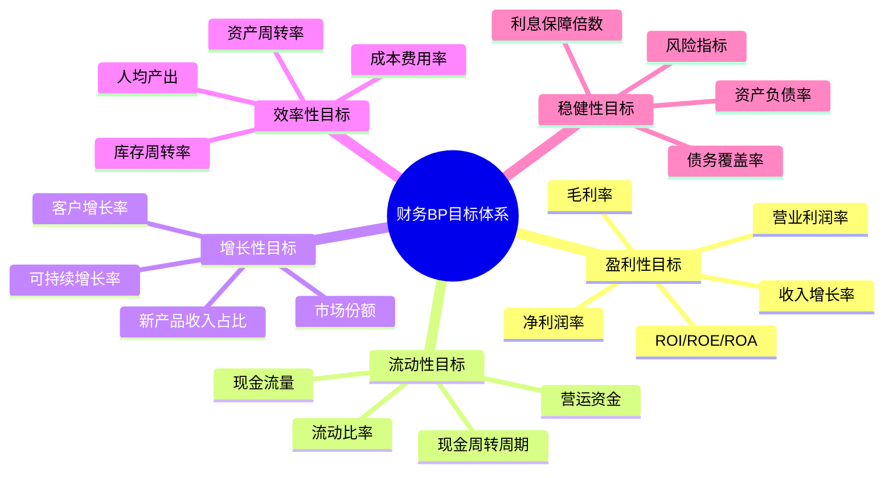

---
{"tags":["财务BP","基础概念","价值分析","目标管理","战略支持"],"aliases":["财务计划作用","预算目标","规划价值"],"cssclass":"content","dg-publish":true,"dg-home":false,"permalink":"/知识共享/001_财务/01_财务BP/01_学习内容/01_财务BP基础概念/BP定义与作用/财务BP的作用与目标/","dgPassFrontmatter":true}
---

> [!NOTE] 概述
> 财务BP作为企业管理的核心工具，具有指导决策、优化资源分配、监控绩效和预测风险等多重作用。本文详细分析财务BP的核心作用与目标设定，阐述其对企业战略实现和运营管理的价值。

## 1. 财务BP的核心作用

财务BP（Business Plan/Budget Planning）作为企业财务管理体系的重要组成部分，发挥着多方面的关键作用：

### 1.1 战略导向功能 #战略管理

财务BP是企业战略的数字化表达，通过具体的财务目标和资源配置计划，将企业的长期战略分解为可执行的短期行动：

- **战略翻译**：将企业愿景和战略目标转化为具体、可量化的财务指标
- **战略一致性**：确保各部门和业务单元的财务活动与企业整体战略方向保持一致
- **战略优先级**：通过资源分配反映业务重点和战略优先事项

例如，如果某企业战略目标是"在3年内成为行业前三"，财务BP会将其转化为"年销售额增长30%"、"研发投入占收入10%"等可衡量的财务目标。

### 1.2 资源配置功能 #资源管理

财务BP是企业合理分配有限资源的决策工具，帮助管理层在众多需求中做出最优选择：

- **资金分配**：确定各业务部门、产品线、项目的资金边界
- **资源优化**：基于投资回报率等指标评估不同资源配置方案
- **资源协调**：解决跨部门资源竞争，实现整体最优

在实际应用中，财务BP通过预算编制与审批流程，建立资源配置的正式决策机制，避免主观或情感因素干扰资源分配决策。

### 1.3 预测与规划功能 #预测管理

财务BP提供对未来财务状况的系统性预测，帮助企业未雨绸缪：

- **趋势识别**：基于历史数据和市场分析预测关键财务指标趋势
- **情景分析**：评估不同条件下的财务结果，制定相应应对策略
- **风险预警**：识别潜在财务风险，提前准备应对措施

**案例**：某制造企业通过财务BP的现金流预测，发现在季节性低谷将面临资金短缺，提前6个月安排了银行授信，避免了流动性危机。

### 1.4 绩效管理功能 #绩效管理

财务BP为绩效评估提供基准和标准，帮助企业建立有效的激励与约束机制：

- **目标设定**：为组织、部门和个人设立明确的财务绩效目标
- **差异分析**：比较实际表现与预算目标的差异，找出问题根源
- **绩效考核**：将预算达成情况与管理者绩效评估和薪酬激励相联系

通过"计划-执行-检查-调整"的循环，财务BP成为企业绩效管理的基础工具，推动持续改进。

### 1.5 沟通协调功能 #组织协调

财务BP在企业内部发挥着重要的沟通和协调作用：

- **共识建立**：通过预算编制过程形成对未来经营目标的共识
- **期望管理**：向内部员工和外部投资者传达合理的业绩期望
- **跨部门协作**：促进不同部门在资源使用和目标实现上的协调配合

良好的财务BP成为企业内部的"共同语言"，减少信息不对称，提高决策和执行效率。

## 2. 财务BP的目标设定

有效的财务BP需要设立明确、合理且具有挑战性的目标。以下是财务BP目标设定的主要维度和方法：

### 2.1 目标设定的关键维度 #目标设定

全面的财务BP目标体系通常包括以下维度：

### 2.2 目标设定的SMART原则 #目标方法

有效的财务BP目标应遵循SMART原则：

- **具体(Specific)**：目标应明确具体，而非笼统表述
  - 不佳示例："提高销售额"
  - 良好示例："Q3销售额达到2000万元，同比增长15%"

- **可衡量(Measurable)**：目标应可量化，便于评估进度和成效
  - 不佳示例："降低成本"
  - 良好示例："生产单位成本同比降低5%，降低金额200万元"

- **可实现(Achievable)**：目标应具有挑战性但可实现，避免过高或过低
  - 不佳示例："利润翻十倍"
  - 良好示例："通过产品结构优化提升毛利率2个百分点"

- **相关性(Relevant)**：目标应与企业战略和长期发展相关联
  - 不佳示例："全面压缩成本20%"(可能损害长期发展)
  - 良好示例："非核心业务成本压缩20%，核心研发投入增加10%"

- **时限性(Time-bound)**：目标应有明确的时间节点
  - 不佳示例："尽快提高收入"
  - 良好示例："第四季度电商渠道收入环比增长25%"

### 2.3 目标设定的方法 #目标方法

财务BP目标设定通常采用以下几种方法：

- **自上而下法**：从企业整体目标分解至各部门和业务单元
  - 优点：确保目标与企业战略一致
  - 缺点：可能缺乏基层操作细节的考虑

- **自下而上法**：汇总各业务单元的目标提案形成整体目标
  - 优点：更贴近业务实际，执行可行性高
  - 缺点：可能缺乏足够的挑战性和战略高度

- **协商迭代法**：上下级多轮沟通，逐步调整形成最终目标
  - 优点：平衡战略需求与操作可行性
  - 缺点：过程可能耗时较长

- **标杆比较法**：参考行业标杆企业设定目标
  - 优点：具有外部视角，避免闭门造车
  - 缺点：不同企业情况各异，简单对标可能不适用

## 3. 财务BP在不同企业阶段的作用

财务BP的作用和重点会随着企业发展阶段而变化：

### 3.1 创业初期 #企业阶段

- **主要作用**：
  - 验证商业模式财务可行性
  - 预测现金消耗率和生存期
  - 规划融资节奏和资金使用

- **目标重点**：
  - 收入增长速度
  - 客户获取成本
  - 现金流平衡点

**案例**：某科技创业公司通过财务BP明确了"烧钱速率"和"生存期"，并据此调整了产品推广节奏，使有限资金支撑到B轮融资完成。

### 3.2 快速增长期 #企业阶段

- **主要作用**：
  - 平衡增长速度与资源约束
  - 优化业务结构和盈利模式
  - 规划组织扩张和能力建设

- **目标重点**：
  - 收入增长率
  - 毛利率改善
  - 规模经济效应

**案例**：某电商企业在快速增长期，通过财务BP发现仓储物流成为增长瓶颈，提前两年启动自建物流中心项目，保障了持续扩张能力。

### 3.3 成熟稳定期 #企业阶段

- **主要作用**：
  - 优化资本结构和回报率
  - 平衡短期利润与长期投资
  - 管理股东回报与再投资

- **目标重点**：
  - 股东回报率
  - 资本支出效率
  - 现金流稳定性

**案例**：某成熟制造企业通过财务BP分析，实施了股息政策调整和股票回购计划，优化了资本结构，提高了股东价值。

### 3.4 转型调整期 #企业阶段

- **主要作用**：
  - 评估转型策略的财务影响
  - 管理传统业务与新业务资源分配
  - 监控转型进度和成效

- **目标重点**：
  - 新业务增长速度
  - 传统业务利润稳定性
  - 转型投资回报周期

**案例**：某传统出版集团向数字内容转型过程中，通过财务BP实施了"双轨制"资源分配机制，确保传统业务稳定的同时为数字业务提供充足发展资源。

## 4. 财务BP作用的行业差异

财务BP在不同行业中侧重点有所不同：

### 4.1 制造业 #行业特点

- **主要作用**：
  - 生产规划与库存优化
  - 固定资产投资管理
  - 供应链成本控制

- **关键目标**：
  - 产能利用率
  - 原材料成本率
  - 设备投资回报率

### 4.2 零售业 #行业特点

- **主要作用**：
  - 销售预测与商品规划
  - 门店扩张与效益评估
  - 营销投入与效果管理

- **关键目标**：
  - 同店销售增长
  - 库存周转率
  - 每平米销售额

### 4.3 服务业 #行业特点

- **主要作用**：
  - 人员规划与成本管理
  - 服务能力与收入匹配
  - 客户满意度与盈利平衡

- **关键目标**：
  - 人均产值
  - 客户满意度
  - 客户生命周期价值

### 4.4 科技行业 #行业特点

- **主要作用**：
  - 研发投入规划与管理
  - 产品迭代与市场投放节奏
  - 用户增长与变现策略

- **关键目标**：
  - 研发投入产出比
  - 用户获取成本
  - 平台交易规模

## 5. 财务BP的实际应用案例

### 案例一：制造企业的产能扩张决策 #案例分析

**背景**：某汽车零部件制造商面临产能不足问题，需要决定是扩建现有工厂还是新建生产基地

**财务BP的作用**：
1. 比较两种方案的投资回报率：扩建ROI 22%，新建ROI 18%
2. 分析现金流影响：扩建方案前期投入小，现金流压力较小
3. 评估风险情景：模拟"需求下降20%"情景下两个方案的财务弹性
4. 制定分阶段实施计划：先扩建现有工厂，观察市场3年后再决定是否新建

**结果**：公司采用财务BP建议的分阶段方案，成功应对了后期市场波动，避免了产能过剩风险。

### 案例二：科技公司的融资战略 #案例分析

**背景**：某SaaS企业需要决定是否进行C轮融资以及融资规模和时机

**财务BP的作用**：
1. 分析现金消耗预测：在不同增长情景下的资金需求
2. 评估内部融资可能性：预测未来18个月现金流情况
3. 敏感性分析：客户获取成本上升对现金需求的影响
4. 估值影响评估：测算不同业绩指标对可能估值的影响

**结果**：基于财务BP分析，公司决定推迟6个月融资，利用这段时间改善核心指标，最终以更有利的条件完成融资。

### 案例三：零售企业的渠道转型 #案例分析

**背景**：某服装零售商需要制定线上线下融合战略，重新规划门店网络和电商投入

**财务BP的作用**：
1. 门店盈利能力分析：识别需要关闭、调整或升级的门店
2. 电商渠道投入回报评估：不同推广策略的ROI对比
3. 全渠道库存优化：分析共享库存模式的财务效益
4. 五年转型路径财务规划：明确每年电商占比和投入节奏

**结果**：公司基于财务BP关闭了20%低效门店，将资源转向电商和旗舰店，三年内实现整体利润率提升2个百分点。

## 6. 与其他概念的关系

- [[知识共享/001_财务/01_财务BP/01_学习内容/01_财务BP基础概念/BP定义与作用/财务BP的定义\|财务BP的定义]] - 基础概念，了解财务BP的本质
- [[知识共享/001_财务/01_财务BP/01_学习内容/01_财务BP基础概念/BP定义与作用/财务BP在企业管理中的位置\|财务BP在企业管理中的位置]] - 财务BP在企业管理体系中的定位
- [[BP与企业战略的关系\|BP与企业战略的关系]] - 财务BP与战略的联系
- [[知识共享/001_财务/01_财务BP/01_学习内容/02_预算编制基础/预算编制流程/预算编制流程\|预算编制流程]] - 财务BP目标如何通过预算过程落地
- [[情景分析\|情景分析]] - 评估不同情景下财务BP目标的可行性

## 7. 财务BP作用的局限与应对

### 7.1 常见局限 #实践挑战

- **静态性问题**：传统财务BP缺乏灵活性，难以适应快速变化的市场环境
- **机械性问题**：过度依赖财务BP可能导致短视行为和创新不足
- **数据偏差问题**：预测数据质量不高导致BP失准
- **执行脱节问题**：BP制定与实际执行脱节，沦为"纸上谈兵"

### 7.2 应对策略 #解决方案

- **实施滚动预算**：定期更新预测，提高BP灵活性
- **情景规划**：设计多种情景的应对方案，增强适应性
- **目标与方法分离**：坚持战略目标，但允许执行方法灵活调整
- **超越数字管理**：将BP作为沟通工具，而非纯粹的控制工具

> [!TIP] 学习建议
> 在学习财务BP的作用与目标时，建议结合企业实际案例分析，了解财务BP如何帮助企业做出关键决策。可尝试为一个假设的企业制定简化版财务BP目标，体会其在管理中的实际应用价值。

## 参考文献

1. Simons, R. (2013). *Performance Measurement and Control Systems for Implementing Strategy*. Pearson Education Limited.
2. Hope, J., & Fraser, R. (2013). *Beyond Budgeting: How Managers Can Break Free from the Annual Performance Trap*. Harvard Business Review Press.
3. Kaplan, R. S., & Norton, D. P. (2008). *The Execution Premium: Linking Strategy to Operations for Competitive Advantage*. Harvard Business Press.
4. 陈志斌. (2018). 《全面预算管理：理论、方法与实践》. 中国人民大学出版社.
5. 韦尔奇, J., & 拜恩, J. (2007). 《赢》. 中信出版社.
6. 马丁, R. L. (2014). 《决策陷阱：如何打破职场和生活中的决策困局》. 中国人民大学出版社. 