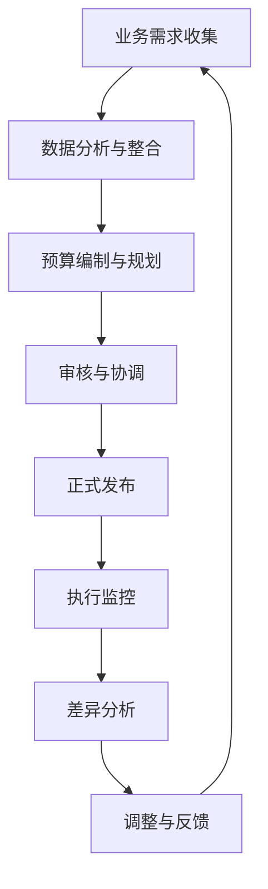
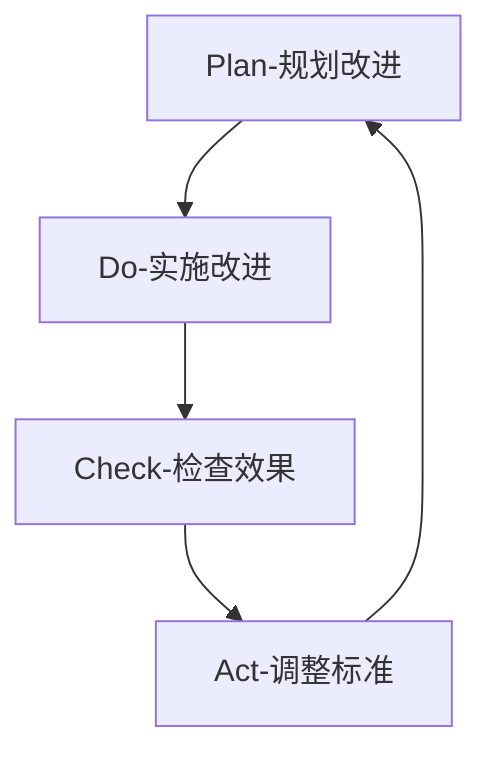

---
{"tags":["财务BP","流程管理","流程优化","业务规划","效率提升"],"created":"2024-04-24","update":"2024-04-24","dg-publish":true,"permalink":"/知识共享/001_财务/01_财务BP/01_学习内容/01_财务BP基础概念/BP流程与周期/BP流程管理与优化/","dgPassFrontmatter":true}
---

# BP流程管理与优化

## 引言
BP流程管理是财务业务伙伴工作中不可或缺的一部分，有效的流程管理能够提高工作效率，减少错误，并确保财务预算与规划工作的质量和一致性。随着业务环境的不断变化，持续优化BP流程也变得尤为重要。

## BP核心流程框架

### 1. 标准BP流程构成

BP工作通常包含以下核心流程环节：

### 2. 各环节关键活动

| 流程环节 | 关键活动 | 输出成果 |
|---------|----------|----------|
| 业务需求收集 | 与业务部门沟通，明确目标与预期 | 需求文档，关键指标清单 |
| 数据分析与整合 | 收集历史数据，进行趋势分析 | 数据分析报告，基础假设 |
| 预算编制与规划 | 制定预算方案，构建财务模型 | 预算草案，财务预测 |
| 审核与协调 | 跨部门协调，消除冲突 | 修订后预算方案 |
| 正式发布 | 获得管理层批准，下发预算 | 正式预算文件 |
| 执行监控 | 跟踪实际表现与预算比较 | 月度/季度监控报告 |
| 差异分析 | 分析偏差原因，提出解决方案 | 差异分析报告 |
| 调整与反馈 | 必要时调整预算，总结经验 | 预算调整方案，流程改进建议 |

## 流程优化方法论

### 1. 流程诊断技术

有效的流程优化始于全面的诊断：

- **价值流图分析**：识别流程中的增值和非增值活动
- **瓶颈分析**：确定限制流程效率的关键环节
- **根本原因分析**：找出流程问题的深层次原因

### 2. 常见BP流程优化方向

| 优化方向 | 具体措施 | 预期效果 |
|---------|----------|----------|
| 流程标准化 | 建立标准操作规程(SOP)，统一模板 | 减少差错，提高一致性 |
| 自动化提升 | 引入预算管理系统，自动化数据收集与分析 | 节省时间，提高准确性 |
| 协作机制优化 | 建立跨部门协作平台，明确责任与时间点 | 减少沟通障碍，提高效率 |
| 流程简化 | 消除冗余环节，合并相关活动 | 缩短周期，减轻工作负担 |
| 能力建设 | 提供培训，建立知识库 | 提高团队能力，促进知识传承 |

## 案例分析：某科技公司BP流程优化实践

### 背景
某科技公司原BP流程耗时长，准确性低，业务部门参与度不足。

### 优化措施
1. **数据源整合**：建立统一数据平台，解决数据分散问题
2. **模板标准化**：设计结构化预算模板，简化数据输入
3. **系统自动化**：引入预算管理系统，减少手工操作
4. **协作机制改革**：设立业务-财务定期沟通机制
5. **流程精简**：将原15步流程简化为8步核心流程

### 成效
- 预算周期从8周缩短至4周
- 数据错误率降低75%
- 预算准确性提高30%
- 业务部门满意度从60%提升至85%

## BP流程持续改进框架

持续改进是流程管理的关键，可采用PDCA循环方法：

## 相关链接
- [[知识共享/001_财务/01_财务BP/01_学习内容/01_财务BP基础概念/BP流程与周期/BP预算周期概述\|BP预算周期概述]]
- [[财务BP的组成部分\|财务BP的组成部分]]
- [[BP工具与模板\|BP工具与模板]]

## 参考文献
1. 张伟. (2023). 《企业预算管理流程优化》. 财务管理研究, 18(4), 56-68.
2. Johnson, K. (2022). *Process Optimization in Financial Planning*. Journal of Business Finance, 37(2), 143-157.
3. 刘芳. (2021). 《基于精益管理的财务BP流程改进》. 会计与管理, 12(3), 92-101. 