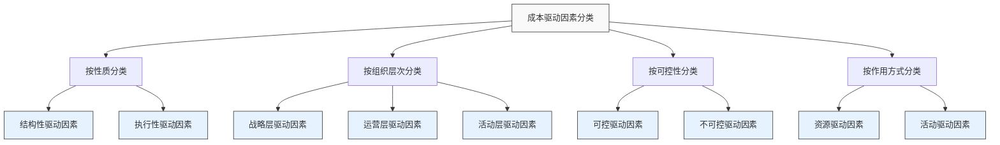
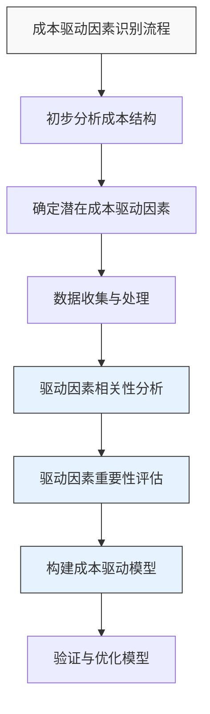

---
{"dg-publish":true,"tags":["财务BP","成本分析","成本预测","驱动因素","成本管理"],"创建日期":"2024-05-11","permalink":"/知识共享/001_财务/01_财务BP/01_学习内容/02_预算编制基础/成本预测方法/成本驱动因素识别/","dgPassFrontmatter":true}
---


成本驱动因素是影响产品或服务成本的关键变量，其识别和分析对于准确预测成本至关重要。掌握成本驱动因素可以帮助企业更精准地进行成本规划、优化资源配置并提高成本控制能力。

## 基础知识

### 成本驱动因素的定义

成本驱动因素(Cost Driver)是指那些引起成本变化的因素或变量，它们与成本之间存在因果关系，通过影响资源消耗来影响成本的产生和变动。

不同权威对成本驱动因素的定义：
- **卡普兰(Kaplan)与库珀(Cooper)**：成本驱动因素是能够合理解释成本变动的结构性因素。
- **波特(Porter)**：成本驱动因素是影响价值链成本的结构性决定因素。
- **中国管理会计准则**：成本驱动因素是引起成本对象成本发生变化的各种因素。

### 成本驱动因素的历史演变

- **传统时期(1920年代前)**：主要关注直接人工和直接材料作为单一成本驱动因素
- **科学管理时期(1920-1970年代)**：开始考虑产量作为主要成本驱动因素
- **战略成本管理时期(1980年代-)**：引入多元化成本驱动因素理论，识别结构性和执行性驱动因素
- **数字化转型时期(2000年代-)**：数据分析和人工智能技术促进了更复杂成本驱动因素的识别和预测

### 成本驱动因素的分类



#### 1. 按性质分类

- **结构性驱动因素**：与企业基本结构和战略选择有关
  - 规模和范围经济
  - 技术和工艺复杂度
  - 产品线宽度和多样性
  - 垂直整合程度
  - 地理位置分布

- **执行性驱动因素**：与企业执行能力有关
  - 员工参与度和能力
  - 全面质量管理
  - 产能利用率
  - 工厂布局效率
  - 产品配置设计

#### 2. 按组织层次分类

- **战略层驱动因素**：影响整体业务模式的因素
- **运营层驱动因素**：影响日常运营效率的因素
- **活动层驱动因素**：影响具体活动资源消耗的因素

#### 3. 按可控性分类

- **可控驱动因素**：企业可以主动影响的因素
- **不可控驱动因素**：企业难以直接影响的外部因素

#### 4. 按作用方式分类

- **资源驱动因素**：影响资源投入的因素
- **活动驱动因素**：影响活动效率的因素

## 理论框架

### 成本驱动因素识别的理论模型



### 主要成本驱动因素识别方法

1. **定性分析法**
   - 专家访谈与头脑风暴
   - 价值链分析法
   - 因果图分析法
   - 流程分析法

2. **定量分析法**
   - 相关性分析
   - 回归分析
   - 主成分分析
   - 层次分析法(AHP)
   - 数据包络分析(DEA)

3. **混合分析法**
   - 活动基础成本法(ABC)结合统计分析
   - 价值链分析结合回归分析
   - 专家判断结合数据验证

## 应用指南

### 成本驱动因素识别的步骤

1. **前期准备**
   - 明确分析目标和范围
   - 组建跨部门团队
   - 确定分析方法和工具

2. **成本结构分析**
   - 收集历史成本数据
   - 分解成本组成部分
   - 识别主要成本项目和变动规律

3. **潜在驱动因素确定**
   - 结合业务流程分析可能的驱动因素
   - 通过专家访谈确定候选驱动因素
   - 分析行业标准和最佳实践

4. **数据收集与处理**
   - 确定需要收集的数据类型
   - 制定数据收集计划
   - 收集并清理、标准化数据

5. **驱动因素相关性分析**
   - 定性分析驱动因素与成本的关系
   - 利用统计方法验证相关性
   - 评估驱动因素之间的交互影响

6. **驱动因素重要性评估**
   - 根据相关性强度排序驱动因素
   - 评估驱动因素的可控性和影响范围
   - 识别关键驱动因素

7. **构建成本驱动模型**
   - 基于关键驱动因素建立成本预测模型
   - 确定驱动因素与成本间的数学关系
   - 设定模型参数和假设条件

8. **模型验证与优化**
   - 利用历史数据测试模型准确性
   - 进行敏感性分析评估模型稳定性
   - 持续优化模型参数和结构

### 常用数据收集方法

| 数据类型 | 收集方法 | 适用场景 |
|--------|--------|---------|
| 生产数据 | ERP系统提取、生产记录 | 制造业成本驱动分析 |
| 销售数据 | CRM系统、销售报表 | 销售相关成本驱动分析 |
| 人力资源数据 | 人力资源系统、考勤记录 | 人工成本驱动分析 |
| 运营数据 | 运营管理系统、流程记录 | 运营效率相关成本分析 |
| 外部市场数据 | 行业报告、市场调研 | 外部环境影响分析 |

### 驱动因素分析方法详解

#### 相关性分析

步骤：
1. 收集成本数据和潜在驱动因素数据
2. 计算相关系数(如皮尔逊相关系数)
3. 评估统计显著性
4. 解释相关性强度和方向

#### 回归分析

步骤：
1. 确定因变量(成本)和自变量(驱动因素)
2. 选择回归模型类型(线性、非线性等)
3. 进行模型拟合
4. 评估模型拟合优度和统计显著性
5. 解释回归系数

示例:
```
成本 = β₀ + β₁×驱动因素₁ + β₂×驱动因素₂ + ... + βₙ×驱动因素ₙ + ε
```
其中，β₀为常数项，β₁至βₙ为各驱动因素的系数，ε为误差项。

## 案例分析

### 案例一：制造业企业成本驱动因素识别

**背景**:
某汽车零部件制造企业面临成本上升压力，需要识别关键成本驱动因素以优化成本结构。

**分析过程**:
1. 分析历史成本数据，发现制造成本占总成本的65%
2. 对制造成本进行分解，包括直接材料(45%)、直接人工(25%)、制造费用(30%)
3. 通过流程分析和专家访谈，初步确定潜在驱动因素:
   - 生产批次数量
   - 产品复杂度
   - 设备利用率
   - 原材料价格
   - 生产线换型次数
   - 产品质量不良率
4. 收集12个月的历史数据，进行相关性和回归分析
5. 结果显示:
   - 产品复杂度与制造成本相关系数为0.82
   - 生产线换型次数与制造成本相关系数为0.75
   - 设备利用率与制造成本相关系数为-0.68

**结论与应用**:
1. 确定三个关键成本驱动因素：产品复杂度、生产线换型次数、设备利用率
2. 建立成本预测模型：月度制造成本 = 850万 + 120万×产品复杂度指数 + 25万×换型次数 - 15万×设备利用率百分比
3. 通过降低产品复杂度、优化生产计划减少换型次数、提高设备利用率等措施，成功降低制造成本18%

### 案例二：服务业企业成本驱动因素识别

**背景**:
某连锁餐饮企业需要了解门店运营成本的主要驱动因素，以优化成本预测和控制。

**分析过程**:
1. 分析50家门店的成本数据，包括食材成本、人工成本、租金、水电等
2. 通过头脑风暴和价值链分析，确定潜在驱动因素:
   - 门店面积
   - 客流量
   - 菜单复杂度
   - 门店位置
   - 运营时间
   - 员工培训水平
3. 采用分层次分析法(AHP)和回归分析相结合的方法
4. 结果显示:
   - 客流量是食材成本的主要驱动因素(弹性系数0.92)
   - 门店面积是租金和水电费的主要驱动因素(弹性系数0.85)
   - 菜单复杂度是人工成本的主要驱动因素(弹性系数0.67)

**结论与应用**:
1. 建立门店成本预测模型：门店月成本 = 固定成本 + a×客流量 + b×门店面积 + c×菜单复杂度
2. 基于此模型，企业优化了菜单设计，减少了低效菜品，提高了厨房效率
3. 改进选址模型，平衡门店面积与预期客流量
4. 成本预测准确率提高了22%，成本控制效率提升15%

### 案例三：IT服务企业成本驱动因素识别

**背景**:
某IT外包服务企业需要识别项目成本驱动因素，以改进项目预算编制和定价策略。

**分析过程**:
1. 收集过去3年完成的120个项目的详细成本数据
2. 对项目成本进行分类：开发人员成本、测试成本、管理成本、基础设施成本等
3. 通过流程分析和专家访谈确定潜在驱动因素:
   - 项目复杂度
   - 开发周期
   - 团队规模
   - 客户变更请求数量
   - 技术栈复杂性
   - 远程/现场工作比例
4. 使用主成分分析和多元回归分析
5. 结果显示:
   - 客户变更请求数量与项目总成本相关系数为0.83
   - 团队规模与人员成本相关系数为0.91
   - 技术栈复杂性与开发成本相关系数为0.76

**结论与应用**:
1. 识别三个关键驱动因素：客户变更请求数量、团队规模、技术栈复杂性
2. 建立项目成本预测模型：项目成本 = 基础成本 + α×变更请求数量 + β×团队人月 + γ×技术复杂度系数
3. 改进客户变更管理流程，引入变更收费机制
4. 优化团队配置和技术选型决策
5. 项目预算准确率提高30%，利润率提升12%

## 延伸内容

### 与其他财务BP概念的联系

1. **与成本结构分析的关系**
   - 成本结构分析提供成本构成基础
   - 成本驱动因素识别解释成本变动原因
   - 两者结合可建立完整成本管理体系

2. **与敏感性分析的联系**
   - 成本驱动因素识别确定关键变量
   - 敏感性分析评估这些变量变动的影响
   - 共同支持稳健的成本预测和决策

3. **与活动基础成本法(ABC)的关系**
   - ABC提供活动层面的成本分配基础
   - 成本驱动因素识别找出活动成本变动因素
   - 两者互补，提高成本分析精度

### 不同行业的成本驱动因素特点

| 行业 | 主要成本驱动因素 | 特点 |
|-----|--------------|-----|
| 制造业 | 生产规模、材料价格、产品复杂度 | 规模经济效应显著 |
| 服务业 | 人员数量、服务时间、客户需求复杂度 | 人力成本占比高 |
| 零售业 | 店铺位置、存货周转率、SKU数量 | 位置和效率驱动 |
| 科技业 | 研发投入、技术复杂度、市场拓展速度 | 高固定成本、规模经济 |
| 金融业 | 风险水平、资金成本、监管合规要求 | 资本效率驱动 |

### 新兴趋势与创新

1. **大数据分析在成本驱动因素识别中的应用**
   - 利用机器学习识别非线性成本驱动关系
   - 通过预测分析预测驱动因素变化趋势
   - 实时成本驱动因素监控与应对

2. **区块链技术在成本数据收集中的应用**
   - 提高供应链成本数据的透明度和可靠性
   - 减少成本数据收集的时间和成本
   - 支持更精准的跨组织成本驱动分析

3. **人工智能驱动的自动化成本分析**
   - 自动识别和评估潜在成本驱动因素
   - 智能建议成本优化措施
   - 持续学习和改进成本预测模型

## 学习资源

### 思考问题

1. 结构性成本驱动因素和执行性成本驱动因素有何区别？各自适用于哪些决策场景？
2. 如何区分相关性和因果性？在成本驱动因素识别中为什么这一区分很重要？
3. 为什么同一企业不同部门可能有不同的成本驱动因素？如何协调这些差异？
4. 外部环境变化（如技术革新、监管变化）如何影响企业的成本驱动因素？
5. 在成本驱动因素分析中，如何处理数据缺失或质量问题？
6. 为什么有些成本驱动因素的影响可能会随时间变化？如何在成本预测中考虑这种动态性？
7. 企业规模如何影响成本驱动因素的重要性和影响程度？
8. 如何评估成本驱动模型的准确性和实用性？
9. 在多个成本驱动因素之间存在交互作用时，如何构建预测模型？
10. 如何将成本驱动因素分析与战略规划和预算编制过程有效整合？

### 自测题

1. 下列哪项不是结构性成本驱动因素？
   A. 规模经济  B. 产品线宽度  C. 员工培训水平  D. 地理位置

2. 在制造业中，以下哪项通常被视为最重要的执行性成本驱动因素？
   A. 规模经济  B. 产能利用率  C. 垂直整合程度  D. 技术复杂度

3. 成本驱动因素相关性分析最常用的统计方法是？
   A. 方差分析  B. 时间序列分析  C. 相关分析和回归分析  D. 聚类分析

4. 在多元回归模型中，回归系数的统计显著性用于判断什么？
   A. 模型整体拟合优度  B. 自变量之间的相关性  C. 特定驱动因素是否真正影响成本  D. 样本大小是否足够

5. 活动基础成本法(ABC)在成本驱动因素识别中的主要贡献是什么？
   A. 简化成本计算  B. 提高成本分配准确性  C. 减少数据需求  D. 降低分析复杂性

### 实践练习

**练习1: 制造企业成本驱动因素识别**

假设你是某电子产品制造企业的财务分析师，需要识别产品生产成本的主要驱动因素。以下是收集的月度数据：

| 月份 | 产量(千件) | 材料价格指数 | 产品型号数 | 员工人数 | 生产成本(万元) |
|-----|----------|------------|---------|--------|------------|
| 1月 | 50 | 100 | 5 | 200 | 450 |
| 2月 | 55 | 102 | 5 | 200 | 470 |
| 3月 | 60 | 105 | 6 | 210 | 510 |
| 4月 | 65 | 108 | 6 | 210 | 530 |
| 5月 | 70 | 110 | 7 | 220 | 580 |
| 6月 | 75 | 112 | 7 | 220 | 600 |

要求：
1. 计算各潜在驱动因素与生产成本的相关系数
2. 建立成本预测的多元回归模型
3. 识别最重要的成本驱动因素
4. 提出基于分析结果的成本优化建议

**练习2: 服务企业成本驱动因素分析**

作为金融服务公司的预算分析师，你需要分析客户服务中心的成本驱动因素。请设计一个完整的分析方案，包括：
1. 确定需要收集的数据类型
2. 列出潜在的成本驱动因素
3. 设计数据收集表格
4. 提出合适的分析方法
5. 说明如何将分析结果应用于预算编制

## 参考文献

1. Kaplan, R. S., & Cooper, R. (2018). *Cost & Effect: Using Integrated Cost Systems to Drive Profitability and Performance*. Harvard Business Review Press.
2. Porter, M. E. (1985). *Competitive Advantage: Creating and Sustaining Superior Performance*. Free Press.
3. Shank, J. K., & Govindarajan, V. (1993). *Strategic Cost Management: The New Tool for Competitive Advantage*. Free Press.
4. Anderson, S. W., & Dekker, H. C. (2009). Strategic Cost Management in Supply Chains, Part 1: Structural Cost Management. *Accounting Horizons*, 23(2), 201-220.
5. 陈守明. (2017). 《战略成本管理》. 中国人民大学出版社.
6. 刘永泽, 傅荣. (2019). 《管理会计》(第四版). 东北财经大学出版社.
7. 中国财政部. (2016). 《管理会计应用指引第100号——成本管理》. 