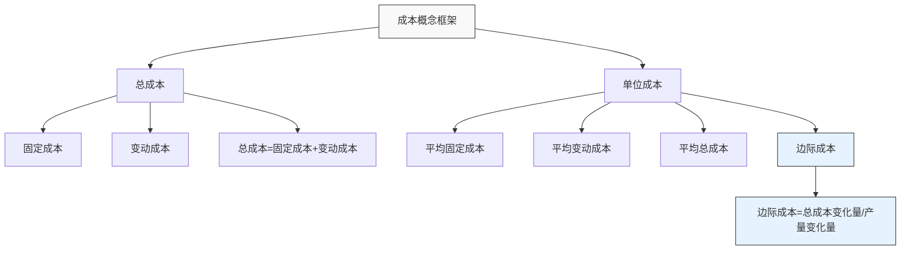
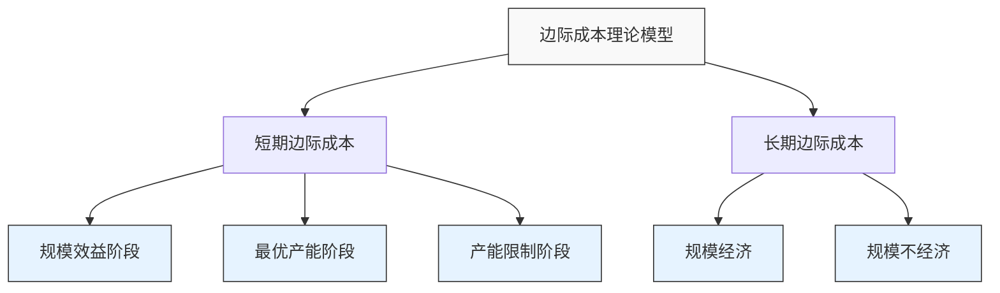
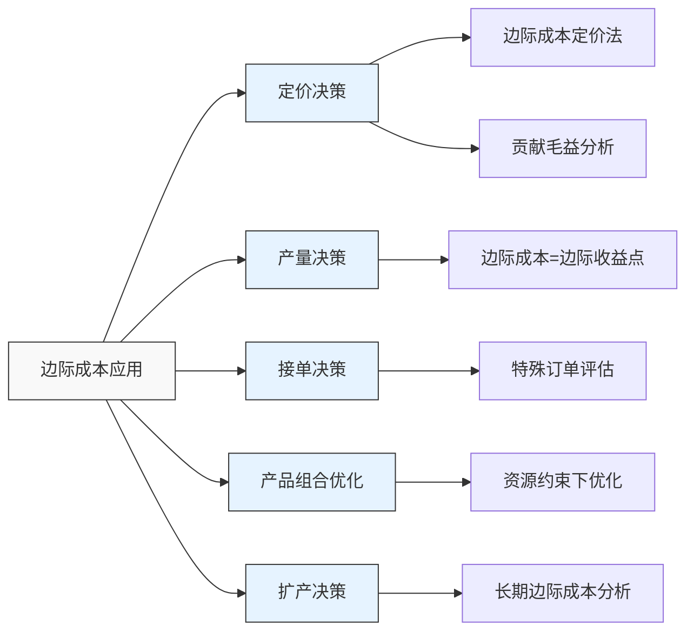

---
{"dg-publish":true,"tags":["财务BP","成本分析","边际分析","成本预测","决策分析"],"创建日期":"2024-05-11","permalink":"/知识共享/001_财务/01_财务BP/01_学习内容/02_预算编制基础/成本预测方法/边际成本分析/","dgPassFrontmatter":true}
---

边际成本分析是企业财务决策与成本预测的重要工具，通过研究每增加一单位产出所带来的额外成本，帮助管理者理解成本变动规律，为产品定价、产量决策和资源配置提供科学依据。

## 基础知识

### 边际成本的定义

边际成本(Marginal Cost)是指企业增加一单位产出所引起的总成本增量。它反映了生产规模变动与成本变化之间的关系，是微观经济学中的核心概念之一。

不同学术和实务视角对边际成本的定义：
- **经济学视角**：生产最后一单位产品所引起的总成本的变化量。
- **会计学视角**：产量增加一单位所增加的变动成本。
- **管理决策视角**：为满足一单位额外需求而发生的增量成本。

### 边际成本的历史发展

- **古典经济学时期**：亚当·斯密和大卫·李嘉图开始探讨生产规模与成本的关系
- **新古典经济学时期**：马歇尔系统性提出边际成本概念及其与边际收益的关系
- **现代成本会计时期**：边际成本理论与企业实践相结合，发展出贡献毛益分析
- **数字化时代**：大数据和人工智能技术使得边际成本分析更加精确和实时

### 边际成本的特点与意义

#### 特点

- 反映产出变动引起的短期成本变化
- 通常随产量增加呈现先下降后上升的"U型曲线"
- 边际成本等于平均可变成本的最低点
- 受到技术条件、产能利用率等因素影响

#### 意义

- 为最优产量决策提供依据
- 帮助制定科学的定价策略
- 支持资源配置和生产计划优化
- 作为产能扩张决策的分析工具

## 理论框架

### 边际成本与成本结构的关系

### 边际成本曲线

边际成本曲线通常呈"U"形，这反映了收益递减规律：
- 产量较低时，边际成本下降（规模效益）
- 达到最优产能后，边际成本上升（产能限制）
- 边际成本曲线与平均变动成本曲线相交于平均变动成本的最低点
- 边际成本曲线与平均总成本曲线相交于平均总成本的最低点

### 边际成本在决策中的应用

## 应用指南

### 边际成本计算方法

#### 1. 差异法

边际成本(MC) = 总成本变化量(ΔTC) ÷ 产量变化量(ΔQ)

计算步骤：
1. 确定两个不同产量水平下的总成本
2. 计算总成本差异和产量差异
3. 用总成本差异除以产量差异获得边际成本

示例：
| 产量(单位) | 总成本(元) | 产量变化(单位) | 总成本变化(元) | 边际成本(元/单位) |
|-----------|-----------|--------------|--------------|-----------------|
| 100       | 10,000    | -            | -            | -               |
| 110       | 10,800    | 10           | 800          | 80              |
| 120       | 11,700    | 10           | 900          | 90              |
| 130       | 12,700    | 10           | 1,000        | 100             |

#### 2. 微分法

对于连续型成本函数，边际成本可以通过对总成本函数求导获得：

MC = d(TC)/dQ

其中，TC是总成本函数，Q是产量。

示例：
若总成本函数为TC = 5,000 + 50Q + 0.2Q²
则边际成本函数MC = d(TC)/dQ = 50 + 0.4Q

#### 3. 活动基础边际成本计算

基于活动的边际成本计算考虑了不同活动的成本驱动因素：

1. 识别与产量变化相关的活动
2. 确定每项活动的成本驱动因素
3. 计算每单位产出引起的活动增量
4. 汇总各活动的边际成本

### 边际成本分析的步骤

1. **数据收集准备**
   - 收集历史成本数据和产量数据
   - 区分固定成本和变动成本
   - 确定成本函数形式

2. **成本函数建立**
   - 利用回归分析等方法拟合成本函数
   - 验证成本函数的统计显著性
   - 确定成本函数的适用范围

3. **边际成本计算**
   - 使用差异法或微分法计算边际成本
   - 绘制边际成本曲线
   - 分析边际成本变动规律

4. **决策应用分析**
   - 结合边际收益进行最优产量分析
   - 进行贡献毛益分析
   - 评估特殊订单或扩产方案

5. **敏感性测试**
   - 评估关键参数变动对边际成本的影响
   - 构建不同情景下的边际成本模型
   - 确定稳健的决策范围

### 不同行业边际成本分析的特点

| 行业类型 | 边际成本特点 | 主要影响因素 | 应用重点 |
|---------|------------|------------|---------|
| 制造业  | 材料和直接人工为主 | 产能利用率、生产规模 | 产量决策、产品组合 |
| 服务业  | 主要是人员和时间成本 | 服务效率、人员配置 | 定价策略、接单决策 |
| 科技业  | 高固定成本、低变动成本 | 研发投入、平台规模 | 用户规模扩张、定价 |
| 能源业  | 受资源获取成本影响大 | 资源价格、开采效率 | 生产计划、投资决策 |
| 零售业  | 采购成本为主 | 库存周转、规模采购 | 促销决策、库存管理 |

## 边际成本在决策中的应用

### 最优产量决策

在完全竞争市场中，利润最大化的产量决策原则是：
- 当边际收益(MR)等于边际成本(MC)时，利润最大化
- 若MR > MC，应增加产量
- 若MR < MC，应减少产量

决策步骤：
1. 计算不同产量下的边际成本
2. 确定市场价格(边际收益)
3. 找出边际成本等于边际收益的产量点
4. 验证该点满足利润最大化条件

### 定价决策

边际成本在定价策略中的应用：
- **短期定价下限**：边际成本是产品定价的理论下限
- **差别定价**：基于消费者支付意愿和边际成本的组合策略
- **产能利用率定价**：在低谷期可采用略高于边际成本的价格提高产能利用率
- **渗透定价**：利用规模效应降低边际成本，实现低价扩张

### 特殊订单决策

评估特殊订单时的边际分析步骤：
1. 确定特殊订单带来的增量收入
2. 计算特殊订单引起的边际成本
3. 确定接受订单是否会影响现有产品销售
4. 分析订单的贡献毛益是否为正
5. 考虑长期影响因素做出决策

### 产品组合优化

在有限资源约束下，边际成本分析可用于优化产品组合：
1. 计算各产品的单位贡献毛益
2. 确定限制资源(瓶颈资源)
3. 计算每种产品每单位限制资源的贡献毛益
4. 按贡献毛益排序分配有限资源
5. 确定最优产品组合

## 案例分析

### 案例一：制造企业边际成本分析

**背景**：
某电子设备制造企业需要确定新产品的最优生产规模和定价策略。

**分析过程**：
1. 收集试生产阶段的成本数据，包括：
   - 固定成本：设备折旧、研发摊销等，每月500万元
   - 变动成本：原材料、直接人工等，呈非线性变化

2. 建立成本函数：
   总成本(万元) = 500 + 0.8Q + 0.002Q²，其中Q为月产量(千台)

3. 计算边际成本函数：
   边际成本(元/台) = 800 + 4Q

4. 市场调研显示，产品市场价格约为1,200元/台

5. 分析发现：
   - 当产量为100千台时，边际成本为1,200元，等于市场价格
   - 边际成本曲线显示，产量低于50千台时有明显的规模效应
   - 产量超过100千台后，边际成本快速上升

**结论与应用**：
1. 确定最优生产规模为月产100千台
2. 制定阶梯定价策略：大客户可享受较低价格
3. 分析表明扩大产能投资可能带来规模效应
4. 企业据此调整生产计划，月产量控制在95-105千台的范围
5. 实施后利润率提升了3.5个百分点

### 案例二：航空公司边际成本分析

**背景**：
某航空公司需要评估是否接受旅行社提出的特价团队机票请求。

**分析过程**：
1. 分析航班成本结构：
   - 固定成本：飞机租赁/折旧、机组人员基本工资等
   - 变动成本：燃油、机场费、餐饮服务等

2. 计算单个航班的成本构成：
   - 总成本：120,000元/航班
   - 其中固定成本：80,000元/航班
   - 变动成本：40,000元/航班(满载200位乘客)

3. 计算边际成本：
   - 每增加一名乘客的边际成本约200元
   - 主要包括额外燃油、餐食、保险等成本

4. 旅行社报价：每位乘客380元，共40位乘客
   - 增量收入：40 × 380 = 15,200元
   - 增量成本：40 × 200 = 8,000元
   - 贡献毛益：7,200元

5. 进一步考虑：
   - 该航班目前预订率仅为65%(130位乘客)
   - 特价团不会替代原有乘客
   - 接受特价团后航班总收入和成本：
     - 收入：(原有乘客收入) + 15,200元
     - 成本：80,000 + 200 × (130 + 40) = 114,000元

**结论与应用**：
1. 接受特价团可提供正贡献毛益，增加利润
2. 边际成本分析显示每位额外乘客边际成本仅为200元
3. 公司制定了非高峰期的差别定价策略
4. 开发了动态定价系统，根据预订率调整价格
5. 该策略使公司客座率提高12%，总利润增加8%

### 案例三：软件企业边际成本分析

**背景**：
某SaaS软件企业需要确定最优定价策略和用户扩张计划。

**分析过程**：
1. 分析成本结构：
   - 固定成本：软件开发、服务器基础设施、核心团队等，每月200万元
   - 变动成本：客户支持、服务器扩容、数据存储等

2. 通过数据分析确定成本函数：
   月总成本(万元) = 200 + 0.05U + 0.0001U²，其中U为用户数(千人)

3. 计算边际成本函数：
   边际成本(元/用户) = 50 + 0.2U

4. 当前用户规模为50千人，单用户月收入为100元
   - 当前边际成本：50 + 0.2 × 50 = 60元/用户
   - 边际收益：100元/用户

5. 分析不同用户规模下的边际成本：
   - 100千用户时：边际成本为70元/用户
   - 250千用户时：边际成本为100元/用户(等于边际收益)
   - 超过250千用户将导致边际成本大于边际收益

**结论与应用**：
1. 公司最优用户规模为250千用户(边际成本等于边际收益)
2. 采用分层定价策略：基础版和高级版
3. 优化技术架构降低用户增长带来的边际成本增长
4. 设计自动化服务减少人工支持成本
5. 实施后用户获取成本降低15%，毛利率提高8%

## 延伸内容

### 与其他财务BP概念的联系

1. **与固定成本和变动成本分析的关系**
   - 变动成本是边际成本的基础
   - 固定成本不影响短期边际成本，但影响长期边际成本
   - 边际成本分析依赖于准确的成本结构分析

2. **与成本驱动因素分析的联系**
   - 成本驱动因素分析帮助理解边际成本变动原因
   - 边际成本分析评估驱动因素变动的边际影响
   - 两者结合可构建更精准的成本预测模型

3. **与敏感性分析的关系**
   - 边际成本是敏感性分析的重要参数
   - 敏感性分析可评估关键因素对边际成本的影响
   - 边际成本曲线可用于构建敏感性分析场景

4. **与生产规划和资本预算的联系**
   - 边际成本分析为产能扩张决策提供依据
   - 资本支出预算需考虑边际成本变化
   - 生产规划基于边际成本和边际收益的平衡

### 新兴趋势与发展

1. **数字化转型对边际成本的影响**
   - 数字产品和服务接近零边际成本
   - 平台经济模型下的网络效应与边际成本
   - 人工智能降低人工服务的边际成本

2. **长尾经济与边际成本**
   - 数字平台使小众产品边际成本降低
   - 定制化生产与边际成本的关系
   - 利用边际成本分析优化长尾产品组合

3. **可持续发展与全成本边际分析**
   - 环境成本纳入边际成本分析
   - 社会责任成本的边际分析
   - 可持续发展背景下的边际决策模型

## 学习资源

### 思考问题

1. 为什么边际成本曲线通常呈"U"形？这反映了什么经济规律？
2. 在哪些情况下，企业可以考虑以低于全部成本但高于边际成本的价格接受订单？
3. 边际成本与平均成本的关系是什么？为什么边际成本曲线与平均可变成本曲线相交于平均可变成本的最低点？
4. 在多产品企业中，如何利用边际成本分析确定最优产品组合？
5. 数字产品(如软件、在线内容)的边际成本接近于零，这对传统定价理论有何影响？
6. 在什么情况下，长期边际成本可能会低于短期边际成本？
7. 边际成本分析如何应用于服务业企业，与制造业有何不同？
8. 在有限产能约束下，如何利用边际成本分析进行生产计划优化？
9. 边际成本分析在环境决策和可持续发展中有哪些应用？
10. 如何将边际成本分析与战略规划相结合，支持长期业务发展决策？

### 自测题

1. 当边际成本曲线与平均可变成本曲线相交时，平均可变成本：
   A. 达到最高点  B. 达到最低点  C. 等于边际成本  D. 开始上升

2. 在完全竞争市场中，企业利润最大化的产量是：
   A. 平均成本最低的产量  B. 边际成本等于价格的产量  C. 总收入最大的产量  D. 边际收益为零的产量

3. 以下哪项不会影响制造企业的短期边际成本？
   A. 原材料价格  B. 工人生产效率  C. 设备折旧费用  D. 能源成本

4. 某企业的成本函数为TC = 1000 + 20Q + 0.1Q²，则当Q=10时，边际成本为：
   A. 20  B. 22  C. 1000  D. 1220

5. 在以下哪种情况下，企业可能接受低于全部成本但高于边际成本的特殊订单？
   A. 企业已满负荷生产  B. 存在闲置产能  C. 特殊订单将成为常规业务  D. 边际成本上升

### 实践练习

**练习1: 制造企业边际成本计算与决策**

某家具制造企业的成本函数如下：
- 固定成本：每月50万元
- 变动成本：材料费用200元/件，人工费用100元/件，其他变动成本50元/件
- 当产量超过2000件/月时，需支付加班费，导致人工成本增加20%

当前产品售价为500元/件，月产量为1800件。公司收到一个400件的特殊订单，客户愿意支付380元/件。

要求：
1. 计算不同产量下的边际成本
2. 分析是否应接受特殊订单
3. 如果接受订单会导致部分常规订单推迟，最多可接受多少延迟订单数量？
4. 如果预计未来产品价格可能下降，公司应采取什么策略？

**练习2: 服务企业边际成本模型构建**

作为咨询公司的财务分析师，你需要建立客户服务部门的边际成本模型。

已知信息：
- 固定成本：办公场地、基本人员工资等每月10万元
- 变动成本：主要与服务小时数相关
- 近6个月数据如下：

| 月份 | 服务小时 | 总成本(元) |
|-----|---------|-----------|
| 1   | 500     | 150,000   |
| 2   | 550     | 157,000   |
| 3   | 600     | 165,000   |
| 4   | 650     | 175,000   |
| 5   | 700     | 186,000   |
| 6   | 750     | 198,000   |

要求：
1. 利用回归分析确定成本函数
2. 计算边际成本函数
3. 如果每小时服务收费250元，确定最优服务时数
4. 设计一个基于边际成本的定价策略
5. 分析如何优化成本结构降低边际成本

## 参考文献

1. Mankiw, N. G. (2020). *Principles of Economics* (9th ed.). Cengage Learning.
2. Horngren, C. T., Datar, S. M., & Rajan, M. V. (2018). *Cost Accounting: A Managerial Emphasis* (16th ed.). Pearson.
3. Drury, C. (2018). *Management and Cost Accounting* (10th ed.). Cengage Learning.
4. Kaplan, R. S., & Atkinson, A. A. (2015). *Advanced Management Accounting* (3rd ed.). Pearson.
5. Rifkin, J. (2014). *The Zero Marginal Cost Society: The Internet of Things, the Collaborative Commons, and the Eclipse of Capitalism*. Palgrave Macmillan.
6. 吴大琨. (2017). 《管理会计学》(第四版). 中国人民大学出版社.
7. 余绪缨. (2016). 《成本管理会计》. 中国财政经济出版社.
8. 王平心. (2019). 《边际分析的理论与应用》. 经济科学出版社. 