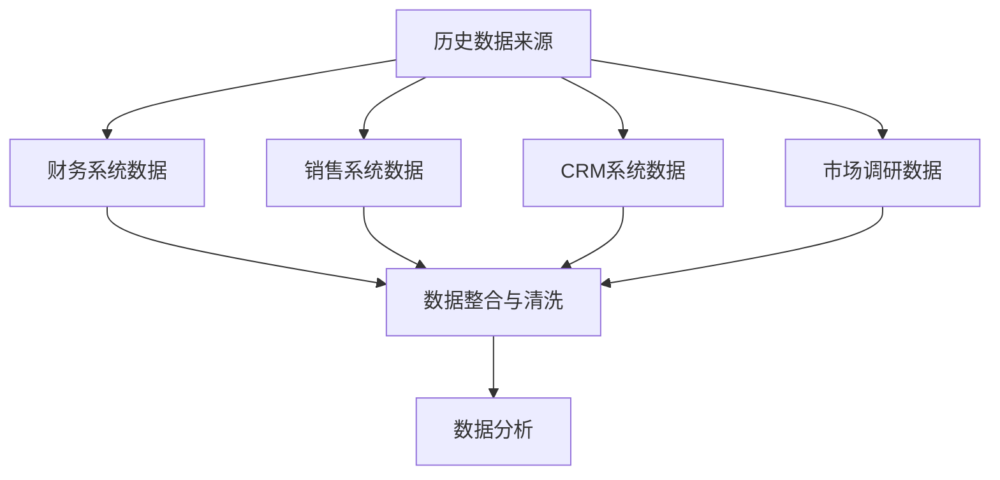

---
{"tags":["财务BP","预算规划","收入预测","历史数据","趋势分析"],"aliases":["历史数据预测","数据分析预测法"],"created":"2024-03-20","dg-publish":true,"permalink":"/知识共享/001_财务/01_财务BP/01_学习内容/02_预算编制基础/收入预测方法/历史数据分析法/","dgPassFrontmatter":true}
---

# 历史数据分析法

> [!abstract] 概述
> 本文档详细介绍历史数据分析法在收入预测中的应用。历史数据分析是企业收入预测的基础方法，通过分析过去的销售数据，识别趋势、周期和关联因素，为未来收入预测提供科学依据。本文探讨历史数据分析的基本原理、方法技巧、实施步骤以及典型应用案例。

## 一、历史数据分析基本原理

### 1. 基本概念
- **定义**：利用企业过去一定时期的销售数据，通过统计和数学方法，分析其变化规律和趋势，预测未来一定时期的销售收入。
- **前提假设**：历史数据中包含了能够预示未来的规律和趋势。
- **应用范围**：适用于经营较为稳定、历史数据较为丰富的企业。

### 2. 数据类型与来源

## 二、历史数据分析方法

### 1. 时间序列分析
- **趋势分析**：识别长期发展趋势
- **季节性分析**：识别周期性变化
- **周期性分析**：识别经济周期影响
- **不规则波动分析**：识别随机因素影响

### 2. 回归分析
- **简单线性回归**：单一变量影响分析
- **多元回归分析**：多变量综合影响
- **对数线性回归**：非线性关系分析
- **自回归模型**：时间序列自相关分析

### 3. 移动平均法
- **简单移动平均**：等权重历史数据平均
- **加权移动平均**：不同权重历史数据平均
- **指数平滑法**：赋予近期数据更高权重
- **霍尔特-温特斯(Holt-Winters)法**：处理趋势和季节性

### 4. 分解法
- **趋势分量提取**
- **季节分量提取**
- **周期分量提取**
- **随机分量分析**

## 三、历史数据分析实施步骤

### 1. 数据准备
- 数据收集：确定需要的数据类型与范围
- 数据清洗：处理缺失值、异常值
- 数据标准化：统一数据格式与单位
- 数据分段：按时间段、产品线等划分

### 2. 模式识别

### 3. 模型选择与应用
- 根据数据特点选择合适的分析方法
- 建立数学模型
- 模型参数估计与调整
- 模型验证与评估

### 4. 结果分析与解释
- 预测结果呈现
- 误差分析
- 敏感性分析
- 预测结果解释

## 四、历史数据分析案例

### 案例1：零售企业销售预测
**背景**：某大型零售连锁企业需要预测下一季度的销售收入，为采购和营销决策提供依据。

**实施方法**：
1. **数据准备**
   - 收集过去3年的月度销售数据
   - 按产品类别、门店区域划分
   - 清洗异常数据点（促销、节假日等）

2. **分析步骤**
   - 时间序列分解：提取趋势、季节性和随机成分
   - 识别季节模式：发现每年Q4销售高峰
   - 识别增长趋势：年均增长率约7%
   - 应用霍尔特-温特斯模型进行预测

3. **预测结果**
   - 下季度销售预计增长8.5%
   - 各产品类别增长率不同：食品10%，服装6%，电器8%
   - 节假日销售峰值预测：同比增长15%

**实施效果**：
- 预测准确率达到92%
- 库存管理优化，降低库存成本15%
- 营销资源分配优化，提升ROI 20%
- 现金流管理改善，降低融资成本5%

### 案例2：B2B企业合同更新预测
**背景**：某SaaS企业需要预测客户合同续约率及收入变化。

**实施方法**：
1. **数据准备**
   - 收集过去5年的客户合同数据
   - 按客户规模、行业、服务类型分类
   - 整合客户使用情况和满意度数据

2. **分析步骤**
   - 客户分层分析：根据合同金额和历史续约情况
   - 回归分析：识别影响续约的关键因素
   - 概率模型构建：预测不同客户群的续约概率
   - 收入预测：结合续约率和价格调整因素

3. **预测结果**
   - 整体续约率预计在85%
   - 大客户续约率91%，收入增长5%
   - 中小客户续约率78%，收入增长3%
   - 新增升级服务带来额外8%收入增长

**实施效果**：
- 预测准确率达到88%
- 客户管理策略优化，提升续约率5%
- 销售资源合理分配，新签约增长12%
- 现金流预测准确性提高，资金使用效率提升10%

## 五、历史数据分析优势与局限

### 1. 优势
- 基于实际数据，客观性强
- 操作简单，易于实施
- 适用于相对稳定的业务环境
- 可识别隐藏的模式和趋势

### 2. 局限性
- 对历史数据质量和数量依赖性高
- 难以预测结构性变化和突发事件
- 适用性受行业和市场稳定性影响
- 需要结合其他预测方法使用

## 六、最佳实践建议

1. **数据基础建设**
   - 建立完善的数据收集体系
   - 确保数据质量和一致性
   - 采用适当的数据存储和处理技术
   - 定期更新和维护历史数据库

2. **方法选择与应用**
   - 根据业务特点选择合适的分析方法
   - 结合定性和定量方法
   - 定期评估和调整预测模型
   - 建立预测结果的跟踪和反馈机制

3. **组织保障**
   - 培养数据分析专业人才
   - 建立跨部门协作机制
   - 提高管理层对数据分析的重视
   - 营造数据驱动的决策文化

## 相关链接

- [[知识共享/001_财务/01_财务BP/01_学习内容/02_预算编制基础/收入预测方法/销量预测技术\|销量预测技术]]
- [[知识共享/001_财务/01_财务BP/01_学习内容/02_预算编制基础/收入预测方法/价格策略与预测\|价格策略与预测]]
- [[知识共享/001_财务/01_财务BP/01_学习内容/02_预算编制基础/收入预测方法/行业趋势分析\|行业趋势分析]]
- [[财务报表预测\|财务报表预测]]
- [[知识共享/001_财务/01_财务BP/01_学习内容/02_预算编制基础/收入预测方法/收入预测方法\|收入预测方法]]

## 参考文献

1. Box, G. E. P., Jenkins, G. M., & Reinsel, G. C. (2015). *Time Series Analysis: Forecasting and Control*. Wiley.
2. Hyndman, R. J., & Athanasopoulos, G. (2018). *Forecasting: Principles and Practice*. OTexts.
3. Montgomery, D. C., Jennings, C. L., & Kulahci, M. (2015). *Introduction to Time Series Analysis and Forecasting*. Wiley.
4. 《企业收入预测方法与实践》，张国强，中国财政经济出版社，2019.
5. 《数据驱动的商业决策：预测分析实用指南》，刘海平，机械工业出版社，2020. 